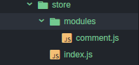

# Vuex

Vuex 是一个专为 Vue.js 应用程序开发的状态管理模式，类似 React 中的 Redux

### 装包

```
npm install vuex --save
```

### 注入 store

导入 store

```javascript
import store from './store'
```

将 store 注入到组件中

```javascript
new Vue({
  el: '#app',
  store,
  router,
  template: '<App/>',
  components: { App }
})
```

### 创建 store

我们这里根据官网给出的例子，创建 store

数据结构为：



其中`index.js` 在 store 中创建 store 并将数据组合的作用，类似 Redux 中的 combineReducers

```javascript
import Vue from 'vue'
import Vuex from 'vuex'
//引用 vuex
import comment from './modules/comment'
// 导入 comment 数据
Vue.use(Vuex)
// 安装使用 vuex 插件
export default new Vuex.Store({
  // 创建 store 并导出
  modules: {
    comment
  }
})
```

Vuex 通过 Vue.use(Vuex) 提供了一种机制将状态从根组件『注入』到每一个子组件中 store 选项，在组件需要 store 时，用 （`this.$store.state`）调用

```javascript
const state = {
  all: [
    { text: 'haha' },
    { text: 'gege' }
  ]
}

export default {
  state
}
```

在 modules 文件夹中写入数据并导出

**参考**：<https://vuex.vuejs.org/zh-cn/state.html>

### 读取数据

Vuex 的状态存储是响应式的，从 store 实例中读取状态最简单的方法就是在 **计算属性中返回某个状态**：

```js
<script>
export default {
  name: 'comment-box',
  // 在计算属性 computed 中
  computed: {
    //comments 方法
    comments: function () {
      //通过返回值拿到 store 中的数据
      return this.$store.state.comment.all
    }
  }
}
</script>
```

通过 comments 方法 返回的`this.$store.state.comment.all`拿到 store 中的值

将数据渲染到页面上

```html
<template>
  <li v-for="comment in reversedMessage">
    {{ comment.text }}
  </li>
</template>
```

### 对 store 中的数据进行修改

> 更改 Vuex 的 store 中的状态的唯一方法是提交 mutation

Vuex 中的 mutations 非常类似于事件：每个 mutation 都有一个字符串的 事件类型 (type) 和 一个 回调函数 (handler)。这个回调函数就是我们实际进行状态更改的地方，并且它会接受 state 作为第一个参数

```javascript
const mutations = {
    [函数名] (state) {
      // 变更状态
      state.count++
    }
  }
})
```

### 提交载荷（Payload）

> Payload 就是接受的数据

你可以向 store.commit 传入额外的参数(数据)，即 mutation 的 载荷（payload）：

```javascript
const mutations = {
  [increment] (state, n) {
  //n 为组件传过来的数据
    state.count += n
  }
}
```

### 使用常量替代 Mutation 事件类型

在 store 文件夹下创建 `mutation-types.js`文件，将 Mutation 事件类型写在里面

```javascript
export const SOME_MUTATION = 'SOME_MUTATION'
//声明 一个常量作为函数名
```

### Mutaion 函数

> store 类似于 React 中的 action

```js
//导入 事件类型
import * as types from '../mutation-types'
//数据 state
const state = {
  all: [
    { text: 'fooo' },
    { text: 'barr' }
  ]
}
//创建一个 mutations 将接受的数据放入 state 中
const mutations = {
  [types.ADD_COMMENT] (state, { text }) {
    state.all.push({ text })
  }
}

export default {
  state,
  mutations
}
//导出 state mutations
```

### 在组件中提交 Mutations

你可以在组件中使用 this.$store.commit('xxx') 提交 mutation，
或者使用 mapMutations 辅助函数将组件中的 methods 映射为 store.commit 调用（需要在根节点注入 store）

```js
<script>
  import * as types from '../store/mutation-types'
  //导入 mutation 函数类型
  export default {
    name: 'comment-box',
    computed: {
      reversedMessage: function () {
        return this.comments.slice().reverse()
      },
      comments: function () {
        return this.$store.state.comment.all
      }
    },
    methods: {
      addComment: function () {
        const input = document.getElementById('commentForm')
        this.$store.commit(types.ADD_COMMENT, { text: input.value })
        input.value = ''
      }
    }
  }
</script>
```

```html
<template>
  <div class="comment-box">
    <div class="form">
     <input type="text" id="commentForm" />
     <button type="submit" v-on:click="addComment">发布</button>
   </div>
   <ul>
    <li v-for="comment in reversedMessage">
      {{ comment.text }}
    </li>
   </ul>
  </div>
</template>
```

### actions

> action 类似于 React 中的 Thunk

Action 类似于 mutation，不同在于：

 - Action 提交的是 mutation，而不是直接变更状态

 - Action 可以包含任意异步操作

### 小例子

```js
const store = new Vuex.Store({
  state: {
    count: 0
  },
  mutations: {
    increment (state) {
      state.count++
    }
  },
  //发出 actions
  actions: {
    increment (context) {
      context.commit('increment')
      //通过 commit 触发 mutations
    }
  }
})
```

Action 函数接受一个与 store 实例具有相同方法和属性的 context 对象，因此你可以调用 `context.commit` 提交一个 mutation，
或者通过 `context.state` 和 `context.getters` 来获取 state 和 getters。当我们在之后介绍到 Modules 时，你就知道 context 对象为什么不是 store 实例本身了。

实践中，我们会经常用到 ES2015 的 参数解构 来简化代码（特别是我们需要调用 commit 很多次的时候）：

```js
actions: {
  increment ({ commit }) {
    commit('increment')
  }
}
```

**参考**：<https://vuex.vuejs.org/zh-cn/mutations.html>

### 分发 Action

> Action 通过 store.dispatch 方法触发：

```js
store.dispatch('increment')
```

乍一眼看上去感觉多此一举，我们直接分发 mutation 岂不更方便？

实际上并非如此，还记得 mutation 必须同步执行这个限制么？

Action 就不受约束！我们可以在 action 内部执行异步操作：

```js
actions: {
  incrementAsync ({ commit }) {
    setTimeout(() => {
      commit('increment')
    }, 1000)
  }
}
```

Actions 支持同样的 **载荷方式** 和对象方式进行分发：

```js
// 以载荷形式分发
store.dispatch('incrementAsync', {
  amount: 10
})

// 以对象形式分发
store.dispatch({
  type: 'incrementAsync',
  amount: 10
})
```

### 购物车示例

涉及到调用异步 API 和 分发多重 mutations：

```js
actions: {
  checkout ({ commit, state }, products) {
    // 把当前购物车的物品备份起来
    const savedCartItems = [...state.cart.added]
    // 发出结账请求，然后乐观地清空购物车
    commit(types.CHECKOUT_REQUEST)
    // 购物 API 接受一个成功回调和一个失败回调
    shop.buyProducts(
      products,
      // 成功操作
      () => commit(types.CHECKOUT_SUCCESS),
      // 失败操作
      () => commit(types.CHECKOUT_FAILURE, savedCartItems)
    )
  }
}
```

注意我们正在进行一系列的异步操作，并且通过提交 mutation 来记录 action 产生的副作用（即状态变更）

### 在组件中分发 Action

你在组件中使用 this.$store.dispatch('xxx') 分发 action，或者使用 mapActions 辅助函数将组件的 methods 映射为 store.dispatch 调用（需要先在根节点注入 store）：

```js
import { mapActions } from 'vuex'

export default {
  // ...
  methods: {
    ...mapActions([
      'increment' // 映射 this.increment() 为 this.$store.dispatch('increment')
    ]),
    ...mapActions({
      add: 'increment' // 映射 this.add() 为 this.$store.dispatch('increment')
    })
  }
}
```

### 组合 Actions

Action 通常是异步的，那么如何知道 action 什么时候结束呢？更重要的是，我们如何才能组合多个 action，以处理更加复杂的异步流程？

首先，你需要明白 store.dispatch 可以处理被触发的action的回调函数返回的Promise，并且store.dispatch仍旧返回Promise：

```js
actions: {
  actionA ({ commit }) {
    return new Promise((resolve, reject) => {
      setTimeout(() => {
        commit('someMutation')
        resolve()
      }, 1000)
    })
  }
}
```

现在你可以：

```js
store.dispatch('actionA').then(() => {
  // ...
})
在另外一个 action 中也可以：

actions: {
  // ...
  actionB ({ dispatch, commit }) {
    return dispatch('actionA').then(() => {
      commit('someOtherMutation')
    })
  }
}
```

最后，如果我们利用 async / await 这个 JavaScript 即将到来的新特性，我们可以像这样组合 action：

```
// 假设 getData() 和 getOtherData() 返回的是 Promise

actions: {
  async actionA ({ commit }) {
    commit('gotData', await getData())
  },
  async actionB ({ dispatch, commit }) {
    await dispatch('actionA') // 等待 actionA 完成
    commit('gotOtherData', await getOtherData())
  }
}
```

一个 store.dispatch 在不同模块中可以触发多个 action 函数。在这种情况下，只有当所有触发函数完成后，返回的 Promise 才会执行。

### 参考

- Vuex文档：[点击进入](https://vuex.vuejs.org/zh-cn/)

- Vuex官网例子：[点击进入](https://github.com/vuejs/vuex/tree/dev/examples)
