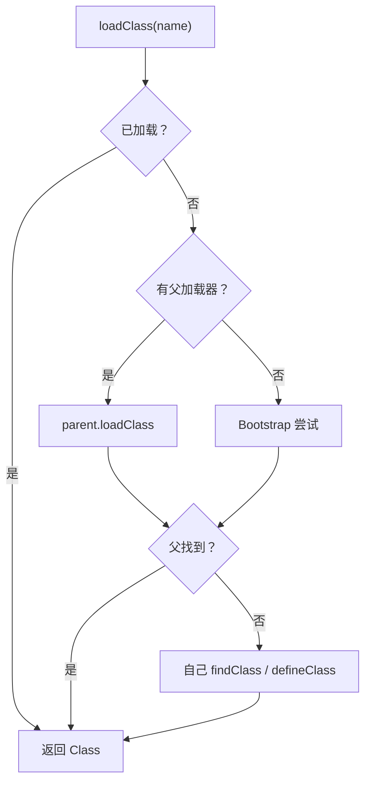

## 题目

什么是双亲委派模型？有什么作用？什么时候会打破它？

## 答案

1. **双亲委派**：某个 ClassLoader 收到加载请求时，先把请求委派给**父加载器**；父加载器找不到，才由自己 `findClass` / `defineClass`。
2. **作用**：
   - **安全**：防止用户代码伪造 / 替换核心类（如自己写一个 `java.lang.String`，最终仍由 Bootstrap 加载官方版本）；
   - **唯一性**：同一份类尽量由同一加载器链加载，避免多份同名类并存导致类型混乱。
3. **打破场景**：SPI（JDBC 等）、Tomcat 等容器的 WebApp 隔离、热部署 / OSGi——需要「子先加载」或「反向委派」时。

### 解释与扩展

- 向上委托流程
  1. 我收到加载请求，先看**我自己缓存**，有直接返回。
  2. 缓存没有，**向上交给父加载器处理**。
  3. 父加载器重复逻辑：先查父的缓存；没有继续往上交给上一级。
  4. 到 Bootstrap：查自己缓存；没有就去 jre/lib 找 class。
  5. **上层任意一级加载成功，直接返回，下层全部放弃加载。**
  6. 全部上层都找不到类文件，才回到我这一层，由我读取磁盘加载这个类，存入我的缓存。
- 默认父子链：Application → Platform → Bootstrap（见上一题「类加载器」）。
- 向上委托（优先xia），向下返回
- **SPI 为何要打破**：接口在 Bootstrap / Platform 里，实现在应用 classpath；父加载器看不见实现类，需通过线程上下文类加载器（TCCL）等反向查找。
- 自定义加载器时，重写 `loadClass` 可改变委派策略；一般更推荐只重写 `findClass`，保留默认双亲委派。

### 注意

- 「双亲」指父加载器委派，不是生物学上的双亲；英文常称 parent delegation。
- 打破双亲委派不等于不要加载器隔离：容器场景往往是「先自己、再父」或分层委派，仍有明确规则。
- 类唯一性仍取决于「全限定名 + ClassLoader」；打破委派后更容易出现同名类多份，需注意隔离边界。
