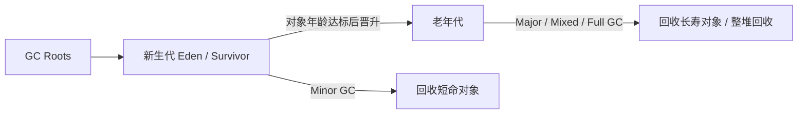

# 优化后版本（面试题，结构更顺、重点突出、精简无废话，保留原有mermaid、表格、参考链接，修正逻辑顺序，适合口述+文档阅读）
---
title: 谈谈 GC 垃圾回收机制
difficulty: medium
tags: [Java, JVM, GC]
reference:
  - [https://docs.oracle.com/en/java/javase/21/gctuning/introduction-garbage-collection-tuning.html](https://docs.oracle.com/en/java/javase/21/gctuning/introduction-garbage-collection-tuning.html)
  - [https://docs.oracle.com/en/java/javase/21/gctuning/garbage-first-g1-garbage-collector-tuning.html](https://docs.oracle.com/en/java/javase/21/gctuning/garbage-first-g1-garbage-collector-tuning.html)
---
## 题目
谈谈 Java 的 GC 垃圾回收机制：如何判断对象可回收？常见算法与收集器有哪些？

## 答案
1. **GC 的作用**：自动识别并回收堆中不再被使用的对象，释放内存。Java开发者不需要手动释放内存，但需要避免长生命周期无用引用造成内存泄漏。

2. **如何判断对象是否可以回收**
HotSpot JVM **不使用引用计数法（存在循环引用缺陷），采用可达性分析算法**。
从 **GC Roots** 作为起点遍历所有引用链：
- 引用链可达：对象存活；
- 引用链不可达：标记为垃圾对象，等待回收。
> GC Roots包含：虚拟机栈局部变量引用对象、元空间静态变量引用对象、常量引用对象、JNI本地方法引用对象、synchronized锁持有的对象、JVM内部引用对象。
> 注意：`finalize()` 方法可靠性很差，现代开发不建议依赖它做资源释放。

3. **分代收集理论（分代假说）**
分代假说是垃圾回收优化理论，不是判断对象存活的算法。两条核心假说：
- 弱分代假说：绝大多数对象朝生夕灭；
- 强分代假说：存活越久的对象，越难被回收。

基于假说，传统分代收集器把堆划分为**新生代、老年代**：
- 新生代：存放新创建、短生命周期对象，分为 Eden、S0、S1 两个Survivor区；对象熬过多次GC年龄增长，到达阈值后晋升老年代。
- 老年代：存放存活时间长的对象。
> 注意：ZGC、Shenandoah 属于不分代收集器，没有新生代、老年代划分。

4. **三种基础垃圾回收算法**
- **标记-清除**：先标记垃圾，再统一清除。实现简单，但是容易产生内存碎片。
- **复制算法**：将存活对象复制到另一块空闲区域，清空原区域。新生代Minor GC主流算法；缺点是需要预留一半内存空间，有内存开销。
- **标记-整理**：标记垃圾后，把存活对象向内存一端移动压缩，消除内存碎片。老年代常用，缺点是移动对象开销大。

5. **HotSpot 常见垃圾收集器**
- Serial：单线程收集，STW时间长，适合客户端小内存场景；
- Parallel：多线程，**优先高吞吐量**，适合后台任务；
- CMS：并发低停顿收集器，JDK9后废弃，老版本用于低延迟场景，存在内存碎片；
- G1（JDK9默认）：把堆切分成多个Region，可设置预期停顿时间，兼顾吞吐量和延迟，支持Mixed GC；
- ZGC / Shenandoah：低延迟收集器，几乎无STW，大堆场景优选，不分代。

### 解释与扩展

| 概念 | 含义 |
|---|---|
| Minor GC | 只回收新生代，触发频率高，STW较短 |
| Major GC | 只回收老年代，触发次数较少；不同收集器定义略有差异 |
| Full GC | 全堆回收（新生代+老年代+元空间），STW时间很长，生产环境尽量避免 |
| STW Stop-The-World | GC执行标记/复制整理阶段，暂停全部用户业务线程 |

#### G1 核心要点
将堆拆分为大小相同的Region，Region可以动态充当新生代或者老年代；GC时优先选择回收垃圾最多的Region，可通过 `-XX:MaxGCPauseMillis` 设置预期最大停顿时间；除了普通新生代GC，还支持Mixed GC，一次性回收部分老年代Region。

#### GC 触发条件与调优思路
堆内存分配失败、对象晋升失败、元空间内存不足、主动调用`System.gc()`都会触发GC。
> `System.gc()`只是一个建议，不能强制触发Full GC；生产环境一般配置 `-XX:+DisableExplicitGC` 禁用显式GC。
调优优先查看GC日志，定位GC原因，不要盲目调大堆最大内存`-Xmx`。

#### Java四种引用和回收规则
- 强引用：普通对象引用，GC Roots可达，永远不会回收；
- 软引用 SoftReference：内存充足不回收，内存不足时回收，适合做缓存；
- 弱引用 WeakReference：只要GC发生就回收，典型应用WeakHashMap；
- 虚引用 PhantomReference：无法获取对象实例，仅用于监听对象回收、释放堆外内存。

### 注意
1. 引用计数法存在循环引用无法回收的缺陷，HotSpot没有采用；
2. 收集器选型：追求高吞吐量选Parallel/G1；追求超低延迟选ZGC/Shenandoah；CMS已经废弃，新项目不再使用；
3. GC只负责堆内对象回收；栈内存、元空间类加载器泄漏不属于堆GC管理范围；
4. Minor GC存在跨代引用问题，使用CardTable卡表优化，避免Minor GC扫描全部老年代。
