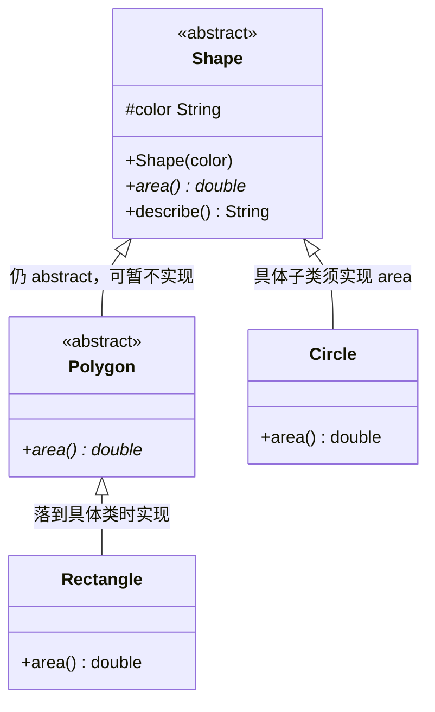

## 题目

抽象类和普通类的区别

## 答案

1. **抽象类**：不能 `new`；既能有完整方法体，也能有 `abstract` 抽象方法（无方法体）。
2. **普通子类**继承抽象类：强制实现所有抽象方法，普通方法直接继承不用管。
3. 如果子类也加 `abstract`：可以不实现抽象方法，继续向下传递。
4. 抽象类可以有构造器，供子类 `super` 调用；接口没有构造器。

### 解释与扩展

| | 抽象类 abstract class | 普通类（具体类） |
|---|---|---|
| 实例化 | 不能 `new` | 可以 `new` |
| 抽象方法 | 允许；有则类必须 `abstract` | 不允许 |
| 普通方法 / 字段 | 都可以有 | 都可以有 |
| 构造器 | 有（初始化子类时由 `super` 调用） | 有 |
| 继承义务 | 具体子类须实现全部抽象方法 | 无「必须实现」约束 |
| 设计角色 | 半成品模板，锁定共性、推迟差异 | 可直接使用的完整实现 |

- **模板方法常见用法**：抽象类里写好流程骨架（普通方法），差异步骤留给子类抽象方法实现。
- 抽象类也可以**零个**抽象方法：仅禁止直接实例化（如部分工具基类），但更常见是「共享实现 + 强制子类补齐差异」。

### 注意

- 含抽象方法的类必须声明为 `abstract`，否则编译失败。
- `abstract` 与 `final` 不能同时修饰类（一个要被继承补齐，一个禁止继承）。
- 抽象类构造器存在，是为了初始化共享字段；对外仍不能 `new` 抽象类本身。
- 与「接口 vs 抽象类」区分开：本题侧重能否实例化、子类实现义务；能力契约 / 多实现见上一题。
