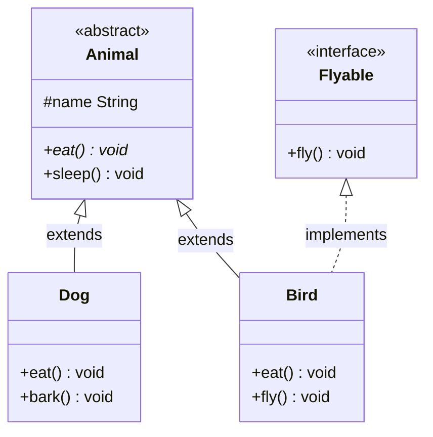

## 题目

接口和抽象类的区别

## 答案

1. 两者都用于抽象：声明「能做什么」，不完全给出实现；设计意图不同。
2. **抽象类**：偏「是什么」（is-a），模板 / 半成品，可承载共享状态与默认行为；单继承。
3. **接口**：偏「能做什么」（can-do），能力契约；可多实现。
4. 选用：要共享字段/构造/强父子关系 → 抽象类；只需约定能力、多实现解耦 → 接口。

### 解释与扩展

| | 抽象类 abstract class | 接口 interface |
|---|---|---|
| 继承关系 | 单继承（`extends` 一个） | 可多实现（`implements` 多个） |
| 成员变量 | 可有实例字段、任意修饰符 | 默认 `public static final` 常量 |
| 方法 | 可有抽象方法 + 普通实例方法 | Java 8+：抽象 / `default` / `static`；Java 9+ 还可 `private` |
| 构造器 | 有（供子类调用，不能 `new`） | 无 |
| 访问修饰符 | 方法可用 `public` / `protected` 等 | 抽象方法隐式 `public` |
| 设计目的 | 复用代码与状态，定义继承层次 | 定义能力契约，解耦实现 |

实践中常组合：抽象类提供模板，接口声明能力（如 `ArrayList` 继承骨架、实现 `List`）。

### 注意

- 抽象类不能被实例化；含抽象方法的类必须声明为 `abstract`。
- 接口实现类必须实现全部抽象方法（除非自身也是抽象类）。
- Java 8 起接口可有 `default` 方法，但仍不宜塞业务状态；有状态优先抽象类。
