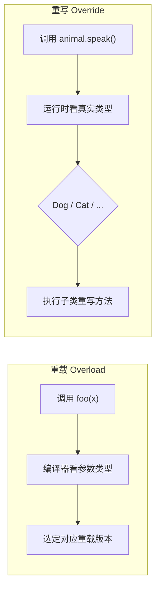
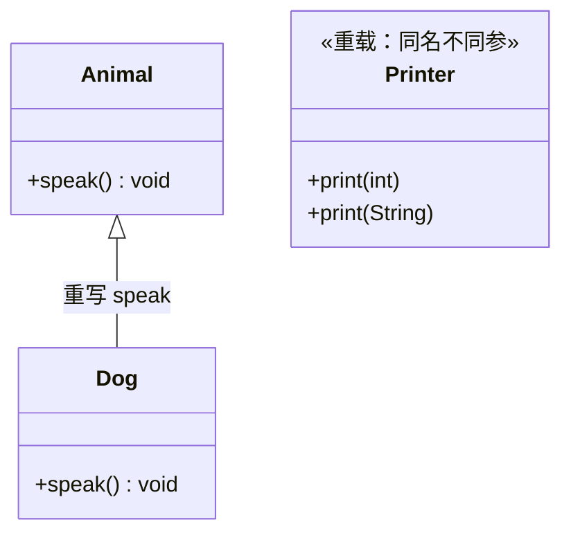

## 题目

重载和重写的区别？编译期/运行期如何选择方法？

## 答案

1. **重载（Overload）**：同名、参数列表不同（个数 / 类型 / 顺序）；返回值不能单独区分。编译期静态绑定，编译时多态。
2. **重写（Override）**：子类实现父类同签名实例方法。运行期按实际类型动态分发，运行时多态。
3. 选择过程：编译期按静态类型 + 实参做重载决议 → 运行期按对象真实类型选重写实现。

### 解释与扩展

| | 重载 Overload | 重写 Override |
|---|---|---|
| 发生位置 | 同一类（或父子同名不同参） | 父子类之间 |
| 方法签名 | 方法名同，参数列表**必须不同** | 方法名 + 参数列表**必须相同** |
| 返回值 | 可同可不同（不能仅靠返回值区分） | 相同或协变（子类型） |
| 访问修饰符 | 无特殊限制 | 不能更严（父 `protected` → 子不可变 `private`） |
| 绑定时机 | 编译期静态绑定 | 运行期动态分发（虚方法表） |
| 异常 | 无继承约束 | 不能抛出比父类更宽的受检异常 |

### 注意

- 静态方法、私有方法不能被重写（静态是隐藏 hide，不是 override）。
- `@Override` 可在编译期校验是否真的重写了父方法。
- 构造方法可以重载，不能重写。
