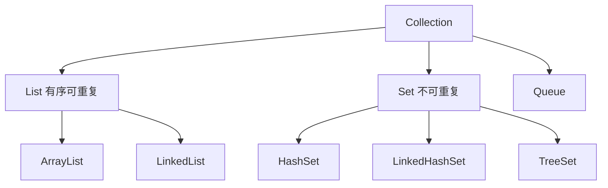

## 题目

List 和 Set 的区别

## 答案

1. 两者都是 `Collection` 子接口，存「一堆元素」；与 `Map`（键值对）并列。
2. **List**：有序（按插入/下标）、**可重复**，支持 `get(i)` 按下标访问。
3. **Set**：元素**不可重复**（判重靠 `equals` / `hashCode`，Tree 靠比较器）；默认实现不保证顺序。
4. 选用：要下标、允许重复 → `List`（默认 `ArrayList`）；要去重 → `Set`（默认 `HashSet`）。

### 解释与扩展

| | List | Set |
|---|---|---|
| 顺序 | 有序（下标 / 插入序） | `HashSet` 无保证；`LinkedHashSet` 插入序；`TreeSet` 排序序 |
| 重复 | 允许 | 不允许 |
| 访问 | `get(index)` 等下标 API | 无下标，靠迭代 / `contains` |
| 判等 | 可存多个相等元素 | 相同元素只保留一个 |
| 常用实现 | `ArrayList`、`LinkedList` | `HashSet`、`LinkedHashSet`、`TreeSet` |



```java
List<String> list = new ArrayList<>();
list.add("a");
list.add("a"); // 允许：["a", "a"]

Set<String> set = new HashSet<>();
set.add("a");
set.add("a"); // 忽略，仍只有一个 "a"
```

### 注意

- 「Set 无序」常指 `HashSet`；要稳定遍历序用 `LinkedHashSet`，要排序用 `TreeSet`。
- 自定义对象放进 `Set`（或当 `HashMap` 键）必须正确重写 `equals` 与 `hashCode`。
- List 的「有序」≠「排序」；要排序可 `Collections.sort` / `list.sort`，或用 `TreeSet`。
