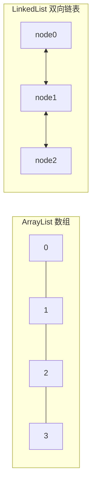

## 题目

`ArrayList` 和 `LinkedList` 的区别？

## 答案

1. 两者都实现 `List`：有序、可重复、有下标。
2. **ArrayList**：底层**动态数组**；随机访问 O(1)，尾部增删快，中间增删要搬移元素。
3. **LinkedList**：底层**双向链表**；按索引访问要遍历 O(n)，首尾增删 O(1)，中间增删还要先定位。
4. 日常默认用 `ArrayList`；只有频繁在两端插删、且几乎不按下标随机访问时才考虑 `LinkedList`。

### 解释与扩展

| | ArrayList | LinkedList |
|---|---|---|
| 结构 | 动态数组（`Object[]`） | 双向链表（节点 + prev/next） |
| 随机访问 `get(i)` | O(1) | O(n) |
| 尾部 `add` | 均摊 O(1)（扩容偶发 O(n)） | O(1) |
| 头部 / 中间增删 | 需搬移，O(n) | 定位 O(n)，改指针 O(1) |
| 内存 | 连续、开销小 | 每节点额外指针，更占内存 |
| 实现的接口 | `List`、`RandomAccess` | `List`、`Deque`（可当队列/栈） |



```java
List<String> arr = new ArrayList<>();   // 查多、按下标 → 首选
arr.add("a");
arr.get(0); // O(1)

List<String> link = new LinkedList<>(); // 或 Deque
link.addFirst("head");
link.addLast("tail");
```

**选用建议：**
- 遍历、随机访问、绝大多数业务 List → `ArrayList`
- 只要队列语义（头删尾加）→ 优先 `ArrayDeque`，一般不必上 `LinkedList`
- `LinkedList` 作 `List` 在真实场景里很少比 `ArrayList` 更快

### 注意

- 两者都**非线程安全**；并发用 `CopyOnWriteArrayList` 或外部同步。
- `ArrayList` 扩容约 1.5 倍；已知容量可 `new ArrayList<>(n)` 减少扩容。
- `LinkedList` 实现了 `Deque`，但作双端队列时 `ArrayDeque` 通常更优（无节点开销、缓存友好）。
- 面试别死记「LinkedList 增删一定快」：中间增删仍要先 `get` 到节点，常是 O(n)。
