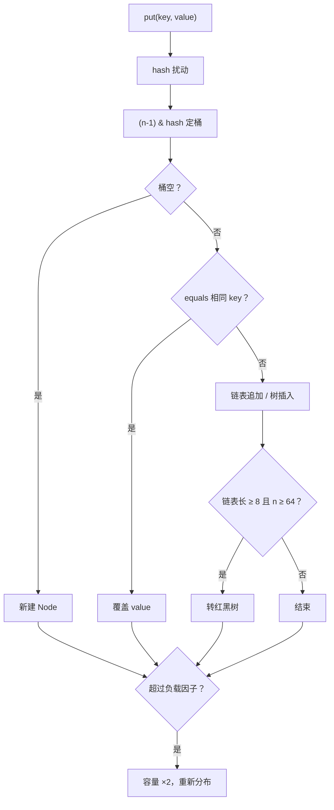

## 题目

`HashMap` 和 `Hashtable` 的区别和底层实现？

## 答案

1. 两者都实现 `Map`：存 key-value，key 唯一。
2. **HashMap**：非线程安全；允许 **一个 `null` key** 和多个 `null` value；JDK 8+ 底层为 **数组 + 链表 / 红黑树**。
3. **Hashtable**：方法级 `synchronized`，线程安全但粗粒度、性能差；**不允许 `null`**；数组 + 链表，无树化；遗留类。
4. 日常用 `HashMap`；并发用 `ConcurrentHashMap`，不要再用 `Hashtable`。

### 解释与扩展

| | HashMap | Hashtable |
|---|---|---|
| 线程安全 | 否 | 是（方法级 `synchronized`） |
| `null` | 1 个 null key、多个 null value | key / value 均不可 null（NPE） |
| 父类 | `AbstractMap` | 遗留 `Dictionary`（兼实现 `Map`） |
| 结构 | 数组 + 链表 / 红黑树（JDK 8+） | 数组 + 链表 |
| 遍历 | `Iterator`（fail-fast） | 另有 `Enumeration` |
| 性能 | 无锁，单线程更快 | 全局锁，争用大 |

**HashMap 底层（JDK 8+）：**

1. **定桶**：`hash = key.hashCode()` 再扰动（高位异或），`i = (n - 1) & hash`（容量为 2 的幂）。
2. **put**：桶空则直接放；否则链表 / 树里用 `equals` 比 key，相同则覆盖 value，不同则追加；链表长度 ≥ 8 且容量 ≥ 64 时树化。
3. **get**：同样定桶 → 链表 / 树里 `equals` 找 key。
4. **扩容**：`size > capacity * 0.75` 时容量翻倍（16 → 32…），节点按新掩码迁移（高位为 0 留原桶，为 1 进 `oldCap + i`）。
5. **退化**：树节点过少（约 ≤ 6）在扩容等时机退回链表。



```java
Map<String, String> map = new HashMap<>();
map.put(null, "v");      // OK
map.put("k", null);      // OK

Hashtable<String, String> table = new Hashtable<>();
// table.put(null, "v"); // NPE
// table.put("k", null); // NPE
```

**并发选型：**
- 单线程 → `HashMap`
- 高并发 → `ConcurrentHashMap`（远好于 `Hashtable`）
- `Hashtable` / `Collections.synchronizedMap` 基本过时

### 注意

- 类名是 `Hashtable`（t 小写），不是 `HashTable`。
- 多线程共享 `HashMap` 可能丢数据甚至死循环（JDK 7 头插扩容）；优先 `ConcurrentHashMap`。
- 默认容量 16、负载因子 0.75；已知规模可 `new HashMap<>(n)` 减少扩容。
- 自定义 key 必须正确重写 `equals` / `hashCode`；放入后勿改参与哈希的字段。
