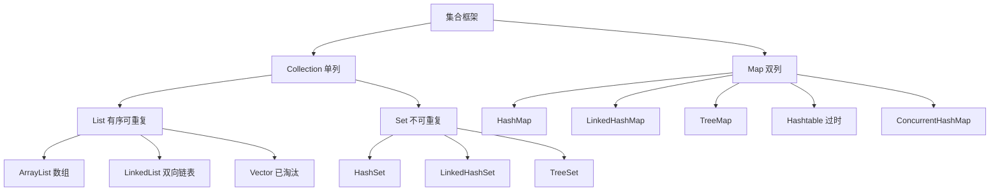

## 题目

说一下 Java 集合体系？

## 答案

1. 两大根接口：`Collection`（单列，存元素）、`Map`（双列，存 key-value）。
2. **List**：有序、可重复、有索引；常用 `ArrayList` / `LinkedList`（`Vector` 基本淘汰）。
3. **Set**：不可重复；`HashSet` 无序、`LinkedHashSet` 插序、`TreeSet` 排序。
4. **Map**：key 唯一；日常 `HashMap`，并发用 `ConcurrentHashMap`（`Hashtable` 过时）。

### 解释与扩展

| 分支 | 特点 | 常用实现 |
|---|---|---|
| List | 有序、可重复、有索引 | `ArrayList`（查快增删相对慢）、`LinkedList`（首尾增删快）、`Vector`（同步，淘汰） |
| Set | 不可重复 | `HashSet`（靠 hashCode+equals 去重）、`LinkedHashSet`（插序）、`TreeSet`（Comparable/Comparator） |
| Map | key 唯一，value 可重复 | `HashMap`（数组+链表+红黑树）、`LinkedHashMap`、`TreeMap`、`ConcurrentHashMap` |

**选用建议：**
- 普通增删查 → `ArrayList`
- 键值对 → `HashMap`
- 高并发 Map → `ConcurrentHashMap`

**HashMap（JDK 8+）：** 链表长度 > 8 转红黑树，树节点 < 6 退回链表；线程不安全。

### 注意

- 用 `Iterator` 遍历时不要直接对集合 `add`/`remove`，会触发 `ConcurrentModificationException`；应使用迭代器的 `remove`，或 `CopyOnWrite` / 并发集合。
- 线程安全：`Vector`、`Hashtable` 老旧；高并发推荐 `ConcurrentHashMap`；其余 `List` / `Set` / `HashMap` 默认都不安全。
- 一句话：List 有序可重复，Set 不重复；HashMap 不安全，ConcurrentHashMap 并发安全。
