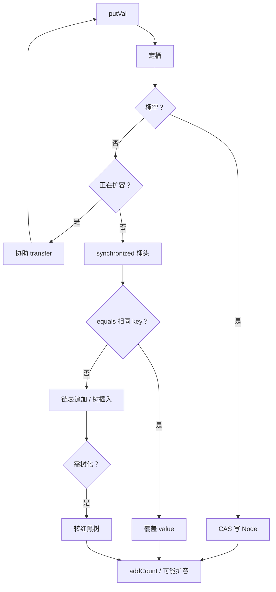

## 题目

`ConcurrentHashMap` 原理？JDK 7 和 JDK 8 版本有何区别？

## 答案

1. 线程安全的 `Map`，高并发读写首选；**key / value 均不允许 `null`**。
2. **JDK 7**：**分段锁**——数组拆成多个 `Segment`，每个 `Segment` 是一把 `ReentrantLock` + 本地哈希表；锁粒度 = 段，不同段可并行写。
3. **JDK 8**：取消 `Segment`，结构与 `HashMap` 类似（**数组 + 链表 / 红黑树**）；写入用 **CAS + 桶头 `synchronized`**，锁粒度细到单个桶。
4. 读大多无锁（volatile / 可见性保证）；扩容、计数等也比 Hashtable 细粒度得多。

### 解释与扩展

| | JDK 7 | JDK 8 |
|---|---|---|
| 结构 | `Segment[]` + `HashEntry[]` + 链表 | `Node[]` + 链表 / 红黑树 |
| 锁 | 分段 `ReentrantLock`（默认 16 段） | CAS 占空桶；冲突则锁桶头节点 |
| 锁粒度 | 一个 Segment（多桶） | 一个桶 |
| 树化 | 无 | 链表长 ≥ 8 且容量 ≥ 64 → 红黑树 |
| 扩容 | 段内扩容 | 多线程协助迁移（transfer） |
| `size` | 先无锁尝试多次，再锁全段 | `baseCount` + `CounterCell[]`（类似 LongAdder） |

**JDK 7 心智模型：**

```text
ConcurrentHashMap
  └─ Segment[0..15]   ← 各持一把锁
       └─ HashEntry[] + 链表
```

- `put`：定位 Segment → 加该段锁 → 写本地表；其他 Segment 不受影响。
- `get`：一般不加锁（Entry 的 value 等为 volatile）。

**JDK 8 put 流程（面试常考）：**

1. 计算 hash，定桶 `i = (n - 1) & hash`。
2. 桶为空 → **CAS** 写入新节点（无锁成功路径）。
3. 桶正在扩容（`ForwardingNode`）→ 帮忙迁移后再写。
4. 桶非空 → **`synchronized (头节点)`**，链表 / 树中 `equals` 找 key：有则改 value，无则追加；链表过长则树化。
5. 必要时触发扩容；`size` 用分散计数累加。



```java
ConcurrentHashMap<String, Integer> map = new ConcurrentHashMap<>();
map.put("a", 1);
map.putIfAbsent("a", 2);   // 已有则不覆盖，仍为 1
map.compute("a", (k, v) -> v + 1);

// map.put(null, 1);       // NPE
// map.put("b", null);     // NPE
```

**为何比 Hashtable 快：** Hashtable 整表一把锁；CHM 只锁冲突桶（JDK 8）或一段（JDK 7），读路径基本无锁。

### 注意

- 不允许 `null`：避免与「查不到」语义混淆（并发下无法用 `containsKey` 可靠区分）。
- **线程安全 ≠ 复合操作原子**：`if (!map.containsKey(k)) map.put(k, v)` 仍有竞态，应用 `putIfAbsent` / `compute` 等。
- 迭代器是**弱一致**（weakly consistent），不抛 `ConcurrentModificationException`，也不保证看见迭代开始后的全部更新。
- 面试默认讲 **JDK 8**；对比时点出「段锁 → CAS + synchronized 桶锁」即可。
)
