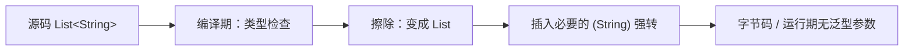

## 题目

泛型解决什么问题？什么是类型擦除？

## 答案

1. Java 泛型是参数化类型，编译期做类型校验，运行时发生类型擦除。
2. **泛型解决的问题**：在编写可复用代码的同时保证**编译期类型安全**，避免到处强制转型和运行期 `ClassCastException`。
3. **类型擦除**：Java 泛型主要是编译期特性。编译器做完类型检查和必要的强转插入后，运行期字节码里**泛型参数信息基本被擦掉**，`List<String>` 与 `List<Integer>` 在 JVM 中都是原始类型 `List`。

### 解释与扩展

#### 1. 泛型解决什么问题

| 无泛型 | 有泛型 |
|---|---|
| `List` 只能存 `Object`，取出要强转 | `List<String>` 编译期约束元素类型 |
| 错放类型 → 运行期 `ClassCastException` | 错放类型 → **编译期直接报错** |
| 同一套逻辑要为多种类型重复写代码 | 用类型参数 `T` 写一份，多处复用 |

```java
// 无泛型：编译能过，运行可能炸
List list = new ArrayList();
list.add("hello");
list.add(123);
String s = (String) list.get(1); // ClassCastException

// 有泛型：编译期拦住
List<String> list = new ArrayList<>();
list.add("hello");
// list.add(123); // 编译错误
String s = list.get(0); // 无需强转
```

核心收益三句话：
- **类型安全**：错误提前到编译期；
- **消除强制转型**：取出即目标类型；
- **代码复用**：`Collections.sort`、`Optional<T>`、`Comparator<T>` 等一套逻辑服务多种类型。

#### 2. 什么是类型擦除

编译器把泛型「擦」成原始类型，并插入桥接方法 / 强制转换以保持语义。常见规则：

| 源码中的泛型 | 擦除后 |
|---|---|
| `T`（无界） | `Object` |
| `T extends Comparable` | `Comparable`（取最左边界） |
| `List<String>` | `List` |
| `List<T>` | `List` |

```java
// 源码
public static <T> T identity(T t) { return t; }
List<String> names = new ArrayList<>();
String first = names.get(0);

// 擦除后大致等价于
public static Object identity(Object t) { return t; }
List names = new ArrayList();
String first = (String) names.get(0); // 编译器自动插入强转
```



无边界 T 擦除为 Object，有上界就擦除为上界类型。
通配符：`? extends T`上界，适合读；`? super T`下界，适合写，记住 PECS 原则。
泛型类静态方法不能直接使用类泛型参数；`List<String>`和`List<Object>`不存在继承关系。

#### 3. 擦除带来的直接后果（常考点）

1. **不能** `new T()`、`new T[]`，不能用 `instanceof List<String>`（只能 `instanceof List`）。
2. **不能** 按泛型参数重载：`void f(List<String>)` 与 `void f(List<Integer>)` 擦除后签名相同，编译失败。
3. 运行期拿不到完整泛型参数（普通场景）；反射里可见的是擦除后的原始类型（个别场景可通过 `ParameterizedType` 拿到声明处的泛型信息，如字段、父类签名）。
4. 泛型主要存在于**编译期**；要让运行期保留更多类型信息，需用 `Class<T>` / `TypeToken` 等手法额外传入。

### 注意

- 泛型不能用于基本类型,只能用包装类：要用 `List<Integer>`，不能 `List<int>`（装箱）。
- 类型擦除是为了**兼容 Java 5 之前无泛型的字节码**（原始类型仍可与泛型代码混用），代价是运行期类型信息变弱。
- 通配符 `?`、`? extends`、`? super`（PECS）解决的是「只读 / 只写」的类型安全，本身仍会被擦除。
- 面试口述可收束为：泛型让容器类型安全且可复用；类型擦除让这些约束主要留在编译期，JVM 里基本只剩原始类型。
