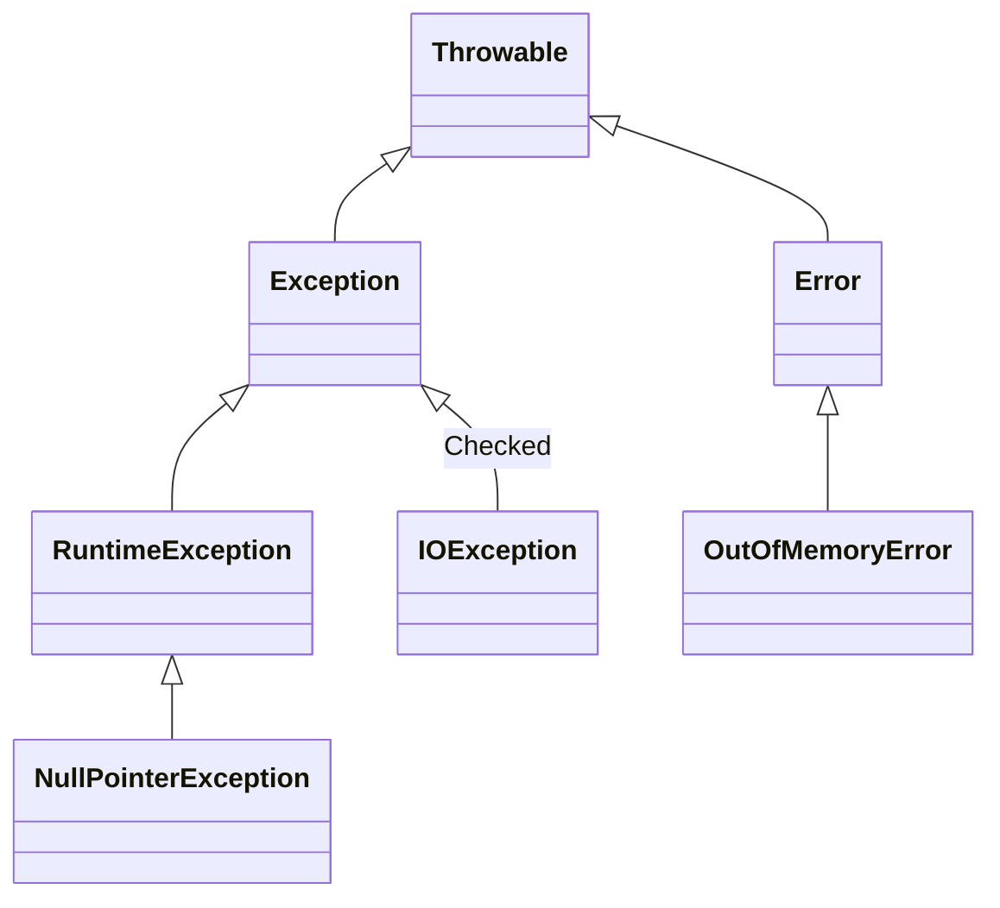
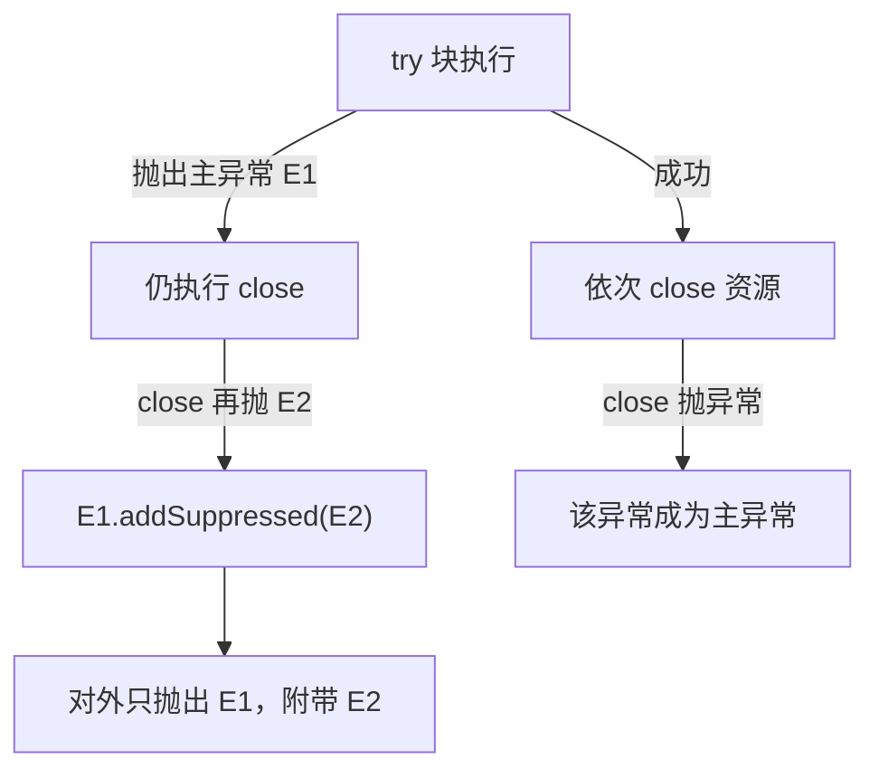

## 题目

说一下 Java 异常体系？Checked vs RuntimeException 如何选？try-with-resources 与异常压制？

## 答案

1. **异常体系根是 `Throwable`**，两大分支：`Error`（JVM 级严重错误，一般不捕获）与 `Exception`（程序可处理的异常）。
2. `Exception` 再分：**受检异常 Checked**（必须声明或处理）与 **`RuntimeException` 及其子类**（非受检，可不声明）。
3. **选型原则**：调用方**能合理恢复 / 必须知晓** → Checked；属于**编程错误或无法就地恢复** → RuntimeException。
4. **try-with-resources**：自动关闭实现了 `AutoCloseable` 的资源；关闭时若再抛异常，会作为**被压制异常（suppressed）**挂到主异常上，不丢失。

### 解释与扩展

#### 1. 异常继承树



| 类型 | 代表 | 特点 |
|---|---|---|
| `Error` | `OutOfMemoryError`、`StackOverflowError` | JVM / 系统级，通常无法恢复，不要 `catch` 后继续装正常 |
| Checked Exception | `IOException`、`SQLException`、`InterruptedException` | 编译期强制 `throws` 或 `try-catch` |
| RuntimeException | `NPE`、`IllegalArgumentException`、`IndexOutOfBoundsException` | 非受检，多属代码缺陷或非法参数 |

另外：`throws` 声明、`throw` 抛出、`try / catch / finally` 处理；`finally` 几乎总会执行（除非 JVM 退出 / 线程被干掉）。

#### 2. Checked vs RuntimeException 如何选

| 维度 | 选 Checked | 选 RuntimeException |
|---|---|---|
| 语义 | 业务上「可预期的失败」，调用方应显式处理 | 编程错误、前置条件破坏、无法就地恢复 |
| 例子 | 文件不存在、网络超时、SQL 失败 | 空指针、非法参数、状态机用错 |
| 代价 | 签名污染、层层 `throws` / 包装 | 编译不强制，易被忽略 |

实践建议：
- **库 / 框架对外 API**：能恢复的受检失败可用 Checked；若到处被迫空 `catch`，说明不该 Checked。
- **应用内部业务异常**：多数团队用 **自定义 RuntimeException**（或统一业务异常基类）+ 全局处理，避免 Checked 层层传递。
- **不要**为图省事把所有异常都吞掉或一律包成 Runtime；也不要滥用 Checked 强迫每个 `map` 回调都处理 IO。
- 包装时保留因果：`throw new BizException("...", e)`，便于排查。

#### 3. try-with-resources 与异常压制

```java
try (InputStream in = Files.newInputStream(path);
     OutputStream out = Files.newOutputStream(outPath)) {
  in.transferTo(out);
} // 自动按声明逆序 close
```

要点：
1. 资源须实现 `AutoCloseable`（`Closeable` 是其子接口）；多个资源按**声明的逆序**关闭。
2. **主异常**：`try` 块里抛出的异常（或初始化资源失败的那个）。
3. **关闭阶段再抛异常**：不会覆盖主异常，而是调用 `primary.addSuppressed(closeEx)`，形成**异常压制**。
4. 排查时看 `getSuppressed()`，日志框架一般会一并打印。



对比手写 `try-finally`：若 `try` 与 `close` 都抛异常，旧写法常**丢失**其中一个；try-with-resources 用压制机制两者都保留。

### 注意

- `Error` 与多数 `RuntimeException` 都不应在业务层「消化掉装没事」；该失败就失败或上抛到统一处理。
- `catch (Exception e)` 过宽会误伤；更不要 `catch (Throwable)` 除非框架顶层兜底。
- try-with-resources 里资源变量隐式 `final`；Java 9+ 可用「效最终」的已有变量：`try (in)`。
- `InterruptedException` 是 Checked：捕获后应恢复中断标志 `Thread.currentThread().interrupt()`，不要空吞。
