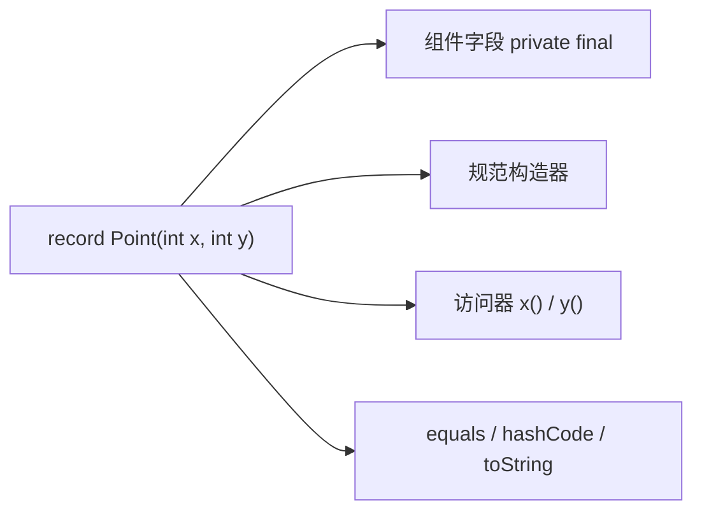

## 题目

Record 是什么？Record 适合表达什么？与普通不可变类区别？（Java 16+）

## 答案

1. **Record** 是 Java 16 正式落地的一类特殊类：用来做**浅不可变、透明的数据载体**（nominal tuple），组件在头声明，编译器自动生成规范构造器、访问器、`equals` / `hashCode` / `toString`。
2. **适合表达**：DTO、事件载荷、坐标/区间、多返回值、Map 的 key、配置快照等「状态即全部含义」的不可变聚合；不适合富行为实体、需要继承体系或可变状态的领域模型。
3. **与手写不可变类的核心区别**：Record **承诺状态透明、API 与组件一一对应**；手写类可自由封装、解耦表示与 API。Record 隐式 `final`、隐式继承 `java.lang.Record`，组件字段 `private final`，访问器是 `name()` 而非 `getName()`。

### 解释与扩展

#### 1. Record 是什么

```java
public record Point(int x, int y) {}

// 大致等价于编译器生成：
// - private final int x, y;
// - 规范构造器 Point(int x, int y)
// - 访问器 x() / y()
// - 基于全部组件的 equals / hashCode / toString
```

要点：
- 头里的参数叫 **record components**；每个组件对应一个 `private final` 字段 + 同名 `public` 访问器。
- 未显式声明时，自动提供**规范构造器**（canonical constructor）及 `equals` / `hashCode` / `toString`。
- 可用**紧凑构造器**做校验 / 规范化：

```java
public record Range(int from, int to) {
  public Range {
    if (from > to) throw new IllegalArgumentException("from > to");
  }
}
```

- 可实现接口、可声明静态成员与额外实例方法；**不能**显式继承其他类（已隐式继承 `Record`），**不能**声明实例字段（除组件对应字段外），类本身隐式 `final`。
- 隐式 `final` 使其很适合做密封层次（`sealed`）的叶子实现（见下文「与 sealed」）。



#### 2. Record 适合表达什么

语义目标（JEP 395）：**把数据当数据建模**，而不是先冲着少写样板。

| 适合 | 不适合 / 慎用 |
|---|---|
| DTO、API 请求/响应体、消息体 | 需要可变状态、Builder 渐进填充的实体 |
| 值对象：坐标、金额快照、区间、配对 | 富行为领域对象（大量可变业务逻辑） |
| 多返回值、流处理中间结果 | 需要继承扩展的类层次 |
| 作为 `HashMap` / `Set` 的不可变 key | 要隐藏内部表示、或访问器语义 ≠ 字段本身 |

一句话：组件集合**完整描述**了这个类型的身份与含义时，用 Record；需要封装、可变、继承时，用手写类。

#### 3. 与普通不可变类的区别

| 维度 | Record | 手写不可变类 |
|---|---|---|
| 目的 | 透明数据载体，状态公开 | 可封装，API 可与内部表示解耦 |
| 样板 | 一行头声明即可 | 手写字段、构造、getter、三方法 |
| 继承 | 隐式 `final`，父类固定为 `Record` | 可设计继承（若允许） |
| 字段 | 仅组件对应的 `private final` | 可自由设计字段与可见性 |
| 访问器 | `x()` 风格，与组件同名 | 常见 `getX()`，也可自定义 |
| 相等性 | 默认按**全部组件**值相等 | 需自己定义相等语义 |
| 可变性 | 浅不可变（引用组件指向的对象仍可能可变） | 同样需自行保证深/浅不可变 |
| 序列化 | 可 `Serializable`；反序列化走规范构造器，定制 `readObject` 等无效 | 常规序列化钩子可用 |

```java
// 手写不可变类：可隐藏表示、提供派生 API
public final class Money {
  private final long cents;
  public Money(long cents) { this.cents = cents; }
  public String display() { return "$" + (cents / 100.0); }
  // equals/hashCode/toString 自己写…
}

// Record：表示即 API，适合「就这几个字段」
public record MoneyDto(long cents, String currency) {}
```

浅不可变提醒：`record User(String name, List<String> roles)` 中 `roles` 仍可能被外部改掉；需要真正不可变时应对可变组件做拷贝或用不可变集合。

#### 4. 与 sealed 的组合（ADT）

Record 管「一个值由哪些组件构成」（积类型）；`sealed` 管「这个抽象只有哪些已知实现」（和类型）。常见写法（详见同目录 sealed 题）：

```java
public sealed interface Result permits Ok, Err {}

public record Ok(String value) implements Result {}
public record Err(String message) implements Result {}
```

叶子用 Record 时不必再写 `final`，层次简洁，且便于后续 `switch` 模式匹配做穷尽检查。建模「有限多种形态的不可变数据」时，优先想 **sealed + record**，而不是开放继承 + 手写样板类。

### 注意

- Preview：Java 14/15；**正式特性：Java 16+**（JEP 395）。sealed 正式于 **Java 17**（JEP 409）。
- Record 不是「语法糖版 Lombok `@Value`」这么简单——核心是**语义承诺**：透明、不可变数据载体；换来的是不能随便解耦表示。
- 访问器不是 JavaBean `getXxx()`；和部分框架（旧版 ORM / 部分 Bean 工具）对接时要确认是否支持 record。
- 可覆盖访问器、`equals` 等，但应保持「透明载体」契约，不要把 Record 写成隐藏状态的伪实体。
- 面试口述可收束：Record = 浅不可变透明数据载体；适合 DTO/值对象；与 sealed 组合可表达 ADT；比手写不可变类少样板，但放弃表示封装与继承自由度。
