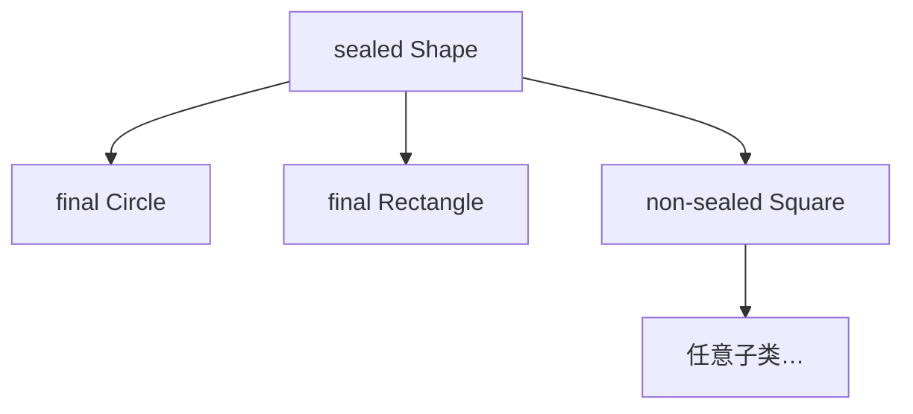

## 题目

密封类 sealed 是什么？解决什么问题？（Java 17+）

## 答案

1. **密封类 / 接口**（`sealed`）用 `permits` **显式限定**谁可以继承或实现它；被允许的子类型必须是 `final`、`sealed` 或 `non-sealed` 之一。
2. **解决的问题**：在「完全开放继承」与「`final` 彻底禁止继承」之间给出第三种选择——**受控、可穷尽的类型层次**，便于领域建模，并为模式匹配的穷尽检查打基础。
3. 与 Record 常一起用：Record 隐式 `final`，很适合做 sealed 层次的叶子；二者合称代数数据类型（ADT）——Record 表积类型，sealed 表和类型。

### 解释与扩展

#### 1. sealed 是什么

```java
public abstract sealed class Shape
    permits Circle, Rectangle, Square {
  // ...
}

public final class Circle extends Shape { /* ... */ }
public final class Rectangle extends Shape { /* ... */ }
public non-sealed class Square extends Shape { /* ... */ } // 此支重新开放继承
```

| 修饰 | 含义 |
|---|---|
| `sealed` | 仅 `permits` 列出的类型可直接继承 / 实现 |
| `final` | 叶子：不可再继承 |
| `non-sealed` | 打开封闭：其下又可任意继承 |
| `permits` | 声明允许的直接子类型；同编译单元时可省略，由编译器推断 |

约束要点：
- 密封类型与被允许子类型须在**同一模块**；未命名模块则须**同一包**。
- 子类型必须**直接**继承 / 实现该 sealed 类型。
- 接口同样可 `sealed`；子接口须为 `sealed` 或 `non-sealed`（接口不能 `final`）。



#### 2. 解决什么问题

| 旧手段 | 痛点 |
|---|---|
| 普通开放继承 | 库外可任意加子类，作者无法假定「只有这几种」 |
| `final` 类 | 完全不能扩展，建模「有限多种形态」太死 |
| 包私有构造 + 同包实现 | 靠约定，跨包/模块难用，意图不清晰 |
| 访问器里一长串 `instanceof` | 加新子类型易漏分支，无编译期穷尽检查 |

sealed 给出的能力：
1. **领域封闭**：如图形只有圆/矩/方，结果只有成功/失败/超时——层次由作者说了算。
2. **库边界控制**：对外暴露抽象，禁止第三方意外继承破坏不变量。
3. **为穷尽匹配铺路**：配合 `switch` 模式匹配（Java 21 等），编译器可检查是否覆盖全部 `permits` 分支。

```java
// 密封接口 + 穷尽建模（示意）
public sealed interface Result permits Ok, Err {}
public record Ok(String value) implements Result {}
public record Err(String msg) implements Result {}
```

#### 3. 与 Record 的结合（ADT）

详见同目录 Record 题。典型写法：

```java
public sealed interface Expr
    permits Constant, Plus, Neg {
}

public record Constant(int value) implements Expr {}
public record Plus(Expr left, Expr right) implements Expr {}
public record Neg(Expr expr) implements Expr {}
```

- **Record**：积类型（一组固定组件拼成一个值）。
- **sealed**：和类型（「恰好是这些可能性之一」）。
- Record 已是 `final`，做 sealed 叶子时不必再写 `final`，层次更干净。

### 注意

- Preview：Java 15/16；**正式特性：Java 17**（JEP 409）。
- `permits` 与子类声明必须一致；漏写或跨模块会直接编译失败。
- `non-sealed` 会局部打破封闭性——只在确实需要第三方扩展的那一支使用。
- 面试口述可收束：sealed = 受控继承；解决「有限已知子类型」建模；常与 Record + 模式匹配组成 ADT。
