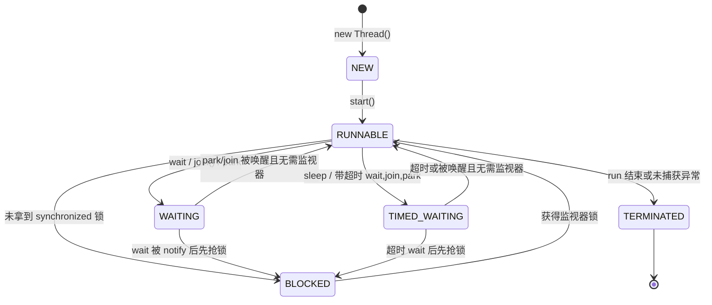

## 题目

说一下进程和线程？Java 线程的生命周期(有哪些状态)？状态如何转换？

## 答案

1. 进程管资源,线程管调度(执行);
2. **Java 线程**是 JVM 的执行调度单元。HotSpot 采用 **1:1**：一个 Java 线程对应一个 OS 内核线程。`Thread` 是载体，`Runnable` / `Callable` 是任务；`start()` 才会真正起线程，直接 `run()` 仍在当前线程。
3. **生命周期 6 种状态**（`Thread.State`，没有 OS 意义上的 Running / Sleeping）：`NEW`、`RUNNABLE`、`BLOCKED`、`WAITING`、`TIMED_WAITING`、`TERMINATED`。
4. **转换主线**：`new Thread()` → `NEW` → `start()` → `RUNNABLE`；因锁进入 `BLOCKED`，因无限等待进入 `WAITING`，因限时等待进入 `TIMED_WAITING`；任务结束或未捕获异常 → `TERMINATED`。`wait` 被唤醒后往往先抢锁（可能 `BLOCKED`）再回 `RUNNABLE`。

### 解释与扩展

#### 1. 进程和线程

**进程**是 OS 资源分配的基本单位（独立地址空间、文件描述符等）进程间相互隔离；
**线程**是 CPU 调度的基本单位。同一进程内多线程共享堆与方法区，各自有独立栈、程序计数器、本地变量。

| 维度 | 进程 | 线程 |
|---|---|---|
| 定位 | 资源分配单位 | CPU 调度单位 |
| 地址空间 | 彼此隔离 | 同进程共享堆 / 静态区 |
| 开销 | 创建、切换、IPC 更重 | 更轻；共享内存通信 |
| 故障隔离 | 一进程崩溃一般不影响其他进程 | 一线程搞坏共享数据可拖垮整个进程 |

Java 里：一个 JVM 进程内多个线程共享堆；每个线程有自己的 Java 栈、PC、本地方法栈。开发优先线程池，少手动 `new Thread`。

#### 2. 六种状态（`Thread.State`）

| 状态 | 核心含义 |
|---|---|
| `NEW` | 已 `new Thread`，尚未 `start()` |
| `RUNNABLE` | 就绪 + 正在跑；含等 CPU。阻塞在部分 IO 上时仍可能是 `RUNNABLE` |
| `BLOCKED` | 争抢 **`synchronized` 监视器锁**失败，等锁 |
| `WAITING` | 无限等待，需其他线程唤醒（`wait()`、无参 `join()`、`LockSupport.park()` 等） |
| `TIMED_WAITING` | 限时等待（`sleep`、带超时的 `wait`/`join`、`parkNanos` 等） |
| `TERMINATED` | `run` 正常结束或未捕获异常退出；不能再 `start()` |

重点：`BLOCKED` **只针对 `synchronized`**。`ReentrantLock.lock()` 拿不到锁时通常是 `WAITING` / `TIMED_WAITING`，不是 `BLOCKED`。

#### 3. 状态如何转换

口述版：
- `new Thread()` → `NEW` → `start()` → `RUNNABLE`。
- 抢 `synchronized` 失败 → `BLOCKED`；拿到锁 → `RUNNABLE`。
- `Object.wait()`、无参 `join()`、`park()` → `WAITING`；`wait` 被 `notify`/`notifyAll` 后**先抢同一把监视器**，常经 `BLOCKED` 再回 `RUNNABLE`。
- `Thread.sleep`、带超时的 `wait`/`join`、`parkNanos` → `TIMED_WAITING`；超时或提前唤醒，`wait` 场景同样要重新抢锁。
- `run` 执行完或线程内未捕获异常 → `TERMINATED`。

### 注意

- `sleep` / `wait` / `join` / `yield` 的对比见同系列「sleep、wait、join、yield 的区别」。
- `interrupt()` 只打中断标记，不是立刻杀线程；阻塞 API 抛 `InterruptedException` 后会清标记，捕获后应 `Thread.currentThread().interrupt()`。
- `setDaemon(true)` 必须在 `start()` 之前；JVM 只剩守护线程就会退出。
- 排查：大量 `BLOCKED` 多半是 `synchronized` 争用；大量 `WAITING` 多见条件等待、队列 `take`、`park`。
