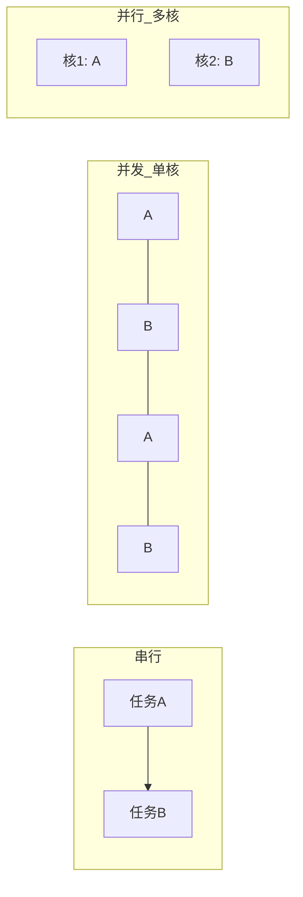

## 题目

说一下并发、并行、串行？及并发的三大特性

## 答案

1. **串行**：排队依次执行
2. **并发**：分时切换，伪同时
3. **并行**：多核硬件，真同时
4. **并发三大特性**：**原子性**、**可见性**、**有序性**（Java 内存模型 JMM 要保证的核心）。

### 解释与扩展

#### 1. 串行 / 并发 / 并行

| 概念 | 核心 | 生活类比 | 硬件直觉 |
|---|---|---|---|
| 串行 | 同一时刻只做一件事，做完再下一件 | 一个人洗完一摞碗再擦桌子 | 单线程、无交错 |
| 并发 | 逻辑上同时推进，物理上常靠时间片轮转 | 一人在洗碗与擦桌子间切换 | 单核也可「同时」跑多线程 |
| 并行 | 同一时刻真的在同时执行 | 两人分别洗碗、擦桌子 | 多核 / 多 CPU |

关系要点：
- **并发是设计层面**（程序如何组织多任务）；**并行是执行层面**（硬件能否同拍跑）。
- 单核多线程 → 只有并发、无并行；多核多线程 → 可并发也可并行。
- 并行一定是某种意义上的同时执行；并发未必并行（分时也算并发）。

#### 2. 并发三大特性

多线程共享内存时，若不加同步，会出现「写了一半被看见」「改了别的核看不到」「指令被重排」等问题。JMM 用三大特性描述正确性目标：

| 特性 | 含义 | 反例 / 风险 | Java 常见手段 |
|---|---|---|---|
| **原子性** | 一组操作要么全做完，要么看起来像没做；中间状态不可被其他线程观察到 | `i++` 实际是读-改-写三步，中间可被打断 → 丢更新 | `synchronized` / `Lock`、`AtomicInteger` 等原子类、CAS |
| **可见性** | 一线程改了共享变量，其他线程能及时看到最新值 | 线程 A 改 `flag=true`，线程 B 一直读到旧的 `false`（缓存 / 寄存器） | `volatile`、`synchronized` / `Lock` 的释放-获取语义 |
| **有序性** | 程序按「符合 happens-before 的顺序」执行；禁止有害的指令重排对外暴露 | 双重检查锁未 `volatile`：先发布对象引用，再初始化字段 → 看到半初始化对象 | `volatile`、`synchronized`、`final` 语义、显式屏障（少直接用） |

口述收束：
1. **原子性**管「做完整」——别让别人看到半截操作。
2. **可见性**管「改完别人看得到」——别卡在各自缓存里。
3. **有序性**管「顺序别乱到破坏语义」——编译器 / CPU 重排要对其他线程安全。

三者常一起谈：例如 `synchronized` 同时提供原子性（临界区互斥）、可见性（解锁前写对后续加锁可见）和一定有序性；`volatile` 保可见性与有序性，**不**保复合操作的原子性（`volatile int` 的 `i++` 仍要额外同步）。

### 注意

- 面试别把「并发 = 多核」说死：单核时间片切换也是并发。
- 「并行一定并发」在日常说法里常成立；严格说并行强调物理同时，并发强调逻辑交错——别抠字眼，能讲清场景即可。
- 三大特性对应的坑：原子性 → 竞态；可见性 → 死循环 / 读到旧值；有序性 → DCL、发布对象。
- `volatile` ≠ 万能锁；复合读改写仍要锁或原子类。
