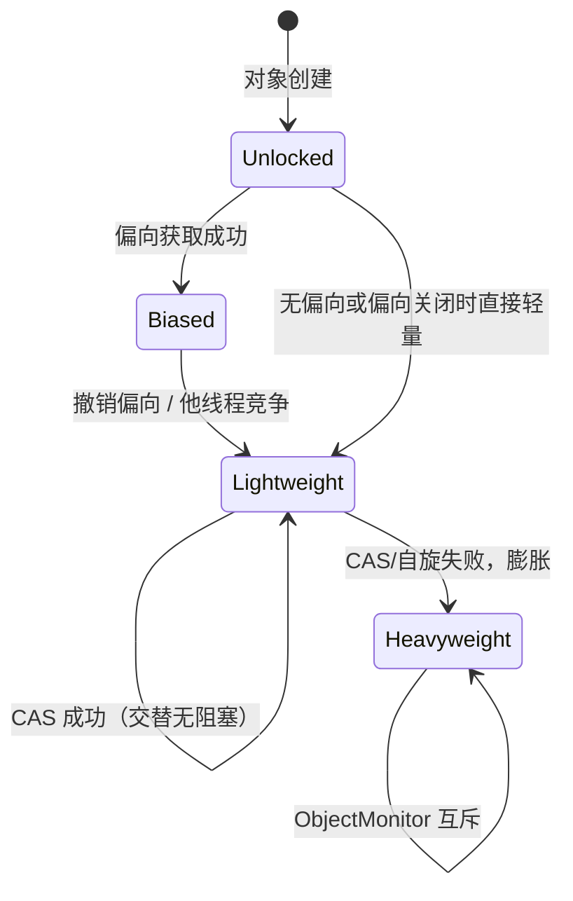

## 题目

synchronized 如何实现？锁升级与优化经历了什么？

## 答案

1. **语义层**：`synchronized` 是监视器锁（Monitor），保证互斥 + 解锁对后续加锁的可见性 / 有序性（JMM happens-before）。
2. **字节码层**：同步块 → `monitorenter` / `monitorexit`；同步方法 → 方法表 `ACC_SYNCHRONIZED`，进出时由 JVM 隐式加解锁。
3. **对象头层**：锁状态记在对象头 **Mark Word**；竞争升级时膨胀为 **ObjectMonitor**（重量级锁，关联 OS 互斥量）。
4. **锁升级（HotSpot 经典路径）**：无锁 → **偏向锁** → **轻量级锁**（CAS）→ **重量级锁**（只升不降，同一对象锁生命周期内）。
5. **其他优化**：锁消除、锁粗化、自适应自旋；JDK 15+ **偏向锁默认关闭**（JEP 374），面试要分清「经典故事」与「现行默认」。

### 解释与扩展

#### 1. 如何实现（三层说清）

**① 写法与字节码**

```java
synchronized (obj) { /* 临界区 */ }

synchronized void m() { /* ... */ }
```

| 形式 | 实现要点 |
|---|---|
| 同步块 | 编译为 `monitorenter` / `monitorexit`（异常路径也会 `monitorexit`，保证释放） |
| 实例同步方法 | `ACC_SYNCHRONIZED`，锁的是 **当前实例 `this`** |
| 静态同步方法 | 同上，锁的是 **Class 对象** |

**② 锁记在哪：对象头 Mark Word**

每个 Java 对象头含 Mark Word（+ 类型指针等）。Mark Word 用若干 bit 表示：哈希码、分代年龄、**锁标志、偏向线程 ID** 等。同一把 `synchronized(obj)` 的「锁」就是 **这个 `obj` 的监视器身份**，状态写在它的头里。

**③ 重量级：ObjectMonitor**

膨胀后关联 C++ `ObjectMonitor`：持有者、入口队列（EntryList）、等待队列（WaitSet，对应 `wait`/`notify`）、计数（可重入）等；真正阻塞/唤醒往往落到 OS 的 mutex / park，开销大。

口述收束：源码是关键字 → 字节码是 `monitor*` / 标志位 → 运行时在 **Mark Word +（必要时）ObjectMonitor** 上完成加解锁。

#### 2. 锁升级路径（经典 HotSpot）

设计动机：多数锁很少竞争、甚至只有一个线程反复进入 → 先用便宜方案，竞争加剧再升级。

```text
无锁 / 可偏向
    │ 首次被某线程以偏向方式拿到
    ▼
偏向锁（Biased）     —— 同一线程反复进入几乎无 CAS
    │ 出现其他线程竞争（撤销偏向）
    ▼
轻量级锁（Lightweight）—— 栈上 Lock Record + CAS 改 Mark Word；失败可自旋
    │ 自旋仍失败 / 竞争激烈
    ▼
重量级锁（Heavyweight）—— 膨胀为 ObjectMonitor，未抢到的线程阻塞（BLOCKED）
```

| 阶段 | 核心手段 | 适合场景 | 失败/升级触发 |
|---|---|---|---|
| **偏向锁** | Mark Word 记下偏向线程 ID；同线程再进入几乎只做检查 | 单线程反复进同一锁 | 其他线程来抢 → 撤销偏向，常升到轻量级 |
| **轻量级锁** | 线程栈帧建 Lock Record，CAS 把 Mark Word 指向它 | 交替执行、竞争很轻 | CAS 失败，自适应自旋仍拿不到 → 膨胀 |
| **重量级锁** | ObjectMonitor + OS 调度阻塞/唤醒 | 真实多线程争用 | 已是最重形态；**同一对象上一般不降级** |

补充细节（常考点）：
- **可重入**：同一线程多次进入，计数 +1；退出减到 0 才真正释放。
- **只升不降**：某个对象上的锁一旦膨胀为重量级，在该对象生命周期内通常不会退回轻量级/偏向（避免来回抖动）。
- **哈希码与偏向**：对象算过 `identityHashCode` 后通常不能再偏向（Mark Word 要存 hash），面试提一句即可。



#### 3. 还有哪些优化（不只「升级」）

| 优化 | 做什么 | 谁做 |
|---|---|---|
| **锁消除** | 逃逸分析证明对象不会逃出线程 → 去掉无意义的同步 | JIT |
| **锁粗化** | 相邻多次对同一锁的加解锁合并成一次，减少进出开销 | JIT |
| **自适应自旋** | 膨胀前自旋一会儿；根据历史成败动态调自旋次数 | JVM 运行时 |
| **偏向锁** | 消除无竞争时的 CAS（见上；现行 JDK 默认往往关掉） | JVM |

#### 4. JDK 演进（面试加分）

- **早期**：粗粒度、动辄重量级，`synchronized` 被说「慢」。
- **JDK 6 前后**：偏向 / 轻量级 / 自适应自旋等，性能大幅改善，很多场景不必急着换 `ReentrantLock`。
- **JEP 374（JDK 15）**：**偏向锁默认禁用**，并可废弃；维护成本高、收益在现代负载上变小。写答案时要说：经典八股仍讲四级状态，但 **跑新 JDK 时默认往往没有偏向阶段**，无锁后更常直接走轻量级 → 重量级。
- 与 `ReentrantLock`：功能上可中断、公平、多条件等更灵活；单纯互斥时 `synchronized` 仍是默认首选（选型细节见下一题）。

### 注意

- 实现细节是 **HotSpot** 行为，不是 JLS 必选；别把 Mark Word 位图背成「规范」。
- 升级是 **性能优化叙事**；语义上始终是同一把监视器：互斥 + HB。
- 抢不到重量级锁 → 线程状态多为 `BLOCKED`（与 `ReentrantLock` + `park` 的 `WAITING` 不同）。
- 和 JMM 题衔接：`synchronized` 的释放-获取建立 happens-before，因而同时覆盖原子性（互斥）、可见性、有序性。
- 别把「锁升级」说成业务 API；应用代码无法手动选偏向/轻量，只能选同步粒度与是否该用锁。
