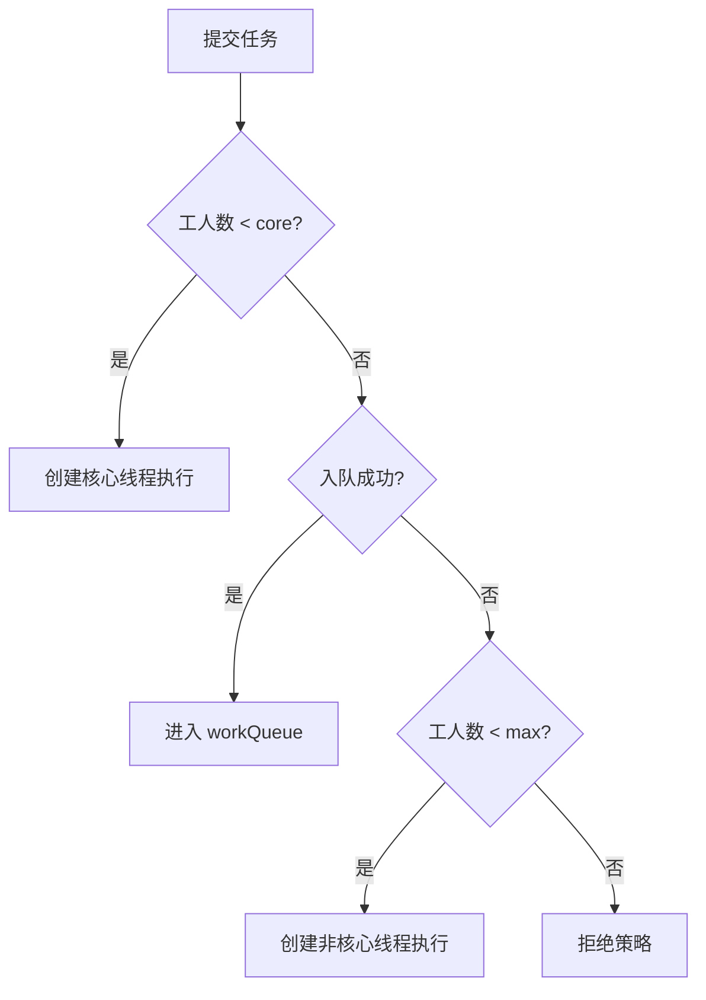

## 题目

线程池核心参数、执行流程、拒绝策略。★

## 答案

1. **核心参数（`ThreadPoolExecutor`）**：`corePoolSize`、`maximumPoolSize`、`keepAliveTime` + 单位、`workQueue`、`threadFactory`、`handler`（拒绝策略）。
2. **执行流程**：有空闲工人直接干 → 工人未满 core 则建核心线程 → 否则入队 → 队列满且未到 max 则建非核心线程 → 仍放不下则走拒绝策略。
3. **拒绝策略**：`AbortPolicy`（默认抛异常）、`CallerRunsPolicy`（调用线程跑）、`DiscardPolicy`（丢弃）、`DiscardOldestPolicy`（丢队头再试）；也可自定义。
4. **实践**：按业务选队列与上下限；慎用无界队列 + 默认 `Executors` 工厂；优雅关闭用 `shutdown` / `awaitTermination`。

### 解释与扩展

#### 1. 核心参数

| 参数 | 含义 | 面试要点 |
|---|---|---|
| **corePoolSize** | 核心线程数：即使空闲也常驻（除非允许超时回收） | 稳态并发「保底」容量 |
| **maximumPoolSize** | 池内线程上限（含核心） | 只有**队列满了**才会往 max 扩 |
| **keepAliveTime** | 超出 core 的空闲线程存活时间 | 过期回收，降资源占用 |
| **unit** | 上述时间的单位 | — |
| **workQueue** | 任务队列 | 有界 / 无界 / 同步移交，决定扩容时机与积压形态 |
| **threadFactory** | 如何 `new Thread` | 命名、守护线程、优先级；便于排查 |
| **handler** | 饱和时怎么办 | 四策略或自定义 |

常见队列选型：

| 队列 | 行为 | 典型场景直觉 |
|---|---|---|
| `ArrayBlockingQueue` | 有界数组 | 可控积压，易触发扩到 max / 拒绝 |
| `LinkedBlockingQueue` | 可有界；`Executors.newFixedThreadPool` 默认**无界** | 无界时几乎不扩到 max，易 OOM |
| `SynchronousQueue` | 不存任务，直接移交 | `CachedThreadPool`：来任务就尽量新建线程 |
| `PriorityBlockingQueue` | 优先级 | 要排序的任务 |

`allowCoreThreadTimeOut(true)` 时，核心线程空闲超过 `keepAliveTime` 也会回收。

#### 2. 执行流程（`execute`）

口述顺序（与源码直觉一致）：

```text
提交任务
  ├─ 当前线程数 < core ？ ──是──→ 创建核心线程执行
  ├─ 否 → 能入队成功？ ──是──→ 排队等待工人领取
  ├─ 否（队列满）→ 线程数 < max ？ ──是──→ 创建非核心线程执行
  └─ 否 → 拒绝策略 handler.rejectedExecution(...)
```



易错点：
- **不是**「先扩到 max 再入队」；是 **先 core → 再队列 → 最后才到 max**。
- 无界队列几乎总是入队成功 → **maximumPoolSize 形同虚设**。
- `submit` 相对 `execute`：包装成 `FutureTask`，异常进 Future，未 `get` 可能「吞」住。

#### 3. 拒绝策略

| 策略 | 行为 | 适用直觉 |
|---|---|---|
| **AbortPolicy**（默认） | 抛 `RejectedExecutionException` | 要明确失败、由调用方感知 |
| **CallerRunsPolicy** | 由**提交任务的线程**同步执行 | 降速反压，避免任务丢；可能拖慢调用方 |
| **DiscardPolicy** | 默默丢弃新任务 | 可丢的次要任务；难排查 |
| **DiscardOldestPolicy** | 丢掉队列最老任务，再试一次提交 | 要新不要旧；仍可能再拒 |

自定义：实现 `RejectedExecutionHandler`，做监控打点、落库、降级等。

#### 4. 和 `Executors` 工厂的关系

| 工厂方法 | 本质配置直觉 | 风险 |
|---|---|---|
| `newFixedThreadPool(n)` | core=max=n，**无界** `LinkedBlockingQueue` | 任务堆积 OOM |
| `newCachedThreadPool()` | core=0，max=很大，`SynchronousQueue`，60s 回收 | 突发流量线程爆炸 |
| `newSingleThreadExecutor()` | 单线程 + 无界队列 | 同无界积压 |
| `newScheduledThreadPool` | 定时 / 周期 | 异常后周期任务行为要当心 |

阿里等规范常建议：**自己 `new ThreadPoolExecutor(...)`**，显式有界队列 + 拒绝策略 + 线程命名。

### 注意

- 参数调优没有万能公式：core / max 初值见下一题（CPU / IO 密集）；受下游连接池、DB 等约束，要用压测。
- 关闭：`shutdown` 不再接新任务、跑完队列；`shutdownNow` 尝试中断在途并返回未执行列表；生产常 `shutdown` + `awaitTermination`。
- 与 ThreadLocal 题衔接：池化线程长寿，任务结束务必 `remove` 上下文。
- 面试加分：能画出「core → 队列 → max → 拒绝」，并点出无界队列坑。
