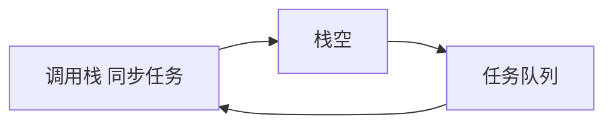

## 题目

请简述 JavaScript 的单线程模型与事件循环。同步任务、异步任务、任务队列如何配合？

## 答案

1. **单线程**：JS **主线程同时只执行一个任务**。设计原因是避免多线程同时改 DOM 的复杂锁。引擎后台可有其它线程，但脚本逻辑在主线程。耗时同步会卡住页面。

2. **同步 vs 异步**
   - **同步任务**：在主线程（调用栈）上排队，前一个结束才到下一个。
   - **异步任务**：先挂起，不阻塞后面代码；完成后以**回调**形式进入**任务队列**，等主线程空闲再执行。Ajax 可同步也可异步，由开发者选择。

3. **事件循环**：主线程先跑完所有同步任务 → 查看任务队列里到期的异步回调 → 取一个进栈执行 → 再检查……循环往复。引擎不断检查「挂起的异步是否可进入主线程」，即 **Event Loop**。没有回调的异步一般不会作为任务重新进主线程。

4. **扩展：微任务 vs 宏任务**（笔记基础之上）
   - 一轮循环：同步执行完后，先清空 **微任务**（如 `Promise.then`、`queueMicrotask`），再取一个 **宏任务**（如 `setTimeout`、I/O、部分 UI 事件）。
   - `Promise.resolve().then(fn)` 在本轮同步之后、下一个 `setTimeout(fn,0)` 之前执行。

### 解释与扩展

异步常见写法：回调、事件监听、Promise。长时间计算仍会阻塞；IO 等待适合异步。HTML5 **Web Worker** 可开子线程，但不能操作 DOM，不改变「主线程单线程」本质。Node 能高并发也依赖事件循环而非每请求一线程。

### 注意

1. `setTimeout(fn, 0)` 不是「立即」，而是尽快进入宏任务队列。
2. 死循环会饿死队列，定时器和 Promise 回调都无法跑。
3. 渲染时机与 `requestAnimationFrame` 常夹在帧循环里，深入问再展开。
