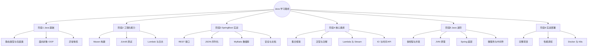
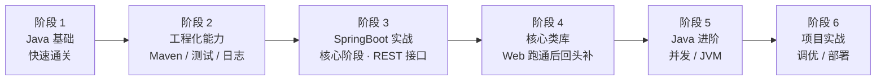
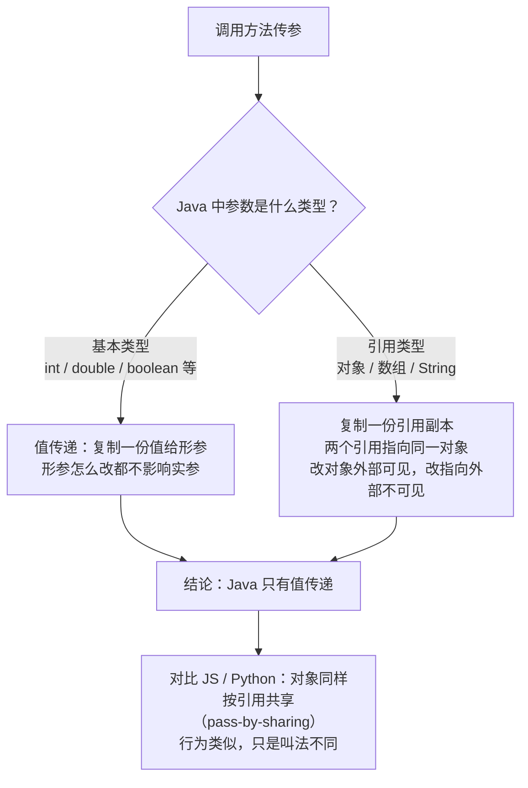
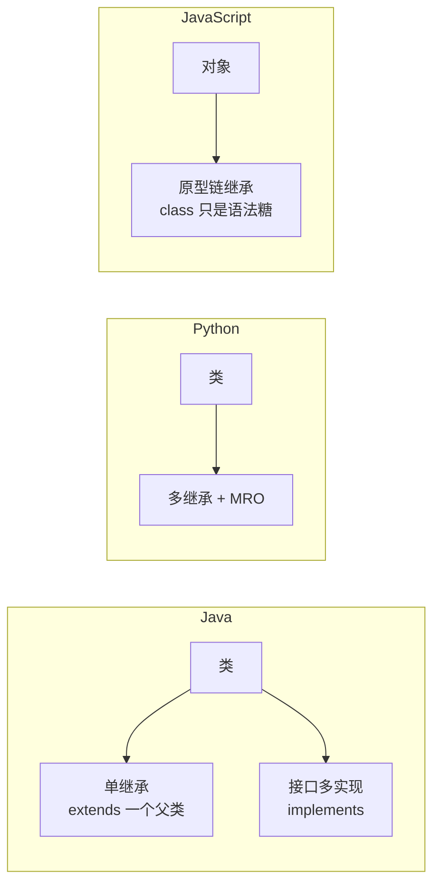
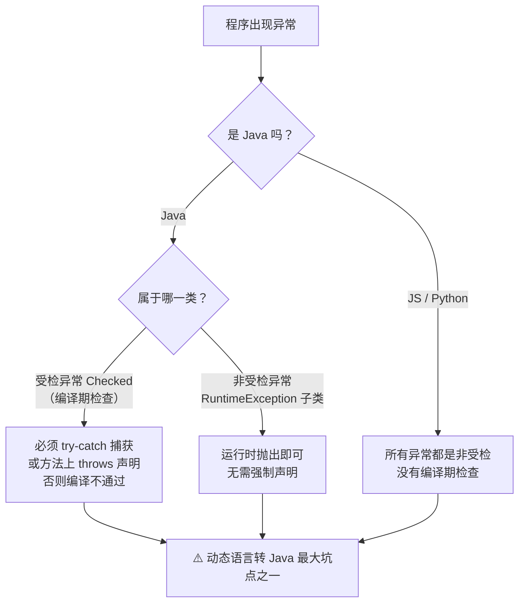
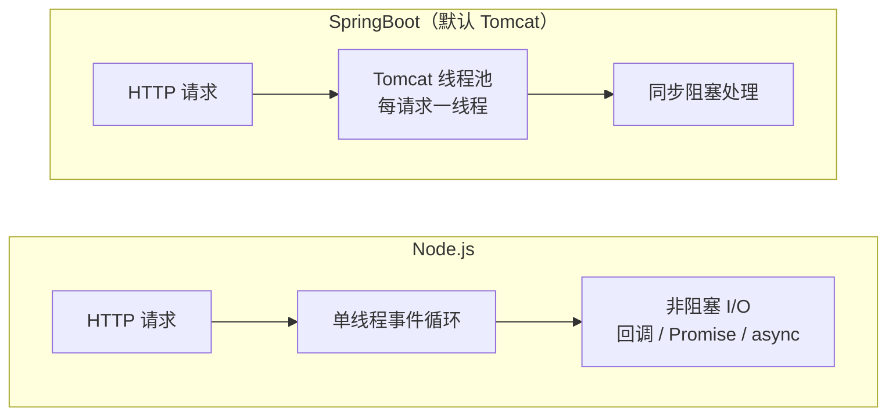
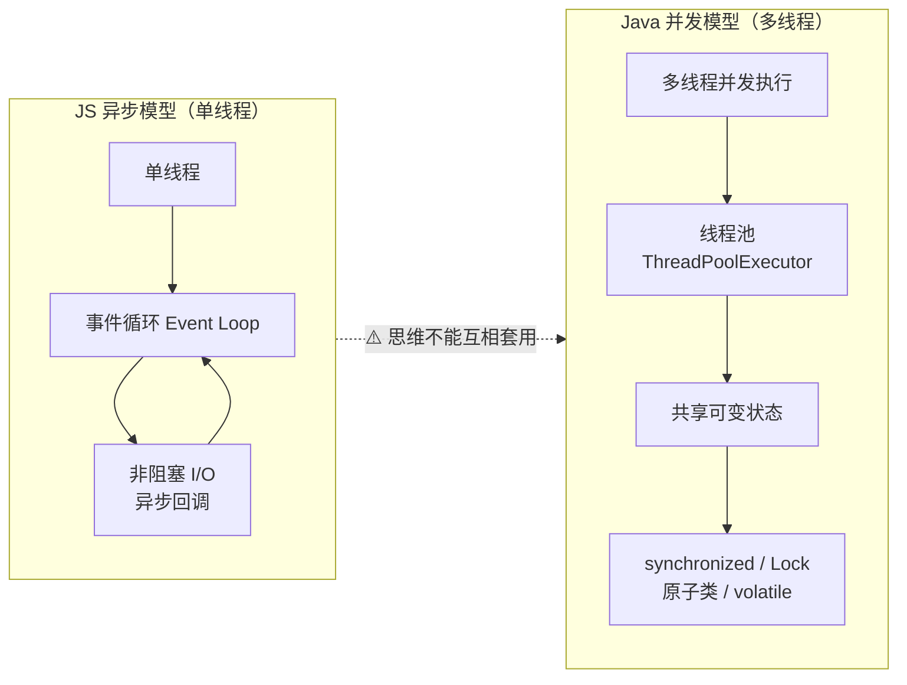

# Java 学习路线
> 适用人群：熟练 JavaScript、Python，掌握变量、函数、对象、异步、REST、JSON；有动态语言开发经验，目标掌握 Java 后端开发
<!-- more -->

## TL;DR（先看结论）

> 一句话路线：**快速过 Java 语法 → 工程化（Maven / 测试）→ 用 SpringBoot 写 REST 接口（复用 Web 经验）→ 回头补集合 / 泛型 / Stream → 攻克并发与 JVM → 完整项目收尾部署。**

- 通用编程语法**快速扫读**，重点学 Java 独有机制：静态类型、OOP、受检异常、值传递
- **持续横向对比 JS / Python**，同一个概念同步对照，重点抓差异点
- **优先 Web 实战**：先跑通 REST 接口，再回头补集合、IO、并发、JVM
- 四大高频坑：① JS 单线程事件循环 ≠ Java 多线程；② 受检异常编译期强制；③ Java 只有值传递；④ 泛型存在类型擦除

## 🗺️ 路线总览（先看图）

## 原有学习方案优缺点回顾

### ✅ 优点

- 跳过通用编程基础，聚焦 Java 独有特性，学习效率高
- 将 Maven、SpringBoot Web 实战前置，快速编写 HTTP 接口，利用 Web 开发经验
- 学习路径贴近企业真实开发流程，不是纯纸上谈兵

### ❌ 原有方案短板（针对 JS+Python 双动态语言背景）

1. 只对比 Python，缺少和 JavaScript 的对照，容易混淆原型继承、异步模型
2. 没有区分 Node.js 事件循环模型 和 Java 线程模型，写并发代码极易带入 JS 思维踩坑
3. JSON 序列化、参数绑定等 Web 场景，JS/Python 弱类型自动转换，Java 强类型校验逻辑差异大，缺少专项提示
4. 泛型、静态类型只简单介绍；你有 JS/TS、Python 类型注解基础，可以更快吃透 Java 泛型，原有目录没有利用好这个优势
5. 异常模型缺少横向对比：Python 异常、JS 异常 和 Java「受检异常 + 非受检异常」的巨大差异

## 核心学习原则

1. **通用编程语法快速扫读**：分支、循环、函数定义只看 Java 写法差异，不重复刷题
2. **持续横向对比**：同一个概念，同步对照 Python、JavaScript 的实现方式，重点抓差异点
3. **优先 Web 实战**：快速上手 SpringBoot，编写 REST 接口，对比 Node.js Web 开发模式
4. **先能用，再深挖底层**：跑通接口、数据库 CRUD 之后，回头补集合、IO、并发、JVM
5. **警惕思维迁移坑**：不要把 JS 原型、事件异步、Python 动态类型思维直接套用到 Java

## 推荐学习顺序

> 💡 一句话结论：**阶段 1→2 打基础，阶段 3 用 Web 实战快速产出，阶段 4→5 回头补底层，阶段 6 收尾成完整项目。**

### 阶段 1：Java 基础（快速通关，重点：静态类型、OOP、异常）
> 目标：建立 Java 语言模型，分清 Java VS Python VS JS 的核心差异

1. Java 介绍：JDK/JVM、字节码、跨平台、JDK 发行版、生态
   - 建议选择 **JDK 17 或 21（LTS）**，Spring Boot 3.x 要求 JDK 17+
2. Java 基础语法
   - 基本数据类型 & 包装类（重点：Java 特有的 primitive 与包装类二分，如 `int`/`Integer`；JS 原始值在需要时自动装箱为对象，Python 一切皆对象）
   - 静态类型约束、类型转换，对比 Python 类型注解 / TypeScript
   - 方法、**值传递（重中之重）**：Java 只有值传递，基本类型传值，对象传引用的副本；JS/Python 常被误称为引用传递，实际是“按共享传递”（pass-by-sharing），需仔细区分
   - 方法重载

3. Java 面向对象（核心章节，横向对比）
   - 类、对象、构造器；对比 JS 构造函数 / 类、Python 类
   - 访问修饰符 `private protected public default`：Java 有强制权限控制；JS/Python 只有约定（TypeScript 的访问修饰符仅编译期检查，运行时无效；Python 靠 `_`/`__` 命名约定）
   - 继承、重写、super：Java **类只能单继承**，对比 JS 原型继承、Python 多继承
   - 抽象类、接口：Java 接口，对比 Python ABC 抽象基类、JS interface（TS）；注意 Java 8+ 接口支持默认方法、静态方法，Java 9+ 支持私有方法
   - package 包管理、import、Jar 包

4. Java 异常体系
   - 受检异常 vs 非受检异常（最大坑点！JS/Python 没有受检异常）
   - try-catch-finally、try-with-resources
   - 异常处理最佳实践：不要吞异常、使用自定义异常、全局异常处理器设计

> ✅ 阶段产出：编写多个类，练习继承与接口；理解静态类型带来的约束；分清三种语言 OOP 模型差异

### 阶段 2：工程化能力（前置学习，Java 必备）
> 目标：脱离手动 `javac` 编译，掌握现代 Java 项目开发方式

1. Maven：项目目录结构、pom.xml、依赖管理、构建生命周期；多模块项目结构
2. JUnit5 + Mockito：单元测试，对比 Python pytest、JS Jest；可补充 AssertJ、Testcontainers
3. Lombok、日志框架 SLF4J + Logback
4. IDEA 常用配置、代码规范（阿里巴巴 Java 开发手册、Checkstyle、SpotBugs、SonarQube）
5. （可选）Gradle：在 Android 和部分后端项目中广泛使用

> ✅ 阶段产出：搭建 Maven 项目，引入第三方依赖，编写单元测试

### 阶段 3：SpringBoot Web 实战（发挥你 Web 开发经验，核心阶段）
> 目标：快速开发 REST 接口，对比 Node.js Web 开发模型

1. SpringBoot 入门：自动配置、启动类
2. Web 开发：`@RestController`、请求参数接收、参数校验
3. JSON 序列化 Jackson：重点对比 JS/Python JSON 自动转换，Java 强类型序列化坑
4. 跨域 CORS、全局异常处理器
5. MyBatis / MyBatis-Plus：数据库操作，对比 Python ORM、JS Sequelize；了解 HikariCP 连接池
6. 实战项目：RESTful CRUD 接口，可以用前端 JS 直接调用
7. 补充：SpringDoc OpenAPI（Swagger）生成接口文档；Spring Security 基础（认证、授权、JWT）
8. 理解 SpringBoot 和 Node.js 在 Web 请求处理模型上的区别：Node.js 单线程事件循环 + 非阻塞 I/O；SpringBoot 默认 Tomcat 多线程 + 阻塞 I/O，每请求一线程（线程池）

> ✅ 阶段产出：完整后端接口项目；理解 SpringBoot 和 Node.js 在 Web 请求处理模型上的区别

### 阶段 4：Java 核心类库
> 目标：掌握开发高频工具类

1. 集合框架：List、Set、Map，底层原理（ArrayList、HashMap 扩容、红黑树、并发问题；ConcurrentHashMap 原理）
2. 泛型、注解（结合你 TS/Python 类型基础，重点理解泛型擦除；补充通配符 `? extends`/`? super`、擦除带来的限制如不能 `new T()`、不能 `instanceof T`）；反射与注解处理
3. Java8+ Lambda、Stream 流：对比 JS 箭头函数、数组高阶方法；强调 Stream 惰性求值、只能消费一次、支持并行流，与集合有本质区别
4. 日期时间 API（java.time）
5. IO / NIO
6. Java 新特性：Optional、Record、Sealed Classes、模式匹配等

### 阶段 5：Java 进阶（难点，重点区分 JS 异步模型）
> 目标：理解 Java 并发模型，**强制区分：JS 事件循环 与 Java 多线程**

1. 多线程基础、线程池、`java.util.concurrent` 并发工具包
   - 深入：JMM（Java 内存模型）、volatile、synchronized、Lock、原子类、并发集合、线程安全与锁优化

2. JVM 基础：内存结构、GC 垃圾回收、类加载机制
   - 补充：垃圾收集器（G1、ZGC）、JVM 参数调优、VisualVM/JProfiler 等监控工具
3. Spring 底层原理：IoC、AOP
4. Spring Cloud 微服务基础（可选）
5. Netty（可选，高性能网络）
6. 缓存与消息队列：Redis、RabbitMQ/Kafka（企业级常见组件）

### 阶段 6：项目实战 & 查漏补缺

1. 完整后端项目：REST 接口、数据库、全局异常、日志、单元测试
2. 性能调优、常见坑点总结
3. Jar 包打包、部署运行
4. 容器化与部署：Docker 打包、Kubernetes 基础

## 📌 学习优先级表

| 模块 | 学习优先级 | 备注（JS/Python 背景） |
| --- | --- | --- |
| 值传递、静态类型、包装类 | ⭐⭐⭐⭐⭐ | 动态语言没有这个概念，高频踩坑 |
| Java OOP（单继承、接口、访问修饰符） | ⭐⭐⭐⭐⭐ | 和 JS 原型、Python OOP 差异巨大 |
| 受检异常 | ⭐⭐⭐⭐⭐ | JS/Python 不存在，Java 特有机制 |
| Maven | ⭐⭐⭐⭐⭐ | Java 项目基础，越早掌握越好 |
| SpringBoot REST 开发 | ⭐⭐⭐⭐⭐ | 复用你的 Web 开发经验，快速出成果 |
| 集合框架、Lambda/Stream | ⭐⭐⭐⭐ | Stream 和 JS 数组方法很像，但底层不一样 |
| Java 并发、线程池 | ⭐⭐⭐⭐ | ❗重点区分：JS 单线程事件循环 vs Java 多线程 |
| JVM 原理 | ⭐⭐⭐ | Web 上手之后再深入 |

## 📌 笔记系列文档规划（笔记风格统一）

1. Java 介绍
2. Java 基础语法：数据类型、值传递（对比 JS / Python）
3. Java 面向对象：类、继承、抽象类、接口（横向对比 JS/Python）
4. Java 异常体系：受检异常详解
5. Maven 项目管理
6. JUnit 单元测试
7. SpringBoot 快速入门
8. SpringBoot REST 接口开发、参数校验与 JSON 序列化
9. SpringBoot 全局异常与跨域处理
10. MyBatis 数据库开发
11. Java 集合框架
12. Java Lambda & Stream 流
13. Java 多线程与并发（重点对比 JS 事件循环）
14. JVM 基础
15. 实战项目：RESTful 后端系统

## 📌 学习小贴士（针对 JS+Python 开发者）

1. 不要用 Node.js 的思维写 Java：Node 是单线程事件循环；Java 是多线程模型，并发编程思路完全不同
2. JSON 序列化坑：JS/Python 会自动隐式转换数字、字符串；Java 强类型，类型不匹配直接报错
3. 泛型：TS 泛型和 Java 泛型看起来相似，但 Java 存在**泛型擦除**，底层不一样，不要直接等同
4. 异常：Python/JS 异常全部是非受检；Java 强制捕获或者声明受检异常，初期非常不习惯
5. 写 Demo 优先做 Web 接口，不要长时间写控制台程序，Web 项目能最大化复用你已有经验