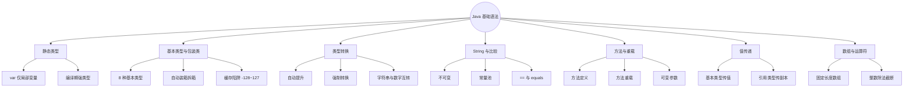
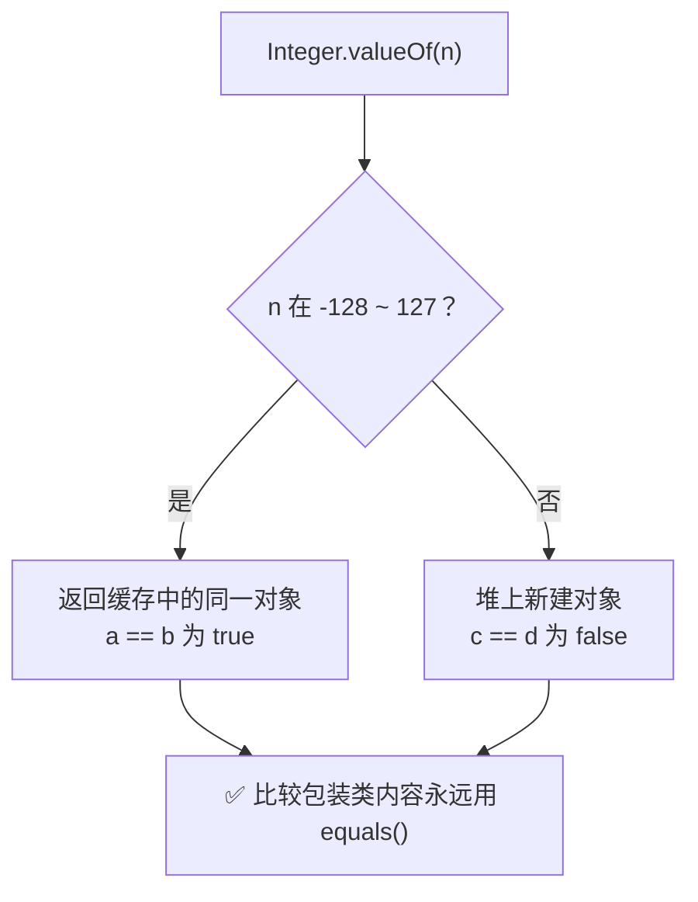
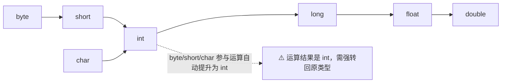
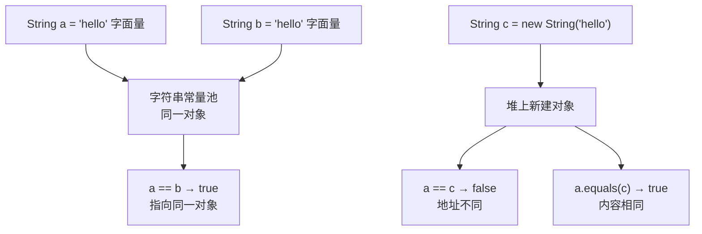
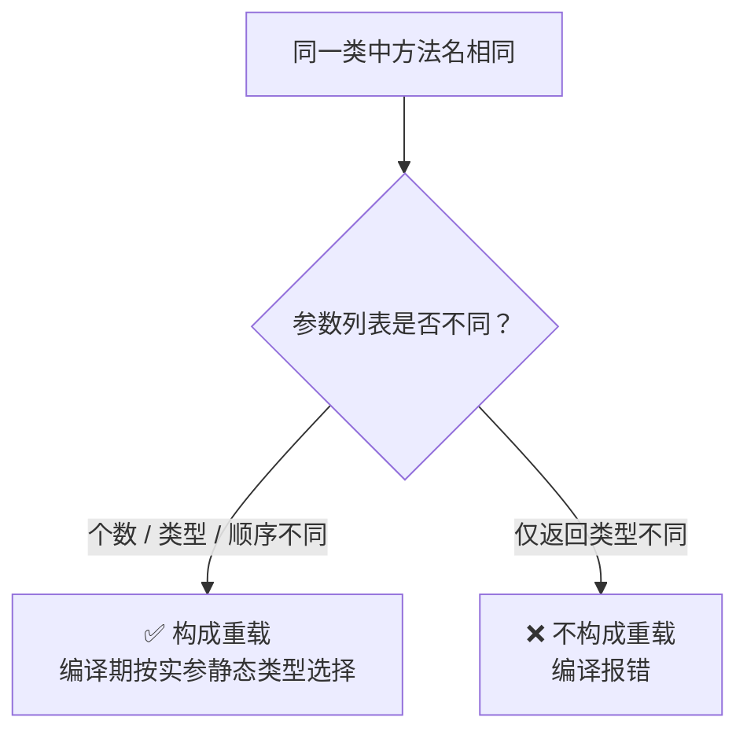
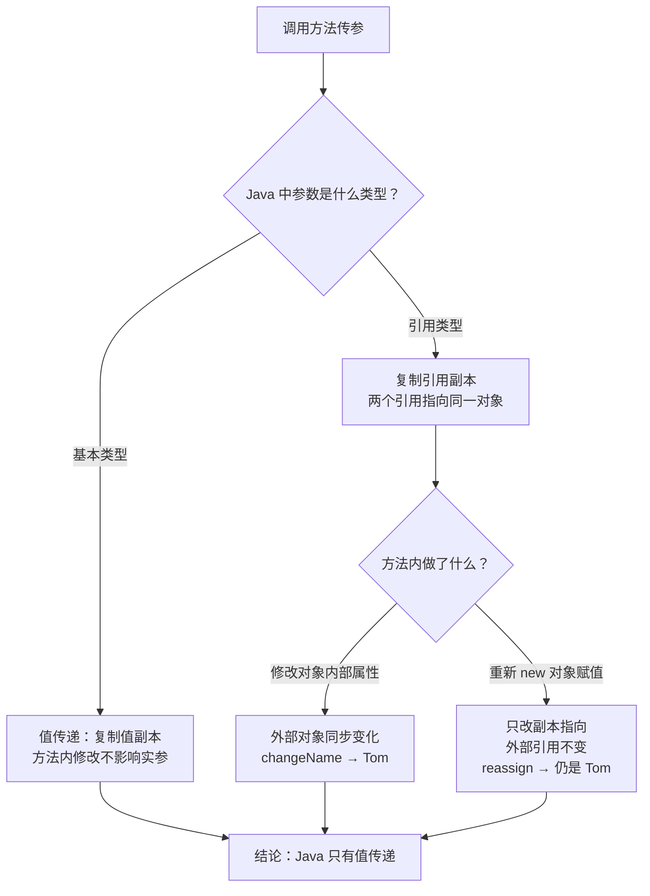

# Java 基础语法：数据类型、值传递
> 面向 JS + Python 背景开发者。
> 目标：快速建立 Java 静态类型语言模型，重点吃透 **基本类型 / 包装类、类型转换、方法重载、值传递**，并横向对比 JavaScript、Python。
<!-- more -->

## TL;DR（先看结论）

> 一句话结论：**Java 是静态强类型语言——8 种基本类型 + 包装类二分、方法参数只有值传递、`==` 与 `equals()` 双轨比较、重载是编译期特性，这 5 点和 JS / Python 差异最大。**

- 通用流程控制（if/for/while）快速扫读，重点抓差异
- 高频坑速记：自动拆箱 `NPE`、包装类缓存 -128~127、整数除法截断、`final` 锁引用不锁对象内容

## 🗺️ 本笔记知识地图



## 0. 本笔记重点

作为 JS + Python 开发者，你不需要从头学“变量、循环、函数”这些通用概念，而应该重点抓 Java 的差异：

1. Java 是**静态强类型**语言，编译期就要确定类型。
2. Java 有 **8 种基本数据类型**，以及对应的包装类。
3. Java 方法参数传递**只有值传递**。
4. Java 有**方法重载**，JS / Python 没有完全等价的机制。
5. Java 的 `String` 是引用类型，且不可变。
6. Java 的 `==` 和 `equals()` 行为不同，和 JS / Python 直觉差异很大。

> ⚠️ 快速扫读：if/for/while 等通用流程控制，只看语法差异，不用大量练习。

## 1. 静态类型：Java vs JS vs Python
> 💡 一句话结论：**Java 编译期定类型，`var` 只是局部变量语法糖、推断后不可改；JS / Python 运行时才确定类型。**

### 1.1 Java
Java 变量必须先声明类型，编译期检查：
```java
int age = 18;
String name = "lious";
// age = "hello"; // 编译错误
```
Java 10+ 支持**局部变量类型推断 `var`**：
```java
var age = 18;        // 推断为 int
var name = "lious";  // 推断为 String
```
✅ 重要限制：`var` **只能用于局部变量，不能用于成员变量、方法参数、返回值类型**；只是语法糖，Java 仍然是静态强类型，编译后类型固定，一旦推断完成不能修改。

### 1.2 JavaScript
JS 是动态类型，变量类型运行时确定：
```js
let age = 18;
age = "hello"; // 合法
```
TypeScript 增加了静态类型检查，但编译后类型信息擦除，运行时无类型校验：
```ts
let age: number = 18;
// age = "hello"; // TS 编译期报错，但编译成JS后运行时不强制
```

### 1.3 Python
Python 是动态类型，变量本质是对象引用：
```python
age = 18
age = "hello"  # 合法
```
Python 类型注解主要用于静态检查工具（mypy），Python 解释器运行时不做强制校验：
```python
age: int = 18
# age = "hello"  # mypy 可能报错，但解释器执行无异常
```

### 1.4 对比总结

| 特性 | Java | JavaScript | Python |
| --- | --- | --- | --- |
| 类型系统 | 静态强类型 | 动态弱类型 | 动态强类型 |
| 编译期检查 | 严格 | 无 / TS 编译期检查 | 无 / 类型注解辅助 |
| 变量类型可变 | 否 | 是 | 是 |
| 类型推断 | `var` 仅局部变量 | 无 | 无 |
| 运行时类型信息 | 保留较多 | 保留 | 保留 |

## 2. 基本数据类型与包装类
> 💡 一句话结论：**基本类型 / 包装类二分是 Java 独有（JS / Python 都没有）；比较包装类内容永远用 `equals()`，小心自动拆箱 NPE 和缓存陷阱。**

### 2.1 Java 的 8 种基本数据类型

| 类型 | 大小 | 默认值 | 范围 / 说明 | 示例 |
| --- | --- | --- | --- | --- |
| `byte` | 1 字节 | 0 | -128 ~ 127 | `byte b = 100;` |
| `short` | 2 字节 | 0 | -32768 ~ 32767 | `short s = 1000;` |
| `int` | 4 字节 | 0 | \(-2^{31}\) ~ \(2^{31}-1\) | `int i = 100;` |
| `long` | 8 字节 | 0L | \(-2^{63}\) ~ \(2^{63}-1\) | `long l = 100L;` |
| `float` | 4 字节 | 0.0f | 单精度浮点数 | `float f = 1.5f;` |
| `double` | 8 字节 | 0.0d | 双精度浮点数 | `double d = 1.5;` |
| `char` | 2 字节 | `'\u0000'` | Unicode 码点，**无符号** | `char c = 'A';` |
| `boolean` | JVM 依赖 | false | true / false | `boolean ok = true;` |

> 注意：
> 1. Java 数值型（byte/short/int/long/float/double）全部**有符号**；唯独 `char` 是无符号。
> 2. 浮点数直接量默认是`double`，写`float`必须后缀`f/F`；`long`常量建议后缀`l/L`。

### 2.2 包装类
每个基本类型都有对应包装类：

| 基本类型 | 包装类 |
| --- | --- |
| `byte` | `Byte` |
| `short` | `Short` |
| `int` | `Integer` |
| `long` | `Long` |
| `float` | `Float` |
| `double` | `Double` |
| `char` | `Character` |
| `boolean` | `Boolean` |

包装类是引用类型，可以赋值为 `null`：
```java
Integer age = null; // 合法
int age2 = null;    // 编译错误
```

> ⚠️ 坑：自动拆箱时，如果包装类为`null`，会抛出`NullPointerException`。

### 2.3 自动装箱与拆箱
Java 5+ 支持自动装箱 / 拆箱：
```java
Integer a = 100; // 自动装箱：int -> Integer
int b = a;       // 自动拆箱：Integer -> int
```
等价于：
```java
Integer a = Integer.valueOf(100);
int b = a.intValue();
```

### 2.4 包装类缓存陷阱
`Integer.valueOf()` 默认缓存范围：**-128 ~ 127**，上限可通过 JVM 参数调整。Byte、Short、Long 缓存范围同样固定 - 128~127；Character 缓存 0~127。
```java
Integer a = 100;
Integer b = 100;
System.out.println(a == b); // true，同一缓存对象
Integer c = 200;
Integer d = 200;
System.out.println(c == d); // false，超出缓存范围，新建对象
```
✅ 正确比较包装类内容，永远使用 `equals()`：
```java
System.out.println(c.equals(d)); // true
```



### 2.5 对比 JS / Python
- **JavaScript**：原始类型有 `number`、`string`、`boolean`、`null`、`undefined`、`symbol`、`bigint`。原始值访问属性时会被临时包装成对象，语句结束包装对象销毁。
- **Python**：一切皆对象，`int`、`float`、`bool`、`str` 全部是对象，不存在 Java 这种「基本类型 / 包装类」二分体系。
- **Java**：严格区分 `int` 和 `Integer`，直接影响 `null` 判断、泛型（泛型只能放引用类型，不能放基本类型）、集合存储、`==` 比较。

> 补充：Java 集合（List/Map）**不能直接存基本类型**，存入时自动装箱。JS/Python 数组 / 列表可以直接存放数字原始值。

## 3. 变量、常量与命名规范
> 💡 一句话结论：**`final` 对引用类型只锁引用、不锁对象内容——这是 JS / Python 没有的坑。**

```java
int count = 0;
final double PI = 3.14; // 常量，引用类型final是引用不可变，对象内部属性仍然可改！
String name = "lious";
```

> ⚠️ `final` 重点坑（JS/Python 没有完全一样的关键字）：
> - 基本类型`final`：值不能修改。
> - 引用类型`final`：**引用地址不能重新指向新对象，但对象内部字段可以修改**。

命名规范：
- 类名：`UpperCamelCase`，如 `UserService`
- 方法名、变量名：`lowerCamelCase`，如 `getUserName`
- 常量：`UPPER_SNAKE_CASE`，如 `MAX_RETRY_COUNT`
- 包名：全小写，如 `com.example.demo`

对比：
- JS 常用 `camelCase`，类名 `PascalCase`；`const` 声明常量，但是对象属性可修改。
- Python 常用 `snake_case`，类名 `PascalCase`，常量约定 `UPPER_SNAKE_CASE`，语言层面无强制常量。

## 4. 类型转换
> 💡 一句话结论：**小范围自动提升、大范围强制转换；`byte/short/char` 参与运算自动变 `int`，浮点转整数直接截断。**

### 4.1 自动类型提升
小范围类型可以自动提升为大范围类型：
```java
byte b = 10;
int i = b;      // byte -> int
long l = i;     // int -> long
double d = l;   // long -> double
```
提升顺序大致为：
```
byte -> short -> int -> long -> float -> double
char -> int
```



> 重要：`byte`、`short`、`char` 在参与运算时，会**自动提升为 int**，运算结果是 int。
```java
byte x = 1;
byte y = 2;
// byte res = x + y; // 编译报错，x+y自动提升为int，需要强转
byte res = (byte)(x + y);
```

### 4.2 强制类型转换
大范围转小范围需要强制转换，可能丢失精度或溢出：
```java
int i = 130;
byte b = (byte) i;
System.out.println(b); // -126，溢出
```
浮点转整数会直接截断小数部分，不是四舍五入：
```java
double d = 3.99;
int i = (int) d;
System.out.println(i); // 3
```

### 4.3 字符串与数字转换
字符串转数字：
```java
int i = Integer.parseInt("123");
double d = Double.parseDouble("3.14");
```

> ⚠️ 异常提醒：字符串无法转为数字时抛出 `NumberFormatException`。

数字转字符串：
```java
String s1 = String.valueOf(123);
String s2 = Integer.toString(123);
String s3 = "" + 123; // 简单写法，底层会创建新字符串
```

### 4.4 对比 JS / Python
- **JS**：`Number("123")`、`parseInt("123")`、`String(123)`，隐式类型转换极多，容易出现 `==` 怪异结果。
- **Python**：`int("123")`、`float("3.14")`、`str(123)`，转换失败抛出`ValueError`，没有隐式强制转换。
- **Java**：强类型，转换规则严格，编译期和运行期都会校验。

## 5. String 与 == / equals
> 💡 一句话结论：**String 不可变；字面量进常量池、`new` 必建新对象；内容比较永远用 `equals()`。**

### 5.1 String 是引用类型且不可变
```java
String s = "hello";
s = s + " world"; // 创建新字符串对象，原"hello"对象本身内容不变
```

> 原理：String 底层 char 数组（Java9 + 是 byte 数组）用`final`修饰，一旦创建不能修改；所有字符串拼接都会生成新对象。频繁拼接建议使用`StringBuilder`。

### 5.2 字符串常量池
```java
String a = "hello";
String b = "hello";
String c = new String("hello");
System.out.println(a == b);      // true，a、b指向常量池同一个对象
System.out.println(a == c);      // false，new 强制在堆创建新对象
System.out.println(a.equals(c)); // true，内容相同
```



> `new String("hello")`：会先检查常量池，没有则放入；然后在堆上新建 String 对象。

### 5.3 == 与 equals
- `==`：基本类型比较**值**；引用类型比较**内存地址**。
- `equals()`：`Object`默认实现等价于`==`；`String`、`Integer`等重写后，比较**内容**。

### 5.4 对比 JS / Python
- **JS**：`==` 隐式转换，`===` 严格比较；对象比较引用地址。JS 字符串是原始类型。
- **Python**：`==` 比较对象值；`is` 判断是否是同一个对象（内存地址）。Python str 不可变。
- **Java**：`==` 比较值或地址；`equals()` 用于内容比较，前提是类正确重写该方法。

## 6. 方法、重载与可变参数
> 💡 一句话结论：**重载看参数列表、编译期静态绑定；仅返回类型不同不构成重载。**

### 6.1 方法定义
```java
public int add(int a, int b) {
    return a + b;
}
```
Java 方法必须声明返回类型，无返回值用 `void`。

> 方法必须归属类，不能单独定义顶层函数（JS/Python 支持顶层函数）。

### 6.2 方法重载
同一个类中，**方法名相同，参数列表（参数个数、类型、顺序）不同**。
```java
public int add(int a, int b) {
    return a + b;
}
public double add(double a, double b) {
    return a + b;
}
public int add(int a, int b, int c) {
    return a + b + c;
}
```
❌ 注意：**仅返回类型不同，不构成重载**，编译报错。重载在编译期根据实参静态类型绑定方法。



### 6.3 可变参数
```java
public int sum(int... nums) {
    int total = 0;
    for (int n : nums) {
        total += n;
    }
    return total;
}
```
规则：可变参数必须是**方法最后一个参数**；一个方法最多只能有一个可变参数；可变参数本质是数组。

### 6.4 对比 JS / Python
- **JS**：函数参数无类型，支持默认参数、剩余参数 `...args`，无编译期重载。
- **Python**：支持默认参数、`*args`、`**kwargs`，没有编译期重载。
- **Java**：重载是编译期特性，根据传入参数静态类型选择方法。

## 7. 值传递（重中之重）
> 💡 一句话结论：**Java 只有值传递：改对象属性外部可见，重新赋值引用外部不可见。**

### 7.1 Java 只有值传递
Java 方法参数传递**永远是值传递**：
- 基本类型：传递变量值的副本。
- 引用类型：传递**对象引用地址的副本**。

> 一句话总结：传进去的永远是副本，方法内部无法修改外部原始变量的指向。

### 7.2 基本类型示例
```java
public static void change(int x) {
    x = 100;
}
public static void main(String[] args) {
    int a = 1;
    change(a);
    System.out.println(a); // 1
}
```
方法内修改 `x`，修改的是副本，不影响外部 `a`。

### 7.3 引用类型示例
```java
class User {
    String name;
}
public static void changeName(User user) {
    user.name = "Tom";
}
public static void reassign(User user) {
    user = new User();
    user.name = "Jerry";
}
public static void main(String[] args) {
    User u = new User();
    u.name = "Jack";
    changeName(u);
    System.out.println(u.name); // Tom
    reassign(u);
    System.out.println(u.name); // Tom，重新赋值副本，不影响外部引用
}
```
关键点：
- 通过引用副本修改**对象内部属性**，会影响原对象。
- 给参数变量重新`new`对象，只是修改副本指向，**不会改变外部变量指向**。



### 7.4 对比 JavaScript
JS 原始类型按值传递，对象是**按共享传递（pass-by-sharing）**：
```js
function changeName(user) {
  user.name = "Tom";
}
function reassign(user) {
  user = { name: "Jerry" };
}
let u = { name: "Jack" };
changeName(u);
console.log(u.name); // Tom
reassign(u);
console.log(u.name); // Tom
```
行为和 Java 引用类型非常像，但 JS 不存在基本类型 / 包装类二分。

### 7.5 对比 Python
Python 全部是**按共享传递**，函数拿到对象引用副本：
```python
def change_name(user):
    user["name"] = "Tom"
def reassign(user):
    user = {"name": "Jerry"}
u = {"name": "Jack"}
change_name(u)
print(u["name"])  # Tom
reassign(u)
print(u["name"])  # Tom
```
Python 不可变对象 `int/str/tuple`，修改会生成新对象；可变对象`dict/list`可以修改内部状态。

### 7.6 常见坑
```java
public static void swap(int a, int b) {
    int temp = a;
    a = b;
    b = temp;
}
```
Java 中这样无法交换外部变量，交换的只是副本。
如果交换对象引用：
```java
public static void swap(User u1, User u2) {
    User temp = u1;
    u1 = u2;
    u2 = temp;
}
```
同样无效，交换的只是两个引用副本。

## 8. 数组
> 💡 一句话结论：**数组是定长引用类型，`length` 是属性不是方法；业务开发优先用集合 `List` / `Map`。**

Java 数组是引用类型，**长度一旦初始化固定不可修改**：
```java
int[] nums = new int[3];
nums[0] = 1;
int[] nums2 = {1, 2, 3};
System.out.println(nums2.length);
```

> ⚠️ 数组`length`是属性，不是方法；字符串`length()`是方法，不要混淆。
> 数组越界访问抛出 `ArrayIndexOutOfBoundsException`。

对比：
- **JS**：数组是对象，长度可变，`push`/`pop`，`.length`属性可读写。
- **Python**：list 列表长度可变，支持切片。
- **Java**：原生数组长度固定；业务开发优先使用集合 `List`、`Map`。

## 9. 运算符与流程控制快速扫读
> 💡 一句话结论：**整数除法直接截断小数；`&&`/`||` 短路，`&`/`|` 不短路。**

Java 运算符和 JS / Python 大同小异：
```java
int a = 10;
int b = 3;
System.out.println(a / b); // 3，整数除法！两个int相除结果仍然int，直接截断小数
System.out.println(a % b); // 1
System.out.println(a > b); // true
```
重点注意：
- **整数除法**：两个 int 相除，不会自动转浮点数，直接舍弃小数。想要小数：`10 * 1.0 / 3`。
- `&&`、`||` 短路逻辑；`&`、`|` 不短路，还可以做位运算。
- `if`、`for`、`while`、`do-while` 写法和 JS 接近。
- Java 14+ 支持增强 `switch` 表达式，支持 yield 返回值。

> 快速扫读：break /continue 语法和 JS 几乎一致，仅需了解标签跳转（很少用）。

## 10. 小结

| 概念 | Java | JavaScript | Python |
| --- | --- | --- | --- |
| 类型 | 静态强类型 | 动态弱类型 | 动态强类型 |
| 基本类型 | 8 种 | 7 种原始类型 | 一切皆对象 |
| 包装类 | 有 | 临时包装 | 无 |
| 值传递 | 只有值传递 | 原始值按值，对象按共享 | 对象引用共享传递 |
| 字符串 | 引用类型，不可变 | 原始类型，不可变 | 对象，不可变 |
| `==` | 值 / 地址比较 | 宽松 / 严格比较 | 值比较，`is`判断身份 |
| 重载 | 编译期支持 | 不支持 | 不支持 |
| 数组 | 固定长度引用类型 | 可变对象数组 | 可变 list |

## 11. 练习建议

1. 写一个方法，尝试修改基本类型参数，验证外部变量不变。
2. 写一个方法，修改对象属性，验证外部对象变化。
3. 写一个方法，重新赋值对象参数，验证外部引用不变。
4. 测试 `Integer a = 100; Integer b = 100;` 和 `Integer c = 200; Integer d = 200;` 的 `==` 结果，理解缓存。
5. 写多个重载方法，观察编译期如何选择。
6. 对比 `String`、`StringBuilder` 拼接字符串，理解不可变性。
7. 拓展：尝试`final`修饰引用对象，修改对象内部字段，验证引用不可变但对象内容可变。

## 12. 下一篇

下一篇：**Java 面向对象：类、继承、抽象类、接口（横向对比 JS / Python）**。
重点会放在：
- Java 类只能单继承
- 接口与抽象类的区别
- 访问修饰符的强制权限控制
- JS 原型继承 / Python 多继承 / Java 单继承模型差异
- Java 8+ 接口默认方法