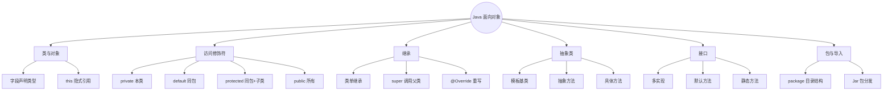
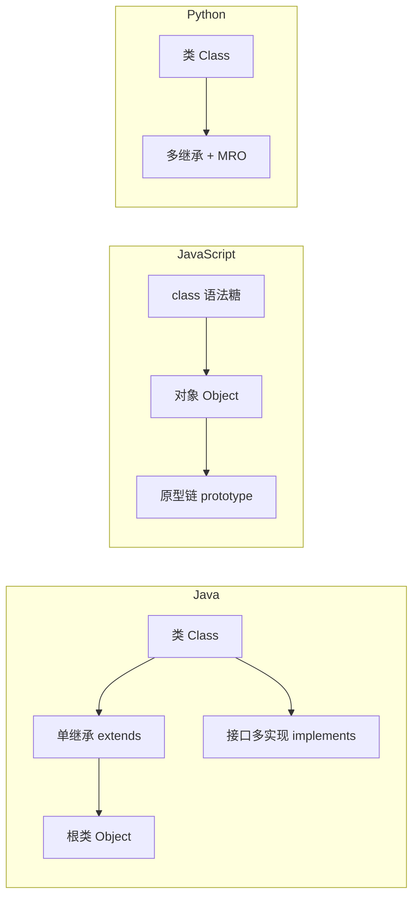
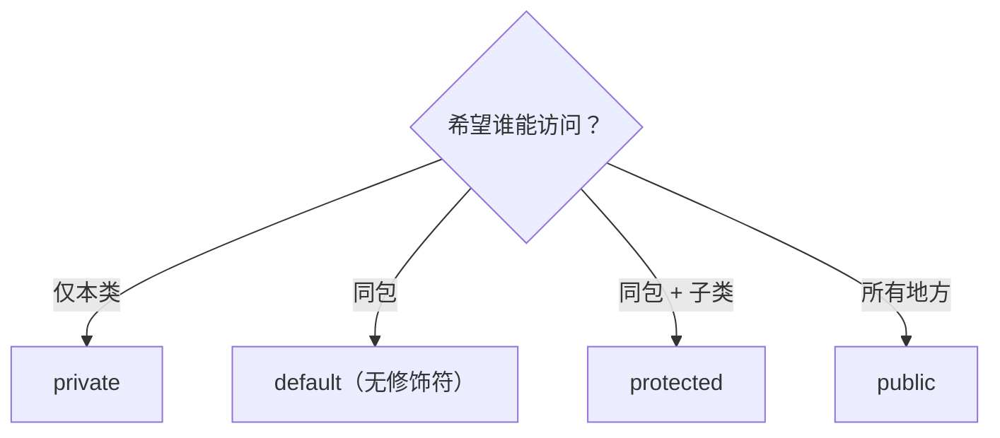
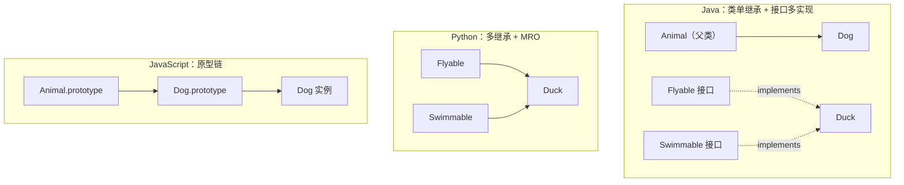
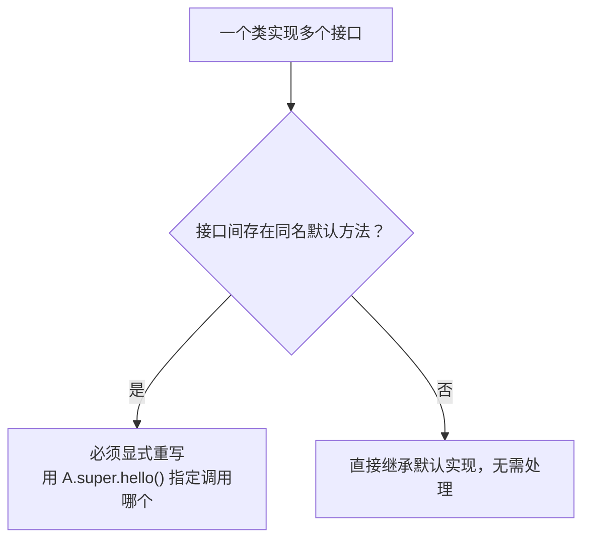
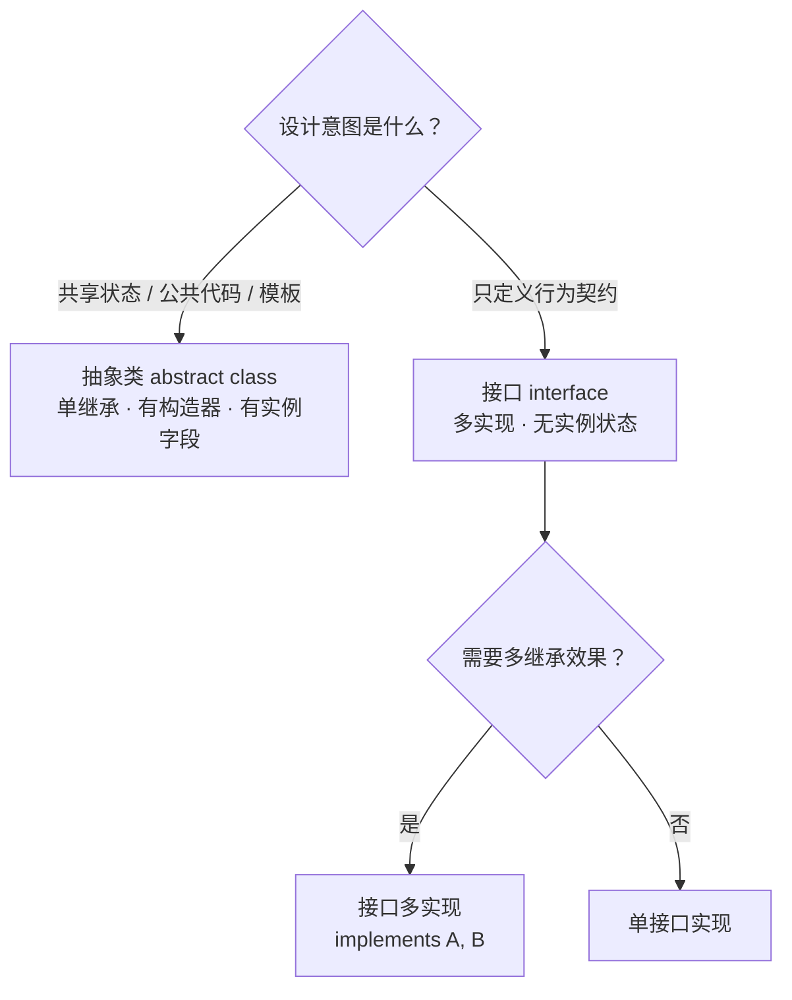

# Java 面向对象：类、继承、抽象类、接口
> 面向 JS + Python 背景开发者。
> 目标：吃透 Java OOP 模型，重点区分 **单继承、接口、访问修饰符、抽象类**，并横向对比 JavaScript 原型继承与 Python 多继承。
<!-- more -->

## TL;DR（先看结论）

> 一句话结论：**Java 的 OOP 和 JS / Python 最大的 4 个不同——① 类只能单继承、接口可以多实现；② 访问修饰符是编译期强约束；③ 抽象类和接口是两个概念（模板基类 vs 行为契约）；④ 所有类默认继承 `Object` 根类。**

- JS 的"原型继承"、Python 的"多继承 + MRO"在 Java 中没有直接对应物，必须重新建立模型
- 高频坑速记：`protected` 包含同包、接口字段默认 `public static final`、同名默认方法冲突必须显式重写

## 🗺️ 本笔记知识地图



## 三语言 OOP 模型总览（先看这张图）

> 💡 一句话结论：**Java = 类单继承 + 接口多实现；JS = 原型链；Python = 多继承 + MRO。这是全文最核心的差异，后面每一节都在展开这张图。**


| 概念 | Java | JavaScript | Python |
|---|---|---|---|
| 继承模型 | 类单继承 + 接口多实现 | 原型链，extends 语法糖，可 mixin | 多继承 + MRO |
| 访问控制 | 强制（编译期校验） | 无 / TS 仅编译期 | 命名约定 |
| 抽象定义 | abstract class / interface | TS 有，原生无 | ABC / Protocol |
| 接口能力 | 有，多实现 | TS interface（编译后消失） | ABC / Protocol |
| 默认方法 | 支持（8+） | 不支持 | ABC 可部分支持 |
| 方法查找 | 类层级 | 原型链 | MRO |
| 根对象 | java.lang.Object | Object.prototype | object |
| 包管理 | package / jar | ESM / npm | module / pip |

> 文末第 9 节有完整版总结表，可回查。

## 0. 本笔记重点

作为 JS + Python 开发者，你已经熟悉 OOP，但 Java 的 OOP 有三个关键差异：

1. **Java 类只能单继承**，但接口可以多实现。
2. **访问修饰符是强制的**，不是命名约定。
3. **接口不是纯抽象**，Java 8+ 支持默认方法、静态方法。

此外，JavaScript 的"原型继承"和 Python 的"多继承 + MRO"在 Java 中都没有直接对应物，必须重新建立模型。

## 1. 类与对象
> 💡 一句话结论：**Java 的类是「字段 + 构造器 + 方法」，字段必须声明类型、访问控制强制；JS 的 class 是原型语法糖，Python 用 `self` 显式传参。**

### 1.1 Java 类定义
```java
public class User {
    // 字段
    private String name;
    private int age;
    // 构造器
    public User(String name, int age) {
        this.name = name;
        this.age = age;
    }
    // 方法
    public String getName() {
        return name;
    }
    public void setName(String name) {
        this.name = name;
    }
    public void sayHello() {
        System.out.println("Hello, I'm " + name);
    }
}
```
创建对象：
```java
User user = new User("lious", 18);
user.sayHello();
```

### 1.2 对比 JavaScript
ES6 之前的 JS 使用构造函数 + 原型：
```js
function User(name, age) {
  this.name = name;
  this.age = age;
}
User.prototype.sayHello = function () {
  console.log(`Hello, I'm ${this.name}`);
};
const user = new User("lious", 18);
```
ES6+ 使用 `class` 语法糖：
```js
class User {
  constructor(name, age) {
    this.name = name;
    this.age = age;
  }
  sayHello() {
    console.log(`Hello, I'm ${this.name}`);
  }
}
```
关键差异：
- JS `class` 本质仍是原型继承的语法糖。
- JS 字段默认公开，没有访问修饰符（TS 有，但仅编译期）。
- JS 方法定义在 `prototype` 上，`this` 绑定是运行时决定。

### 1.3 对比 Python
```python
class User:
    def __init__(self, name, age):
        self.name = name
        self.age = age
    def say_hello(self):
        print(f"Hello, I'm {self.name}")
```
关键差异：
- Python 用 `self` 显式接收实例，Java 用隐式 `this`。
- Python 没有访问修饰符，`_`、`__` 只是约定。
- Python 字段无需声明，运行时动态添加。

### 1.4 对比总结

| 特性 | Java | JavaScript | Python |
| --- | --- | --- | --- |
| 类定义 | `class` | `class` / 构造函数 | `class` |
| 实例引用 | `this`（隐式） | `this`（运行时） | `self`（显式） |
| 字段声明 | 必须声明类型 | 动态 | 动态 |
| 访问控制 | 强制 | 无 / TS 编译期 | 命名约定 |
| 构造器 | 与类同名 | `constructor` | `__init__` |

## 2. 访问修饰符
> 💡 一句话结论：**Java 的访问修饰符是编译期强约束（`private` / `default` / `protected` / `public`），JS / Python 只有命名约定，TS 的修饰符仅编译期有效。**

### 2.1 Java 四种访问级别

| 修饰符 | 同类 | 同包 | 子类 | 其他包 |
| --- | --- | --- | --- | --- |
| `private` | ✅ | ❌ | ❌ | ❌ |
| `default`（无修饰符） | ✅ | ✅ | ❌ | ❌ |
| `protected` | ✅ | ✅ | ✅ | ❌ |
| `public` | ✅ | ✅ | ✅ | ✅ |



示例：
```java
public class User {
    private String name;       // 仅本类可访问
    int age;                   // 同包可访问
    protected String email;    // 同包 + 子类可访问
    public String nickname;    // 所有地方可访问
}
```

### 2.2 对比 JavaScript
- 原生 JS 无访问修饰符。
- TypeScript 有 `private`、`protected`、`public`，但**只在编译期检查，运行时无效**。
- JS 社区常用 `_` 前缀表示"内部使用"，但只是约定。
```ts
class User {
  private name: string;
  protected age: number;
  public email: string;
}
```
编译后：
```js
class User {}
```
类型信息完全擦除，运行时任何人都能访问。

### 2.3 对比 Python
Python 只有命名约定：
- `name`：公开
- `_name`：内部使用，约定不直接访问
- `__name`：名称修饰，变成 `_ClassName__name`，仍可绕过
```python
class User:
    def __init__(self):
        self.name = "public"
        self._age = 18        # 约定私有
        self.__secret = "xxx" # 名称修饰
```

### 2.4 常见坑
- Java 的 `protected` 允许**同包**访问，不只是子类，这点和 Python/TS 直觉不同。
- 子类不能降低父类方法的访问级别。
- 接口方法默认是 `public`，不能写 `private`（Java 9+ 可以有私有方法，但仅用于接口内部）。

## 3. 继承
> 💡 一句话结论：**Java 类只能单继承，多继承需求靠接口多实现；方法查找走类层级，不是原型链 / MRO。**

### 3.1 Java 单继承
Java 类只能继承一个父类：
```java
public class Animal {
    protected String name;
    public void eat() {
        System.out.println(name + " is eating");
    }
}
public class Dog extends Animal {
    public void bark() {
        System.out.println(name + " is barking");
    }
}
```
使用：
```java
Dog dog = new Dog();
dog.name = "旺财";
dog.eat();
dog.bark();
```

### 3.2 super 关键字
`super` 用于调用父类构造器、方法、字段：
```java
public class Dog extends Animal {
    public Dog(String name) {
        super();          // 调用父类无参构造器
        this.name = name;
    }
    @Override
    public void eat() {
        super.eat();      // 调用父类方法
        System.out.println("Dog eats fast");
    }
}
```

### 3.3 方法重写（Override）
子类重写父类方法：
```java
@Override
public void eat() {
    System.out.println(name + " eats dog food");
}
```
规则：
- 方法名、参数列表、返回类型必须兼容。
- 访问级别不能更严格。
- 不能重写 `final`、`static`、`private` 方法。
- 建议加 `@Override` 注解，让编译器校验。

### 3.4 对比 JavaScript 原型继承
JS 使用原型链：
```js
function Animal(name) {
  this.name = name;
}
Animal.prototype.eat = function () {
  console.log(`${this.name} is eating`);
};
function Dog(name) {
  Animal.call(this, name);
}
Dog.prototype = Object.create(Animal.prototype);
Dog.prototype.constructor = Dog;
Dog.prototype.bark = function () {
  console.log(`${this.name} is barking`);
};
```
ES6 `class` 语法：
```js
class Animal {
  constructor(name) {
    this.name = name;
  }
  eat() {
    console.log(`${this.name} is eating`);
  }
}
class Dog extends Animal {
  bark() {
    console.log(`${this.name} is barking`);
  }
}
```
关键差异：
- JS 继承本质是**原型链查找**，Java 是**类层级**。
- JS 的 `super` 指向父类原型，行为更动态。
- JS 没有 `@Override` 编译期校验。

### 3.5 对比 Python 多继承
Python 支持多继承：
```python
class Flyable:
    def fly(self):
        print("flying")
class Swimmable:
    def swim(self):
        print("swimming")
class Duck(Flyable, Swimmable):
    pass
```
Python 使用 MRO（方法解析顺序）决定方法查找顺序：
```python
print(Duck.__mro__)
# (<class 'Duck'>, <class 'Flyable'>, <class 'Swimmable'>, <class 'object'>)
```
Java 不支持类的多继承，但可以通过**接口多实现**达到类似效果：
```java
interface Flyable {
    void fly();
}
interface Swimmable {
    void swim();
}
class Duck implements Flyable, Swimmable {
    public void fly() { System.out.println("flying"); }
    public void swim() { System.out.println("swimming"); }
}
```
这是 Java 解决"菱形继承"问题的方式：**类单继承 + 接口多实现**。



### 3.6 对比总结

| 特性 | Java | JavaScript | Python |
| --- | --- | --- | --- |
| 继承方式 | 类单继承 | 原型链 | 多继承 |
| 多继承 | 不支持（接口多实现） | 不支持 | 支持 |
| 方法查找 | 类层级 | 原型链 | MRO |
| super | 父类 | 父类原型 | MRO 下一个 |
| 重写校验 | `@Override` | 无 | 无 |

## 4. 抽象类
> 💡 一句话结论：**抽象类 = 模板基类：可以含构造器、实例字段和具体方法，子类必须实现抽象方法（编译期强制），JS 原生没有、Python ABC 是运行时检查。**

### 4.1 Java 抽象类
抽象类不能实例化，可以包含抽象方法和具体方法：
```java
public abstract class Shape {
    protected String color;
    public Shape(String color) {
        this.color = color;
    }
    // 抽象方法，子类必须实现
    public abstract double area();
    // 具体方法
    public void printColor() {
        System.out.println("Color: " + color);
    }
}
public class Circle extends Shape {
    private double radius;
    public Circle(String color, double radius) {
        super(color);
        this.radius = radius;
    }
    @Override
    public double area() {
        return Math.PI * radius * radius;
    }
}
```
规则：
- 抽象类可以有构造器。
- 抽象方法不能是 `private`、`final`、`static`。
- 子类必须实现所有抽象方法，除非子类也是抽象类。

### 4.2 对比 Python ABC
Python 使用 `abc` 模块：
```python
from abc import ABC, abstractmethod
class Shape(ABC):
    def __init__(self, color):
        self.color = color
    @abstractmethod
    def area(self):
        pass
    def print_color(self):
        print(f"Color: {self.color}")
class Circle(Shape):
    def __init__(self, color, radius):
        super().__init__(color)
        self.radius = radius
    def area(self):
        return 3.14 * self.radius ** 2
```
关键差异：
- Python 抽象方法是运行时检查，Java 是编译期检查。
- Python 抽象类可以多继承，Java 抽象类单继承。
- Python ABC 本质上还是普通类，Java 抽象类是独立概念。

### 4.3 对比 JavaScript
JS 没有抽象类原生支持，TS 才有：
```ts
abstract class Shape {
  constructor(protected color: string) {}
  abstract area(): number;
  printColor() {
    console.log(`Color: ${this.color}`);
  }
}
```
但 TS 抽象类只在编译期检查，运行时无强制力。

## 5. 接口
> 💡 一句话结论：**接口 = 行为契约：可以多实现；Java 8+ 支持默认 / 静态方法、Java 9+ 私有方法；TS 接口编译后消失，Java 接口是运行时真实存在的类型。**

### 5.1 Java 接口基础
接口定义行为契约：
```java
public interface Flyable {
    void fly();                      // 抽象方法，默认 public abstract
    int MAX_HEIGHT = 10000;          // 默认 public static final
}
```
实现接口：
```java
public class Bird implements Flyable {
    @Override
    public void fly() {
        System.out.println("Bird is flying");
    }
}
```

### 5.2 Java 8+ 接口新特性
Java 8 引入默认方法和静态方法：
```java
public interface Flyable {
    void fly();
    // 默认方法
    default void land() {
        System.out.println("Landing...");
    }
    // 静态方法
    static Flyable createDefault() {
        return () -> System.out.println("Default flying");
    }
}
```
Java 9+ 支持私有方法：
```java
public interface Flyable {
    default void fly() {
        log("flying");
    }
    private void log(String msg) {
        System.out.println("[LOG] " + msg);
    }
}
```
接口多实现：
```java
public class Duck implements Flyable, Swimmable {
    public void fly() { System.out.println("Duck flying"); }
    public void swim() { System.out.println("Duck swimming"); }
}
```

### 5.3 默认方法冲突
如果两个接口有同名默认方法，实现类必须重写：
```java
interface A {
    default void hello() { System.out.println("A"); }
}
interface B {
    default void hello() { System.out.println("B"); }
}
class C implements A, B {
    @Override
    public void hello() {
        A.super.hello(); // 显式指定
        B.super.hello();
    }
}
```



### 5.4 对比 TypeScript interface
TS 接口只描述类型结构：
```ts
interface Flyable {
  fly(): void;
}
class Bird implements Flyable {
  fly() {
    console.log("flying");
  }
}
```
差异：
- TS 接口编译后完全消失，无运行时存在。
- TS 接口可以有属性、函数签名、索引签名，不能有实现。
- Java 接口可以有默认实现、静态方法、私有方法。
- Java 接口是运行时真实存在的类型，支持反射、多态。

### 5.5 对比 Python 抽象基类 / Protocol
Python 没有独立的接口概念，常用两种方式：
**方式一：ABC 抽象基类**
```python
from abc import ABC, abstractmethod
class Flyable(ABC):
    @abstractmethod
    def fly(self):
        pass
```
**方式二：Protocol（Python 3.8+）**
```python
from typing import Protocol
class Flyable(Protocol):
    def fly(self) -> None:
        ...
```
Protocol 是结构化类型，类似 TS 接口，运行时也可检查。
差异：
- Python 接口更像 ABC 或 Protocol，没有 Java 接口的"默认方法"机制。
- Java 接口是名义类型（nominal typing），必须显式 `implements`。
- Python Protocol 是结构化类型（structural typing），只要结构匹配即可。

### 5.6 对比总结

| 特性 | Java interface | TS interface | Python ABC / Protocol |
| --- | --- | --- | --- |
| 运行时存在 | 是 | 否 | ABC 是，Protocol 部分 |
| 默认实现 | 支持 | 不支持 | ABC 可部分支持 |
| 静态方法 | 支持 | 不支持 | 支持 |
| 多实现 | 支持 | 支持 | 支持 |
| 类型系统 | 名义类型 | 结构化类型 | ABC 名义，Protocol 结构化 |

## 6. 抽象类 vs 接口

> 💡 一句话结论：**有共享状态 / 公共代码 → 抽象类；只定义行为契约 → 接口；要多继承效果 → 接口多实现。**



| 维度 | 抽象类 | 接口 |
| --- | --- | --- |
| 继承 | 单继承 | 多实现 |
| 构造器 | 有 | 无 |
| 字段 | 可有实例字段 | 只能常量 |
| 方法 | 抽象 + 具体 | 抽象 + 默认 + 静态 + 私有 |
| 设计意图 | 代码复用 + 模板 | 行为契约 |
| 使用场景 | 有共同状态的类族 | 定义能力 / 协议 |

选择建议：
- 需要共享状态或代码 → 抽象类。
- 只定义行为契约 → 接口。
- 需要多继承效果 → 接口多实现。

## 7. package 与 import

### 7.1 包声明
```java
package com.example.demo.service;
public class UserService {
}
```

### 7.2 导入
```java
import java.util.List;
import java.util.ArrayList;
import com.example.demo.model.User;
// 静态导入
import static java.lang.Math.PI;
import static java.lang.Math.max;
```

### 7.3 对比
- **JS**：ES Module `import` / `export`，或 CommonJS `require`。
- **Python**：`import module`、`from module import name`。
- **Java**：`package` 对应目录结构，`import` 引入类，包名全小写。

### 7.4 Jar 包
Java 的 Jar 类似 JS 的 npm 包、Python 的 wheel：
- Jar 是字节码 + 资源的压缩包。
- Maven / Gradle 负责依赖管理。
- 可执行 Jar 包含 `META-INF/MANIFEST.MF`，指定 `Main-Class`。

## 8. 常见坑点

1. **Java 类只能单继承**，不要试图模仿 Python 多继承。
2. **接口多实现**是 Java 解决多继承问题的方式，但接口不能有实例状态。
3. **访问修饰符 `protected` 包含同包**，不只是子类。
4. **`@Override` 只是编译期校验**，不是运行时行为。
5. **默认方法冲突必须显式重写**，否则编译错误。
6. **接口中的字段默认 `public static final`**，不能修改。
7. **抽象类可以有构造器**，但只能被子类通过 `super` 调用。
8. **TS 接口、Python Protocol 是结构化类型**，Java 接口是名义类型，必须显式实现。

## 9. 小结

| 概念 | Java | JavaScript | Python |
| --- | --- | --- | --- |
| 继承模型 | 类单继承 | 原型链 | 多继承 + MRO |
| 多继承 | 不支持 | 不支持 | 支持 |
| 接口 | 有，多实现 | TS 有 | ABC / Protocol |
| 抽象类 | 有 | TS 有 | ABC |
| 访问控制 | 强制 | 无 | 约定 |
| 默认方法 | 支持 | 不支持 | 部分 |
| 包管理 | package / jar | ESM / npm | module / pip |

## 10. 练习建议

1. 定义 `Animal` 抽象类，包含抽象方法 `makeSound()`，派生 `Dog`、`Cat`。
2. 定义 `Flyable`、`Swimmable` 接口，让 `Duck` 同时实现。
3. 练习接口默认方法冲突，显式重写解决。
4. 用 `protected` 修饰字段，验证同包可访问、不同包子类可访问。
5. 对比 JS 原型链实现同样结构，感受差异。
6. 用 Python ABC 实现同样结构，对比 Java 接口的运行时差异。

## 11. 下一篇

下一篇：**Java 异常体系：受检异常详解**。
重点：
- 受检异常 vs 非受检异常
- try-catch-finally、try-with-resources
- 与 JS / Python 异常模型的差异
- 自定义异常与全局异常处理