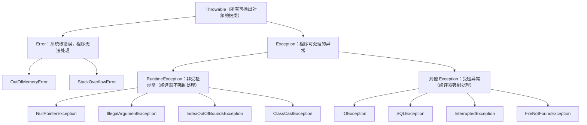
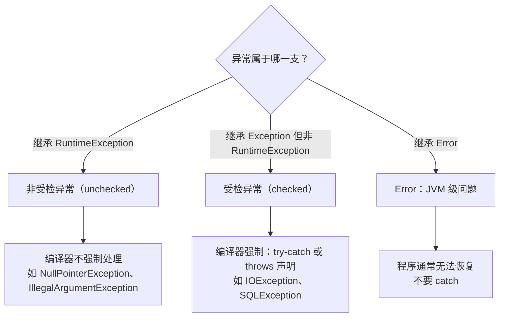
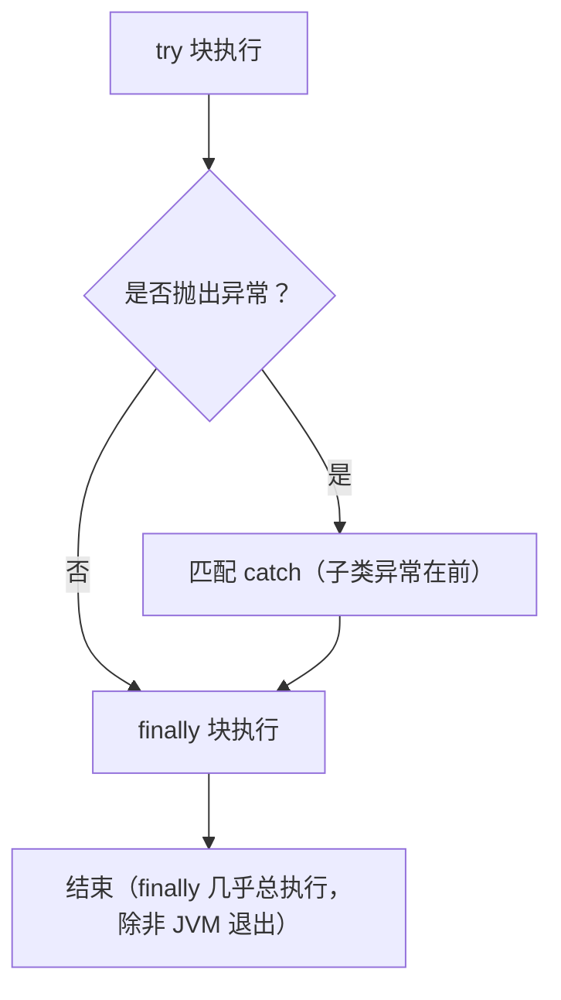
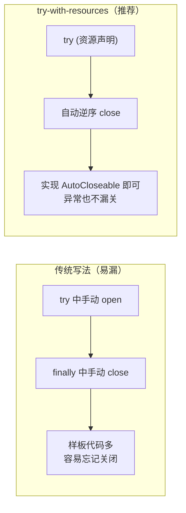
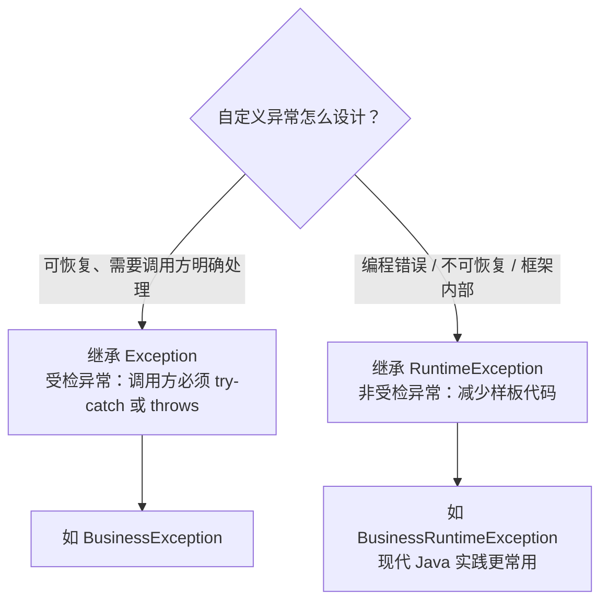
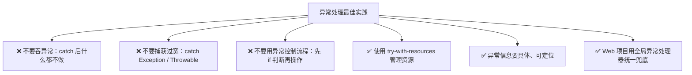

# Java 异常体系：受检异常详解
> 面向 JS + Python 背景开发者。  
> 目标：吃透 Java 异常模型，重点区分 **受检异常 vs 非受检异常**，掌握 try-catch-finally、try-with-resources、自定义异常与全局异常处理，横向对比 JS / Python。
<!-- more -->

## TL;DR（先看结论）

> 一句话结论：**Java 异常和 JS / Python 最大的不同是"受检异常"——编译器强制要求你处理（try-catch 或 throws 声明），不处理就编译不过。** JS / Python 的异常全部是非受检的，这是动态语言转 Java 最不习惯、最容易踩坑的点。

- 异常三兄弟：`Error`（JVM 级问题，**不要 catch**）→ `Exception`（程序可处理）→ `RuntimeException`（非受检，编译器不强制）
- 高频坑速记：catch 时子类异常必须放在父类前面、`finally` 里不要 return / 抛异常、资源管理用 try-with-resources、包装异常时别丢 `cause`

## 🗺️ 本笔记知识地图

```mermaid
flowchart TB
    ROOT(("Java 异常体系"))

    ROOT --> A["异常体系结构"]
    ROOT --> B["受检 vs 非受检"]
    ROOT --> C["try-catch-finally"]
    ROOT --> D["try-with-resources"]
    ROOT --> E["throws 与 throw"]
    ROOT --> F["自定义异常"]
    ROOT --> G["异常链 cause"]
    ROOT --> H["最佳实践"]

    A --> A1["Throwable 根类"]
    A --> A2["Error 不要 catch"]
    A --> A3["Exception 可处理"]
    A --> A4["RuntimeException 非受检"]

    B --> B1["编译器强制处理"]
    B --> B2["JS / Python 无此概念"]

    C --> C1["finally 几乎总执行"]
    C --> C2["子类 catch 在前"]
    C --> C3["多异常合并捕获"]

    D --> D1["AutoCloseable 自动关闭"]
    D --> D2["多个资源逆序关"]
    D --> D3["替代手动 finally"]

    E --> E1["throw 抛出对象"]
    E --> E2["throws 声明契约"]
    E --> E3["重写不能更宽泛"]

    F --> F1["继承 Exception 受检"]
    F --> F2["继承 RuntimeException 非受检"]

    G --> G1["包装不丢堆栈"]
    G --> G2["JS cause / Python from"]

    H --> H1["不吞异常"]
    H --> H2["不捕获过宽"]
    H --> H3["全局异常处理器"]
```



---
## 0. 本笔记重点
> 💡 一句话结论：**Java 异常体系 = Error（别 catch）+ Exception（可处理，分受检 / 非受检两派）+ finally（几乎总执行）+ try-with-resources（资源管理标准写法）。** 受检异常是 JS / Python 完全没有的概念。

作为 JS + Python 开发者，Java 异常体系是**最容易踩坑、最不习惯**的部分，核心差异：
1. Java 有**受检异常（checked exception）**，编译器强制你处理，JS / Python 没有。
2. Java 异常分为 `Error`、`Exception`（含 `RuntimeException`）三大分支。
3. Java 的 `finally` 几乎总是执行，`try-with-resources` 是资源管理的标准写法。
4. Java 的异常是**类层级**，可以自定义异常类型。
5. 异常处理在 Spring Boot 中还有全局处理器，是 Web 项目必备。

---
## 1. Java 异常体系结构
> 💡 一句话结论：**Throwable 是根：Error 是 JVM 级问题（别 catch），Exception 是可处理异常；其中 RuntimeException 及其子类是非受检，其余 Exception 是受检。**

先看这张结构图：



原文结构速查：

```text
Throwable
├── Error                    // 系统级错误，程序无法处理
│   ├── OutOfMemoryError
│   ├── StackOverflowError
│   └── ...
└── Exception                // 程序可处理的异常
    ├── RuntimeException     // 非受检异常（unchecked）
    │   ├── NullPointerException
    │   ├── IllegalArgumentException
    │   ├── IndexOutOfBoundsException
    │   ├── ClassCastException
    │   └── ...
    └── 其他 Exception        // 受检异常（checked）
        ├── IOException
        ├── SQLException
        ├── InterruptedException
        ├── FileNotFoundException
        └── ...
```

关键理解：
- `Throwable`：所有可抛出对象的根类。
- `Error`：JVM 层面的严重问题，程序通常无法恢复，**不应该 catch**。
- `Exception`：程序可以处理的异常。
- `RuntimeException`：**非受检异常**，编译器不强制处理。
- 其他 `Exception` 子类：**受检异常**，编译器强制处理。

---
## 2. 受检异常 vs 非受检异常
> 💡 一句话结论：**受检异常编译器强制 try-catch 或 throws；非受检（RuntimeException 系）不强制；JS / Python 所有异常都是非受检的。**



### 2.1 受检异常（Checked Exception）
继承自 `Exception`，但不是 `RuntimeException` 的子类。  
**编译器强制要求**：要么 `try-catch` 处理，要么在方法签名上用 `throws` 声明。
```java
public void readFile(String path) throws IOException {
    FileReader reader = new FileReader(path);
    // ...
}
```
调用方必须处理：
```java
try {
    readFile("data.txt");
} catch (IOException e) {
    e.printStackTrace();
}
```
或者继续向上抛：
```java
public void process() throws IOException {
    readFile("data.txt");
}
```
### 2.2 非受检异常（Unchecked Exception）
继承自 `RuntimeException`，编译器**不强制**处理。
```java
public int divide(int a, int b) {
    return a / b; // 可能抛 ArithmeticException，但无需声明
}
```
常见非受检异常：
| 异常 | 触发场景 |
| --- | --- |
| `NullPointerException` | 调用 null 对象的方法 / 字段 |
| `IllegalArgumentException` | 参数不合法 |
| `IllegalStateException` | 对象状态不允许操作 |
| `IndexOutOfBoundsException` | 数组 / 列表越界 |
| `ClassCastException` | 类型转换失败 |
| `ArithmeticException` | 算术错误，如除以 0 |
| `NumberFormatException` | 字符串转数字失败 |
### 2.3 为什么有受检异常？
设计初衷：
- 强制调用方考虑可恢复的错误（如文件不存在、网络断开）。
- 让 API 契约更明确：方法签名直接告诉调用方可能抛什么。

但实际上，受检异常也是 Java 被吐槽最多的设计之一：
- 大量 `try-catch` 样板代码。
- 很多场景下无法真正恢复，只能包装成运行时异常。
- Spring 等框架普遍把受检异常包装成 `RuntimeException`。
### 2.4 对比 JavaScript
JS 没有受检异常概念，所有异常都是运行时抛出：
```js
function readFile(path) {
  throw new Error("File not found");
}
// 调用方可以选择不处理，异常会向上冒泡
readFile("data.txt");
```
处理方式：
```js
try {
  readFile("data.txt");
} catch (e) {
  console.error(e.message);
} finally {
  console.log("done");
}
```
关键差异：
- JS 异常全部是“非受检”。
- JS 没有 `throws` 声明。
- JS 的 `Error` 是唯一内置错误类型，其他都是它的子类（`TypeError`、`RangeError` 等）。
### 2.5 对比 Python
Python 也没有受检异常，全部是运行时异常：
```python
def read_file(path):
    raise FileNotFoundError("File not found")
try:
    read_file("data.txt")
except FileNotFoundError as e:
    print(e)
finally:
    print("done")
```
关键差异：
- Python 异常全部是“非受检”。
- Python 没有 `throws` 声明。
- Python 异常继承自 `BaseException`，常见子类有 `Exception`、`KeyboardInterrupt`、`SystemExit`。
- Python 鼓励 EAFP（Easier to Ask Forgiveness than Permission），即先做再捕获异常。
- Java 对受检异常鼓励“预先检查 + 明确声明”。
### 2.6 对比总结
| 特性 | Java | JavaScript | Python |
| --- | --- | --- | --- |
| 受检异常 | 有 | 无 | 无 |
| 强制处理 | 是（受检异常） | 否 | 否 |
| throws 声明 | 有 | 无 | 无 |
| 异常根类 | `Throwable` | `Error` | `BaseException` |
| 常见处理 | try-catch / throws | try-catch | try-except |
| 多异常捕获 | 支持 | 支持（ES2022+ 有限） | 支持 |

---
## 3. try-catch-finally
> 💡 一句话结论：**finally 几乎总执行；多 catch 时子类必须在前；不要在 finally 里 return 或抛异常——会吞掉 try 的结果和原异常。**



### 3.1 基本结构
```java
try {
    // 可能抛异常的代码
    int result = 10 / 0;
} catch (ArithmeticException e) {
    System.out.println("算术异常: " + e.getMessage());
} finally {
    System.out.println("finally 执行");
}
```
执行顺序：
1. `try` 块执行。
2. 如果抛异常，匹配 `catch`。
3. 无论是否异常，`finally` 都会执行（除非 JVM 退出）。
### 3.2 多 catch
```java
try {
    String s = null;
    s.length();
} catch (NullPointerException e) {
    System.out.println("NPE");
} catch (RuntimeException e) {
    System.out.println("Runtime");
}
```
注意：**子类异常必须放在父类异常前面**，否则编译错误。
```java
// 编译错误：NullPointerException 已被捕获
catch (RuntimeException e) {}
catch (NullPointerException e) {}
```
### 3.3 多异常合并捕获（Java 7+）
```java
try {
    // ...
} catch (IOException | SQLException e) {
    System.out.println("IO 或 SQL 异常: " + e.getMessage());
}
```
### 3.4 finally 的细节
`finally` 中如果 `return`，会覆盖 `try` 中的 `return`：
```java
public int test() {
    try {
        return 1;
    } finally {
        return 2;
    }
}
// 返回 2
```
`finally` 中抛异常会覆盖原异常：
```java
try {
    throw new RuntimeException("A");
} finally {
    throw new RuntimeException("B");
}
// 最终抛出 B，A 被吞掉
```
结论：**不要在 finally 中 return 或抛异常**。
### 3.5 对比 JS / Python
JS：
```js
try {
  // ...
} catch (e) {
  // ...
} finally {
  // ...
}
```
Python：
```python
try:
    ...
except Exception as e:
    ...
finally:
    ...
```
差异：
- JS / Python 的 finally 行为类似。
- Python 支持 `else` 子句（try 无异常时执行）。
- JS / Python 没有“多 catch 顺序必须子类在前”的限制，因为匹配是动态的。

---
## 4. try-with-resources（Java 7+）
> 💡 一句话结论：**实现 AutoCloseable 的资源交给 try-with-resources 自动关闭（多个资源逆序关），比手动 finally 更简洁、不会漏关；和 Python 的 with 最像。**



### 4.1 问题背景
传统写法需要手动关闭资源：
```java
FileReader reader = null;
try {
    reader = new FileReader("data.txt");
    // ...
} catch (IOException e) {
    e.printStackTrace();
} finally {
    if (reader != null) {
        try {
            reader.close();
        } catch (IOException e) {
            e.printStackTrace();
        }
    }
}
```
样板代码多，容易忘记关闭。
### 4.2 try-with-resources 写法
```java
try (FileReader reader = new FileReader("data.txt")) {
    // 使用 reader
} catch (IOException e) {
    e.printStackTrace();
}
```
只要资源实现了 `AutoCloseable`（或 `Closeable`），就会自动关闭。
多个资源：
```java
try (
    FileReader reader = new FileReader("in.txt");
    FileWriter writer = new FileWriter("out.txt")
) {
    // ...
}
```
关闭顺序：**逆序关闭**（先 writer，后 reader）。
### 4.3 自定义 AutoCloseable
```java
public class MyResource implements AutoCloseable {
    @Override
    public void close() {
        System.out.println("Closed");
    }
}
```
使用：
```java
try (MyResource r = new MyResource()) {
    System.out.println("Using");
}
// 输出：Using → Closed
```
### 4.4 对比 JS / Python
JS 的 `try-finally`：
```js
const reader = openFile();
try {
  // ...
} finally {
  reader.close();
}
```
Python 的 `with`：
```python
with open("data.txt") as f:
    content = f.read()
# 自动关闭
```
对比：
- Python 的 `with` 和 Java 的 try-with-resources 非常相似。
- 都依赖资源实现特定接口（Python `__enter__` / `__exit__`，Java `AutoCloseable`）。
- JS 没有内置的自动资源管理，需手动 finally 关闭（或使用 `using` 提案）。

---
## 5. throws 与 throw
> 💡 一句话结论：**throw 是抛出异常对象，throws 是声明方法可能抛出的受检异常（编译期契约）；重写时不能抛出更宽泛的受检异常。**

### 5.1 throw：抛出异常
```java
throw new IllegalArgumentException("age must be positive");
```
### 5.2 throws：声明可能抛出的异常
```java
public void readFile(String path) throws IOException {
    FileReader reader = new FileReader(path);
}
```
可以声明多个：
```java
public void process() throws IOException, SQLException {
    // ...
}
```
### 5.3 方法重写中的 throws 规则
子类重写方法时：
- 可以不抛出任何异常。
- 可以抛出更少的异常。
- 不能抛出更宽泛的受检异常。
```java
class Parent {
    public void doSomething() throws IOException {}
}
class Child extends Parent {
    @Override
    public void doSomething() throws FileNotFoundException {} // OK，更具体
}
```
### 5.4 对比 JS / Python
- JS / Python 没有 `throws` 声明，异常都是运行时抛出。
- Java 的 `throws` 是编译期契约，调用方必须处理。

---
## 6. 自定义异常
> 💡 一句话结论：**自定义异常继承 Exception 就是受检、继承 RuntimeException 就是非受检；现代 Java 实践多选 RuntimeException，减少样板代码。**



### 6.1 自定义受检异常
```java
public class BusinessException extends Exception {
    public BusinessException(String message) {
        super(message);
    }
    public BusinessException(String message, Throwable cause) {
        super(message, cause);
    }
}
```
使用：
```java
public void doBusiness() throws BusinessException {
    throw new BusinessException("业务失败");
}
```
### 6.2 自定义非受检异常
```java
public class BusinessRuntimeException extends RuntimeException {
    public BusinessRuntimeException(String message) {
        super(message);
    }
}
```
使用：
```java
throw new BusinessRuntimeException("业务失败");
```
### 6.3 选择建议
- 可恢复、需要调用方明确处理 → 受检异常。
- 编程错误、不可恢复、框架内部 → 非受检异常。
- 现代 Java 实践中，**自定义异常多继承 `RuntimeException`**，减少样板代码。
### 6.4 对比 JS / Python
JS：
```js
class BusinessError extends Error {
  constructor(message) {
    super(message);
    this.name = "BusinessError";
  }
}
```
Python：
```python
class BusinessError(Exception):
    def __init__(self, message):
        super().__init__(message)
        self.message = message
```
差异：
- JS / Python 自定义异常都是运行时异常，没有受检/非受检之分。
- Java 自定义异常可以选择继承 `Exception` 或 `RuntimeException`，行为完全不同。

---
## 7. 异常链与 cause
> 💡 一句话结论：**包装异常时把原始异常作为 cause 传入构造器，保留完整堆栈；JS（ES2022+）用 `{ cause: e }`、Python 用 `raise ... from ...`。**

### 7.1 包装异常
```java
try {
    readFile("data.txt");
} catch (IOException e) {
    throw new RuntimeException("读取文件失败", e);
}
```
第二个参数 `e` 是 cause，保留原始异常信息。
### 7.2 获取 cause
```java
Throwable cause = e.getCause();
```
### 7.3 对比 JS / Python
JS 的 `cause`（ES2022+）：
```js
try {
  // ...
} catch (e) {
  throw new Error("读取文件失败", { cause: e });
}
```
Python 的 `raise ... from ...`：
```python
try:
    read_file("data.txt")
except IOError as e:
    raise RuntimeError("读取文件失败") from e
```

---
## 8. 异常处理最佳实践
> 💡 一句话结论：**别吞异常、别捕获过宽、别用异常控制流程、资源用 try-with-resources、异常信息要具体；Web 项目用 @RestControllerAdvice 全局兜底。**



### 8.1 不要吞异常
反例：
```java
try {
    doSomething();
} catch (Exception e) {
    // 什么都不做，异常被吞掉
}
```
正确做法：
- 记录日志。
- 转换成业务异常。
- 至少打印堆栈。
### 8.2 不要捕获过宽
反例：
```java
try {
    // ...
} catch (Exception e) {
    // 可能掩盖真实问题
}
```
正确做法：
- 捕获具体异常类型。
- 使用多 catch 分别处理。
### 8.3 不要用异常控制流程
反例：
```java
try {
    return list.get(index);
} catch (IndexOutOfBoundsException e) {
    return null;
}
```
正确做法：
```java
if (index >= 0 && index < list.size()) {
    return list.get(index);
}
return null;
```
### 8.4 使用 try-with-resources
任何 `AutoCloseable` 资源都应该用 try-with-resources。
### 8.5 异常信息要有意义
反例：
```java
throw new RuntimeException("error");
```
正确：
```java
throw new IllegalArgumentException("age must be positive, but got: " + age);
```
### 8.6 全局异常处理器（Spring Boot）
Web 项目中，通常用 `@RestControllerAdvice` 统一处理异常：
```java
@RestControllerAdvice
public class GlobalExceptionHandler {
    @ExceptionHandler(BusinessException.class)
    public ResponseEntity<ErrorResponse> handleBusiness(BusinessException e) {
        return ResponseEntity.badRequest()
                .body(new ErrorResponse(e.getMessage()));
    }
    @ExceptionHandler(Exception.class)
    public ResponseEntity<ErrorResponse> handleUnknown(Exception e) {
        return ResponseEntity.status(500)
                .body(new ErrorResponse("Internal error"));
    }
}
```
对比：
- Express / Koa 中通过中间件处理异常。
- Python Flask / FastAPI 用 `@app.errorhandler` 或异常处理器。

---
## 9. 常见坑点
> 💡 一句话结论：**8 个高频坑都集中在"catch 顺序、finally 副作用、受检异常处理、Error / Throwable 捕获、cause 丢失"上，背下来能省很多 Debug 时间。**

1. **子类异常必须放在 catch 前面**，否则编译错误。
2. **`finally` 中 return 会吞掉 try 中的 return 和异常**。
3. **受检异常必须处理**，不能像 JS / Python 那样忽略。
4. **`Error` 不要 catch**，那是 JVM 层面的问题。
5. **不要用 `e.printStackTrace()` 代替日志**，生产环境应该用日志框架。
6. **包装异常时不要丢失 cause**，否则堆栈信息断裂。
7. **不要捕获 `Throwable`**，会连 `Error` 一起捕获。
8. **Spring Boot 默认会把未处理异常转成 500**，需要通过全局异常处理器定制响应。

---
## 10. 小结
> 💡 一句话结论：**总表：受检异常 / 强制处理 / throws 声明是 Java 独有；资源管理 Java（try-with-resources）≈ Python（with）≈ JS（手动 finally）；全局处理三端都有对应物。**

| 概念 | Java | JavaScript | Python |
| --- | --- | --- | --- |
| 受检异常 | 有 | 无 | 无 |
| 强制处理 | 有 | 无 | 无 |
| throws 声明 | 有 | 无 | 无 |
| 异常根类 | `Throwable` | `Error` | `BaseException` |
| 捕获语法 | `try-catch-finally` | `try-catch-finally` | `try-except-finally` |
| 资源管理 | try-with-resources | 手动 finally | `with` |
| 自定义异常 | 继承 `Exception` / `RuntimeException` | 继承 `Error` | 继承 `Exception` |
| 全局处理 | `@RestControllerAdvice` | 中间件 | `errorhandler` |

---
## 11. 练习建议
> 💡 一句话结论：**按 7 步动手，重点是受检 / 非受检的处理差异和 finally 副作用，最后一步对接 Spring Boot 全局异常。**

1. 写一个方法读取文件，使用 `throws IOException` 声明，调用方 try-catch。
2. 用 try-with-resources 改写上面的资源管理，对比样板代码差异。
3. 自定义 `BusinessException`（受检）和 `BusinessRuntimeException`（非受检），对比调用方处理差异。
4. 写一个 `finally` 中 return 的例子，观察结果。
5. 用异常链包装底层异常，打印堆栈观察 cause。
6. 用 Python `with` 和 JS `try-finally` 实现同样功能，横向对比。
7. 在 Spring Boot 中写一个全局异常处理器，返回统一错误响应。

---
## 12. 下一篇
下一篇：**Maven 项目管理**。  
重点：
- Maven 目录结构、`pom.xml`
- 依赖管理、作用域、传递依赖
- 构建生命周期
- 多模块项目
- 对比 npm / pip