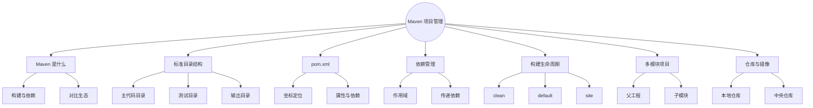
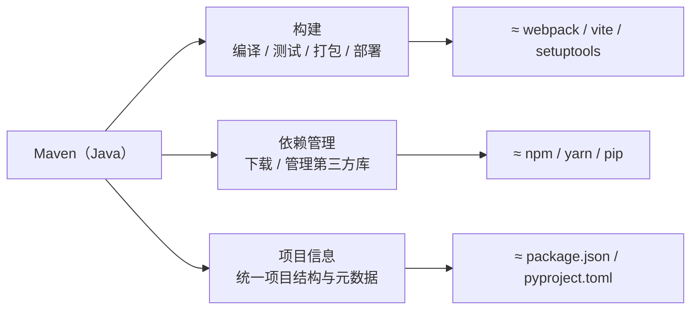
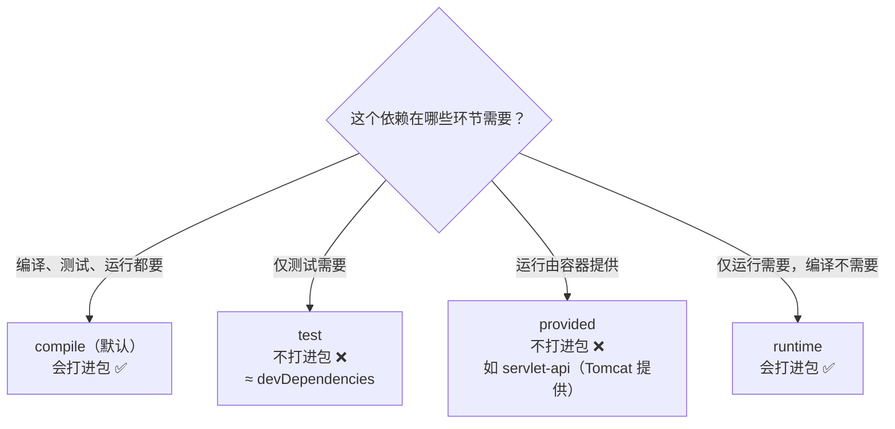
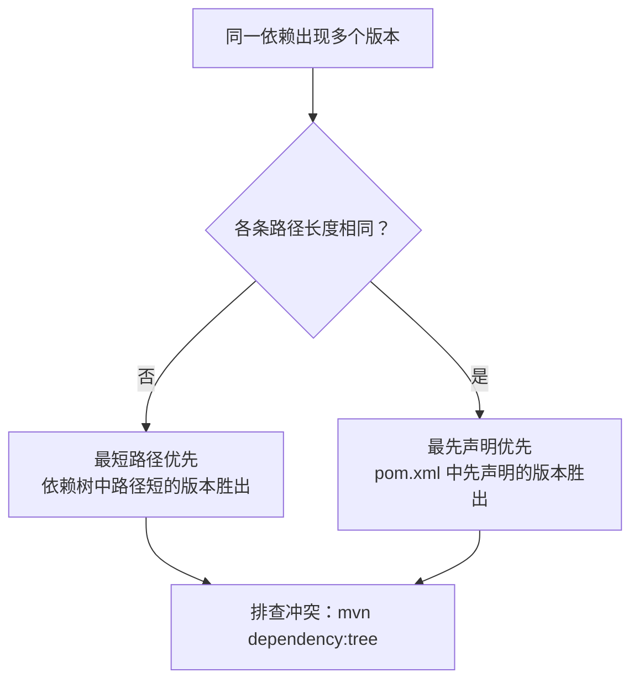
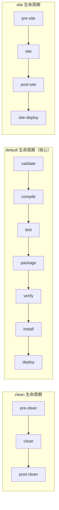
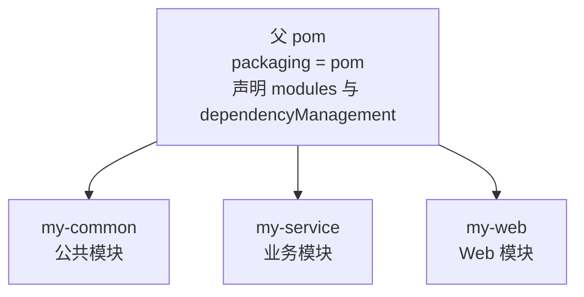

# Maven 项目管理（对比 npm / pip）
> 面向 JS + Python 背景开发者。  
> 目标：掌握 Maven 的核心概念与使用方式，理解 Java 项目的标准结构、依赖管理、构建生命周期，横向对比 npm / pip。
<!-- more -->

## TL;DR（先看结论）

> 一句话结论：**Maven 是 Java 的"npm + webpack + yarn"三合一：一个 `pom.xml` 搞定依赖管理（坐标 GAV）、构建（三套生命周期 + 插件）和项目结构（约定优于配置）。** JS / Python 开发者上手最快的路径：把 `pom.xml` 当 `package.json` 读，把 `mvn package` 当 `npm run build` 用。

- 三个必懂概念：**坐标 GAV**（`groupId:artifactId:version`）、**依赖 scope**（`compile` / `test` / `provided` / `runtime`）、**传递依赖冲突**（最短路径优先 / 先声明优先）
- 高频坑速记：`SNAPSHOT` 可被覆盖、`dependencyManagement` 只管理版本不引入依赖、多模块子模块必须声明 `<parent>`、国内要配阿里云镜像

## 🗺️ 本笔记知识地图



---
## 0. 本笔记重点
> 💡 一句话结论：**Maven = npm + webpack 的组合；`pom.xml` 是核心配置文件；scope、传递依赖、三套生命周期、多模块是四个必懂点。**

作为 JS + Python 开发者，Maven 是你从“手动 `javac`”走向“现代 Java 工程化”的第一步。核心要点：
1. Maven 集**构建 + 依赖管理 + 发布**于一体，类似 `npm + webpack + yarn` 的组合。
2. Java 项目有**约定优于配置**的标准目录结构。
3. `pom.xml` 是 Maven 的核心配置文件，类似 `package.json` / `pyproject.toml`。
4. 依赖有**作用域（scope）**，理解 `compile`、`test`、`provided`、`runtime` 是关键。
5. **传递依赖**会导致依赖冲突，需要理解 `exclusion` 和 `dependencyManagement`。
6. Maven 有**三套生命周期**：`clean`、`default`、`site`。
7. 多模块项目是企业级 Java 项目的常见形态。

---
## 1. Maven 是什么
> 💡 一句话结论：**Maven 干三件事：构建、依赖管理、项目信息统一；对应 JS / Python 生态的 npm + webpack / pip + setuptools。**



### 1.1 核心功能
Maven 是一个 Java 项目的构建与依赖管理工具，主要做三件事：
| 功能 | 说明 | JS / Python 对应 |
| --- | --- | --- |
| 构建 | 编译、测试、打包、部署 | webpack / vite / setuptools |
| 依赖管理 | 下载、管理第三方库 | npm / yarn / pip |
| 项目信息 | 统一项目结构与元数据 | package.json / pyproject.toml |
### 1.2 为什么需要 Maven
没有 Maven 时：
- 手动下载 Jar 包，容易漏依赖。
- 手动 `javac`、`java -cp`，命令冗长。
- 依赖冲突难以排查。
- 项目结构不统一，团队协作困难。
Maven 解决这些问题，并提供统一约定。
### 1.3 对比 JS / Python 生态
| 场景 | Java | JavaScript | Python |
| --- | --- | --- | --- |
| 包管理 | Maven / Gradle | npm / yarn / pnpm | pip / poetry |
| 配置文件 | `pom.xml` | `package.json` | `pyproject.toml` / `requirements.txt` |
| 锁文件 | 无（依赖版本靠 `pom.xml`） | `package-lock.json` | `poetry.lock` / `Pipfile.lock` |
| 中央仓库 | Maven Central | npm Registry | PyPI |
| 构建 | `mvn package` | `npm run build` | `python -m build` |
| 本地缓存 | `~/.m2/repository` | `node_modules` | `~/.cache/pip` |

---
## 2. 标准目录结构
> 💡 一句话结论：**约定优于配置——`src/main/java`、`src/main/resources`、`src/test/java`、`target` 四条铁律，工具依赖这些路径。**

### 2.1 Maven 约定结构
```text
my-project/
├── pom.xml
├── src/
│   ├── main/
│   │   ├── java/              # 主代码
│   │   │   └── com/example/
│   │   │       └── App.java
│   │   └── resources/         # 主资源
│   │       ├── application.yml
│   │       └── logback.xml
│   └── test/
│       ├── java/              # 测试代码
│       │   └── com/example/
│       │       └── AppTest.java
│       └── resources/         # 测试资源
│           └── test-data.json
└── target/                    # 构建输出（类似 dist / build）
```
### 2.2 关键约定
- 源码目录：`src/main/java`
- 资源目录：`src/main/resources`
- 测试目录：`src/test/java`
- 输出目录：`target`
- 源码包名对应目录层级，如 `com.example.App` → `com/example/App.java`
### 2.3 对比 JS / Python
JS 项目：
```text
my-project/
├── package.json
├── src/
├── public/
├── node_modules/
└── dist/
```
Python 项目：
```text
my-project/
├── pyproject.toml
├── my_package/
│   ├── __init__.py
│   └── main.py
├── tests/
└── dist/
```
差异：
- Java 有**强约定**的目录结构，工具依赖这些路径。
- JS / Python 结构相对自由，由工具配置决定。
- Java 把测试代码放在 `src/test/java`，与主代码对称。

---
## 3. pom.xml 详解
> 💡 一句话结论：**`pom.xml` = 项目身份证（GAV 三段式坐标）+ 属性 + 依赖；三段式坐标比 npm 的 name@version 更严格。**

### 3.1 最小 pom.xml
```xml
<?xml version="1.0" encoding="UTF-8"?>
<project xmlns="http://maven.apache.org/POM/4.0.0"
         xmlns:xsi="http://www.w3.org/2001/XMLSchema-instance"
         xsi:schemaLocation="http://maven.apache.org/POM/4.0.0
                             http://maven.apache.org/xsd/maven-4.0.0.xsd">
    <modelVersion>4.0.0</modelVersion>
    <groupId>com.example</groupId>
    <artifactId>my-project</artifactId>
    <version>1.0.0-SNAPSHOT</version>
    <packaging>jar</packaging>
    <properties>
        <maven.compiler.source>17</maven.compiler.source>
        <maven.compiler.target>17</maven.compiler.target>
        <project.build.sourceEncoding>UTF-8</project.build.sourceEncoding>
    </properties>
    <dependencies>
        <dependency>
            <groupId>org.junit.jupiter</groupId>
            <artifactId>junit-jupiter</artifactId>
            <version>5.10.0</version>
            <scope>test</scope>
        </dependency>
    </dependencies>
</project>
```
### 3.2 坐标（GAV）
Maven 用 `groupId:artifactId:version` 唯一定位一个构件：
| 元素 | 含义 | 示例 |
| --- | --- | --- |
| `groupId` | 组织 / 公司标识 | `org.springframework.boot` |
| `artifactId` | 项目 / 模块名 | `spring-boot-starter-web` |
| `version` | 版本号 | `3.2.0` |
| `packaging` | 打包类型 | `jar` / `war` / `pom` |
对比：
- **npm**：`package.json` 的 `name` + `version`。
- **pip**：包名 + 版本，如 `requests==2.31.0`。
- **Maven**：三段式坐标，更严格。
### 3.3 版本号约定
| 类型 | 示例 | 说明 |
| --- | --- | --- |
| `SNAPSHOT` | `1.0.0-SNAPSHOT` | 开发中版本，可重复发布 |
| 正式版 | `1.0.0` | 稳定版本，不可覆盖 |
| 里程碑 | `1.0.0-M1` | 里程碑版本 |
| 候选版 | `1.0.0-RC1` | 发布候选 |
语义化版本（SemVer）通用：`MAJOR.MINOR.PATCH`。
### 3.4 对比 package.json / pyproject.toml
**package.json**：
```json
{
  "name": "my-project",
  "version": "1.0.0",
  "dependencies": {
    "express": "^4.18.0"
  },
  "devDependencies": {
    "jest": "^29.0.0"
  }
}
```
**pyproject.toml**：
```toml
[project]
name = "my-project"
version = "1.0.0"
dependencies = ["requests>=2.31.0"]
[project.optional-dependencies]
dev = ["pytest>=7.0.0"]
```
差异：
- Maven 用 XML，其他两者用 JSON / TOML。
- Maven 的 `scope` 比 npm 的 `dependencies` / `devDependencies` 更细。
- Maven 没有 lock 文件，依赖版本靠 `pom.xml` 显式固定。

---
## 4. 依赖管理
> 💡 一句话结论：**scope 决定依赖在哪些环节生效、是否打包；传递依赖自动带入并"降级"；冲突按"最短路径优先 → 先声明优先"调解，用 `mvn dependency:tree` 排查。**

### 4.1 依赖声明
```xml
<dependencies>
    <dependency>
        <groupId>com.fasterxml.jackson.core</groupId>
        <artifactId>jackson-databind</artifactId>
        <version>2.15.2</version>
    </dependency>
</dependencies>
```
### 4.2 依赖作用域（scope）
| scope | 说明 | 是否打包 | JS / Python 类比 |
| --- | --- | --- | --- |
| `compile`（默认） | 编译、测试、运行都需要 | ✅ | `dependencies` |
| `provided` | 编译和测试需要，运行由容器提供 | ❌ | 无直接对应 |
| `runtime` | 运行和测试需要，编译不需要 | ✅ | 无直接对应 |
| `test` | 仅测试需要 | ❌ | `devDependencies` |
| `system` | 本地系统路径（不推荐） | ❌ | 无 |
示例：
```xml
<dependency>
    <groupId>javax.servlet</groupId>
    <artifactId>javax.servlet-api</artifactId>
    <version>4.0.1</version>
    <scope>provided</scope>  <!-- Tomcat 提供，不打进 war -->
</dependency>
<dependency>
    <groupId>org.junit.jupiter</groupId>
    <artifactId>junit-jupiter</artifactId>
    <version>5.10.0</version>
    <scope>test</scope>
</dependency>
```

scope 选择速查：



### 4.3 传递依赖
Maven 自动下载依赖的依赖，称为传递依赖。
例如引入 `spring-boot-starter-web`，会自动带入 `spring-core`、`jackson`、`tomcat` 等。
传递依赖的作用域会“降级”：
| 直接依赖 scope | 传递依赖 scope |
| --- | --- |
| `compile` | `compile` |
| `runtime` | `runtime` |
| `provided` | `provided`（不传递） |
| `test` | 不传递 |
### 4.4 依赖冲突与调解
当多个路径引入同一个依赖的不同版本时，Maven 使用两个原则：
1. **最短路径优先**：依赖树中路径最短的版本胜出。
2. **最先声明优先**：路径长度相同时，`pom.xml` 中先声明的胜出。



排查冲突：
```bash
mvn dependency:tree
```
输出示例：
```text
[INFO] com.example:my-project:jar:1.0.0
[INFO] +- org.springframework.boot:spring-boot-starter-web:jar:3.2.0:compile
[INFO] |  +- org.springframework:spring-core:jar:6.1.0:compile
[INFO] |  \- org.springframework:spring-web:jar:6.1.0:compile
[INFO] \- com.fasterxml.jackson.core:jackson-databind:jar:2.15.2:compile
```
### 4.5 排除依赖
```xml
<dependency>
    <groupId>org.springframework.boot</groupId>
    <artifactId>spring-boot-starter-web</artifactId>
    <version>3.2.0</version>
    <exclusions>
        <exclusion>
            <groupId>org.springframework.boot</groupId>
            <artifactId>spring-boot-starter-tomcat</artifactId>
        </exclusion>
    </exclusions>
</dependency>
```
### 4.6 dependencyManagement
`dependencyManagement` 用于统一管理版本，子模块只需声明 `groupId` + `artifactId`：
```xml
<dependencyManagement>
    <dependencies>
        <dependency>
            <groupId>com.fasterxml.jackson.core</groupId>
            <artifactId>jackson-databind</artifactId>
            <version>2.15.2</version>
        </dependency>
    </dependencies>
</dependencyManagement>
<dependencies>
    <dependency>
        <groupId>com.fasterxml.jackson.core</groupId>
        <artifactId>jackson-databind</artifactId>
        <!-- 版本由 dependencyManagement 决定 -->
    </dependency>
</dependencies>
```
Spring Boot 的 `spring-boot-dependencies` 就大量使用这个机制。
### 4.7 对比 npm / pip
| 特性 | Maven | npm | pip |
| --- | --- | --- | --- |
| 依赖声明 | `pom.xml` | `package.json` | `pyproject.toml` |
| 版本范围 | 支持 | 支持 | 支持 |
| 锁文件 | 无 | `package-lock.json` | `poetry.lock` |
| 传递依赖 | 自动 | 自动 | 自动 |
| 冲突解决 | 最短路径 + 先声明 | 扁平化 + 嵌套 | 覆盖安装 |
| 排除依赖 | `exclusions` | `overrides` | 无直接支持 |
| 依赖树 | `mvn dependency:tree` | `npm ls` | `pipdeptree` |

---
## 5. 构建生命周期
> 💡 一句话结论：**三套生命周期（clean / default / site）相互独立；执行某个阶段会依次执行它之前的阶段——`mvn package` 会自动跑 validate → compile → test → package。**



### 5.1 三套生命周期
Maven 有三套相互独立的生命周期：
1. **clean**：清理项目。
2. **default**（build）：构建项目。
3. **site**：生成项目站点文档。
### 5.2 clean 生命周期
| 阶段 | 说明 |
| --- | --- |
| `pre-clean` | 清理前准备 |
| `clean` | 删除 `target` 目录 |
| `post-clean` | 清理后工作 |
### 5.3 default 生命周期（核心）
| 阶段 | 说明 | 对应命令 |
| --- | --- | --- |
| `validate` | 校验项目 | |
| `compile` | 编译主代码 | `mvn compile` |
| `test` | 运行单元测试 | `mvn test` |
| `package` | 打包成 jar / war | `mvn package` |
| `verify` | 集成测试校验 | |
| `install` | 安装到本地仓库 | `mvn install` |
| `deploy` | 发布到远程仓库 | `mvn deploy` |
执行某个阶段会**依次执行之前的阶段**。例如 `mvn package` 会执行 `validate` → `compile` → `test` → `package`。
### 5.4 site 生命周期
| 阶段 | 说明 |
| --- | --- |
| `pre-site` | 站点生成前 |
| `site` | 生成站点文档 |
| `post-site` | 站点生成后 |
| `site-deploy` | 部署站点 |
### 5.5 常用命令
```bash
mvn clean              # 清理
mvn compile            # 编译
mvn test               # 运行测试
mvn package            # 打包
mvn install            # 安装到本地仓库
mvn clean package      # 清理 + 打包
mvn clean install -DskipTests  # 跳过测试
mvn dependency:tree    # 查看依赖树
mvn help:effective-pom # 查看有效 pom
```
### 5.6 对比 npm / pip
| 操作 | Maven | npm | pip |
| --- | --- | --- | --- |
| 安装依赖 | `mvn install` | `npm install` | `pip install -r req.txt` |
| 构建 | `mvn package` | `npm run build` | `python -m build` |
| 测试 | `mvn test` | `npm test` | `pytest` |
| 清理 | `mvn clean` | `rm -rf dist` | `rm -rf dist` |
| 发布 | `mvn deploy` | `npm publish` | `twine upload` |

---
## 6. 插件与属性
> 💡 一句话结论：**Maven 的功能几乎都由插件实现，插件绑定到生命周期阶段执行，比 npm scripts 更"声明式"；属性用 `${name}` 引用，一处定义多处使用。**

### 6.1 Maven 插件
Maven 的核心构建逻辑也是由插件实现的：
```xml
<build>
    <plugins>
        <plugin>
            <groupId>org.apache.maven.plugins</groupId>
            <artifactId>maven-compiler-plugin</artifactId>
            <version>3.11.0</version>
            <configuration>
                <source>17</source>
                <target>17</target>
            </configuration>
        </plugin>
        <plugin>
            <groupId>org.springframework.boot</groupId>
            <artifactId>spring-boot-maven-plugin</artifactId>
        </plugin>
    </plugins>
</build>
```
常见插件：
| 插件 | 用途 |
| --- | --- |
| `maven-compiler-plugin` | 编译 |
| `maven-surefire-plugin` | 单元测试 |
| `maven-failsafe-plugin` | 集成测试 |
| `maven-jar-plugin` | 打 jar |
| `maven-war-plugin` | 打 war |
| `maven-assembly-plugin` | 自定义打包 |
| `spring-boot-maven-plugin` | Spring Boot 可执行 jar |
### 6.2 属性
```xml
<properties>
    <java.version>17</java.version>
    <project.build.sourceEncoding>UTF-8</project.build.sourceEncoding>
    <jackson.version>2.15.2</jackson.version>
</properties>
```
引用属性：
```xml
<version>${jackson.version}</version>
```
### 6.3 内置属性
| 属性 | 含义 |
| --- | --- |
| `${project.version}` | 项目版本 |
| `${project.artifactId}` | 项目名 |
| `${basedir}` | 项目根目录 |
| `${project.build.directory}` | `target` 目录 |
### 6.4 对比 npm scripts
npm：
```json
{
  "scripts": {
    "build": "webpack --mode production",
    "test": "jest"
  }
}
```
Maven 的插件配置更“声明式”，绑定到生命周期阶段，而不是自定义脚本。

---
## 7. 多模块项目
> 💡 一句话结论：**多模块 = 父 pom（`packaging=pom` + `<modules>`）+ 子模块 `<parent>` 继承；构建顺序由 Maven 按模块依赖自动确定。**



### 7.1 为什么需要多模块
大型项目通常拆分为多个模块：
```text
my-project/
├── pom.xml                   # 父 pom
├── my-common/                # 公共模块
│   └── pom.xml
├── my-service/               # 业务模块
│   └── pom.xml
└── my-web/                   # Web 模块
    └── pom.xml
```
好处：
- 模块独立开发、测试、部署。
- 依赖关系清晰。
- 复用公共代码。
### 7.2 父 pom
```xml
<project>
    <groupId>com.example</groupId>
    <artifactId>my-project</artifactId>
    <version>1.0.0</version>
    <packaging>pom</packaging>
    <modules>
        <module>my-common</module>
        <module>my-service</module>
        <module>my-web</module>
    </modules>
    <dependencyManagement>
        <dependencies>
            <dependency>
                <groupId>com.example</groupId>
                <artifactId>my-common</artifactId>
                <version>${project.version}</version>
            </dependency>
        </dependencies>
    </dependencyManagement>
</project>
```
### 7.3 子模块 pom
```xml
<project>
    <parent>
        <groupId>com.example</groupId>
        <artifactId>my-project</artifactId>
        <version>1.0.0</version>
    </parent>
    <artifactId>my-service</artifactId>
    <dependencies>
        <dependency>
            <groupId>com.example</groupId>
            <artifactId>my-common</artifactId>
        </dependency>
    </dependencies>
</project>
```
### 7.4 构建顺序
Maven 根据模块间依赖自动确定构建顺序。
```bash
mvn clean install            # 构建所有模块
mvn -pl my-service install   # 只构建 my-service
mvn -pl my-service -am install  # 构建 my-service 及其依赖
```
### 7.5 对比 JS / Python
- **JS**：`lerna`、`pnpm workspace`、`npm workspaces`。
- **Python**：`setuptools` 多包、`poetry` 多包、monorepo 工具。
- **Maven**：原生支持多模块，配置在父 pom 的 `<modules>`。

---
## 8. 本地仓库与中央仓库
> 💡 一句话结论：**依赖缓存在 `~/.m2/repository`，默认中央仓库 Maven Central，国内不配镜像会非常慢。**

### 8.1 本地仓库
默认位置：`~/.m2/repository`
下载的依赖都缓存在这里，类似 `node_modules` 或 pip 缓存。
### 8.2 中央仓库
默认中央仓库：`https://repo.maven.apache.org/maven2/`
### 8.3 镜像配置
国内常用阿里云镜像：
```xml
<!-- ~/.m2/settings.xml -->
<mirrors>
    <mirror>
        <id>aliyun</id>
        <mirrorOf>central</mirrorOf>
        <url>https://maven.aliyun.com/repository/public</url>
    </mirror>
</mirrors>
```
### 8.4 对比
| 概念 | Maven | npm | pip |
| --- | --- | --- | --- |
| 本地缓存 | `~/.m2/repository` | `node_modules` | `~/.cache/pip` |
| 中央仓库 | Maven Central | npm Registry | PyPI |
| 镜像 | `settings.xml` | `.npmrc` | `pip.conf` |
| 私有仓库 | Nexus / Artifactory | Verdaccio / Nexus | devpi / Nexus |

---
## 9. 常见坑点
> 💡 一句话结论：**10 个坑集中在 SNAPSHOT 可覆盖、依赖冲突运行时才爆、provided 不打包、dependencyManagement 只管版本、多模块 parent、国内镜像。**

1. **`SNAPSHOT` 版本可被覆盖**，正式发布不要用。
2. **依赖冲突不一定报错**，可能运行时才暴露 `NoSuchMethodError`。
3. **`provided` 依赖不会打包**，部署到容器时需确保容器提供。
4. **`mvn install` 会先跑测试**，跳过测试用 `-DskipTests`。
5. **多模块项目中子模块必须声明 `<parent>`**，否则无法继承。
6. **`dependencyManagement` 只管理版本，不引入依赖**，还需在 `<dependencies>` 中声明。
7. **`mvn clean package` 与 `mvn package` 不同**，前者先清理。
8. **不要手动改 `target` 目录**，它是构建产物。
9. **不要把 `~/.m2` 提交到 Git**，那是本地缓存。
10. **注意 `settings.xml` 的镜像配置**，国内不配镜像会很慢。

---
## 10. 小结
> 💡 一句话结论：**总表：配置文件、坐标、scope、锁文件、本地仓库、构建方式、多模块、中央仓库——Maven 与 npm / pip 一一对应，只是更"工程化"。**

| 概念 | Maven | npm | pip |
| --- | --- | --- | --- |
| 配置文件 | `pom.xml` | `package.json` | `pyproject.toml` |
| 坐标 | groupId:artifactId:version | name@version | name==version |
| 依赖作用域 | compile/test/provided/runtime | dependencies/devDependencies | 无细粒度 |
| 锁文件 | 无 | 有 | 有（poetry） |
| 本地仓库 | `~/.m2/repository` | `node_modules` | `~/.cache/pip` |
| 构建 | 生命周期 + 插件 | scripts | build backend |
| 多模块 | `<modules>` | workspaces | monorepo 工具 |
| 中央仓库 | Maven Central | npm Registry | PyPI |

---
## 11. 练习建议
> 💡 一句话结论：**7 步动手路线：建项目 → 引依赖看依赖树 → 制造冲突观察调解 → 排除依赖 → 多模块 → 镜像 → 对比 pom 与 package.json。**

1. 用 `mvn archetype:generate` 或 IDEA 创建一个 Maven 项目。
2. 在 `pom.xml` 中引入 `jackson-databind`，用 `mvn dependency:tree` 查看依赖树。
3. 引入两个有冲突的依赖，观察 Maven 如何调解。
4. 用 `exclusions` 排除某个传递依赖，验证效果。
5. 创建多模块项目，父 pom + 两个子模块，验证构建顺序。
6. 配置阿里云镜像，感受下载速度差异。
7. 对比 npm 的 `package.json` 和 Maven 的 `pom.xml`，列出异同。

---
## 12. 下一篇
下一篇：**JUnit 单元测试（对比 pytest / Jest）**。  
重点：
- JUnit 5 核心注解：`@Test`、`@BeforeEach`、`@AfterEach`
- 断言：`assertEquals`、`assertThrows`、`assertAll`
- 参数化测试
- Mockito 模拟对象
- 对比 pytest / Jest 的测试写法