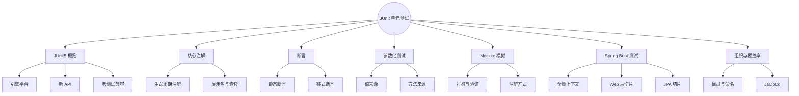
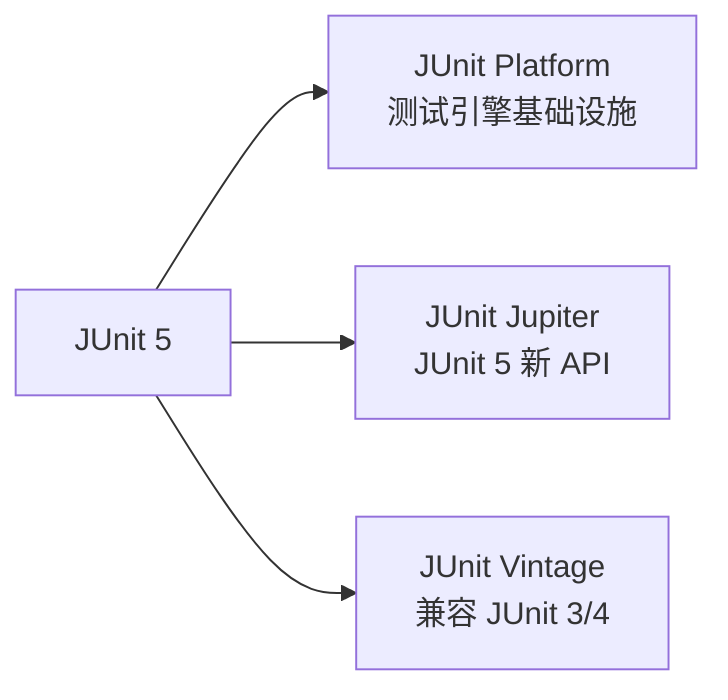
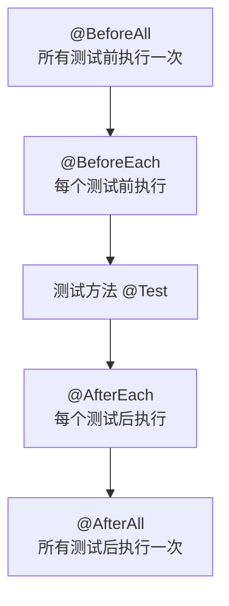
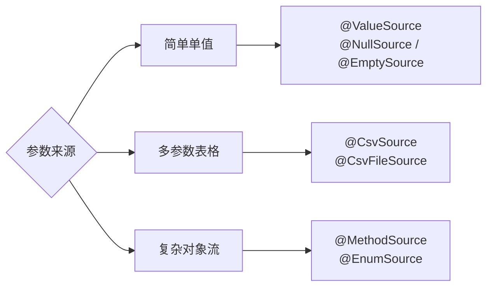
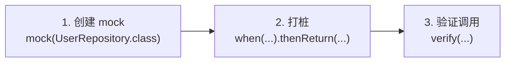
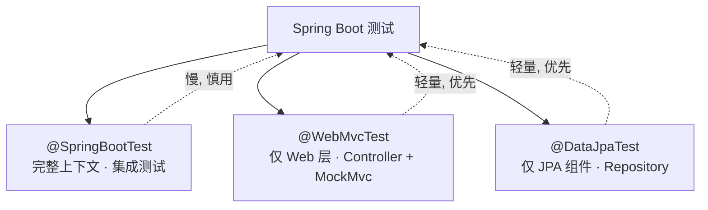

# JUnit 单元测试（对比 pytest / Jest）
> 面向 JS + Python 背景开发者。  
> 目标：掌握 JUnit 5 核心注解与断言、参数化测试、Mockito 模拟、Spring Boot 测试，横向对比 pytest / Jest。
<!-- more -->
## TL;DR（先看结论）
> 一句话结论：JUnit 5 是 Java 测试事实标准 = **Jupiter 注解 + 断言 + Mockito 打桩 + Spring Boot 测试切片**。JS/Python 开发者把 `@Test` 当 `test()` / `it()`，把 `@BeforeEach` 当 fixture / `beforeEach`，把 Mockito 的 `when().thenReturn()` 当 `jest.fn()` / `Mock.return_value`，上手很快。
> 三个必懂概念：测试方法必须 `void` 无参；`@BeforeAll` / `@AfterAll` 必须 `static`；断言消息是**最后一个参数**。
> 高频坑速记：`@Mock` 需配 `@ExtendWith(MockitoExtension.class)`；`@MockBean` 会重置 Spring 上下文缓存（慢）；`assertEquals(double, double)` 需要 delta；不要访问真实数据库 / 网络。

## 🗺️ 本笔记知识地图

---
## 0. 本笔记重点
> 💡 一句话结论：测试思路三语言通用，Java 的差异集中在「注解驱动 + 编译期类型 + Mock 显式化 + Spring 测试切片」四点。
作为 JS + Python 开发者，单元测试的思路你已经熟悉，但 Java 测试生态有几个差异：
1. JUnit 5 是**注解驱动**，比 pytest 的 fixture、Jest 的 `describe/it` 更依赖注解。
2. Java 测试是**编译期类型检查**，Mock 对象需要显式声明接口或类。
3. **Mockito** 是 Java 最主流的 Mock 框架，类似 Jest 的 `jest.fn()` / `unittest.mock`。
4. **Spring Boot Test** 提供 `@SpringBootTest`、`@WebMvcTest` 等集成测试注解。
5. Java 测试类约定放在 `src/test/java`，包名与主代码一致。
---
## 1. JUnit 5 概览
> 💡 一句话结论：JUnit 5 分三层——Platform 是引擎底座、Jupiter 是日常写测试的 API、Vintage 兼容老版本，日常只用 Jupiter。
### 1.1 JUnit 5 组成
JUnit 5 = JUnit Platform + JUnit Jupiter + JUnit Vintage



| 模块 | 作用 |
| --- | --- |
| JUnit Platform | 测试引擎的基础设施 |
| JUnit Jupiter | JUnit 5 新 API（`@Test`、`@BeforeEach` 等） |
| JUnit Vintage | 兼容 JUnit 3 / 4 的老测试 |
日常使用只需关注 Jupiter。
### 1.2 Maven 依赖
```xml
<dependency>
    <groupId>org.junit.jupiter</groupId>
    <artifactId>junit-jupiter</artifactId>
    <version>5.10.0</version>
    <scope>test</scope>
</dependency>
```
Spring Boot 项目引入 `spring-boot-starter-test` 会自动包含 JUnit 5、Mockito、AssertJ、Hamcrest。
### 1.3 对比 pytest / Jest
| 概念 | JUnit 5 | pytest | Jest |
| --- | --- | --- | --- |
| 测试方法 | `@Test` | `def test_xxx` | `test()` / `it()` |
| 测试类 | 普通类 | 普通类 / 函数 | `describe()` |
| 断言 | `Assertions.assertEquals` | `assert` | `expect().toBe()` |
| 前置 | `@BeforeEach` | `@pytest.fixture` | `beforeEach()` |
| 后置 | `@AfterEach` | fixture yield | `afterEach()` |
| 参数化 | `@ParameterizedTest` | `@pytest.mark.parametrize` | `test.each()` |
| Mock | Mockito | `unittest.mock` / `pytest-mock` | `jest.fn()` / `jest.mock()` |
| 运行 | `mvn test` | `pytest` | `npm test` |
---
## 2. 第一个 JUnit 测试
> 💡 一句话结论：JUnit 用静态断言方法（`assertEquals`），测试方法必须 `void` 无参，类和方法推荐包可见。
### 2.1 被测试代码
```java
public class Calculator {
    public int add(int a, int b) {
        return a + b;
    }
    public int divide(int a, int b) {
        if (b == 0) {
            throw new IllegalArgumentException("divisor cannot be zero");
        }
        return a / b;
    }
}
```
### 2.2 测试类
```java
import org.junit.jupiter.api.Test;
import static org.junit.jupiter.api.Assertions.*;
class CalculatorTest {
    @Test
    void testAdd() {
        Calculator calculator = new Calculator();
        int result = calculator.add(2, 3);
        assertEquals(5, result);
    }
    @Test
    void testDivideByZero() {
        Calculator calculator = new Calculator();
        assertThrows(IllegalArgumentException.class,
                     () -> calculator.divide(1, 0));
    }
}
```
运行：
```bash
mvn test
```
### 2.3 对比 pytest
```python
import pytest
from calculator import Calculator
def test_add():
    calculator = Calculator()
    assert calculator.add(2, 3) == 5
def test_divide_by_zero():
    calculator = Calculator()
    with pytest.raises(IllegalArgumentException):
        calculator.divide(1, 0)
```
### 2.4 对比 Jest
```js
const Calculator = require("./calculator");
test("add", () => {
  const calculator = new Calculator();
  expect(calculator.add(2, 3)).toBe(5);
});
test("divide by zero", () => {
  const calculator = new Calculator();
  expect(() => calculator.divide(1, 0)).toThrow();
});
```
差异：
- JUnit 用**断言方法**（`assertEquals`），不是语言级关键字。
- JUnit 测试方法必须是 `void` 且无参。
- JUnit 测试类推荐**包可见**（无 `public`），方法也推荐包可见。
---
## 3. 核心注解
> 💡 一句话结论：生命周期注解 = pytest fixture 的 scope / Jest 钩子的注解版；`@BeforeAll` 必须 `static`，`@Nested` 就是 `describe` 嵌套。
### 3.1 常用注解
| 注解 | 作用 |
| --- | --- |
| `@Test` | 标记测试方法 |
| `@BeforeEach` | 每个测试前执行 |
| `@AfterEach` | 每个测试后执行 |
| `@BeforeAll` | 所有测试前执行一次（`static`） |
| `@AfterAll` | 所有测试后执行一次（`static`） |
| `@DisplayName` | 自定义测试显示名 |
| `@Disabled` | 禁用测试 |
| `@Nested` | 嵌套测试类 |
| `@Tag` | 测试标签，用于分组 |
| `@Timeout` | 超时控制 |
### 3.2 生命周期示例
```java
class LifecycleTest {
    @BeforeAll
    static void beforeAll() {
        System.out.println("before all");
    }
    @BeforeEach
    void beforeEach() {
        System.out.println("before each");
    }
    @AfterEach
    void afterEach() {
        System.out.println("after each");
    }
    @AfterAll
    static void afterAll() {
        System.out.println("after all");
    }
    @Test
    void test1() {
        System.out.println("test1");
    }
    @Test
    void test2() {
        System.out.println("test2");
    }
}
```
执行顺序：


```text
before all
before each
test1
after each
before each
test2
after each
after all
```
### 3.3 对比 pytest fixture
```python
import pytest
@pytest.fixture(scope="session", autouse=True)
def before_all():
    print("before all")
    yield
    print("after all")
@pytest.fixture(autouse=True)
def beforeEach():
    print("before each")
    yield
    print("after each")
def test1():
    print("test1")
def test2():
    print("test2")
```
差异：
- JUnit 用注解 + `static` 区分层级。
- pytest 用 fixture 的 `scope` 控制。
- JUnit 的 `@BeforeAll` 必须是 `static`，pytest 不需要。
### 3.4 对比 Jest
```js
beforeAll(() => console.log("before all"));
beforeEach(() => console.log("before each"));
afterEach(() => console.log("after each"));
afterAll(() => console.log("after all"));
test("test1", () => console.log("test1"));
test("test2", () => console.log("test2"));
```
### 3.5 @DisplayName 与 @Nested
```java
@DisplayName("计算器测试")
class CalculatorTest {
    @Test
    @DisplayName("2 + 3 应该等于 5")
    void testAdd() {
        assertEquals(5, new Calculator().add(2, 3));
    }
    @Nested
    @DisplayName("除法测试")
    class DivideTest {
        @Test
        @DisplayName("除以零应该抛异常")
        void testDivideByZero() {
            assertThrows(IllegalArgumentException.class,
                         () -> new Calculator().divide(1, 0));
        }
    }
}
```
`@Nested` 类似 Jest 的 `describe` 嵌套。
---
## 4. 断言
> 💡 一句话结论：JUnit 断言是静态方法、消息是最后一个参数；`assertAll` 不中断执行；AssertJ 链式风格更接近 Jest 的 `expect()`，推荐使用。
### 4.1 常用断言
```java
import static org.junit.jupiter.api.Assertions.*;
assertEquals(expected, actual);
assertNotEquals(unexpected, actual);
assertTrue(condition);
assertFalse(condition);
assertNull(object);
assertNotNull(object);
assertArrayEquals(expectedArray, actualArray);
assertSame(expected, actual);       // 引用相同
assertNotSame(unexpected, actual);
assertThrows(Exception.class, () -> { ... });
assertDoesNotThrow(() -> { ... });
assertTimeout(Duration.ofSeconds(1), () -> { ... });
```
### 4.2 断言消息
```java
assertEquals(5, result, "2 + 3 应该等于 5");
```
消息是**最后一个参数**，不是第一个（和 pytest `assert x == y, "msg"` 不同）。
### 4.3 assertAll
```java
assertAll("user",
    () -> assertEquals("lious", user.getName()),
    () -> assertEquals(18, user.getAge()),
    () -> assertNotNull(user.getEmail())
);
```
`assertAll` 会执行所有断言，不因第一个失败而中断，类似 Jest 的 `expect` 多项断言。
### 4.4 异常断言
```java
IllegalArgumentException exception = assertThrows(
    IllegalArgumentException.class,
    () -> calculator.divide(1, 0)
);
assertEquals("divisor cannot be zero", exception.getMessage());
```
对比 pytest：
```python
with pytest.raises(IllegalArgumentException) as exc_info:
    calculator.divide(1, 0)
assert str(exc_info.value) == "divisor cannot be zero"
```
### 4.5 对比 Jest
```js
expect(calculator.add(2, 3)).toBe(5);
expect(calculator.add(2, 3)).toEqual(5);
expect(() => calculator.divide(1, 0)).toThrow("divisor cannot be zero");
expect(user).toMatchObject({ name: "lious" });
```
差异：
- JUnit 断言是静态方法，Jest 是链式 `expect().toBe()`。
- JUnit 没有 `toBe` / `toEqual` 的严格区分，`assertEquals` 用 `equals()`。
- JUnit 数组比较用 `assertArrayEquals`，Jest 用 `toEqual`。
### 4.6 AssertJ（推荐）
AssertJ 提供更流畅的链式断言，Spring Boot 默认包含：
```java
import static org.assertj.core.api.Assertions.assertThat;
assertThat(result).isEqualTo(5);
assertThat(user.getName()).isEqualTo("lious");
assertThat(list).hasSize(3).contains("a", "b");
assertThatThrownBy(() -> calculator.divide(1, 0))
    .isInstanceOf(IllegalArgumentException.class)
    .hasMessage("divisor cannot be zero");
```
AssertJ 更接近 Jest 的 `expect` 风格，推荐在项目中使用。
---
## 5. 参数化测试
> 💡 一句话结论：参数化 = 一份测试逻辑跑多组数据；`@CsvSource` 最常用，复杂对象用 `@MethodSource`。
### 5.1 @ParameterizedTest
```java
import org.junit.jupiter.params.ParameterizedTest;
import org.junit.jupiter.params.provider.*;
@ParameterizedTest
@CsvSource({
    "1, 2, 3",
    "2, 3, 5",
    "0, 0, 0",
    "-1, 1, 0"
})
void testAdd(int a, int b, int expected) {
    assertEquals(expected, new Calculator().add(a, b));
}
```
### 5.2 常用数据源
| 注解 | 说明 |
| --- | --- |
| `@ValueSource` | 单参数简单值 |
| `@CsvSource` | CSV 格式多参数 |
| `@CsvFileSource` | CSV 文件 |
| `@MethodSource` | 方法返回流 |
| `@EnumSource` | 枚举值 |
| `@NullSource` / `@EmptySource` | null / 空值 |


`@ValueSource` 示例：
```java
@ParameterizedTest
@ValueSource(ints = {1, 2, 3, 4, 5})
void testIsPositive(int number) {
    assertTrue(number > 0);
}
```
`@MethodSource` 示例：
```java
@ParameterizedTest
@MethodSource("provideUsers")
void testUser(User user, boolean expected) {
    assertEquals(expected, user.isAdult());
}
static Stream<Arguments> provideUsers() {
    return Stream.of(
        Arguments.of(new User("A", 17), false),
        Arguments.of(new User("B", 18), true),
        Arguments.of(new User("C", 30), true)
    );
}
```
### 5.3 对比 pytest
```python
import pytest
@pytest.mark.parametrize("a, b, expected", [
    (1, 2, 3),
    (2, 3, 5),
    (0, 0, 0),
    (-1, 1, 0),
])
def test_add(a, b, expected):
    assert Calculator().add(a, b) == expected
```
### 5.4 对比 Jest
```js
test.each([
  [1, 2, 3],
  [2, 3, 5],
  [0, 0, 0],
  [-1, 1, 0],
])("add(%i, %i) = %i", (a, b, expected) => {
  expect(new Calculator().add(a, b)).toBe(expected);
});
```
差异：
- JUnit 参数化使用不同注解标记数据源。
- pytest 用 `@pytest.mark.parametrize` 一个注解搞定。
- Jest 用 `test.each`，写法更简洁。
- JUnit 的参数类型由方法签名决定，需要类型匹配。
---
## 6. Mockito 模拟
> 💡 一句话结论：Mockito 三段式——`mock()` 创建 → `when().thenReturn()` 打桩 → `verify()` 验证调用；等价于 Jest 的 `jest.fn()` + `toHaveBeenCalledWith`。
### 6.1 为什么需要 Mock
测试 `UserService` 时，不希望真的访问数据库：
```java
public class UserService {
    private final UserRepository userRepository;
    public UserService(UserRepository userRepository) {
        this.userRepository = userRepository;
    }
    public String getUserName(Long id) {
        User user = userRepository.findById(id);
        return user == null ? "unknown" : user.getName();
    }
}
```
### 6.2 引入 Mockito
```xml
<dependency>
    <groupId>org.mockito</groupId>
    <artifactId>mockito-core</artifactId>
    <version>5.5.0</version>
    <scope>test</scope>
</dependency>
```
Spring Boot 项目由 `spring-boot-starter-test` 自动包含。
### 6.3 创建 Mock 对象
```java
import static org.mockito.Mockito.*;
class UserServiceTest {
    @Test
    void testGetUserName() {
        // 创建 mock
        UserRepository repository = mock(UserRepository.class);
        // 打桩
        User user = new User("lious", 18);
        when(repository.findById(1L)).thenReturn(user);
        // 测试
        UserService service = new UserService(repository);
        String name = service.getUserName(1L);
        assertEquals("lious", name);
        // 验证调用
        verify(repository).findById(1L);
    }
}
```


### 6.4 常用 Mockito API
| API | 作用 |
| --- | --- |
| `mock(Class)` | 创建 mock 对象 |
| `when(...).thenReturn(...)` | 打桩返回值 |
| `when(...).thenThrow(...)` | 打桩抛异常 |
| `doNothing().when(...)` | void 方法不做事 |
| `doAnswer(...).when(...)` | 自定义回答 |
| `verify(mock).method()` | 验证调用 |
| `verify(mock, times(2)).method()` | 验证调用次数 |
| `verify(mock, never()).method()` | 验证从未调用 |
| `ArgumentMatchers.any()` | 任意参数匹配 |
| `@Mock` / `@InjectMocks` | 注解方式 |
### 6.5 注解方式
```java
import org.junit.jupiter.api.extension.ExtendWith;
import org.mockito.junit.jupiter.MockitoExtension;
import org.mockito.InjectMocks;
import org.mockito.Mock;
@ExtendWith(MockitoExtension.class)
class UserServiceTest {
    @Mock
    UserRepository userRepository;
    @InjectMocks
    UserService userService;
    @Test
    void testGetUserName() {
        when(userRepository.findById(1L)).thenReturn(new User("lious", 18));
        assertEquals("lious", userService.getUserName(1L));
    }
}
```
### 6.6 参数匹配
```java
when(repository.findById(anyLong())).thenReturn(user);
when(repository.findByName(eq("lious"))).thenReturn(user);
when(repository.save(any(User.class))).thenReturn(user);
```
### 6.7 验证
```java
verify(repository).findById(1L);
verify(repository, times(2)).findById(anyLong());
verify(repository, never()).deleteById(anyLong());
verify(repository, atLeastOnce()).findAll();
```
### 6.8 对比 Jest
```js
const repository = {
  findById: jest.fn().mockReturnValue(user),
};
const service = new UserService(repository);
expect(service.getUserName(1)).toBe("lious");
expect(repository.findById).toHaveBeenCalledWith(1);
```
### 6.9 对比 pytest
```python
from unittest.mock import Mock
def test_get_user_name():
    repository = Mock()
    repository.find_by_id.return_value = User("lious", 18)
    service = UserService(repository)
    assert service.get_user_name(1) == "lious"
    repository.find_by_id.assert_called_once_with(1)
```
差异：
- Mockito 用 `when().thenReturn()`，Jest 用 `mockReturnValue`，pytest 用 `return_value`。
- Mockito 用 `verify()`，Jest 用 `toHaveBeenCalledWith`，pytest 用 `assert_called_once_with`。
- Java 强类型让 Mock 更安全，但样板代码更多。
---
## 7. Spring Boot 测试
> 💡 一句话结论：测试按范围切片——`@SpringBootTest` 全量集成、`@WebMvcTest` 只测 Controller、`@DataJpaTest` 只测 Repository；`@MockBean` 替换 Spring 上下文中的 Bean。
### 7.1 依赖
```xml
<dependency>
    <groupId>org.springframework.boot</groupId>
    <artifactId>spring-boot-starter-test</artifactId>
    <scope>test</scope>
</dependency>
```
包含 JUnit 5、Mockito、AssertJ、Spring Test、JSONassert、JsonPath。
### 7.2 @SpringBootTest
启动完整 Spring 上下文，用于集成测试：
```java
@SpringBootTest
class UserServiceIntegrationTest {
    @Autowired
    private UserService userService;
    @Test
    void testGetUserName() {
        String name = userService.getUserName(1L);
        assertNotNull(name);
    }
}
```
### 7.3 @WebMvcTest
只加载 Web 层，用于测试 Controller：
```java
@WebMvcTest(UserController.class)
class UserControllerTest {
    @Autowired
    private MockMvc mockMvc;
    @MockBean
    private UserService userService;
    @Test
    void testGetUser() throws Exception {
        when(userService.getUserName(1L)).thenReturn("lious");
        mockMvc.perform(get("/users/1"))
            .andExpect(status().isOk())
            .andExpect(jsonPath("$.name").value("lious"));
    }
}
```
### 7.4 @DataJpaTest
只加载 JPA 相关组件：
```java
@DataJpaTest
class UserRepositoryTest {
    @Autowired
    private UserRepository userRepository;
    @Test
    void testSave() {
        User user = new User("lious", 18);
        userRepository.save(user);
        assertNotNull(user.getId());
    }
}
```


### 7.5 @MockBean
Spring Boot 提供的注解，替换 Spring 上下文中的 Bean：
```java
@MockBean
private UserService userService;
```
区别 `@Mock` 和 `@MockBean`：
| 注解 | 场景 |
| --- | --- |
| `@Mock` | 纯 Mockito，不涉及 Spring |
| `@MockBean` | Spring 上下文中的 Bean 替换 |
### 7.6 对比 NestJS / FastAPI
NestJS：
```ts
describe("UserController", () => {
  let app: INestApplication;
  beforeAll(async () => {
    const module = await Test.createTestingModule({
      controllers: [UserController],
      providers: [{ provide: UserService, useValue: mockUserService }],
    }).compile();
    app = module.createNestApplication();
    await app.init();
  });
  it("GET /users/1", () => {
    return request(app.getHttpServer())
      .get("/users/1")
      .expect(200)
      .expect({ name: "lious" });
  });
});
```
FastAPI：
```python
from fastapi.testclient import TestClient
def test_get_user():
    app.dependency_overrides[get_user_service] = lambda: mock_user_service
    client = TestClient(app)
    response = client.get("/users/1")
    assert response.status_code == 200
    assert response.json() == {"name": "lious"}
```
---
## 8. 测试组织与命名
> 💡 一句话结论：测试类放 `src/test/java` 且包名与主代码一致；方法名简洁，业务含义交给 `@DisplayName`。
### 8.1 目录结构
```text
src/
├── main/java/com/example/
│   ├── service/UserService.java
│   └── repository/UserRepository.java
└── test/java/com/example/
    ├── service/UserServiceTest.java
    └── repository/UserRepositoryTest.java
```
测试类包名与主代码保持一致。
### 8.2 命名约定
| 风格 | 示例 |
| --- | --- |
| 方法名 + Test | `testAdd()` |
| 行为 + 条件 | `shouldReturnZeroWhenAddingZero()` |
| Given-When-Then | `givenValidUser_whenSave_thenReturnUser()` |
| `@DisplayName` | `@DisplayName("2 + 3 应该等于 5")` |
推荐：方法名简洁，用 `@DisplayName` 描述业务含义。
### 8.3 对比
- **pytest**：文件 `test_*.py`，函数 `test_*`。
- **Jest**：文件 `*.test.js` / `*.spec.js`，测试用 `test()` / `it()`。
- **JUnit**：类 `*Test`，方法 `@Test` 注解。
---
## 9. 测试覆盖率
> 💡 一句话结论：Java 覆盖率靠 JaCoCo 插件，`mvn test` 后报告在 `target/site/jacoco/index.html`。
### 9.1 JaCoCo
Maven 插件：
```xml
<plugin>
    <groupId>org.jacoco</groupId>
    <artifactId>jacoco-maven-plugin</artifactId>
    <version>0.8.10</version>
    <executions>
        <execution>
            <goals>
                <goal>prepare-agent</goal>
            </goals>
        </execution>
        <execution>
            <id>report</id>
            <phase>test</phase>
            <goals>
                <goal>report</goal>
            </goals>
        </execution>
    </executions>
</plugin>
```
运行：
```bash
mvn test
# 报告：target/site/jacoco/index.html
```
### 9.2 对比
- **pytest**：`pytest-cov` 生成覆盖率。
- **Jest**：内置 `--coverage`。
- **JUnit**：需要 JaCoCo 插件。
---
## 10. 常见坑点
> 💡 一句话结论：十个坑集中在「static 约束、void 约束、Mock 启用、上下文缓存、浮点 delta、测试独立性」——写前先背下来。
1. **`@BeforeAll` / `@AfterAll` 必须是 `static`**（除非用 `@TestInstance(PER_CLASS)`）。
2. **测试方法必须是 `void` 且无参**，否则 JUnit 不会执行。
3. **`@Mock` 需要 `@ExtendWith(MockitoExtension.class)`** 才能生效。
4. **Mockito 不能 Mock `final` 类 / 方法**（除非开启 inline mock maker）。
5. **`@MockBean` 会重置 Spring 上下文缓存**，大量使用会变慢。
6. **`@SpringBootTest` 启动完整上下文**，慢；单元测试优先用 `@WebMvcTest` / `@DataJpaTest`。
7. **断言消息是最后一个参数**，不是第一个。
8. **`assertEquals(double, double)` 需要 delta 参数**，或用 `assertEquals(double, double, delta)`。
9. **测试之间要独立**，不要依赖执行顺序。
10. **不要在测试中访问真实数据库 / 网络**，用 Mock 或 Testcontainers。
---
## 11. 小结
| 概念 | JUnit 5 | pytest | Jest |
| --- | --- | --- | --- |
| 测试标记 | `@Test` | `def test_` | `test()` / `it()` |
| 测试类 | 普通类 | 普通类 | `describe()` |
| 前置 | `@BeforeEach` | fixture | `beforeEach` |
| 断言 | `Assertions.*` / AssertJ | `assert` | `expect()` |
| 异常断言 | `assertThrows` | `pytest.raises` | `toThrow` |
| 参数化 | `@ParameterizedTest` | `@pytest.mark.parametrize` | `test.each` |
| Mock | Mockito | unittest.mock | jest.fn() |
| Spring 测试 | `@SpringBootTest` | TestClient | Nest Testing |
| 覆盖率 | JaCoCo | pytest-cov | 内置 |
| 运行 | `mvn test` | `pytest` | `npm test` |
---
## 12. 练习建议
1. 为 `Calculator` 写单元测试，覆盖正常、边界、异常场景。
2. 用 `@ParameterizedTest` + `@CsvSource` 写参数化测试。
3. 用 `@BeforeEach` 初始化测试对象，避免重复代码。
4. 用 Mockito Mock 一个 Repository，测试 Service。
5. 用 `@WebMvcTest` + `MockMvc` 测试一个 REST Controller。
6. 用 AssertJ 改写断言，感受链式 API。
7. 配置 JaCoCo，查看测试覆盖率报告。
8. 用 pytest 和 Jest 实现同样的测试，横向对比。
---
## 13. 下一篇
下一篇：**SpringBoot 快速入门**。  
重点：
- SpringBoot 是什么，解决什么问题
- 自动配置原理
- 启动类与 `@SpringBootApplication`
- `application.yml` 配置
- 内嵌 Tomcat 与可执行 Jar
- 对比 Express / FastAPI