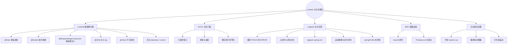
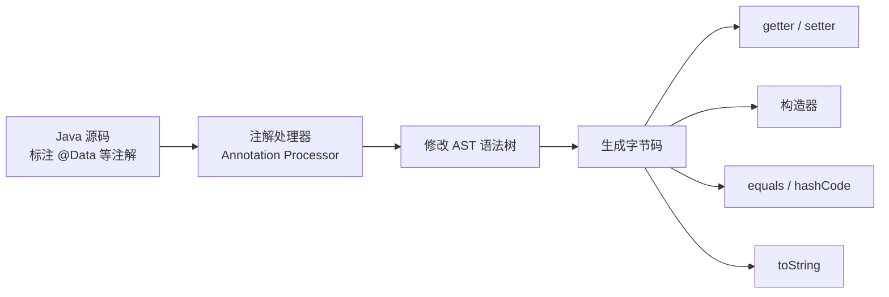
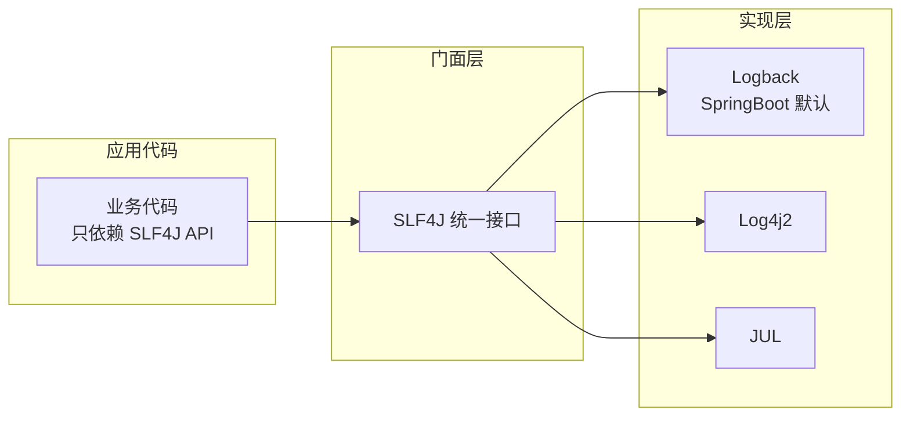
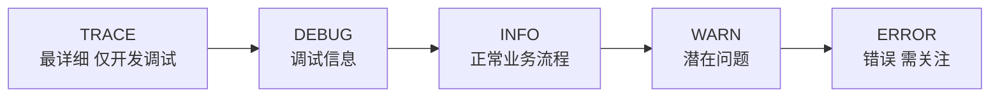
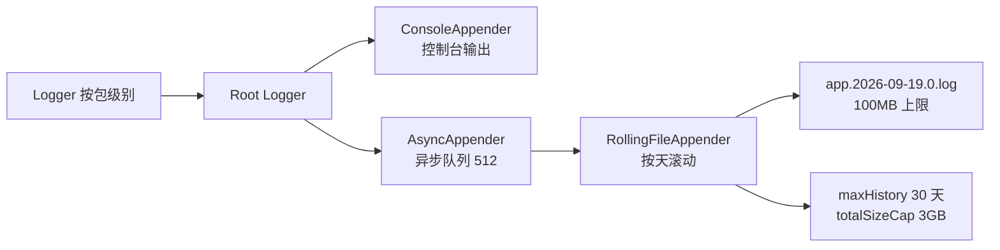
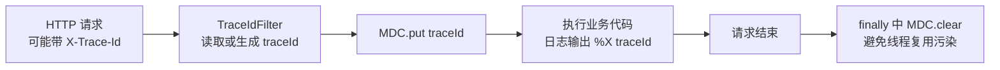

# Lombok 与日志框架 SLF4J + Logback
> 面向 JS + Python 背景开发者。  
> 目标：掌握 Lombok 常用注解、SLF4J + Logback 日志门面与实现、日志配置与最佳实践，横向对比 JS / Python 日志方案。
<!-- more -->
## TL;DR（先看结论）
1. **Lombok 是编译期魔法**：注解处理器在编译时生成 `getter/setter/构造器/equals/hashCode/toString` 字节码，运行时无依赖；`@Data` 一键消除样板，`@Builder` 链式构建，`@RequiredArgsConstructor` 是 Spring 构造器注入的首选写法。
2. **Java 日志 = 门面 + 实现两层**：SLF4J 是门面（代码只依赖它），Logback 是 SpringBoot 默认实现，切换实现零改码；比 JS 的 console/winston/pino、Python 的 logging/loguru 更规范。
3. **日志级别**：`TRACE < DEBUG < INFO < WARN < ERROR`，生产默认 `INFO`，低于级别的日志不输出。
4. **三大铁律**：不用 `System.out.println`；用 `{}` 占位符代替字符串拼接（延迟求值、性能更好）；异常对象作为**最后一个参数**传入以保留堆栈。
5. **`logback-spring.xml` 是标准配置**：控制台 + 按天滚动文件 + `AsyncAppender` 异步队列 + `<springProfile>` 多环境切换；注意它支持 profile，`logback.xml` 不支持。
6. **MDC 打通请求链路**：`MDC.put("traceId", ...)` + 日志格式 `%X{traceId}`，基于 ThreadLocal，务必在 `finally` 中 `MDC.clear()`，异步/线程池会丢失需手动传递。

## 🗺️ 本笔记知识地图

---
## 0. 本笔记重点
作为 JS + Python 开发者，Lombok 和日志框架是 Java 工程化中不可或缺的两块：
1. **Lombok**：通过注解在编译期生成 `getter` / `setter` / `构造器` 等样板代码，类似 Python 的 `@dataclass` / TS 的装饰器。
2. **SLF4J**：日志门面（facade），只提供接口。
3. **Logback**：日志实现，SpringBoot 默认使用。
4. **日志级别**：`TRACE` / `DEBUG` / `INFO` / `WARN` / `ERROR`，比 JS / Python 更规范。
5. **日志配置**：`logback-spring.xml` 是 SpringBoot 项目的标准配置。
6. **日志最佳实践**：不要用 `System.out.println`，不要用字符串拼接，善用占位符。
> 注意：这篇笔记在原本路线里属于阶段 2「工程化能力」的一部分，和 Maven、JUnit 并列。因为内容较独立，单独成篇。
---
## 1. Lombok
> 💡 一句话结论：Lombok 用注解在编译期生成样板代码（getter/setter/构造器/equals/hashCode/toString/Builder/日志对象），运行时零依赖，等价于 Python `@dataclass` 的增强版。
### 1.1 Lombok 是什么
Lombok 是一个 Java 库，通过注解在**编译期**自动生成代码：
- `getter` / `setter`
- 构造器
- `equals` / `hashCode` / `toString`
- 日志对象
- Builder 模式
它通过 **注解处理器（Annotation Processor）** 在编译时修改 AST，生成字节码。

### 1.2 Maven 依赖
```xml
<dependency>
    <groupId>org.projectlombok</groupId>
    <artifactId>lombok</artifactId>
    <version>1.18.30</version>
    <scope>provided</scope>
</dependency>
```
`scope=provided` 表示编译期需要，运行时不打包（因为生成的代码已在字节码中）。
Spring Boot 项目由 `spring-boot-starter-parent` 管理版本，可省去 `<version>`。
### 1.3 IDEA 插件
IDEA 需安装 Lombok 插件，并开启：
```text
Settings → Build → Compiler → Annotation Processors → Enable annotation processing
```
否则 IDEA 会报“找不到 getter”等错误（只是 IDE 索引问题，不影响 Maven 编译）。
### 1.4 常用注解
| 注解 | 作用 |
| --- | --- |
| `@Getter` | 生成 getter |
| `@Setter` | 生成 setter |
| `@ToString` | 生成 toString |
| `@EqualsAndHashCode` | 生成 equals / hashCode |
| `@NoArgsConstructor` | 无参构造器 |
| `@AllArgsConstructor` | 全参构造器 |
| `@RequiredArgsConstructor` | final / `@NonNull` 字段的构造器 |
| `@Data` | 组合：Getter + Setter + ToString + EqualsAndHashCode + RequiredArgsConstructor |
| `@Value` | 不可变版本（字段 final，类 final） |
| `@Builder` | Builder 模式 |
| `@Slf4j` | 注入 `log` 对象 |
| `@NonNull` | 空值检查 |
| `@Cleanup` | 自动关闭资源 |
### 1.5 基础用法
```java
import lombok.Data;

@Data
public class User {
    private String name;
    private int age;
}
```
等价于手写：
```java
public class User {
    private String name;
    private int age;

    public String getName() { return name; }
    public void setName(String name) { this.name = name; }

    public int getAge() { return age; }
    public void setAge(int age) { this.age = age; }

    @Override
    public String toString() { ... }

    @Override
    public boolean equals(Object o) { ... }

    @Override
    public int hashCode() { ... }
}
```
### 1.6 构造器注解
```java
@NoArgsConstructor
@AllArgsConstructor
public class User {
    private String name;
    private int age;
}
```
`@RequiredArgsConstructor` 用于 Spring 依赖注入：
```java
@Service
@RequiredArgsConstructor
public class UserService {
    private final UserRepository userRepository;
    private final EmailService emailService;
    // Lombok 生成：
    // public UserService(UserRepository userRepository, EmailService emailService) { ... }
}
```
这是 Spring 推荐的构造器注入方式，比 `@Autowired` 字段注入更安全。
### 1.7 @Builder
```java
@Builder
@Data
public class User {
    private String name;
    private int age;
    private String email;
}
```
使用：
```java
User user = User.builder()
    .name("lious")
    .age(18)
    .email("lious@example.com")
    .build();
```
### 1.8 @Value
不可变类：
```java
@Value
public class Point {
    int x;
    int y;
}
```
等价于：
- 类 final
- 字段 private final
- 只有 getter，无 setter
- 生成全参构造器
- 生成 `equals` / `hashCode` / `toString`
### 1.9 对比 Python dataclass
```python
from dataclasses import dataclass

@dataclass
class User:
    name: str
    age: int
```
对比：
| 特性 | Java Lombok `@Data` | Python `@dataclass` |
| --- | --- | --- |
| 生成 getter / setter | 是 | 无 setter，字段直接访问 |
| 生成构造器 | 是 | 是 |
| equals / hashCode | 是 | `__eq__`，无 `hashCode` |
| toString | 是 | `__repr__` |
| 不可变版本 | `@Value` | `frozen=True` |
| Builder | `@Builder` | 无内置 |
### 1.10 对比 TypeScript
TS 没有类似 Lombok 的官方机制，需要手写或用装饰器：
```ts
class User {
  constructor(
    public name: string,
    public age: number,
  ) {}
}
```
TS 参数属性（parameter properties）是构造器语法糖，但不如 Lombok 灵活。
### 1.11 对比 JavaScript
JS 完全没有类型和访问控制，也不需要 getter / setter 样板：
```js
class User {
  constructor(name, age) {
    this.name = name;
    this.age = age;
  }
}
```
差异：
- JS 直接操作字段，无需 getter / setter。
- Java 通过 Lombok 消除样板，但字段仍是 private + getter / setter。
- JS 的动态性让“样板”不是问题，但缺少编译期检查。
### 1.12 Lombok 常见坑
1. **Lombok 与 IDE 插件版本不匹配**会导致编译错误。
2. **`@Data` 会生成 `equals` / `hashCode`**，在 JPA 实体中可能引发性能问题（尤其关联关系）。
3. **`@Builder` + `@Data` 组合**会生成无参构造器吗？不会，需显式加 `@NoArgsConstructor`。
4. **`@Builder` 与 `@AllArgsConstructor` 一起用**时，需注意顺序。
5. **不要滥用 `@Data`**，实体类推荐 `@Getter` / `@Setter` 明确意图。
6. **`@Slf4j` 会生成 `log` 字段**，不要手动再声明 `Logger`。
7. **Lombok 生成的代码在 IDE 中不可见**，调试时可能困惑。
8. **`@EqualsAndHashCode` 默认排除 static、transient**，但包含所有普通字段，注意 JPA 实体。
9. **团队协作需统一 Lombok 版本**，否则可能编译失败。
10. **Lombok 是编译期魔法**，部分人主张用 Java record 或手写替代。
### 1.13 Lombok vs Java record
Java 16+ 的 `record` 也能减少样板：
```java
public record User(String name, int age) {}
```
自动生成：
- 全参构造器
- getter（无 `get` 前缀，直接 `name()`）
- `equals` / `hashCode` / `toString`
- 类 final，字段 final
对比：
| 特性 | Lombok `@Data` | Java record |
| --- | --- | --- |
| 可变性 | 可变 | 不可变 |
| setter | 有 | 无 |
| 字段数量 | 任意 | 声明即字段 |
| Builder | 支持 | 需手写 |
| 继承 | 支持 | 不支持 |
| 适用场景 | 实体、DTO | 不可变值对象 |
---
## 2. 日志框架概览
> 💡 一句话结论：Java 日志是「门面 + 实现」两层架构——代码只依赖 SLF4J 门面接口，底层实现（Logback/Log4j2）可随意更换，这是 JS/Python 生态没有的规范。
### 2.1 为什么需要日志框架
不要用 `System.out.println`：
- 无法控制日志级别。
- 无法输出到文件、ELK、Syslog。
- 无法格式化（时间戳、线程名、类名）。
- 性能差，无法异步。
### 2.2 日志门面 vs 日志实现
Java 日志生态有门面和实现两层：
| 层 | 组件 | 作用 |
| --- | --- | --- |
| 门面 | SLF4J、JCL、Log4j API | 提供统一 API |
| 实现 | Logback、Log4j2、JUL | 真正输出日志 |
**SLF4J（Simple Logging Facade for Java）** 是门面，代码只依赖它。  
**Logback** 是 SLF4J 的原生实现，SpringBoot 默认。
好处：
- 更换实现无需改代码。
- 第三方库使用不同门面时，可用桥接统一。

### 2.3 桥接与适配
| 场景 | 组件 |
| --- | --- |
| Log4j 代码迁移到 SLF4J | `log4j-over-slf4j` |
| JUL 代码迁移到 SLF4J | `jul-to-slf4j` |
| JCL 代码迁移到 SLF4J | `jcl-over-slf4j` |
| SLF4J API 转到 Log4j2 | `log4j-slf4j-impl` |
SpringBoot 默认已集成 SLF4J + Logback，无需额外配置。
### 2.4 对比 JS / Python
| 生态 | 门面 / 标准 | 实现 |
| --- | --- | --- |
| Java | SLF4J | Logback / Log4j2 |
| JavaScript | `console` / 自定义 API | `winston` / `pino` / `bunyan` |
| Python | `logging` 标准库 | `logging` / `loguru` |
差异：
- Java 有明确的门面 / 实现分离。
- JS 没有统一门面，各库 API 不同。
- Python `logging` 既是 API 又是实现，`loguru` 是替代品。
---
## 3. SLF4J 使用
> 💡 一句话结论：SLF4J 用法极简——`LoggerFactory.getLogger(X.class)` 获取 logger（或 `@Slf4j`），用 `{}` 占位符记参数、异常作最后一个参数传对象。
### 3.1 获取 Logger
```java
import org.slf4j.Logger;
import org.slf4j.LoggerFactory;

public class UserService {
    private static final Logger log = LoggerFactory.getLogger(UserService.class);

    public void doSomething() {
        log.info("doSomething called");
    }
}
```
Lombok 简化：
```java
import lombok.extern.slf4j.Slf4j;

@Slf4j
public class UserService {
    public void doSomething() {
        log.info("doSomething called");
    }
}
```
### 3.2 日志级别
从低到高：
| 级别 | 用途 |
| --- | --- |
| `TRACE` | 最详细，仅开发调试 |
| `DEBUG` | 调试信息 |
| `INFO` | 正常业务流程 |
| `WARN` | 潜在问题 |
| `ERROR` | 错误，需关注 |
规则：
- 低于配置级别的日志不会输出。
- 生产环境通常 `INFO`。
- 开发环境 `DEBUG`。

### 3.3 占位符（重点）
**推荐**：
```java
log.info("User {} logged in from {}", username, ip);
```
**不推荐**：
```java
log.info("User " + username + " logged in from " + ip);
```
原因：
- 占位符是延迟求值，低于级别时不拼接字符串，性能更好。
- 代码更简洁，避免字符串拼接错误。
### 3.4 异常日志
```java
try {
    doSomething();
} catch (Exception e) {
    log.error("doSomething failed", e);
}
```
注意：
- **异常对象作为最后一个参数**，不加占位符。
- 不要写 `log.error("error: " + e.getMessage())`，会丢失堆栈。
### 3.5 条件日志
```java
if (log.isDebugEnabled()) {
    log.debug("Expensive: {}", computeExpensiveString());
}
```
现代 SLF4J 已优化占位符，一般不需要手动判断，除非参数计算昂贵。
### 3.6 对比 JS
winston：
```js
const winston = require("winston");

const logger = winston.createLogger({
  level: "info",
  format: winston.format.json(),
  transports: [new winston.transports.Console()],
});

logger.info("User %s logged in", username);
logger.error("Failed", { error: e });
```
pino：
```js
const pino = require("pino");

const logger = pino({ level: "info" });

logger.info({ user: username }, "logged in");
logger.error({ err: e }, "failed");
```
### 3.7 对比 Python
标准库：
```python
import logging

logger = logging.getLogger(__name__)
logger.setLevel(logging.INFO)

logger.info("User %s logged in from %s", username, ip)
logger.error("Failed", exc_info=True)
```
loguru：
```python
from loguru import logger

logger.info("User {} logged in from {}", username, ip)
logger.exception("Failed")
```
差异：
- Java 推荐用 `{}` 占位符。
- Python `logging` 用 `%s`，`loguru` 用 `{}`。
- JS 的 winston 用 `%s`，pino 用对象。
- Java 的异常必须作为最后一个参数传递，不能拼接。
---
## 4. Logback 配置
> 💡 一句话结论：`logback-spring.xml` 是标准配置——控制台 + 按天滚动文件 + `AsyncAppender` 异步队列 + `<springProfile>` 多环境，生产环境必须异步 + 滚动。
### 4.1 SpringBoot 默认
SpringBoot 默认：
- 输出到控制台。
- 使用 `logback-spring.xml`（推荐）或 `logback.xml`。
- 日志级别：`INFO`。
### 4.2 application.yml 简单配置
```yaml
logging:
  level:
    root: INFO
    com.example.demo: DEBUG
  file:
    name: logs/app.log
  pattern:
    console: "%d{yyyy-MM-dd HH:mm:ss} [%thread] %-5level %logger{36} - %msg%n"
```
### 4.3 logback-spring.xml
完整配置示例：
```xml
<?xml version="1.0" encoding="UTF-8"?>
<configuration>
    <!-- 引入 SpringBoot 默认配置 -->
    <include resource="org/springframework/boot/logging/logback/defaults.xml"/>

    <property name="LOG_HOME" value="logs"/>
    <property name="APP_NAME" value="demo"/>

    <!-- 控制台输出 -->
    <appender name="CONSOLE" class="ch.qos.logback.core.ConsoleAppender">
        <encoder>
            <pattern>%d{yyyy-MM-dd HH:mm:ss.SSS} [%thread] %-5level %logger{36} - %msg%n</pattern>
            <charset>UTF-8</charset>
        </encoder>
    </appender>

    <!-- 文件输出 -->
    <appender name="FILE" class="ch.qos.logback.core.rolling.RollingFileAppender">
        <file>${LOG_HOME}/${APP_NAME}.log</file>
        <rollingPolicy class="ch.qos.logback.core.rolling.TimeBasedRollingPolicy">
            <fileNamePattern>${LOG_HOME}/${APP_NAME}.%d{yyyy-MM-dd}.%i.log</fileNamePattern>
            <timeBasedFileNamingAndTriggeringPolicy
                class="ch.qos.logback.core.rolling.SizeAndTimeBasedFNATP">
                <maxFileSize>100MB</maxFileSize>
            </timeBasedFileNamingAndTriggeringPolicy>
            <maxHistory>30</maxHistory>
            <totalSizeCap>3GB</totalSizeCap>
        </rollingPolicy>
        <encoder>
            <pattern>%d{yyyy-MM-dd HH:mm:ss.SSS} [%thread] %-5level %logger{36} - %msg%n</pattern>
            <charset>UTF-8</charset>
        </encoder>
    </appender>

    <!-- 异步输出 -->
    <appender name="ASYNC_FILE" class="ch.qos.logback.classic.AsyncAppender">
        <appender-ref ref="FILE"/>
        <queueSize>512</queueSize>
        <discardingThreshold>0</discardingThreshold>
    </appender>

    <!-- 按包设置级别 -->
    <logger name="com.example.demo" level="DEBUG"/>
    <logger name="org.springframework" level="WARN"/>

    <!-- 根日志 -->
    <root level="INFO">
        <appender-ref ref="CONSOLE"/>
        <appender-ref ref="ASYNC_FILE"/>
    </root>
</configuration>
```
### 4.4 日志格式说明
| 占位符 | 含义 |
| --- | --- |
| `%d` | 日期时间 |
| `%thread` | 线程名 |
| `%-5level` | 日志级别，左对齐 5 字符 |
| `%logger{36}` | Logger 名，最多 36 字符 |
| `%msg` | 日志消息 |
| `%n` | 换行 |
| `%X{key}` | MDC 中的值 |
### 4.5 滚动策略
- `TimeBasedRollingPolicy`：按时间滚动。
- `SizeAndTimeBasedRollingPolicy`：按时间和大小滚动。
- `maxHistory`：保留天数。
- `totalSizeCap`：总大小上限。

### 4.6 异步日志
`AsyncAppender` 将日志写入队列，由独立线程写文件，减少业务线程阻塞。
注意：
- 队列满时默认丢弃 `TRACE` / `DEBUG` / `INFO`。
- 设置 `discardingThreshold=0` 可禁用丢弃。
- 应用关闭时需确保日志刷盘。
### 4.7 多环境配置
`logback-spring.xml` 支持 Spring Profile：
```xml
<springProfile name="dev">
    <root level="DEBUG">
        <appender-ref ref="CONSOLE"/>
    </root>
</springProfile>

<springProfile name="prod">
    <root level="INFO">
        <appender-ref ref="ASYNC_FILE"/>
    </root>
</springProfile>
```
注意：`logback-spring.xml` 支持 `<springProfile>`，`logback.xml` 不支持。
### 4.8 对比 JS / Python 日志配置
winston：
```js
const logger = winston.createLogger({
  level: "info",
  format: winston.format.combine(
    winston.format.timestamp(),
    winston.format.json(),
  ),
  transports: [
    new winston.transports.Console(),
    new winston.transports.File({ filename: "app.log" }),
  ],
});
```
Python：
```python
import logging
from logging.handlers import TimedRotatingFileHandler

handler = TimedRotatingFileHandler("app.log", when="midnight", backupCount=30)
formatter = logging.Formatter("%(asctime)s [%(threadName)s] %(levelname)s %(name)s - %(message)s")
handler.setFormatter(formatter)
logging.basicConfig(level=logging.INFO, handlers=[handler])
```
差异：
- Java Logback 用 XML 配置，更声明式。
- JS / Python 通常用代码配置。
- Java 的异步日志、滚动策略开箱即用。
- Python `logging` 也支持滚动，但配置更繁琐。
---
## 5. MDC（Mapped Diagnostic Context）
> 💡 一句话结论：MDC 是 SLF4J 的线程本地上下文，配合 `%X{traceId}` 在日志中打通请求链路；基于 ThreadLocal，请求结束必须 `finally` 中 `MDC.clear()`。
### 5.1 MDC 是什么
MDC 是 SLF4J 提供的**线程本地**上下文，用于在日志中附加请求 ID、用户 ID 等：
```java
import org.slf4j.MDC;

MDC.put("traceId", UUID.randomUUID().toString());
log.info("Processing request");
MDC.clear();
```
日志格式中加入 `%X{traceId}`：
```text
%d [%thread] %-5level [%X{traceId}] %logger - %msg%n
```
输出：
```text
2026-09-18 10:00:00 [http-nio-8080-exec-1] INFO [abc-123] UserService - Processing request
```

### 5.2 Web 项目中的用法
通常用 Filter / Interceptor 统一设置：
```java
@Component
public class TraceIdFilter extends OncePerRequestFilter {
    @Override
    protected void doFilterInternal(HttpServletRequest request,
                                    HttpServletResponse response,
                                    FilterChain chain) throws ServletException, IOException {
        String traceId = request.getHeader("X-Trace-Id");
        if (traceId == null) {
            traceId = UUID.randomUUID().toString();
        }
        MDC.put("traceId", traceId);
        try {
            chain.doFilter(request, response);
        } finally {
            MDC.clear();
        }
    }
}
```
### 5.3 注意
- MDC 基于 `ThreadLocal`，异步 / 线程池中会丢失。
- 使用 `@Async` 或线程池时需手动传递。
- 请求结束务必 `MDC.clear()`，避免污染线程复用。
### 5.4 对比 JS / Python
- **JS**：pino 通过 `child logger` 传递上下文。
- **Python**：`logging.LoggerAdapter` 或 loguru 的 `bind`。
- **Java**：MDC + `%X{}` 是标准做法。
---
## 6. 日志最佳实践
> 💡 一句话结论：SLF4J + 占位符 + 合理级别 + 敏感信息脱敏 + 异步滚动 + traceId 链路，是生产级日志的完整清单。
1. **不要用 `System.out.println`**，用 SLF4J。
2. **使用占位符**，不要字符串拼接。
3. **异常作为最后一个参数**，保留堆栈。
4. **合理选择级别**：
   - 正常流程：`INFO`
   - 调试：`DEBUG`
   - 潜在问题：`WARN`
   - 错误：`ERROR`
5. **不要记录敏感信息**：密码、身份证、Token。
6. **避免大日志**：大对象 `toString` 可能拖慢性能。
7. **异步 + 滚动**：生产环境必须配置。
8. **请求链路**：用 MDC 记录 traceId。
9. **合理使用 `isDebugEnabled`**：仅在参数计算昂贵时。
10. **统一日志格式**：便于 ELK / Loki 采集。
### 6.1 对比 JS / Python
- **JS**：pino 性能最好，winston 更灵活。
- **Python**：loguru 简洁，标准 `logging` 更通用。
- **Java**：SLF4J + Logback 是事实标准，配置更强。
---
## 7. 常见坑点
> 💡 一句话结论：Lombok 的坑集中在 IDE 注解处理与 `@Data` 副作用；日志的坑集中在丢堆栈、性能差与线程上下文污染。
### Lombok
1. **IDE 未启用注解处理**，报“找不到方法”。
2. **`@Data` 用在 JPA 实体上**，`equals` / `hashCode` 可能引发懒加载问题。
3. **`@Builder` 未加 `@NoArgsConstructor`**，Jackson 反序列化失败。
4. **`@RequiredArgsConstructor` 字段必须 `final`** 或 `@NonNull`。
5. **团队 Lombok 版本不一致**，编译失败。
6. **`@Slf4j` 后不要再声明 `Logger`**，冲突。
### 日志
7. **`log.error("error: " + e)`** 丢失堆栈，应写 `log.error("error", e)`。
8. **`log.info("User " + user)`** 性能差，应写占位符。
9. **`logback.xml` 与 `logback-spring.xml` 不要同时存在**，后者优先。
10. **异步日志队列满会丢日志**，注意 `discardingThreshold`。
11. **`MDC.clear()` 必须放在 finally**，否则线程复用会污染。
12. **日志文件权限问题**，容器中尤其注意。
13. **生产环境不要 `DEBUG` 打全量日志**，磁盘会爆。
---
## 8. 小结
### Lombok
| 概念 | Java Lombok | Python | TypeScript | JavaScript |
| --- | --- | --- | --- | --- |
| 样板消除 | 注解 | `@dataclass` | 参数属性 | 无需 |
| 不可变 | `@Value` | `frozen=True` | `readonly` | 无 |
| Builder | `@Builder` | 无内置 | 无 | 无 |
| 编译期生成 | 是 | 是 | 是 | 无 |
| 运行时依赖 | 无 | 无 | 无 | 无 |
### 日志
| 概念 | Java | JavaScript | Python |
| --- | --- | --- | --- |
| 门面 | SLF4J | 无统一 | 无 |
| 实现 | Logback / Log4j2 | winston / pino | logging / loguru |
| 配置 | `logback-spring.xml` | 代码 | 代码 |
| 占位符 | `{}` | `%s` / 对象 | `%s` / `{}` |
| 异常 | 最后参数 | 对象属性 | `exc_info` |
| 上下文 | MDC | child logger | LoggerAdapter / bind |
| 异步 | AsyncAppender | 内置 | QueueHandler |
---
## 9. 练习建议
1. 用 Lombok 改写之前的 `User` 类，对比代码量。
2. 用 `@Builder` 创建对象，感受链式 API。
3. 用 `@RequiredArgsConstructor` 实现 Spring 构造器注入。
4. 用 `@Slf4j` 注入 logger，写几条不同级别的日志。
5. 配置 `logback-spring.xml`，输出到控制台 + 文件，按天滚动。
6. 配置异步日志，观察吞吐变化。
7. 用 MDC 记录 traceId，配合 Filter 打印请求日志。
8. 用 winston / loguru 实现同样日志输出，横向对比。
---
## 10. 下一篇
下一篇：**Spring 快速入门：IoC、DI、AOP、Bean**。  
再往后才是 **SpringBoot 快速入门**，以及 Web 核心：**REST / 参数校验 / JSON 序列化**。
