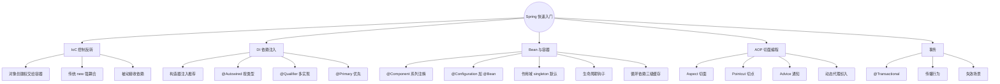
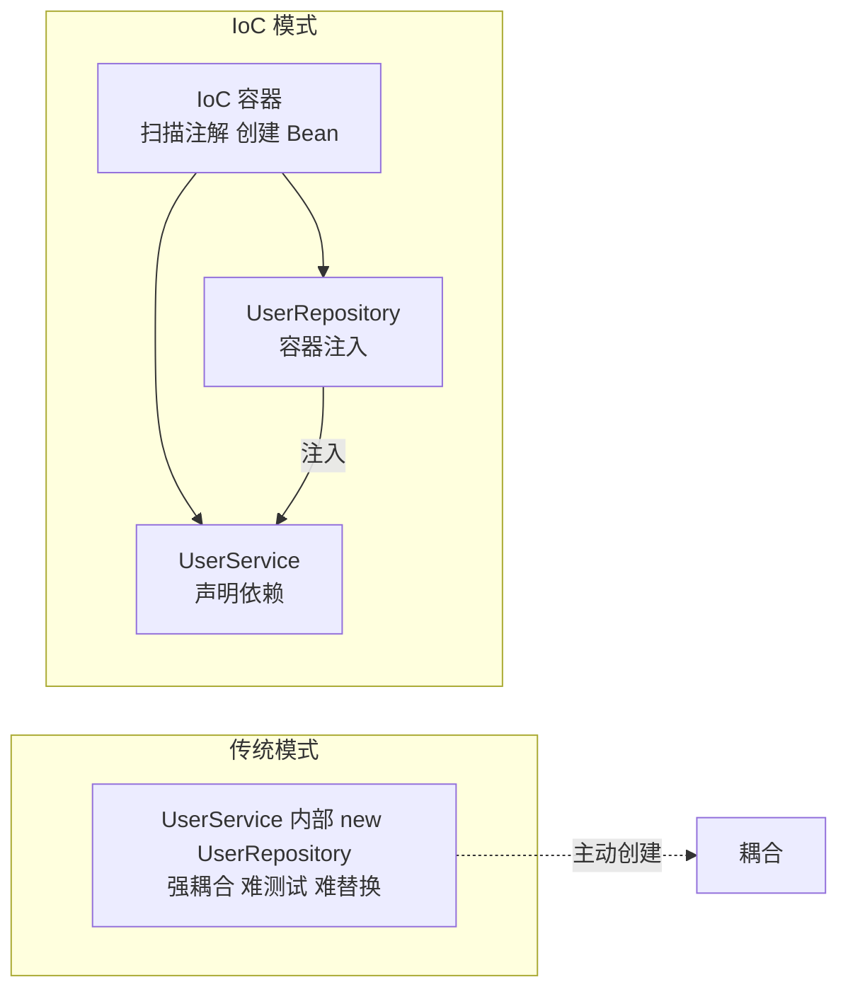
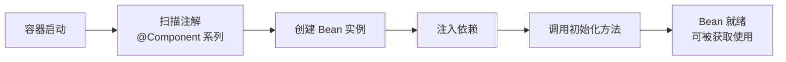
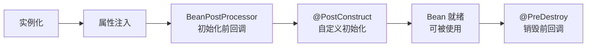
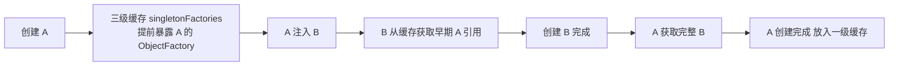
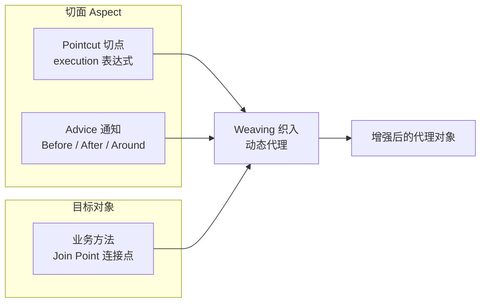

# Spring 快速入门：IoC、DI、AOP、Bean
> 面向 JS + Python 背景开发者。  
> 目标：理解 Spring 框架核心思想，掌握 IoC / DI / AOP / Bean 生命周期，为学习 SpringBoot 打基础，横向对比 JS / Python 的依赖管理方式。
<!-- more -->
## TL;DR（先看结论）
1. **IoC（控制反转）**：对象创建权交给容器，代码不再 `new`；容器启动时「扫描注解 → 创建 Bean → 注入依赖 → 就绪」，这就是 SpringBoot 一切开箱即用的地基。
2. **DI（依赖注入）**：构造器注入最推荐（`final` 不可变 + 非空保证 + 易测试）；`@Autowired` 按类型注入，多实现用 `@Qualifier` / `@Primary`；字段注入不推荐。
3. **Bean = 被容器管理的对象**：`@Component` / `@Service` / `@Repository` / `@Controller` 四种声明（后三者是前者特化），第三方类用 `@Configuration` + `@Bean` 声明。
4. **默认 `singleton` 单例**，作用域还有 prototype/request/session；生命周期钩子 `@PostConstruct` / `@PreDestroy`；循环依赖靠**三级缓存**解决，SpringBoot 2.6+ 默认禁止需显式开启。
5. **AOP 解耦横切逻辑**（日志/事务/权限），基于**动态代理**运行时织入，`@Aspect` + `@Around` 最常用；`@Transactional` 就是 AOP 的典型应用。
6. **生态对照**：NestJS 内置容器级 DI（最接近 Spring）、FastAPI 用函数级 `Depends`、Express 无 IoC 手动管理；Spring 独有 Bean 生命周期管理与声明式事务。

## 🗺️ 本笔记知识地图

---
## 0. 本笔记重点
SpringBoot 是 Spring 的封装，不理解 Spring 就无法真正理解 SpringBoot。作为 JS + Python 开发者，核心需要吃透：
1. **IoC（控制反转）**：对象的创建权交给容器，而不是代码 `new`。
2. **DI（依赖注入）**：容器把依赖“注入”到对象中。
3. **Bean**：被 Spring 容器管理的对象。
4. **注解配置**：`@Component`、`@Service`、`@Repository`、`@Controller`。
5. **AOP（面向切面编程）**：横切逻辑（日志、事务、权限）与业务逻辑解耦。
6. **Bean 生命周期与作用域**：理解单例、原型、请求作用域。
7. **对比 JS / Python**：Express 无 IoC，NestJS 有类似 DI，FastAPI 用 `Depends`。
---
## 1. Spring 是什么
> 💡 一句话结论：Spring 是轻量级企业级框架，核心是 IoC 容器 + AOP + 生态集成；SpringBoot 是其脚手架封装，可先用 SpringBoot 再回头理解底层。
### 1.1 一句话概括
Spring 是一个**轻量级 Java 企业级开发框架**，核心是：
- **IoC 容器**：管理对象的创建与依赖。
- **AOP**：横切关注点与业务逻辑解耦。
- **集成生态**：整合 JDBC、事务、缓存、消息等。
### 1.2 Spring 发展史
| 版本 | 关键特性 |
| --- | --- |
| Spring 1.x | IoC、AOP，XML 配置 |
| Spring 2.x | 注解支持、`@Autowired` |
| Spring 3.x | Java Config、`@Configuration` |
| Spring 4.x | Java 8 支持、条件注解 |
| Spring 5.x | WebFlux、响应式 |
| Spring 6.x | Java 17+、AOT、`@Nullable` |
| SpringBoot | 自动配置、内嵌容器、starter |
| Spring Cloud | 微服务生态 |
### 1.3 Spring vs SpringBoot
| 维度 | Spring | SpringBoot |
| --- | --- | --- |
| 定位 | 框架 | 脚手架 |
| 配置 | 手动（XML / Java Config） | 自动配置 |
| 容器 | 外部 Tomcat | 内嵌 Tomcat |
| 依赖 | 手动引入 | starter |
| 启动 | 部署 war | `java -jar` |
| 学习 | 先学 Spring | 可先用后学 |
> 建议：先用 SpringBoot 跑通 Web，再回头理解 Spring 底层。
### 1.4 对比 JS / Python 框架
| 框架 | 语言 | IoC / DI | AOP |
| --- | --- | --- | --- |
| Spring | Java | 内置 | 内置 |
| Express | JS | 无 | 中间件 |
| NestJS | TS | 内置 | 拦截器 / 守卫 |
| FastAPI | Python | `Depends` | 中间件 |
| Flask | Python | 无 | 装饰器 |
| Django | Python | 无 | 中间件 |
---
## 2. IoC：控制反转
> 💡 一句话结论：IoC 就是把「谁 new 对象」的控制权从代码反转给容器——代码声明需求，容器负责创建与装配，从而解耦、可测、可替换。
### 2.1 传统写法
没有 IoC 时，对象自己创建依赖：
```java
public class UserService {
    private UserRepository userRepository = new UserRepository();
}
```
问题：
- 强耦合：`UserService` 依赖 `UserRepository` 具体实现。
- 难以测试：无法替换 Mock。
- 难以复用：更换实现需改代码。
### 2.2 IoC 写法
容器负责创建对象，`UserService` 不关心依赖从哪来：
```java
@Service
public class UserService {
    private final UserRepository userRepository;

    public UserService(UserRepository userRepository) {
        this.userRepository = userRepository;
    }
}
```
调用方只需从容器获取 `UserService`：
```java
UserService userService = context.getBean(UserService.class);
```
### 2.3 控制反转的含义
- **传统**：代码控制对象创建（主动 `new`）。
- **IoC**：容器控制对象创建（被动接收）。
这就是“控制反转”的由来。

### 2.4 对比 NestJS DI
NestJS 有内置 DI 容器：
```ts
@Injectable()
export class UserService {
  constructor(private userRepository: UserRepository) {}
}
```
### 2.5 对比 FastAPI Depends
```python
from fastapi import Depends

def get_user_repository():
    return UserRepository()

@app.get("/users")
def get_users(repo: UserRepository = Depends(get_user_repository)):
    return repo.find_all()
```
差异：
- FastAPI 的 `Depends` 是函数级依赖注入。
- Spring / NestJS 是容器级 DI，管理对象生命周期。
- Express 无 DI，需手动引入。
---
## 3. Bean 与容器
> 💡 一句话结论：Bean 是被容器管理的对象；容器启动时「扫描 → 创建 → 注入 → 初始化 → 就绪」，`@Component` 系列注解声明 Bean，`@Configuration` + `@Bean` 声明第三方类。
### 3.1 Bean 是什么
Bean = 被 Spring 容器管理的对象。
容器启动时：
1. 扫描注解。
2. 创建 Bean 实例。
3. 注入依赖。
4. 调用初始化方法。
5. Bean 就绪。

### 3.2 容器类型
| 容器 | 说明 |
| --- | --- |
| `BeanFactory` | 基础容器，懒加载 |
| `ApplicationContext` | 高级容器，启动时预加载 |
`ApplicationContext` 是常用接口，常见实现：
- `AnnotationConfigApplicationContext`：注解配置。
- `ClassPathXmlApplicationContext`：XML 配置。
- `SpringApplication`：SpringBoot 启动。
### 3.3 声明 Bean 的注解
| 注解 | 用途 | 层次 |
| --- | --- | --- |
| `@Component` | 通用组件 | 任意 |
| `@Service` | 业务逻辑 | Service |
| `@Repository` | 数据访问 | DAO |
| `@Controller` | Web 控制器 | 表现层 |
| `@RestController` | REST 控制器 | 表现层 |
| `@Configuration` | 配置类 | 配置 |
| `@Bean` | 方法返回 Bean | 配置类中 |
`@Service`、`@Repository`、`@Controller` 都是 `@Component` 的特化，仅语义不同。
### 3.4 示例
```java
@Repository
public class UserRepository {
    public User findById(Long id) {
        // ...
        return null;
    }
}

@Service
public class UserService {
    private final UserRepository userRepository;

    public UserService(UserRepository userRepository) {
        this.userRepository = userRepository;
    }

    public String getUserName(Long id) {
        User user = userRepository.findById(id);
        return user == null ? "unknown" : user.getName();
    }
}
```
### 3.5 @Configuration + @Bean
第三方类的 Bean 无法加 `@Component`，用 `@Bean` 声明：
```java
@Configuration
public class AppConfig {
    @Bean
    public ObjectMapper objectMapper() {
        ObjectMapper mapper = new ObjectMapper();
        mapper.registerModule(new JavaTimeModule());
        return mapper;
    }
}
```
### 3.6 对比 JS / Python
- **NestJS**：`@Injectable()`、`@Module({ providers })`。
- **FastAPI**：`Depends` 函数，无显式 Bean 概念。
- **Express**：无容器，手动管理。
- **Python**：`dependency-injector` 库可模拟。
- **Spring**：`@Component` 系列 + 容器统一管理。
---
## 4. 依赖注入（DI）
> 💡 一句话结论：构造器注入最推荐（final + 非空 + 可测）；`@Autowired` 按类型注入、可配 `@Qualifier`/`@Primary`；字段注入隐藏依赖不可取。
### 4.1 三种注入方式
**方式一：构造器注入（推荐）**
```java
@Service
public class UserService {
    private final UserRepository userRepository;

    public UserService(UserRepository userRepository) {
        this.userRepository = userRepository;
    }
}
```
优点：
- 依赖不可变（`final`）。
- 依赖不为空。
- 便于测试。
**方式二：Setter 注入**
```java
@Service
public class UserService {
    private UserRepository userRepository;

    @Autowired
    public void setUserRepository(UserRepository userRepository) {
        this.userRepository = userRepository;
    }
}
```
适合可选依赖。
**方式三：字段注入（不推荐）**
```java
@Service
public class UserService {
    @Autowired
    private UserRepository userRepository;
}
```
问题：
- 无法 `final`。
- 隐藏依赖。
- 难以测试（不通过容器时无法注入）。
### 4.2 @Autowired
- 按类型注入。
- 多个同类型 Bean 时需配合 `@Qualifier`。
- Spring 4.3+ 单构造器可省略 `@Autowired`。
### 4.3 @Qualifier
```java
@Service
public class UserService {
    private final PaymentService paymentService;

    public UserService(@Qualifier("alipayService") PaymentService paymentService) {
        this.paymentService = paymentService;
    }
}
```
### 4.4 @Primary
```java
@Service
@Primary
public class AlipayService implements PaymentService {}
```
默认选择 `@Primary` 标记的 Bean。
### 4.5 Lombok 简化
```java
@Service
@RequiredArgsConstructor
public class UserService {
    private final UserRepository userRepository;
    private final EmailService emailService;
}
```
Lombok 自动生成包含所有 `final` 字段的构造器。
### 4.6 对比 NestJS / FastAPI
**NestJS**：
```ts
@Injectable()
export class UserService {
  constructor(
    private readonly userRepository: UserRepository,
    private readonly emailService: EmailService,
  ) {}
}
```
**FastAPI**：
```python
def get_user_service(
    repo: UserRepository = Depends(get_user_repository),
) -> UserService:
    return UserService(repo)

@app.get("/users")
def get_users(service: UserService = Depends(get_user_service)):
    return service.list()
```
差异：
- Spring 用构造器 + 注解注入。
- NestJS 用构造器 + 类型元数据。
- FastAPI 用 `Depends` 函数。
- Spring 的注入基于类型，可配合 `@Qualifier` / `@Primary`。
---
## 5. Bean 作用域与生命周期
> 💡 一句话结论：默认 singleton 单例（注意线程安全）；生命周期有完整回调链（`@PostConstruct` 初始化 / `@PreDestroy` 销毁）；循环依赖靠三级缓存，SpringBoot 2.6+ 默认禁止。
### 5.1 作用域
| 作用域 | 说明 |
| --- | --- |
| `singleton` | 默认，容器中只有一个实例 |
| `prototype` | 每次获取创建新实例 |
| `request` | 每个 HTTP 请求一个实例 |
| `session` | 每个 HTTP Session 一个实例 |
| `application` | 每个 ServletContext 一个实例 |
| `websocket` | 每个 WebSocket 一个实例 |
示例：
```java
@Component
@Scope("prototype")
public class Task {}
```
### 5.2 生命周期
```text
实例化 → 属性注入 → BeanNameAware → BeanFactoryAware
→ ApplicationContextAware → BeanPostProcessor.postProcessBeforeInitialization
→ @PostConstruct → InitializingBean.afterPropertiesSet → init-method
→ BeanPostProcessor.postProcessAfterInitialization
→ Bean 就绪
→ @PreDestroy → DisposableBean.destroy → destroy-method
```

常用：
- `@PostConstruct`：初始化后执行。
- `@PreDestroy`：销毁前执行。
```java
@Component
public class MyBean {
    @PostConstruct
    public void init() {
        System.out.println("init");
    }

    @PreDestroy
    public void destroy() {
        System.out.println("destroy");
    }
}
```
### 5.3 循环依赖
A 依赖 B，B 依赖 A：
```java
@Service
public class A {
    @Autowired private B b;
}

@Service
public class B {
    @Autowired private A a;
}
```
Spring 用**三级缓存**解决：
- `singletonObjects`：成品 Bean。
- `earlySingletonObjects`：早期引用。
- `singletonFactories`：ObjectFactory。

SpringBoot 2.6+ 默认禁止循环依赖，需显式开启：
```yaml
spring:
  main:
    allow-circular-references: true
```
或重构代码消除循环依赖。
### 5.4 对比
- **NestJS**：`Scope.DEFAULT` / `REQUEST` / `TRANSIENT`。
- **FastAPI**：默认每次请求创建依赖，可缓存。
- **JS 模块**：ES Module 天然单例。
- **Python**：模块级对象天然单例。
---
## 6. AOP：面向切面编程
> 💡 一句话结论：AOP 把日志/事务/权限等横切逻辑从业务中抽离，基于动态代理在运行时织入——`@Aspect` 定义切面、`execution` 表达式定义切点、`@Around` 最强通知。
### 6.1 为什么需要 AOP
日志、事务、权限等逻辑横跨多个方法：
```java
public void transfer() {
    log.info("start");
    checkPermission();
    try {
        beginTransaction();
        // 业务逻辑
        commit();
    } catch (Exception e) {
        rollback();
        throw e;
    }
    log.info("end");
}
```
这些横切逻辑与业务无关，AOP 将其抽离。
### 6.2 核心概念
| 概念 | 说明 |
| --- | --- |
| Aspect | 切面，横切逻辑的模块 |
| Join Point | 连接点，可被增强的方法 |
| Pointcut | 切点，匹配 Join Point 的表达式 |
| Advice | 通知，增强逻辑（Before / After / Around） |
| Weaving | 织入，把切面应用到目标对象 |

### 6.3 示例
```java
@Aspect
@Component
public class LoggingAspect {
    private static final Logger log = LoggerFactory.getLogger(LoggingAspect.class);

    @Around("execution(* com.example.demo.service.*.*(..))")
    public Object logAround(ProceedingJoinPoint joinPoint) throws Throwable {
        String method = joinPoint.getSignature().toShortString();
        log.info("Enter: {}", method);
        try {
            Object result = joinPoint.proceed();
            log.info("Exit: {}", method);
            return result;
        } catch (Throwable e) {
            log.error("Exception in {}: {}", method, e.getMessage());
            throw e;
        }
    }
}
```
### 6.4 通知类型
| 通知 | 说明 |
| --- | --- |
| `@Before` | 方法执行前 |
| `@After` | 方法执行后（finally） |
| `@AfterReturning` | 正常返回后 |
| `@AfterThrowing` | 抛异常后 |
| `@Around` | 环绕，最强大 |
### 6.5 切点表达式
```java
execution(* com.example.demo.service.*.*(..))
```
含义：
- `*`：任意返回类型。
- `com.example.demo.service`：包。
- `*`：任意类。
- `*`：任意方法。
- `(..)`：任意参数。
### 6.6 典型应用
- **事务**：`@Transactional` 基于 AOP。
- **日志**：统一记录请求 / 响应。
- **权限**：`@PreAuthorize`。
- **缓存**：`@Cacheable`。
- **重试**：`@Retryable`。
- **性能监控**：方法耗时统计。
### 6.7 对比 JS / Python
**Express 中间件**：
```js
app.use((req, res, next) => {
  console.log("before");
  next();
  console.log("after");
});
```
**NestJS 拦截器**：
```ts
@Injectable()
export class LoggingInterceptor implements NestInterceptor {
  intercept(context: ExecutionContext, next: CallHandler) {
    console.log("before");
    return next.handle().pipe(tap(() => console.log("after")));
  }
}
```
**FastAPI 中间件**：
```python
@app.middleware("http")
async def log_middleware(request: Request, call_next):
    print("before")
    response = await call_next(request)
    print("after")
    return response
```
**Python 装饰器**：
```python
def log_decorator(func):
    def wrapper(*args, **kwargs):
        print("before")
        result = func(*args, **kwargs)
        print("after")
        return result
    return wrapper

@log_decorator
def do_something():
    pass
```
差异：
- Spring AOP 基于**动态代理**，运行时织入。
- Python 装饰器是语法级，编译期（定义时）织入。
- JS 中间件仅限 HTTP 请求链路。
- NestJS 拦截器类似 AOP，但限于 Nest 生命周期。
---
## 7. Spring 事务（AOP 典型应用）
> 💡 一句话结论：`@Transactional` 基于 AOP 实现声明式事务——标注即生效、异常自动回滚；但要警惕同类内部调用、catch 吞异常、非 public 方法等失效场景。
### 7.1 @Transactional
```java
@Service
public class UserService {
    @Transactional
    public void transfer(Long from, Long to, BigDecimal amount) {
        // 扣款、加款，异常自动回滚
    }
}
```
### 7.2 关键属性
| 属性 | 说明 |
| --- | --- |
| `propagation` | 传播行为，默认 `REQUIRED` |
| `isolation` | 隔离级别，默认 `DEFAULT` |
| `timeout` | 超时时间 |
| `readOnly` | 只读事务 |
| `rollbackFor` | 指定异常回滚 |
### 7.3 传播行为
| 传播 | 说明 |
| --- | --- |
| `REQUIRED` | 有事务则加入，无则新建（默认） |
| `REQUIRES_NEW` | 总是新建事务 |
| `SUPPORTS` | 有则加入，无则非事务执行 |
| `NOT_SUPPORTED` | 非事务执行，挂起当前事务 |
| `MANDATORY` | 必须在事务中，否则抛异常 |
| `NEVER` | 不能在事务中 |
| `NESTED` | 嵌套事务（保存点） |
### 7.4 事务失效场景
1. **方法非 `public`**。
2. **同类内部调用**（不走代理）。
3. **异常被 catch 未抛出**。
4. **抛出受检异常未配置 `rollbackFor`**。
5. **数据库引擎不支持事务**（如 MyISAM）。
6. **多线程调用**，事务不传播。
### 7.5 对比
- **NestJS**：`@Transaction()` + TypeORM `QueryRunner`。
- **FastAPI**：SQLAlchemy `Session` 事务。
- **Django**：`transaction.atomic()`。
- **Spring**：声明式 `@Transactional`，底层 AOP。
---
## 8. 常用注解速查
> 💡 一句话结论：一张表记住 Spring 常用注解——声明 Bean（Component 系列）、注入（Autowired/Qualifier/Primary）、生命周期（PostConstruct/PreDestroy）、切面（Aspect/Advice）、事务（Transactional）。
| 注解 | 作用 |
| --- | --- |
| `@Component` | 通用组件 |
| `@Service` | 业务层 |
| `@Repository` | 数据层 |
| `@Controller` | 控制器 |
| `@RestController` | REST 控制器 |
| `@Configuration` | 配置类 |
| `@Bean` | 声明 Bean |
| `@Autowired` | 自动注入 |
| `@Qualifier` | 指定 Bean 名 |
| `@Primary` | 优先注入 |
| `@Scope` | 作用域 |
| `@PostConstruct` | 初始化 |
| `@PreDestroy` | 销毁 |
| `@Value` | 注入配置值 |
| `@ConfigurationProperties` | 注入配置对象 |
| `@Aspect` | 切面 |
| `@Around` / `@Before` / `@After` | 通知 |
| `@Transactional` | 事务 |
| `@ComponentScan` | 组件扫描 |
| `@Import` | 导入配置 |
---
## 9. 常见坑点
> 💡 一句话结论：字段注入、循环依赖、同类自调用事务失效、new 出的对象 AOP 不生效，是 Spring 新手四大高频坑。
1. **字段注入不推荐**，用构造器注入。
2. **`@Autowired` 按类型注入**，多实现需 `@Qualifier`。
3. **单例 Bean 不要持有可变状态**，会有线程安全问题。
4. **循环依赖尽量避免**，`allow-circular-references` 只是临时方案。
5. **`@Transactional` 同类内部调用失效**，需通过代理对象调用。
6. **AOP 只对 Spring 管理的 Bean 生效**，`new` 出来的对象不生效。
7. **`@PostConstruct` 不要做耗时操作**，会阻塞启动。
8. **`@Value` 无法注入复杂对象**，用 `@ConfigurationProperties`。
9. **`@ComponentScan` 默认扫描启动类所在包及子包**，不要放在根包外。
10. **Bean 名默认首字母小写**，如 `UserService` → `userService`。
---
## 10. 小结
| 概念 | Spring | NestJS | FastAPI | Express |
| --- | --- | --- | --- | --- |
| IoC | 内置 | 内置 | 无 | 无 |
| DI | `@Autowired` | 构造器 | `Depends` | 手动 |
| Bean | `@Component` | `@Injectable` | 无 | 无 |
| 作用域 | singleton / prototype 等 | DEFAULT / REQUEST / TRANSIENT | 请求级 | 无 |
| AOP | `@Aspect` | 拦截器 | 中间件 | 中间件 |
| 事务 | `@Transactional` | `@Transaction` | Session | 手动 |
| 配置 | `@Configuration` / `@Bean` | `@Module` | `Depends` | 代码 |
---
## 11. 练习建议
1. 用 `@Service` / `@Repository` 声明 Bean，构造器注入。
2. 用 `@Configuration` + `@Bean` 声明第三方类。
3. 用 `@Qualifier` 解决同类型多 Bean。
4. 用 `@PostConstruct` / `@PreDestroy` 观察生命周期。
5. 写一个 `@Aspect` 记录方法耗时。
6. 用 `@Transactional` 实现转账，制造异常验证回滚。
7. 用 NestJS / FastAPI 实现同样的 DI 结构，横向对比。
---
## 12. 下一篇
下一篇：**SpringBoot 快速入门**。  
重点：
- SpringBoot 是什么，解决什么问题
- 自动配置原理
- 启动类与 `@SpringBootApplication`
- `application.yml` 配置
- 内嵌 Tomcat 与可执行 Jar
- 对比 Express / FastAPI
---
## 附：更新后的笔记系列规划
1. Java 介绍（已完成）
2. Java 基础语法：数据类型、值传递（对比 JS / Python）
3. Java 面向对象：类、继承、抽象类、接口（横向对比 JS/Python）
4. Java 异常体系：受检异常详解
5. Maven 项目管理
6. JUnit 单元测试
7. Lombok 与日志框架 SLF4J + Logback
8. **Spring 快速入门：IoC、DI、AOP、Bean（本文）**
9. SpringBoot 快速入门
10. SpringBoot REST 接口开发、参数校验与 JSON 序列化
11. SpringBoot 全局异常与跨域处理
12. MyBatis 数据库开发
13. Java 集合框架
14. Java Lambda & Stream 流
15. Java 多线程与并发（重点对比 JS 事件循环）
16. JVM 基础
17. 实战项目：RESTful 后端系统