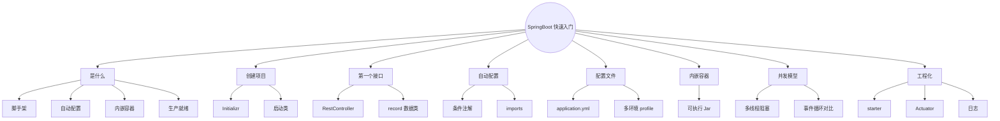
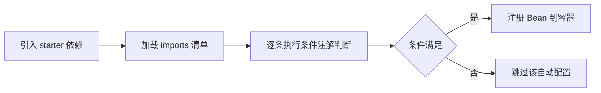
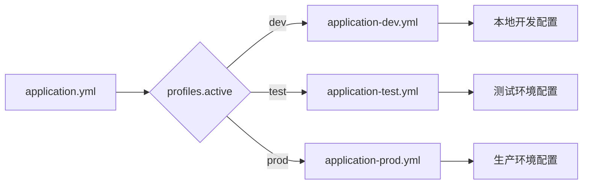
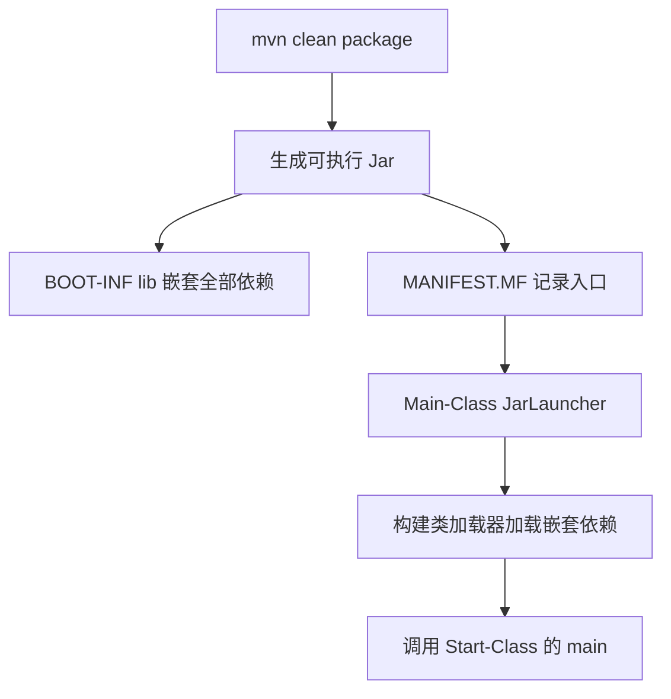
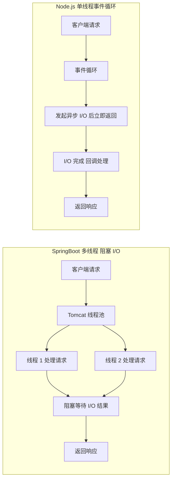
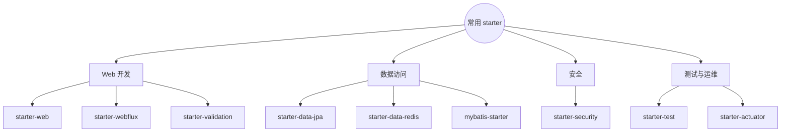

# SpringBoot 快速入门（对比 Express / FastAPI）
> 面向 JS + Python 背景开发者。  
> 目标：快速掌握 SpringBoot 项目搭建、自动配置、启动类、配置文件、内嵌容器、可执行 Jar，横向对比 Express / FastAPI。
<!-- more -->
## TL;DR（先看结论）
> 💡 一句话结论：SpringBoot = 约定优于配置的 Spring 脚手架——一个注解启动、内嵌 Tomcat、starter 依赖、`application.yml` 集中配置、`java -jar` 直接跑。JS/Python 开发者把它当 Express / FastAPI 用，但必须认清**并发模型差异**：Java 多线程 + 阻塞 I/O vs Node 单线程事件循环。
> 
> **三个必懂概念**：
> 1. 启动类必须在**根包**，`@SpringBootApplication` 自动扫描当前包及子包（漏了 Controller 就 404）。
> 2. `@RestController` = `@Controller` + `@ResponseBody`，返回对象**自动序列化成 JSON**。
> 3. 可执行 Jar 必须配 `spring-boot-maven-plugin`，否则打出的 Jar 不能 `java -jar` 直接跑。
> 
> **高频坑速记**：`application.yml` 缩进只能用空格不能用 Tab；默认端口 8080（Node 3000 / FastAPI 8000）；`@Value` 只读简单类型，复杂配置用 `@ConfigurationProperties`；`spring.profiles.active` 的 `profiles` 是复数；不要在请求线程做长时间阻塞操作（会耗尽 Tomcat 线程池）。

## 🗺️ 本笔记知识地图



---
## 0. 本笔记重点
> 💡 一句话结论：作为 JS + Python 开发者，你已熟悉 Web 框架（Express、Koa、FastAPI、Flask），SpringBoot 的学习重点是把「配置、启动、打包」这些事交给框架约定，同时盯住并发模型差异。

作为 JS + Python 开发者，你已经熟悉 Web 框架（Express、Koa、FastAPI、Flask）。SpringBoot 的学习重点是：
1. **约定优于配置**：SpringBoot 通过自动配置减少 XML 样板。
2. **启动类 + `@SpringBootApplication`**：一个注解搞定一切。
3. **内嵌 Tomcat**：不需要外部容器，`java -jar` 直接运行。
4. **`application.yml`**：集中配置，类似 `.env` + 框架配置。
5. **starter 依赖**：一个 starter 引入一整套功能，类似 npm 的 meta package。
6. **对比 Express / FastAPI**：Node 单线程事件循环 vs Java 多线程阻塞模型，是本阶段最重要的认知差异。

---
## 1. SpringBoot 是什么
> 💡 一句话结论：SpringBoot 是 Spring 的「快速开发脚手架」：自动配置取代 XML、内嵌容器免部署、starter 依赖开箱即用、Actuator 生产就绪。

### 1.1 一句话概括
SpringBoot 是基于 Spring 的**快速开发脚手架**，核心目标是：
- **简化配置**：自动配置取代 XML。
- **快速启动**：内嵌 Tomcat / Jetty / Undertow。
- **开箱即用**：starter 依赖整合常见组件。
- **生产就绪**：Actuator 提供健康检查、指标监控。

### 1.2 SpringBoot vs 原生 Spring
| 维度 | 原生 Spring | SpringBoot |
| --- | --- | --- |
| 配置 | XML / Java Config | 自动配置 + `application.yml` |
| 容器 | 外部 Tomcat | 内嵌 Tomcat |
| 依赖 | 手动引入 | starter 整合 |
| 启动 | 部署 war 到容器 | `java -jar` 直接运行 |
| 学习曲线 | 陡峭 | 平缓 |

### 1.3 对比 Express / FastAPI
| 维度 | SpringBoot | Express | FastAPI |
| --- | --- | --- | --- |
| 语言 | Java | JavaScript | Python |
| 启动 | 内嵌 Tomcat | Node HTTP Server | Uvicorn |
| 并发模型 | 多线程 + 阻塞 I/O | 单线程事件循环 | 异步事件循环 |
| 配置 | `application.yml` | `dotenv` + 代码 | `pydantic` + 环境变量 |
| 依赖注入 | 内置 IoC | 手动 / 中间件 | `Depends` |
| 类型检查 | 编译期强类型 | 运行时 | 运行时 + Pydantic |
| 生态 | Spring 全家桶 | 极简，自由组合 | 现代，内置较多 |

---
## 2. 创建第一个 SpringBoot 项目
> 💡 一句话结论：用 Spring Initializr 生成项目（Spring Boot 3.2.x + Java 17/21 + Spring Web + Lombok），启动类一个注解搞定配置与扫描，`mvn spring-boot:run` 就能跑起来。

### 2.1 使用 Spring Initializr
访问 [https://start.spring.io](https://start.spring.io)，或 IDEA 内置的 Spring Initializr：
选项：
- Project：Maven
- Language：Java
- Spring Boot：3.2.x
- Java：17 或 21
- Dependencies：Spring Web、Lombok
生成项目后解压。

### 2.2 项目结构
```text
demo/
├── pom.xml
├── mvnw
├── mvnw.cmd
└── src/
    ├── main/
    │   ├── java/com/example/demo/
    │   │   └── DemoApplication.java
    │   └── resources/
    │       ├── application.yml
    │       ├── static/
    │       └── templates/
    └── test/
        └── java/com/example/demo/
            └── DemoApplicationTests.java
```

### 2.3 启动类
```java
package com.example.demo;

import org.springframework.boot.SpringApplication;
import org.springframework.boot.autoconfigure.SpringBootApplication;

@SpringBootApplication
public class DemoApplication {
    public static void main(String[] args) {
        SpringApplication.run(DemoApplication.class, args);
    }
}
```
`@SpringBootApplication` = 三个注解的组合：
| 注解 | 作用 |
| --- | --- |
| `@SpringBootConfiguration` | 标识配置类 |
| `@EnableAutoConfiguration` | 启用自动配置 |
| `@ComponentScan` | 扫描当前包及子包 |

### 2.4 对比 Express
```js
const express = require("express");
const app = express();

app.get("/", (req, res) => res.send("Hello"));

app.listen(3000, () => console.log("Server started"));
```

### 2.5 对比 FastAPI
```python
from fastapi import FastAPI

app = FastAPI()

@app.get("/")
def read_root():
    return {"message": "Hello"}

# uvicorn main:app --reload
```
差异：
- SpringBoot 用注解声明配置，启动类集中管理。
- Express / FastAPI 用代码显式创建 app。
- SpringBoot 的 `@SpringBootApplication` 自动扫描当前包及子包。

---
## 3. 第一个 REST 接口
> 💡 一句话结论：`@RestController` + `@RequestMapping` 组织路由，方法返回对象自动 JSON 序列化；Java 16+ 的 `record` 一行写出数据载体。

### 3.1 Controller
```java
package com.example.demo.controller;

import org.springframework.web.bind.annotation.GetMapping;
import org.springframework.web.bind.annotation.RequestMapping;
import org.springframework.web.bind.annotation.RestController;

@RestController
@RequestMapping("/api")
public class HelloController {

    @GetMapping("/hello")
    public String hello() {
        return "Hello, SpringBoot!";
    }

    @GetMapping("/user")
    public User getUser() {
        return new User("lious", 18);
    }
}
```

### 3.2 User 类
```java
public record User(String name, int age) {}
```
Java 16+ 的 `record` 是简洁的数据载体，自动生成 `getter`、`equals`、`hashCode`、`toString`。

### 3.3 启动
```bash
mvn spring-boot:run
```
访问：
```bash
curl http://localhost:8080/api/hello
# Hello, SpringBoot!
curl http://localhost:8080/api/user
# {"name":"lious","age":18}
```

### 3.4 对比 Express
```js
app.get("/api/hello", (req, res) => {
  res.send("Hello, Express!");
});

app.get("/api/user", (req, res) => {
  res.json({ name: "lious", age: 18 });
});
```

### 3.5 对比 FastAPI
```python
@app.get("/api/hello")
def hello():
    return "Hello, FastAPI!"

@app.get("/api/user")
def get_user():
    return {"name": "lious", "age": 18}
```
差异：
- SpringBoot 用注解 + 类组织路由。
- Express / FastAPI 用函数 + 装饰器。
- SpringBoot 返回对象自动序列化为 JSON，需 Jackson 支持。

---
## 4. 自动配置原理
> 💡 一句话结论：自动配置 = classpath 依赖 + `AutoConfiguration.imports` 清单 + 条件注解判断：引入什么依赖，容器就自动装配什么 Bean。

### 4.1 自动配置是什么
SpringBoot 根据 classpath 中的依赖，自动配置相应的 Bean。
例如：
- 引入 `spring-boot-starter-web`，自动配置 Tomcat、Spring MVC、Jackson。
- 引入 `spring-boot-starter-data-jpa`，自动配置 DataSource、EntityManager。
- 引入 `mybatis-spring-boot-starter`，自动配置 SqlSessionFactory。



### 4.2 自动配置的入口
`@EnableAutoConfiguration` 会加载 `META-INF/spring/org.springframework.boot.autoconfigure.AutoConfiguration.imports` 中声明的配置类。

### 4.3 条件注解
自动配置大量使用条件注解：
| 注解 | 作用 |
| --- | --- |
| `@ConditionalOnClass` | classpath 存在某类时生效 |
| `@ConditionalOnMissingBean` | 容器中不存在某 Bean 时生效 |
| `@ConditionalOnProperty` | 配置属性满足条件时生效 |
| `@ConditionalOnWebApplication` | Web 应用时生效 |

### 4.4 查看自动配置
启动时加 `--debug`：
```bash
mvn spring-boot:run -Dspring-boot.run.arguments=--debug
```
或配置：
```yaml
debug: true
```
会打印哪些自动配置生效、哪些未生效。

### 4.5 对比 Express / FastAPI
- **Express**：手动组合中间件，没有自动配置。
- **FastAPI**：部分自动（OpenAPI 文档），但依赖需显式声明。
- **SpringBoot**：根据依赖自动决定配置，是"约定优于配置"的极致体现。

---
## 5. 配置文件
> 💡 一句话结论：`application.yml` 集中管理配置（端口/数据源/日志），多环境用 `application-{profile}.yml` + `spring.profiles.active` 切换，读取配置优先用 `@ConfigurationProperties`。

### 5.1 application.yml
```yaml
server:
  port: 8080
  servlet:
    context-path: /
spring:
  application:
    name: demo
  datasource:
    url: jdbc:mysql://localhost:3306/demo
    username: root
    password: 123456
    driver-class-name: com.mysql.cj.jdbc.Driver
logging:
  level:
    root: INFO
    com.example.demo: DEBUG
```
等价于 `application.properties`：
```properties
server.port=8080
spring.application.name=demo
spring.datasource.url=jdbc:mysql://localhost:3306/demo
```

### 5.2 多环境配置
```text
application.yml           # 公共配置
application-dev.yml       # 开发环境
application-test.yml      # 测试环境
application-prod.yml      # 生产环境
```
`application.yml`：
```yaml
spring:
  profiles:
    active: dev
```
或启动时指定：
```bash
java -jar demo.jar --spring.profiles.active=prod
```



### 5.3 读取配置
```java
import org.springframework.beans.factory.annotation.Value;
import org.springframework.stereotype.Component;

@Component
public class AppConfig {
    @Value("${spring.application.name}")
    private String appName;

    @Value("${server.port}")
    private int port;
}
```
推荐用 `@ConfigurationProperties`：
```java
@Component
@ConfigurationProperties(prefix = "app")
public class AppProperties {
    private String name;
    private int timeout;
    // getter / setter
}
```

### 5.4 对比 Express
```js
// .env
// PORT=3000
// DB_URL=mysql://localhost:3306/demo
require("dotenv").config();
const port = process.env.PORT || 3000;
```

### 5.5 对比 FastAPI
```python
from pydantic_settings import BaseSettings

class Settings(BaseSettings):
    port: int = 8000
    db_url: str = "sqlite:///./test.db"

    class Config:
        env_file = ".env"

settings = Settings()
```
差异：
- SpringBoot 用 YAML / Properties，层级清晰。
- Express 用 `.env` + 环境变量。
- FastAPI 用 Pydantic Settings，类型安全。
- SpringBoot 支持多环境 profile，比 Express 更系统化。

---
## 6. 内嵌容器与可执行 Jar
> 💡 一句话结论：SpringBoot 默认内嵌 Tomcat（可换 Jetty/Undertow）；配了 `spring-boot-maven-plugin` 后 `mvn clean package` 打出「代码 + 全部依赖 + 启动器」的可执行 Jar，`java -jar` 一个文件直接跑。

### 6.1 内嵌 Tomcat
SpringBoot 默认内嵌 Tomcat：
```xml
<dependency>
    <groupId>org.springframework.boot</groupId>
    <artifactId>spring-boot-starter-web</artifactId>
</dependency>
```
可以切换：
```xml
<!-- 排除 Tomcat -->
<exclusions>
    <exclusion>
        <groupId>org.springframework.boot</groupId>
        <artifactId>spring-boot-starter-tomcat</artifactId>
    </exclusion>
</exclusions>
<!-- 使用 Jetty -->
<dependency>
    <groupId>org.springframework.boot</groupId>
    <artifactId>spring-boot-starter-jetty</artifactId>
</dependency>
```

### 6.2 打包可执行 Jar
```xml
<build>
    <plugins>
        <plugin>
            <groupId>org.springframework.boot</groupId>
            <artifactId>spring-boot-maven-plugin</artifactId>
        </plugin>
    </plugins>
</build>
```
打包：
```bash
mvn clean package
```
输出：
```text
target/demo-0.0.1-SNAPSHOT.jar
```
运行：
```bash
java -jar target/demo-0.0.1-SNAPSHOT.jar
```

### 6.3 可执行 Jar 原理
SpringBoot 的可执行 Jar 包含：
- 项目代码
- 所有依赖 Jar（嵌套在 `BOOT-INF/lib/`）
- SpringBoot 启动器
`MANIFEST.MF`：
```text
Main-Class: org.springframework.boot.loader.JarLauncher
Start-Class: com.example.demo.DemoApplication
```
`JarLauncher` 负责构建类加载器，加载嵌套依赖，再调用 `Start-Class` 的 `main`。



### 6.4 对比 Express / FastAPI
Express：
```bash
node app.js
# 或
pm2 start app.js
```
FastAPI：
```bash
uvicorn main:app --host 0.0.0.0 --port 8000
```
差异：
- SpringBoot 可执行 Jar 自带容器和依赖，真正"一个文件运行"。
- Node / Python 部署通常需要先安装依赖，再运行。
- Docker 部署方式三者类似。

---
## 7. 请求处理模型（重点）
> 💡 一句话结论：**最大的认知差异**——SpringBoot 是「多线程 + 阻塞 I/O」（每请求一线程，默认 200），Node.js 是「单线程事件循环 + 非阻塞 I/O」，FastAPI 是「异步事件循环 + 协程」；CPU 密集适合 Java，高并发 I/O 密集适合 Node / FastAPI。

### 7.1 SpringBoot 默认模型
- **多线程 + 阻塞 I/O**。
- 每个 HTTP 请求由 Tomcat 线程池中的一个线程处理。
- 线程数默认 200，可通过 `server.tomcat.threads.max` 配置。
- 适合 CPU 密集、传统企业应用。

### 7.2 Node.js 模型
- **单线程事件循环 + 非阻塞 I/O**。
- 所有请求由事件循环调度，I/O 操作异步回调。
- 适合高并发 I/O 密集场景。
- CPU 密集会阻塞整个事件循环。

### 7.3 FastAPI 模型
- **异步事件循环 + 协程**（基于 asyncio）。
- `async def` 路由由事件循环调度。
- `def` 路由由线程池执行。
- 兼具异步和线程池能力。

### 7.4 对比总结


| 维度 | SpringBoot | Node.js | FastAPI |
| --- | --- | --- | --- |
| 并发模型 | 多线程 | 单线程事件循环 | 异步事件循环 |
| I/O 模型 | 阻塞 | 非阻塞 | 非阻塞 |
| CPU 密集 | 适合 | 不适合 | 一般 |
| I/O 密集 | 一般 | 适合 | 适合 |
| 线程安全 | 需注意 | 单线程无竞争 | 需注意 |
| 内存占用 | 高 | 低 | 中 |

### 7.5 实践建议
- Java 中不要在请求线程里做长时间阻塞操作（如大文件、慢查询）。
- 高并发场景可用 WebFlux（响应式）或虚拟线程（Java 21+）。
- 与 JS 思维不同，Java 需要关注线程安全（共享可变状态）。

---
## 8. 常用 starter
> 💡 一句话结论：一个 starter 引入一整套功能（类似 npm 的 meta package），选对 starter 就选对了技术栈；Actuator 是生产就绪标配，`/actuator/health` 直接看存活状态。

| starter | 功能 |
| --- | --- |
| `spring-boot-starter-web` | Spring MVC + Tomcat + Jackson |
| `spring-boot-starter-webflux` | 响应式 Web |
| `spring-boot-starter-data-jpa` | JPA + Hibernate |
| `spring-boot-starter-data-redis` | Redis |
| `spring-boot-starter-security` | Spring Security |
| `spring-boot-starter-validation` | Bean Validation |
| `spring-boot-starter-test` | JUnit + Mockito + AssertJ |
| `spring-boot-starter-actuator` | 健康检查、指标 |
| `mybatis-spring-boot-starter` | MyBatis |



### 8.1 Actuator 示例
```xml
<dependency>
    <groupId>org.springframework.boot</groupId>
    <artifactId>spring-boot-starter-actuator</artifactId>
</dependency>
```
配置：
```yaml
management:
  endpoints:
    web:
      exposure:
        include: health,info,metrics
```
访问：
```bash
curl http://localhost:8080/actuator/health
# {"status":"UP"}
```

### 8.2 对比
- **Express**：`morgan`、`helmet`、`cors` 等中间件。
- **FastAPI**：内置 OpenAPI、`fastapi.middleware`。
- **SpringBoot**：starter 一站式引入，Actuator 生产就绪。

---
## 9. 日志
> 💡 一句话结论：SpringBoot 默认 SLF4J + Logback 统一门面，`@Slf4j` 注解一行搞定 Logger，日志级别按包配置。

### 9.1 默认日志
SpringBoot 默认使用 Logback + SLF4J：
```java
import org.slf4j.Logger;
import org.slf4j.LoggerFactory;

@RestController
public class HelloController {
    private static final Logger log = LoggerFactory.getLogger(HelloController.class);

    @GetMapping("/hello")
    public String hello() {
        log.info("Received hello request");
        return "Hello";
    }
}
```
Lombok 简化：
```java
@Slf4j
@RestController
public class HelloController {

    @GetMapping("/hello")
    public String hello() {
        log.info("Received hello request");
        return "Hello";
    }
}
```

### 9.2 配置日志级别
```yaml
logging:
  level:
    root: INFO
    com.example.demo: DEBUG
  file:
    name: logs/app.log
```

### 9.3 对比
- **Express**：`console.log` 或 `winston`、`pino`。
- **FastAPI**：`logging` 模块或 `loguru`。
- **SpringBoot**：SLF4J + Logback，统一门面。

---
## 10. 常见坑点
> 💡 一句话结论：十个坑里四个是「扫描不到 / 配置不生效 / 端口撞车 / 长阻塞」，都是动态语言背景最容易踩的。

1. **启动类必须在根包**，否则 `@ComponentScan` 扫不到子包。
2. **Controller 必须在启动类的子包中**，否则不会被扫描。
3. **`@RestController` = `@Controller` + `@ResponseBody`**，返回对象自动 JSON。
4. **`application.yml` 缩进必须用空格**，不能用 Tab。
5. **打包可执行 Jar 必须配置 `spring-boot-maven-plugin`**。
6. **不要在请求线程做长时间阻塞**，会耗尽 Tomcat 线程池。
7. **默认端口 8080**，与 Node（3000）、FastAPI（8000）不同。
8. **`@Value` 只能读简单类型**，复杂配置用 `@ConfigurationProperties`。
9. **`spring.profiles.active` 拼写容易错**，注意是 `profiles` 复数。
10. **不要用 `System.out.println` 代替日志**，生产环境无法控制级别。

---
## 11. 小结
| 概念 | SpringBoot | Express | FastAPI |
| --- | --- | --- | --- |
| 创建应用 | `@SpringBootApplication` | `express()` | `FastAPI()` |
| 路由 | `@GetMapping` | `app.get()` | `@app.get()` |
| 返回 JSON | 自动 Jackson 序列化 | `res.json()` | 自动 |
| 配置 | `application.yml` | `.env` | Pydantic Settings |
| 容器 | 内嵌 Tomcat | Node HTTP | Uvicorn |
| 并发 | 多线程阻塞 | 单线程事件循环 | 异步事件循环 |
| 打包 | `java -jar` | `node app.js` | `uvicorn` |
| 健康检查 | Actuator | 手动实现 | 手动实现 |
| 依赖管理 | starter | npm | pip |

---
## 12. 练习建议
1. 用 Spring Initializr 创建项目，跑通 `/hello` 接口。
2. 修改 `application.yml` 端口为 9090，验证生效。
3. 创建 `dev` / `prod` 两个 profile，配置不同数据库。
4. 用 `@ConfigurationProperties` 读取自定义配置。
5. 打包可执行 Jar，用 `java -jar` 运行。
6. 引入 Actuator，访问 `/actuator/health`。
7. 用 Express 和 FastAPI 实现同样的 `/hello` 接口，对比代码量。
8. 思考：如果接口中有 10 秒的阻塞操作，SpringBoot 和 Node 分别会怎样？

---
## 13. 下一篇
下一篇：**SpringBoot REST 接口开发、参数校验与 JSON 序列化**。  
重点：
- `@RequestBody`、`@PathVariable`、`@RequestParam`
- 参数校验：`@Valid`、`@NotNull`、`@Size`
- Jackson 序列化与反序列化
- 日期格式化、枚举处理
- 对比 Express `req.body` / FastAPI Pydantic 模型
- Java 强类型序列化的坑
