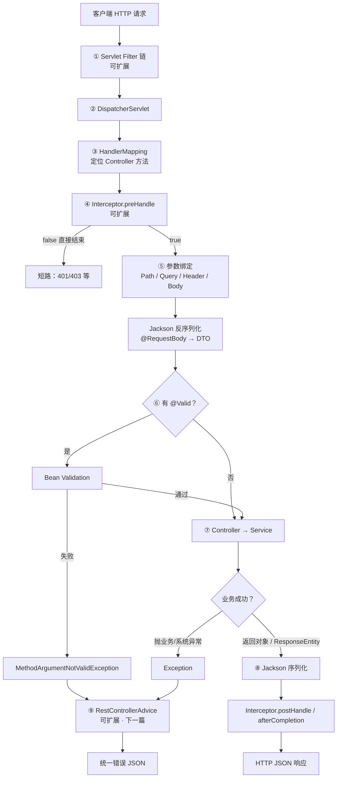
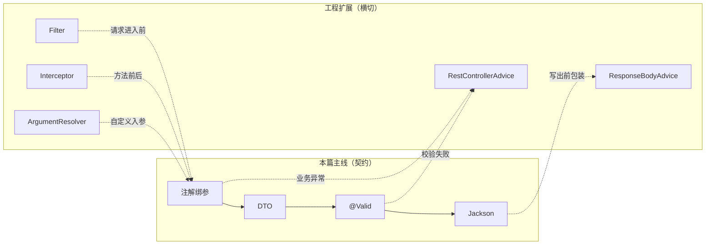
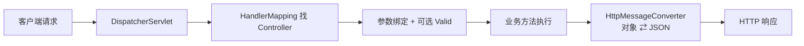
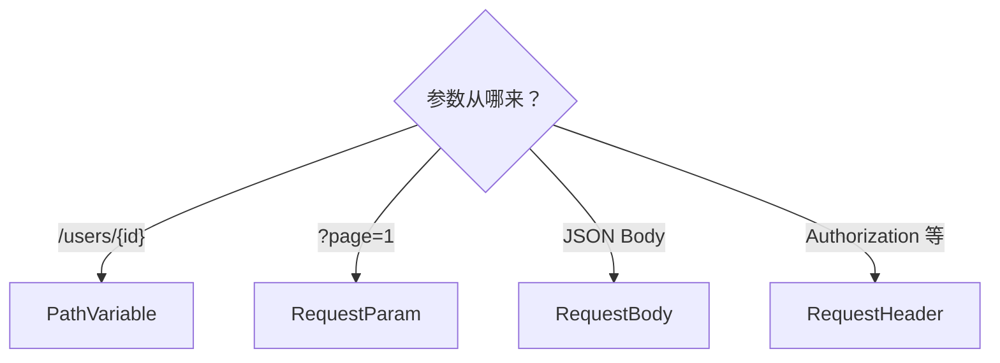
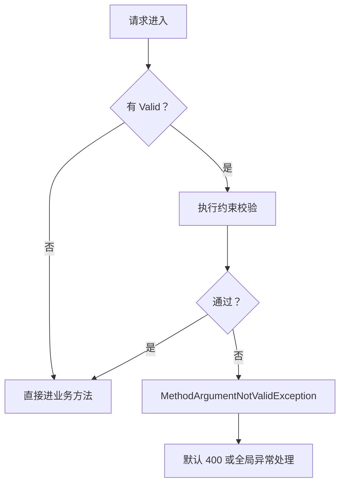

# SpringBoot REST 接口开发：参数校验与 JSON 序列化
> 面向 JS + Python 背景开发者。  
> 目标：吃透 Spring MVC 参数绑定、Bean Validation 校验、Jackson 强类型 JSON，横向对比 Express `req` / FastAPI Pydantic。
<!-- more -->

## TL;DR（先看结论）

> 💡 一句话结论：**SpringBoot REST = 注解绑参 + 强类型 DTO + `@Valid` 校验 + Jackson 自动 JSON。** 和 Express「随便塞对象」、FastAPI「Pydantic 模型」最像的是 DTO + Validation；最大坑是 **Java 强类型不会帮你隐式转换**——类型对不上直接 400 / 反序列化失败。

- 三件套绑参：`@PathVariable`（路径）/ `@RequestParam`（查询）/ `@RequestBody`（JSON 体）
- 校验：引入 `spring-boot-starter-validation`，方法参数前加 `@Valid` / `@Validated`，约束写在 DTO 字段上
- JSON：返回对象 / 接收 `@RequestBody` 都走 Jackson；日期、枚举、`null`、命名策略要显式约定
- 高频坑：忘记 `@RequestBody`、忘记 `@Valid`、用 `Map`/`Object` 偷懒、前端传字符串数字而后端要 `Long`、LocalDateTime 格式不一致

## 🗺️ 本笔记知识地图

```mermaid
flowchart TB
    ROOT(("SpringBoot REST"))

    ROOT --> Z["总流程与扩展点"]
    ROOT --> A["路由与控制器"]
    ROOT --> B["参数绑定"]
    ROOT --> C["DTO 设计"]
    ROOT --> D["参数校验"]
    ROOT --> E["Jackson JSON"]
    ROOT --> F["对比三端"]

    Z --> Z1["Filter → MVC → Controller"]
    Z --> Z2["Interceptor / Advice"]
    Z --> Z3["Converter / Resolver"]

    A --> A1["RestController"]
    A --> A2["GetMapping 等"]
    A --> A3["ResponseEntity"]

    B --> B1["PathVariable"]
    B --> B2["RequestParam"]
    B --> B3["RequestBody"]
    B --> B4["RequestHeader"]

    C --> C1["record / 类"]
    C --> C2["请求与响应分离"]

    D --> D1["Valid 触发"]
    D --> D2["NotNull Size Email"]
    D --> D3["分组与自定义"]

    E --> E1["序列化与反序列化"]
    E --> E2["日期枚举空值"]
    E --> E3["ObjectMapper 配置"]

    F --> F1["Express req"]
    F --> F2["FastAPI Pydantic"]
```



---
## 0. 本笔记重点
> 💡 一句话结论：你已经会写 `/hello`；本篇把「能跑通」升级成「能接真实业务」——绑参、校验、JSON 三关过完，才能安心写 CRUD。

作为 JS + Python 开发者，写 REST 时容易带着这些惯性：
1. **Express**：`req.params` / `req.query` / `req.body` 全是松散对象，校验靠中间件或手写。
2. **FastAPI**：路径参数 + Query + Pydantic `BaseModel`，校验几乎免费。
3. **SpringBoot**：一切靠**注解声明意图**，编译期类型 + 运行时校验 + Jackson 强绑定，漏注解就等于「框架不知道你想干什么」。

本篇重点：
1. 四种常见参数来源怎么声明。
2. 为什么要用 DTO，而不是直接拿 Entity / `Map`。
3. `@Valid` 如何触发，校验失败默认长什么样。
4. Jackson 的日期、枚举、命名、空值坑（相对 JS/Python 最扎心）。
5. 全局异常 / CORS 只点到为止，细节留给下一篇。

---
## 0.5 一次 REST 请求总流程（含扩展点）
> 💡 一句话结论：**主路径极短**——绑参 →（可选）`@Valid` → Controller → Service → Jackson 写出；真正「可插拔」的是两侧的 Filter / Interceptor / Advice / MessageConverter。先建立这张地图，后面各节才知道自己挂在哪一环。

### 0.5.1 主路径在干什么
把一次 `POST /api/users`（JSON Body）拆开看：

1. **进容器**：请求进入内嵌 Tomcat，先过 **Servlet Filter 链**（此时还没到 Spring MVC）。
2. **进 Spring MVC**：`DispatcherServlet` 根据路径找到 `@RestController` 方法。
3. **可选拦截**：执行 `HandlerInterceptor.preHandle`（登录态、权限、耗时等常挂这里）。
4. **参数绑定**：`@PathVariable` / `@RequestParam` / `@RequestBody` 等按注解取值；Body 由 **HttpMessageConverter（Jackson）** 反序列化成 DTO。
5. **参数校验**：方法参数上有 `@Valid` / `@Validated` 时跑 Bean Validation；失败抛 `MethodArgumentNotValidException`，默认 400。
6. **业务执行**：进入 Controller → 通常再调 Service / Mapper；成功则带返回值离开。
7. **写出响应**：返回值再经 Jackson **序列化**成 JSON；需要自定义状态码 / Header 时用 `ResponseEntity`。
8. **异常出口**：任一步抛异常，可由 `@RestControllerAdvice` 统一转成错误 JSON（下一篇）。

对比记忆：
| 阶段 | SpringBoot | Express | FastAPI |
| --- | --- | --- | --- |
| 最外层 | Filter | `app.use` 最前 | Middleware |
| 路由命中后 | Interceptor | 路由级 middleware | Dependency / 中间件 |
| 绑参 + JSON | 注解 + Jackson | `req.*` + `express.json()` | 路径/Query + Pydantic |
| 校验 | `@Valid` | 中间件 / Zod | 模型字段 |
| 统一错误 | `@RestControllerAdvice` | 错误中间件 | `exception_handler` |

### 0.5.2 总流程图


读图时抓住两条线：
- **快乐路径**：①→⑧ 一路绿灯，本篇重点在 ⑤⑥⑦⑧（绑参、DTO、校验、Jackson）。
- **扩展 / 兜底**：①④⑨ 以及 Converter 定制——业务代码变少，横切能力变多。

### 0.5.3 相关可扩展部分（挂哪儿、干什么）
本篇把「接口契约」写清楚；工程化能力优先挂在扩展点，**避免把鉴权、包装、日志堆进每个 Controller 方法**。

| 扩展点 | 挂钩位置 | 典型用途 | 类比 | 本系列位置 |
| --- | --- | --- | --- | --- |
| **Filter** / `OncePerRequestFilter` | DispatcherServlet **之外** | TraceId、CORS、简易鉴权、请求包装 | Express 最外层 middleware | CORS 见下一篇；鉴权多在 Security |
| **HandlerInterceptor** | Controller **前后** | 登录态、权限、接口耗时、防重复提交 | Nest `Interceptor` / 路由 middleware | 进阶自建 |
| **HandlerMethodArgumentResolver** | 参数绑定阶段 | `@CurrentUser` 注入当前用户 | FastAPI `Depends` | 进阶自建 |
| **Bean Validation** | `@Valid` 触发 | 字段约束、自定义 `@Phone` | Zod / Pydantic | **本篇 §4** |
| **HttpMessageConverter / ObjectMapper** | Body 读写 | 命名策略、日期、枚举、忽略未知字段 | JSON 中间件配置 | **本篇 §5–6** |
| **ResponseBodyAdvice** | 返回值写出前 | 统一包装 `{ code, message, data }` | 响应包装中间件 | 可与下一篇一起做 |
| **@RestControllerAdvice** | 异常出口 | 校验/业务/系统异常 → 统一错误体 | Express 错误中间件 | **下一篇** |
| **AOP `@Aspect`** | 方法切面 | 审计日志、限流、幂等（非 Web 专属） | 装饰器 / 中间件 | Spring 篇已有概念 |

选型直觉（由外到内）：
1. **必须对所有请求生效、甚至还没进 MVC** → Filter（含 CORS 过滤器）。
2. **只关心「某个 Controller 方法」前后** → Interceptor。
3. **只关心「出错长什么样」** → `@RestControllerAdvice`。
4. **只关心「入参合不合法」** → DTO + `@Valid`（本篇主线）。
5. **只关心「JSON 长什么样」** → Jackson 配置 / 注解（本篇主线）。



下一节从 **Controller 怎么组织** 开始，沿主路径把 ⑤→⑧ 逐项拆开；扩展点遇到「下一篇 / 进阶」时点到为止即可。

---
## 1. REST 控制器怎么组织
> 💡 一句话结论：`@RestController` + 类级 `@RequestMapping` 定前缀，方法级 `@GetMapping` / `@PostMapping` 等定动词与路径；需要精细控制状态码时用 `ResponseEntity`。

### 1.1 基本骨架
```java
@RestController
@RequestMapping("/api/users")
public class UserController {

    private final UserService userService;

    public UserController(UserService userService) {
        this.userService = userService;
    }

    @GetMapping("/{id}")
    public UserResponse getById(@PathVariable Long id) {
        return userService.findById(id);
    }

    @PostMapping
    public ResponseEntity<UserResponse> create(@Valid @RequestBody UserCreateRequest req) {
        UserResponse created = userService.create(req);
        return ResponseEntity.status(HttpStatus.CREATED).body(created);
    }
}
```

### 1.2 常用映射注解
| 注解 | HTTP 方法 | 类比 Express / FastAPI |
| --- | --- | --- |
| `@GetMapping` | GET | `app.get` / `@app.get` |
| `@PostMapping` | POST | `app.post` / `@app.post` |
| `@PutMapping` | PUT | `app.put` / `@app.put` |
| `@PatchMapping` | PATCH | `app.patch` / `@app.patch` |
| `@DeleteMapping` | DELETE | `app.delete` / `@app.delete` |
| `@RequestMapping` | 可指定 method | 通用路由 |

### 1.3 `@RestController` vs `@Controller`
| 注解 | 行为 |
| --- | --- |
| `@RestController` | `@Controller` + `@ResponseBody`，返回值写进响应体（通常 JSON） |
| `@Controller` | 默认走视图解析（模板），要返回 JSON 需方法上再加 `@ResponseBody` |

Web API 项目几乎一律用 `@RestController`。

### 1.4 `ResponseEntity`：何时使用
直接返回对象 → 默认 **200 OK**。需要自定义状态码 / 响应头时：
```java
return ResponseEntity
        .status(HttpStatus.CREATED)
        .header("Location", "/api/users/" + id)
        .body(response);
```
也可以：
```java
return ResponseEntity.noContent().build(); // 204
return ResponseEntity.notFound().build();  // 404
```



---
## 2. 请求参数绑定
> 💡 一句话结论：路径用 `@PathVariable`，查询串用 `@RequestParam`，JSON 体用 `@RequestBody`，请求头用 `@RequestHeader`——**漏写注解，框架就不会按你想的方式取值**。

### 2.1 `@PathVariable`：路径变量
```java
// GET /api/users/42
@GetMapping("/{id}")
public UserResponse get(@PathVariable Long id) { ... }

// 名字不一致时显式指定
@GetMapping("/{userId}")
public UserResponse get(@PathVariable("userId") Long id) { ... }
```

对比：
```js
// Express
app.get('/api/users/:id', (req, res) => {
  const id = req.params.id; // 字符串！
});
```
```python
# FastAPI
@app.get("/api/users/{id}")
def get(id: int): ...
```

注意：Express 的 `params` 默认是**字符串**；Spring / FastAPI 可按声明类型转换，转失败直接 400。

### 2.2 `@RequestParam`：查询参数
```java
// GET /api/users?page=1&size=10&q=lious
@GetMapping
public Page<UserResponse> list(
        @RequestParam(defaultValue = "1") int page,
        @RequestParam(defaultValue = "10") int size,
        @RequestParam(required = false) String q) { ... }
```

| 属性 | 含义 |
| --- | --- |
| `required` | 默认 `true`；可选参数设 `false` 或给 `defaultValue` |
| `defaultValue` | 缺省时的默认值（字符串形式，会再转换） |
| `name` / `value` | 参数名与形参名不一致时指定 |

对比：
```js
const page = req.query.page; // 字符串或 undefined
```
```python
def list(page: int = 1, size: int = 10, q: str | None = None): ...
```

### 2.3 `@RequestBody`：JSON 请求体
```java
@PostMapping
public UserResponse create(@RequestBody UserCreateRequest req) { ... }
```

对比：
```js
const body = req.body; // 需 express.json() 中间件
```
```python
def create(req: UserCreateRequest): ...  # Pydantic 模型
```

**必记**：
- 只有请求体（通常 POST/PUT/PATCH + `Content-Type: application/json`）才用 `@RequestBody`。
- 一个方法里**通常只能有一个** `@RequestBody`。
- 忘记加 `@RequestBody`：Spring 不会从 JSON 填对象，字段全是 `null`（或绑定失败），极难排查。

### 2.4 `@RequestHeader` / `@CookieValue`
```java
@GetMapping("/me")
public UserResponse me(@RequestHeader("Authorization") String auth) { ... }

@GetMapping("/theme")
public String theme(@CookieValue(value = "theme", defaultValue = "light") String theme) { ... }
```

### 2.5 怎么选
| 数据来源 | 注解 | 典型场景 |
| --- | --- | --- |
| URL 路径 | `@PathVariable` | 资源 ID：`/users/1` |
| Query String | `@RequestParam` | 分页、过滤、搜索 |
| JSON Body | `@RequestBody` | 创建 / 更新资源 |
| Header | `@RequestHeader` | Token、TraceId、语言 |
| 表单 | `@RequestParam` 或 `@ModelAttribute` | `application/x-www-form-urlencoded` |



---
## 3. DTO：请求与响应的数据契约
> 💡 一句话结论：接口边界用 DTO（或 `record`），不要直接暴露 Entity；请求 DTO 与响应 DTO 分开，校验注解只挂在「入口模型」上。

### 3.1 为什么不要直接返回 Entity
- 泄露密码哈希、内部字段。
- 懒加载关联在序列化时触发 `LazyInitializationException`。
- API 与表结构耦合，改库就改接口。

### 3.2 推荐写法（Java 16+ record）
```java
public record UserCreateRequest(
        @NotBlank String name,
        @Email String email,
        @Min(1) @Max(150) Integer age
) {}

public record UserResponse(
        Long id,
        String name,
        String email,
        Integer age
) {}
```

没有 record 时用普通类 + Lombok：
```java
@Data
public class UserCreateRequest {
    @NotBlank
    private String name;
    @Email
    private String email;
    @Min(1) @Max(150)
    private Integer age;
}
```

### 3.3 对比三端
| 维度 | SpringBoot | Express | FastAPI |
| --- | --- | --- | --- |
| 请求模型 | DTO / record | 无强制，多为普通对象 | Pydantic `BaseModel` |
| 响应模型 | DTO / record | `res.json({})` | `response_model=` |
| 类型 | 编译期强类型 | 运行时 | 运行时 + 注解 |

---
## 4. 参数校验（Bean Validation）
> 💡 一句话结论：加依赖 → DTO 写约束 → 方法参数加 `@Valid`；三者缺一，校验都不会跑。失败默认抛 `MethodArgumentNotValidException`（下一篇用全局异常统一成业务错误码）。

### 4.1 依赖
```xml
<dependency>
    <groupId>org.springframework.boot</groupId>
    <artifactId>spring-boot-starter-validation</artifactId>
</dependency>
```
Boot 3.x 对应 Jakarta Validation（包名 `jakarta.validation.*`，不是老的 `javax.validation`）。

### 4.2 触发校验
```java
@PostMapping
public UserResponse create(@Valid @RequestBody UserCreateRequest req) {
    return userService.create(req);
}
```

- `@Valid`：标准 Bean Validation，级联校验嵌套对象也靠它。
- `@Validated`：Spring 扩展，支持**分组校验**；用在类上还可开启方法级校验。

对简单 `@RequestParam` 也可校验（需类上 `@Validated`）：
```java
@RestController
@RequestMapping("/api/users")
@Validated
public class UserController {

    @GetMapping("/{id}")
    public UserResponse get(@PathVariable @Min(1) Long id) { ... }
}
```

### 4.3 常用约束注解
| 注解 | 含义 | 近似 FastAPI / Zod |
| --- | --- | --- |
| `@NotNull` | 不能为 null | `...` 必填 |
| `@NotEmpty` | 字符串/集合非 null 且长度 > 0 | `min_length=1` |
| `@NotBlank` | 字符串 trim 后非空 | 去空白后必填 |
| `@Size(min, max)` | 长度范围 | `Field(min_length=..., max_length=...)` |
| `@Min` / `@Max` | 数值范围 | `ge` / `le` |
| `@Email` | 邮箱格式 | `EmailStr` |
| `@Pattern` | 正则 | `pattern=` |
| `@Positive` / `@PositiveOrZero` | 正数 | `gt=0` |
| `@Past` / `@Future` | 时间先后 | 自定义 |

### 4.4 嵌套对象
```java
public record OrderCreateRequest(
        @NotNull @Valid Address address,
        @NotEmpty List<@NotNull Long> itemIds
) {}

public record Address(
        @NotBlank String city,
        @NotBlank String street
) {}
```
嵌套字段必须再加 `@Valid`，否则只校验外层。

### 4.5 自定义校验（了解）
```java
@Target(ElementType.FIELD)
@Retention(RetentionPolicy.RUNTIME)
@Constraint(validatedBy = PhoneValidator.class)
public @interface Phone {
    String message() default "手机号格式不正确";
    Class<?>[] groups() default {};
    Class<? extends Payload>[] payload() default {};
}
```
实现 `ConstraintValidator<Phone, String>` 即可。业务复杂时，也可在 Service 里显式判断并抛业务异常。

### 4.6 校验失败时默认行为
`@RequestBody` + `@Valid` 失败 → `MethodArgumentNotValidException` → 默认 **400**，body 是 Spring 默认错误结构（字段多、前端不友好）。  
下一篇会用 `@RestControllerAdvice` 改成统一 `{ code, message, details }`。



---
## 5. Jackson：JSON 序列化与反序列化
> 💡 一句话结论：返回对象 → 序列化成 JSON；`@RequestBody` → JSON 反序列化成对象。JS/Python 习惯「差不多能转就转」，Java + Jackson 是「类型严格匹配，否则直接失败」。

### 5.1 默认行为
引入 `spring-boot-starter-web` 即带 Jackson：
- Controller 返回 `UserResponse` → `application/json`
- `@RequestBody UserCreateRequest` ← 解析 JSON

### 5.2 字段命名
默认用 Java Bean 属性名（record 用组件名）。若前端是蛇形：
```yaml
# application.yml
spring:
  jackson:
    property-naming-strategy: SNAKE_CASE
```
或单个字段：
```java
public record UserResponse(
        Long id,
        @JsonProperty("user_name") String name
) {}
```

### 5.3 忽略字段
```java
@JsonIgnore
private String passwordHash;

@JsonIgnoreProperties({"hibernateLazyInitializer", "handler"})
public class User { ... }
```

### 5.4 反序列化常见失败原因
| 现象 | 原因 | 处理 |
| --- | --- | --- |
| 400 Bad Request | JSON 类型与字段不符 | 对齐类型 / 自定义反序列化器 |
| 字段全 null | 忘记 `@RequestBody` 或字段名对不上 | 检查注解与命名策略 |
| 未知字段报错 | 开启了失败策略 | `@JsonIgnoreProperties(ignoreUnknown = true)` |
| 数字溢出 | JS 大整数超 `Number.MAX_SAFE_INTEGER` | 用 `String` / `BigInteger` 传 |

### 5.5 对比 Express / FastAPI
| 维度 | SpringBoot + Jackson | Express | FastAPI |
| --- | --- | --- | --- |
| 解析 | 自动 | `express.json()` | 自动 |
| 类型 | 强类型绑定 | 弱类型 | Pydantic 校验 + 转换 |
| `"18"` → int | 默认可宽松配置，但不建议依赖 | 自己转 | 常能转 |
| 多余字段 | 默认可忽略或配置为失败 | 保留在对象上 | 默认可忽略或 forbid |
| 日期 | 需统一格式 | 字符串自己处理 | 多种友好解析 |

---
## 6. 日期、枚举、空值
> 💡 一句话结论：三端联调翻车最多的是 **时间格式** 和 **枚举大小写**；先在 API 契约里写死，再配 Jackson，不要靠「碰运气」。

### 6.1 日期时间（推荐 `java.time`）
```java
public record EventRequest(
        @JsonFormat(pattern = "yyyy-MM-dd HH:mm:ss")
        LocalDateTime startAt,
        LocalDate endDate
) {}
```

全局配置示例：
```yaml
spring:
  jackson:
    date-format: yyyy-MM-dd HH:mm:ss
    time-zone: Asia/Shanghai
    serialization:
      write-dates-as-timestamps: false
```

建议：
- 新项目优先 `LocalDate` / `LocalDateTime` / `Instant`，不要用 `java.util.Date`。
- 前后端约定用 **ISO-8601**（`2026-09-25T14:30:00`）或明确 pattern，二选一。

### 6.2 枚举
```java
public enum UserStatus {
    ACTIVE, DISABLED
}

public record UserResponse(Long id, UserStatus status) {}
```

默认按**枚举名**序列化（`ACTIVE`）。若要按自定义值：
```java
public enum UserStatus {
    ACTIVE("active"),
    DISABLED("disabled");

    private final String value;
    UserStatus(String value) { this.value = value; }

    @JsonValue
    public String getValue() { return value; }

    @JsonCreator
    public static UserStatus from(String value) {
        for (UserStatus s : values()) {
            if (s.value.equalsIgnoreCase(value)) return s;
        }
        throw new IllegalArgumentException("Unknown status: " + value);
    }
}
```

前端传 `active` / `Active` / `ACTIVE` 不一致时，最容易 400——用 `@JsonCreator` 做宽容解析，或在文档里强制一种写法。

### 6.3 空值与 Optional
```yaml
spring:
  jackson:
    default-property-inclusion: non_null  # 序列化时跳过 null
```

- 响应里不想输出 null：用 `NON_NULL` / `@JsonInclude`。
- 请求里区分「没传」和「传了 null」：可用 `Optional`、`JsonNullable`（进阶）或拆 Update DTO。
- **不要**滥用 `Optional` 作为 Entity 字段类型；更适合作方法返回值。

---
## 7. 完整 CRUD 示例（串起来）
> 💡 一句话结论：列表查询用 Query 参数，详情用 PathVariable，创建/更新用 Body + `@Valid`，删除返回 204；响应统一 DTO。

```java
@RestController
@RequestMapping("/api/users")
public class UserController {

    private final UserService userService;

    public UserController(UserService userService) {
        this.userService = userService;
    }

    @GetMapping
    public List<UserResponse> list(@RequestParam(required = false) String q) {
        return userService.list(q);
    }

    @GetMapping("/{id}")
    public UserResponse get(@PathVariable Long id) {
        return userService.findById(id);
    }

    @PostMapping
    public ResponseEntity<UserResponse> create(@Valid @RequestBody UserCreateRequest req) {
        return ResponseEntity.status(HttpStatus.CREATED).body(userService.create(req));
    }

    @PutMapping("/{id}")
    public UserResponse update(@PathVariable Long id,
                               @Valid @RequestBody UserUpdateRequest req) {
        return userService.update(id, req);
    }

    @DeleteMapping("/{id}")
    public ResponseEntity<Void> delete(@PathVariable Long id) {
        userService.delete(id);
        return ResponseEntity.noContent().build();
    }
}
```

同功能三端对照（创建用户）：

```js
// Express + express-validator（示意）
app.post('/api/users',
  body('email').isEmail(),
  (req, res) => {
    const errors = validationResult(req);
    if (!errors.isEmpty()) return res.status(400).json(errors.array());
    res.status(201).json(createUser(req.body));
  }
);
```

```python
# FastAPI
class UserCreate(BaseModel):
    name: str
    email: EmailStr
    age: int = Field(ge=1, le=150)

@app.post("/api/users", status_code=201)
def create(req: UserCreate) -> UserResponse:
    return create_user(req)
```

FastAPI 的「模型即校验」体感最接近 Spring 的 DTO + `@Valid`；Express 更自由，也更容易漏校验。

---
## 8. 与全局异常、CORS 的边界
> 💡 一句话结论：本篇把「参数怎么进、JSON 怎么出、校验怎么挂」讲清；**统一错误体、业务异常、跨域**放到下一篇 `@RestControllerAdvice` + CORS 配置。

你现在可能会看到：
- 校验失败：默认 Whitelabel / 默认 JSON 错误结构
- `userService.findById` 找不到：自己 `throw` 后还是 500

下一篇会覆盖：
1. `@RestControllerAdvice` + `@ExceptionHandler`
2. 自定义业务异常 vs 校验异常 vs 系统异常
3. 统一响应 `{ code, message, data }`
4. CORS：`WebMvcConfigurer` / `CorsConfigurationSource`

---
## 9. 常见坑点
> 💡 一句话结论：十个坑有一半是「注解漏了」或「强类型不迁就你」——先查注解，再查 JSON 字段名与类型。

1. **忘记 `@RequestBody`**：JSON 进不来，对象字段全 null。
2. **忘记 `@Valid`**：约束注解写了也不执行。
3. **忘记 `starter-validation` 依赖**：本地「好像有注解」但运行期无实现。
4. **Boot 3 仍用 `javax.validation`**：应改为 `jakarta.validation`。
5. **用 `Map<String, Object>` 接 Body**：能跑，但放弃了类型与校验，和 Express 一样乱。
6. **路径参数是 String，业务里当 Long 用却不声明类型**：显式写 `Long id`，让框架转换。
7. **前端传 `"id": "1"`（字符串）而后端要 Long**：多数情况 Jackson 能转，但不要依赖；契约写清楚。
8. **LocalDateTime 格式各端不一致**：统一 ISO 或统一 pattern。
9. **枚举大小写不统一**：`ACTIVE` vs `active` 导致 400。
10. **直接返回 Entity**：懒加载、密码字段、表结构泄漏一起爆。

---
## 10. 小结

| 概念 | SpringBoot | Express | FastAPI |
| --- | --- | --- | --- |
| 路径参数 | `@PathVariable` | `req.params` | 路径声明 + 类型 |
| 查询参数 | `@RequestParam` | `req.query` | Query / 默认参数 |
| JSON Body | `@RequestBody` | `req.body` | Pydantic 模型 |
| 校验 | `@Valid` + 约束注解 | 中间件 / 手写 | 模型字段约束 |
| JSON 引擎 | Jackson | JSON.parse / 库 | 内置 + Pydantic |
| 响应状态码 | `ResponseEntity` / 默认 200 | `res.status` | `status_code=` |
| 强类型 | 编译期 + 运行时绑定 | 弱 | 运行时模型 |

口诀：**Path / Query / Body 分清注解；DTO 做边界；Valid 触发校验；Jackson 管进出。**

---
## 11. 练习建议
1. 写 `UserController` CRUD，全部用 DTO，禁止直接返回 Entity。
2. 给创建接口加 `@NotBlank` / `@Email` / `@Min`，故意传坏数据，观察默认 400 响应。
3. 用 `@JsonFormat` 接收 `yyyy-MM-dd HH:mm:ss`，再用 ISO-8601 各测一次。
4. 定义枚举状态，分别测试大写 / 小写入参。
5. 把同一套接口用 Express + Zod（或 FastAPI + Pydantic）重写，对比代码量与错误信息。
6. 尝试漏写 `@RequestBody` / `@Valid`，记录现象——这是以后排查的肌肉记忆。
7. （选做）自定义 `@Phone` 校验注解。
8. （选做）配置 `SNAKE_CASE` 命名策略，让前端用 `user_name`。

---
## 12. 下一篇
下一篇：**SpringBoot 全局异常处理与跨域 CORS**（已生成）。  
重点回顾：
- `@RestControllerAdvice` / `@ExceptionHandler`
- 校验异常、业务异常、系统异常分层
- 统一响应体设计
- CORS 配置与预检请求
- 对比 Express 错误中间件 / FastAPI `exception_handler`
