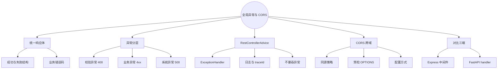
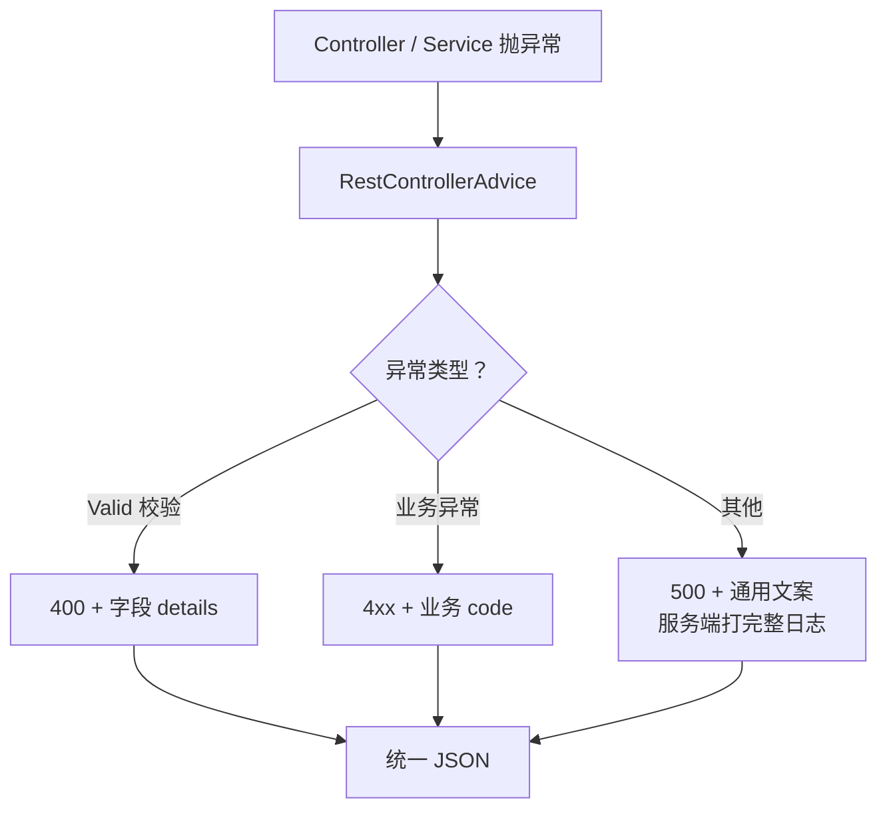
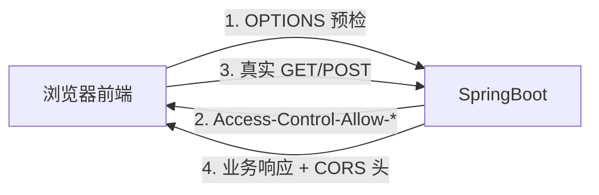

# SpringBoot 全局异常处理与跨域 CORS
> 面向 JS + Python 背景开发者。  
> 目标：用 `@RestControllerAdvice` 统一错误响应，分层处理校验 / 业务 / 系统异常；搞懂 CORS 与预检请求，横向对比 Express 错误中间件 / FastAPI `exception_handler`。
<!-- more -->

## TL;DR（先看结论）

> 💡 一句话结论：**全局异常 = 一个 Advice 兜住所有 Controller 抛出的异常，转成统一 JSON；CORS = 浏览器跨域安全策略，后端显式放行 Origin / Method / Header。** 对应 Express 的错误中间件、FastAPI 的 `exception_handler` + `CORSMiddleware`。

- 统一响应体先定契约：`{ code, message, data, traceId? }`（错误时 `data` 可放字段细节）
- 三层异常：校验异常 → 400；业务异常 → 4xx + 业务码；未知异常 → 500（日志打全，对外模糊）
- `@RestControllerAdvice` + `@ExceptionHandler` 集中处理，Controller 里少写 try-catch
- CORS：开发期可宽、生产期收紧；注意预检 `OPTIONS`、凭证请求不能 `*`、与网关重复配置别打架
- 高频坑：Advice 扫不到包、只处理了自定义异常没处理 `MethodArgumentNotValidException`、CORS 配在错误过滤器之后导致预检失败、把堆栈直接返回给前端

## 🗺️ 本笔记知识地图



---
## 0. 本笔记重点
> 💡 一句话结论：第 10 篇把参数和 JSON 跑通了；本篇解决「出错时前端看到什么」和「浏览器跨域能不能调」——Web 项目上线前的两块标配。

作为 JS + Python 开发者，你会很熟悉：
1. **Express**：`(err, req, res, next)` 错误中间件 + `cors` 包。
2. **FastAPI**：`@app.exception_handler` + `CORSMiddleware`。
3. **SpringBoot**：`@RestControllerAdvice` + `CorsRegistry` / `CorsConfigurationSource`。

本篇重点：
1. 设计统一响应，而不是每个接口自己拼错误 JSON。
2. 区分校验失败、业务失败、系统崩溃三类处理策略。
3. 自定义业务异常怎么抛、怎么映射 HTTP 状态码。
4. CORS 到底拦的是谁（浏览器，不是 curl / Postman）。
5. 与第 04 篇异常体系、第 10 篇 `@Valid` 的衔接。

---
## 1. 为什么需要全局异常处理
> 💡 一句话结论：没有全局处理时，校验失败是难读的默认错误体，业务 `throw` 变成 500，前端无法稳定解析——和 Express 忘写错误中间件一个味道。

### 1.1 没有 Advice 时会发生什么
| 场景 | 默认现象 | 前端感受 |
| --- | --- | --- |
| `@Valid` 失败 | `MethodArgumentNotValidException` → 400 默认结构 | 字段路径又长又丑 |
| `throw new RuntimeException("用户不存在")` | 500 + Whitelabel / 堆栈 | 分不清业务失败还是挂了 |
| 自定义业务异常未捕获 | 同上 500 | 无法按错误码分支 |

### 1.2 目标形态
```json
{
  "code": 40001,
  "message": "邮箱格式不正确",
  "data": {
    "email": "必须是邮箱格式"
  },
  "traceId": "a1b2c3d4"
}
```

成功时可以对称：
```json
{
  "code": 0,
  "message": "ok",
  "data": { "id": 1, "name": "lious" }
}
```

是否强制成功也包一层，看团队约定；**错误响应务必统一**，成功可渐进。



---
## 2. 统一响应体设计
> 💡 一句话结论：先定 `ApiResponse` / `ErrorResponse` 契约，再写 Advice；错误码分段（校验 / 业务 / 系统），`message` 给人看，`code` 给程序看。

### 2.1 响应包装
```java
public record ApiResponse<T>(
        int code,
        String message,
        T data,
        String traceId
) {
    public static <T> ApiResponse<T> ok(T data) {
        return new ApiResponse<>(0, "ok", data, TraceId.get());
    }

    public static ApiResponse<Void> fail(int code, String message) {
        return new ApiResponse<>(code, message, null, TraceId.get());
    }

    public static ApiResponse<Object> fail(int code, String message, Object data) {
        return new ApiResponse<>(code, message, data, TraceId.get());
    }
}
```

`TraceId.get()` 可用 MDC（第 07 篇）：请求入口 Filter 写入，Advice 读出。没有链路也可以先省略该字段。

### 2.2 错误码约定（示例）
| 区间 | 含义 | 示例 |
| --- | --- | --- |
| `0` | 成功 | — |
| `40000–40099` | 参数 / 校验 | `40001` 字段非法 |
| `40400–40499` | 资源不存在 | `40401` 用户不存在 |
| `40900–40999` | 冲突 | `40901` 邮箱已注册 |
| `50000+` | 系统错误 | `50000` 未知异常 |

HTTP 状态码仍按语义返回（400/404/409/500）；`code` 是业务细分。不要只用 200 + 业务码假装成功（除非前后端明确约定，且不利于缓存 / 监控）。

---
## 3. 自定义业务异常
> 💡 一句话结论：业务失败抛**非受检**业务异常（带 code + message），由 Advice 统一转响应；不要在每个 Controller catch 后 `return`。

### 3.1 异常类
```java
public class BusinessException extends RuntimeException {
    private final int code;
    private final HttpStatus status;

    public BusinessException(int code, String message) {
        this(code, message, HttpStatus.BAD_REQUEST);
    }

    public BusinessException(int code, String message, HttpStatus status) {
        super(message);
        this.code = code;
        this.status = status;
    }

    public int getCode() { return code; }
    public HttpStatus getStatus() { return status; }
}
```

继承 `RuntimeException`：调用方不必 `throws`，和现代 Spring 实践一致（第 04 篇：业务异常常用非受检）。

### 3.2 Service 中抛出
```java
public UserResponse findById(Long id) {
    return userRepository.findById(id)
            .map(this::toResponse)
            .orElseThrow(() -> new BusinessException(
                    40401, "用户不存在: " + id, HttpStatus.NOT_FOUND));
}
```

```java
if (userRepository.existsByEmail(req.email())) {
    throw new BusinessException(40901, "邮箱已被注册", HttpStatus.CONFLICT);
}
```

### 3.3 对比 FastAPI / Express
```python
# FastAPI
class BusinessError(Exception):
    def __init__(self, code: int, message: str, status: int = 400):
        self.code, self.message, self.status = code, message, status

@app.exception_handler(BusinessError)
async def business_handler(request, exc: BusinessError):
    return JSONResponse(status_code=exc.status, content={...})
```

```js
// Express
class BusinessError extends Error {
  constructor(code, message, status = 400) {
    super(message);
    this.code = code;
    this.status = status;
  }
}
app.use((err, req, res, next) => {
  if (err instanceof BusinessError) {
    return res.status(err.status).json({ code: err.code, message: err.message });
  }
  next(err);
});
```

---
## 4. `@RestControllerAdvice` 全局处理
> 💡 一句话结论：一个（或少数几个）Advice 类集中 `@ExceptionHandler`；**先写具体类型，再写兜底 `Exception`**，顺序与 catch 子类在前同理。

### 4.1 完整示例
```java
@Slf4j
@RestControllerAdvice
public class GlobalExceptionHandler {

    @ExceptionHandler(MethodArgumentNotValidException.class)
    public ResponseEntity<ApiResponse<Object>> handleValid(MethodArgumentNotValidException ex) {
        Map<String, String> fields = new LinkedHashMap<>();
        ex.getBindingResult().getFieldErrors()
                .forEach(err -> fields.put(err.getField(), err.getDefaultMessage()));
        return ResponseEntity.badRequest()
                .body(ApiResponse.fail(40001, "参数校验失败", fields));
    }

    @ExceptionHandler(ConstraintViolationException.class)
    public ResponseEntity<ApiResponse<Object>> handleConstraint(ConstraintViolationException ex) {
        Map<String, String> fields = new LinkedHashMap<>();
        ex.getConstraintViolations().forEach(v ->
                fields.put(v.getPropertyPath().toString(), v.getMessage()));
        return ResponseEntity.badRequest()
                .body(ApiResponse.fail(40001, "参数校验失败", fields));
    }

    @ExceptionHandler(BusinessException.class)
    public ResponseEntity<ApiResponse<Void>> handleBusiness(BusinessException ex) {
        return ResponseEntity.status(ex.getStatus())
                .body(ApiResponse.fail(ex.getCode(), ex.getMessage()));
    }

    @ExceptionHandler(HttpMessageNotReadableException.class)
    public ResponseEntity<ApiResponse<Void>> handleJson(HttpMessageNotReadableException ex) {
        log.warn("JSON parse error: {}", ex.getMostSpecificCause().getMessage());
        return ResponseEntity.badRequest()
                .body(ApiResponse.fail(40002, "请求体 JSON 无法解析"));
    }

    @ExceptionHandler(Exception.class)
    public ResponseEntity<ApiResponse<Void>> handleOther(Exception ex) {
        log.error("Unhandled error", ex); // 完整堆栈只打日志
        return ResponseEntity.status(HttpStatus.INTERNAL_SERVER_ERROR)
                .body(ApiResponse.fail(50000, "服务器开小差了"));
    }
}
```

### 4.2 各类异常对照表
| 异常 | 典型来源 | HTTP | 建议 code |
| --- | --- | --- | --- |
| `MethodArgumentNotValidException` | `@RequestBody` + `@Valid` | 400 | `40001` |
| `ConstraintViolationException` | `@RequestParam` / `@PathVariable` 校验 | 400 | `40001` |
| `HttpMessageNotReadableException` | JSON 语法 / 类型对不上 | 400 | `40002` |
| `MissingServletRequestParameterException` | 缺必填 Query | 400 | `40003` |
| `MethodArgumentTypeMismatchException` | `/users/abc` 但要 Long | 400 | `40004` |
| `BusinessException` | 业务规则 | 4xx | 自定义 |
| `NoHandlerFoundException` | 路径不存在（需额外开启） | 404 | `40400` |
| `Exception` | 兜底 | 500 | `50000` |

开启 404 进 Advice（可选）：
```yaml
spring:
  mvc:
    throw-exception-if-no-handler-found: true
  web:
    resources:
      add-mappings: false
```
更常见做法是前端路由 / 网关处理 404；按需开启。

### 4.3 `@RestControllerAdvice` vs `@ControllerAdvice`
| 注解 | 行为 |
| --- | --- |
| `@RestControllerAdvice` | `@ControllerAdvice` + `@ResponseBody`，直接写 JSON |
| `@ControllerAdvice` | 可返回视图名；API 项目不如前者直观 |

可用 `basePackages` / `assignableTypes` 缩小作用范围，多模块时避免「一个 Advice 管全世界」。

### 4.4 日志原则
- **业务异常**：`warn` 即可，一般不打堆栈（或打简短 cause）。
- **系统异常**：`error` + 完整堆栈。
- **对外 message**：不泄露 SQL、路径、内部类名。
- **traceId**：写入响应，方便前端报障时对日志。

---
## 5. Controller 还要不要 try-catch
> 💡 一句话结论：默认**不要**在 Controller 里 catch 业务异常；只在「必须局部恢复 / 转换」时才就地处理。

反例：
```java
@GetMapping("/{id}")
public ApiResponse<UserResponse> get(@PathVariable Long id) {
    try {
        return ApiResponse.ok(userService.findById(id));
    } catch (BusinessException e) {
        return ApiResponse.fail(e.getCode(), e.getMessage()); // 状态码容易丢成 200
    }
}
```

正例：Service 抛异常，Advice 定状态码；Controller 保持瘦。
```java
@GetMapping("/{id}")
public UserResponse get(@PathVariable Long id) {
    return userService.findById(id);
}
```

若团队强制成功也包 `ApiResponse`，可用 `ResponseBodyAdvice` 统一包装（进阶），或在 Controller 显式 `return ApiResponse.ok(...)`——二选一，别混用。

---
## 6. CORS：跨域到底是什么
> 💡 一句话结论：CORS 是**浏览器**的同源策略放行机制；curl / Postman / 服务端互调不受 CORS 限制。前端 `localhost:5173` 调后端 `localhost:8080` 就会触发。

### 6.1 同源
协议 + 域名 + 端口 都相同才算同源。  
`http://localhost:5173` 与 `http://localhost:8080` → **跨域**。

### 6.2 简单请求 vs 预检
| 类型 | 条件（简化） | 浏览器行为 |
| --- | --- | --- |
| 简单请求 | GET/POST + 常见 Content-Type 等 | 直接发，看响应头是否允许 |
| 预检请求 | 自定义 Header、`application/json` PUT/DELETE 等 | 先发 `OPTIONS`，通过后再发真请求 |

前端常见翻车：真接口 200，但预检 OPTIONS 404/403，浏览器报 CORS error——**先抓 OPTIONS**。



### 6.3 关键响应头
| 响应头 | 含义 |
| --- | --- |
| `Access-Control-Allow-Origin` | 允许的来源；带 Cookie 时不能是 `*` |
| `Access-Control-Allow-Methods` | 允许的方法 |
| `Access-Control-Allow-Headers` | 允许的请求头 |
| `Access-Control-Allow-Credentials` | 是否允许携带 Cookie |
| `Access-Control-Max-Age` | 预检缓存秒数 |

---
## 7. SpringBoot 配置 CORS
> 💡 一句话结论：开发可用 `addMapping("/**").allowedOriginPatterns("*")`；生产改为明确 Origin 列表，并想清楚是否需要 Cookie。

### 7.1 全局配置（推荐）
```java
@Configuration
public class WebConfig implements WebMvcConfigurer {

    @Override
    public void addCorsMappings(CorsRegistry registry) {
        registry.addMapping("/api/**")
                .allowedOriginPatterns("http://localhost:5173", "https://blog.example.com")
                .allowedMethods("GET", "POST", "PUT", "PATCH", "DELETE", "OPTIONS")
                .allowedHeaders("*")
                .allowCredentials(true)
                .maxAge(3600);
    }
}
```

Boot 2.4+ 带凭证时用 `allowedOriginPatterns`，不要用 `allowedOrigins("*")`（会直接冲突）。

### 7.2 `CorsConfigurationSource`（适合 Security 集成）
```java
@Bean
public CorsConfigurationSource corsConfigurationSource() {
    CorsConfiguration config = new CorsConfiguration();
    config.setAllowedOriginPatterns(List.of("http://localhost:5173"));
    config.setAllowedMethods(List.of("GET", "POST", "PUT", "DELETE", "OPTIONS"));
    config.setAllowedHeaders(List.of("*"));
    config.setAllowCredentials(true);

    UrlBasedCorsConfigurationSource source = new UrlBasedCorsConfigurationSource();
    source.registerCorsConfiguration("/api/**", config);
    return source;
}
```
引入 Spring Security 后，通常要把该 Bean 交给 Security Filter Chain，并 `http.cors(...)`，否则 Security 可能先拦预检。

### 7.3 注解方式（局部）
```java
@CrossOrigin(origins = "http://localhost:5173")
@RestController
@RequestMapping("/api/users")
public class UserController { ... }
```
适合单个接口试验；项目级仍建议全局配置，避免散落注解不一致。

### 7.4 开发期临时放行（仅本地）
```java
.allowedOriginPatterns("*")
.allowCredentials(false) // 与 * 搭配时不能为 true
```
生产环境务必收紧。

### 7.5 对比 Express / FastAPI
```js
// Express
import cors from 'cors';
app.use(cors({
  origin: ['http://localhost:5173'],
  credentials: true
}));
```

```python
# FastAPI
app.add_middleware(
    CORSMiddleware,
    allow_origins=["http://localhost:5173"],
    allow_credentials=True,
    allow_methods=["*"],
    allow_headers=["*"],
)
```

三者概念一一对应：允许来源 / 方法 / 头 / 凭证。

---
## 8. 和网关、反向代理的关系
> 💡 一句话结论：CORS 头只保留一处生成（要么后端，要么网关）；两边都加容易重复头导致浏览器仍报错。

常见部署：
- 开发：Vite 代理到 8080 → **浏览器看是同源**，往往不需要后端 CORS。
- 生产：Nginx / API Gateway 同域反代 → 同样可弱化 CORS。
- 前后端不同域名：必须在**实际响应**里带正确 CORS 头。

排查顺序：
1. 看是不是真跨域（还是代理已同源）。
2. 看失败的是 OPTIONS 还是正式请求。
3. 看响应里 `Access-Control-Allow-Origin` 是否匹配当前页面 Origin。
4. 带 Cookie 时检查 `Allow-Credentials` 与 Origin 是否为具体值。

---
## 9. 把异常与 CORS 放进同一张对照表

| 能力 | SpringBoot | Express | FastAPI |
| --- | --- | --- | --- |
| 全局错误 | `@RestControllerAdvice` | 错误中间件 | `exception_handler` |
| 校验错误 | `MethodArgumentNotValidException` | 校验库结果 | `RequestValidationError` |
| 业务错误 | 自定义 `BusinessException` | 自定义 Error 类 | 自定义 Exception |
| 统一 JSON | `ApiResponse` record | 手写 `res.json` | `JSONResponse` |
| CORS | `CorsRegistry` / Security | `cors` 中间件 | `CORSMiddleware` |
| 预检 | 框架自动处理 OPTIONS | 中间件处理 | 中间件处理 |

---
## 10. 常见坑点
> 💡 一句话结论：Advice 不生效多半是包扫描；CORS 报错多半是预检或凭证与 `*` 冲突；500 对外千万别回堆栈。

1. **Advice 不生效**：类不在启动类扫描包下，或被当成普通类未交给 Spring。
2. **只处理了 BusinessException**：`@Valid` 失败仍是默认丑陋 JSON——必须单写 `MethodArgumentNotValidException`。
3. **Controller catch 后 return 200 + fail**：HTTP 语义丢了，监控与客户端都难受。
4. **500 把 `ex.getMessage()` 或堆栈回传前端**：信息泄露；对外固定文案，对内打日志。
5. **CORS `allowedOrigins("*")` + `allowCredentials(true)`**：非法组合，浏览器直接拒。
6. **只测了 Postman**：Postman 不强制 CORS，过了不代表浏览器能过。
7. **Security 开启后预检 401/403**：需配置 `cors` 并放行 `OPTIONS`。
8. **网关与应用重复加 CORS 头**：出现两个 `Allow-Origin`，仍然失败。
9. **业务异常用受检 Exception**：层层 `throws` 到 Controller，Advice 能捕但代码噪声大；优先非受检。
10. **忘记区分 warn / error 日志**：业务拒绝刷成 error，告警风暴。

---
## 11. 小结

| 主题 | 记住什么 |
| --- | --- |
| 统一响应 | `code` + `message` + `data`（+ `traceId`） |
| 校验异常 | 400 + 字段 map |
| 业务异常 | 自定义 RuntimeException + 状态码 |
| 系统异常 | 500 + 日志堆栈 + 对外模糊 |
| Advice | `@RestControllerAdvice` 集中转换 |
| CORS | 浏览器策略；配 Origin/Method/Header/凭证 |
| 预检 | 先看 OPTIONS |
| 生产 | Origin 白名单；错误不泄密 |

口诀：**异常分层抛，Advice 统一包；跨域看浏览器，预检过了真请求才跑。**

---
## 12. 练习建议
1. 实现 `ApiResponse` + `BusinessException` + `GlobalExceptionHandler`。
2. 故意让 `@Valid` 失败，确认返回字段级 `data`。
3. Service 在「用户不存在」时抛 40401，用浏览器 / curl 看 HTTP 状态与 body。
4. 制造一个 NPE，确认对外是「服务器开小差了」，日志里有完整堆栈。
5. 前端 Vite `localhost:5173` 直连 `8080`，先不配 CORS 看报错，再配上验证。
6. 试 `allowCredentials(true)` + `*`，观察启动或浏览器行为。
7. 用 Express / FastAPI 各写一个等价错误处理与 CORS，对比代码结构。
8. （选做）Filter + MDC 注入 `traceId`，错误响应带回同一 ID。

---
## 13. 下一篇
下一篇：**MyBatis 数据库开发**（已生成）。  
重点回顾：
- MyBatis 与 JDBC / ORM 定位差异
- `mapper.xml` / 注解 SQL
- 与 SpringBoot 整合、分页、多参数
- 对比 SQLAlchemy / Prisma / Sequelize
- 为 MyBatis-Plus 打基础
