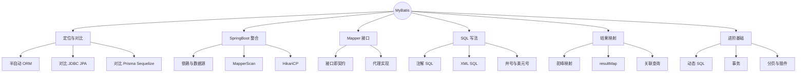
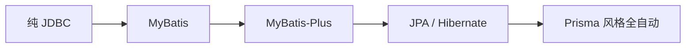
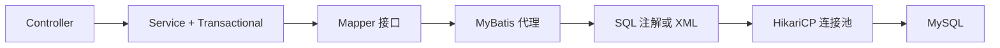

# MyBatis 数据库开发（对比 SQLAlchemy / Prisma / Sequelize）
> 面向 JS + Python 背景开发者。  
> 目标：理解 MyBatis「半自动 ORM」定位，掌握与 SpringBoot 整合、Mapper 接口、XML/注解 SQL、结果映射与事务，为 MyBatis-Plus 打基础。
<!-- more -->

## TL;DR（先看结论）

> 💡 一句话结论：**MyBatis = 你写 SQL，框架负责参数绑定与结果映射。** 不像 JPA / Hibernate / Prisma 那样「对象驱动生成 SQL」，更接近「带强类型的 SQL 模板」——可控、贴近数据库，样板比纯 JDBC 少很多。

- 定位：半自动持久层；SQL 在你手里，映射交给框架
- 整合三件套：`mybatis-spring-boot-starter` + 数据源配置 + `@Mapper` / `@MapperScan`
- 两种写法：注解适合短 SQL；XML 适合动态 SQL、复杂联表
- 结果映射：`underscore_to_camel`、`resultMap`、一对多/多对一
- 事务：Service 上 `@Transactional`（第 08 篇 AOP），Mapper 本身通常不开事务
- 高频坑：XML 的 `namespace` 与接口全限定名不一致、`#{}` vs `${}`（注入）、忘开驼峰、多参数没 `@Param`、本地跑通却打包找不到 xml

## 🗺️ 本笔记知识地图



---
## 0. 本笔记重点
> 💡 一句话结论：你会 Sequelize / Prisma / SQLAlchemy 后，学 MyBatis 的关键不是「再学一个 ORM」，而是**把 SQL 控制权拿回来**，同时保留类型安全的接口调用。

作为 JS + Python 开发者，常见对照：
| 你熟悉的 | 更像 MyBatis 的哪一面 |
| --- | --- |
| 手写 SQL + 驱动 | MyBatis 的本质（参数/结果自动化） |
| Prisma / Sequelize Model | 更像 JPA / MyBatis-Plus 的 ActiveRecord |
| SQLAlchemy Core | 很接近 MyBatis（SQL 表达为主） |
| SQLAlchemy ORM | 更接近 JPA |

本篇重点：
1. MyBatis 在持久层光谱上的位置。
2. SpringBoot 最小可跑通配置。
3. Mapper 接口 + 注解 / XML 两种 SQL。
4. `#{}` 与 `${}`、驼峰、`resultMap`。
5. 动态 SQL、事务、分页入门；Plus 留给下一篇。

---
## 1. MyBatis 是什么
> 💡 一句话结论：MyBatis 是优秀的**持久层框架**：封装 JDBC，用接口 + SQL 完成 CRUD；你负责 SQL 语义，它负责 `PreparedStatement`、结果集灌进 Java 对象。

### 1.1 持久层光谱


| 方案 | SQL 控制权 | 样板代码 | 学习曲线 | 典型场景 |
| --- | --- | --- | --- | --- |
| JDBC | 完全 | 极多 | 低概念高样板 | 教学、极致定制 |
| MyBatis | 完全 | 少 | 中 | 复杂 SQL、报表、国内主流 |
| MyBatis-Plus | 大多可生成 | 更少 | 中低 | 常规 CRUD 加速 |
| JPA | 框架生成（可原生 SQL） | 少 | 高 | 领域模型驱动 |

### 1.2 对比 Prisma / Sequelize / SQLAlchemy
| 维度 | MyBatis | Prisma | Sequelize | SQLAlchemy |
| --- | --- | --- | --- | --- |
| 核心 | SQL 映射 | Schema → Client | Model + Query | Core / ORM 双模式 |
| 复杂联表 | 手写 SQL 最爽 | 有限 / raw | 中等 | Core 很强 |
| 类型 | Mapper 接口 + Java 类型 | 生成 TS 类型 | 弱～中 | 视写法 |
| 动态条件 | `<if>` / `<where>` | 代码拼对象 | where 对象 | 表达式 |
| 国内生态 | 极强 | 偏前端全栈 | Node 常见 | Python 主流 |

一句话：**会写 SQL 就会用 MyBatis；不会写 SQL，MyBatis 帮不了你「变出」正确查询。**

---
## 2. SpringBoot 整合
> 💡 一句话结论：加 starter → 配数据源 → `@MapperScan` 扫接口 → 写 Entity + Mapper；连接池默认 HikariCP，不用自己 new 连接。

### 2.1 依赖（MySQL 示例）
```xml
<dependency>
    <groupId>org.mybatis.spring.boot</groupId>
    <artifactId>mybatis-spring-boot-starter</artifactId>
    <version>3.0.3</version>
</dependency>
<dependency>
    <groupId>com.mysql</groupId>
    <artifactId>mysql-connector-j</artifactId>
    <scope>runtime</scope>
</dependency>
```
Boot 3.x 用 MyBatis Spring Boot Starter 3.x；版本以官方兼容矩阵为准。

### 2.2 `application.yml`
```yaml
spring:
  datasource:
    url: jdbc:mysql://localhost:3306/demo?useSSL=false&serverTimezone=Asia/Shanghai&characterEncoding=utf8
    username: root
    password: secret
    driver-class-name: com.mysql.cj.jdbc.Driver

mybatis:
  configuration:
    map-underscore-to-camel-case: true   # user_name → userName
    log-impl: org.apache.ibatis.logging.slf4j.Slf4jImpl
  mapper-locations: classpath:mapper/**/*.xml
  type-aliases-package: com.example.demo.domain
```

### 2.3 扫描 Mapper
```java
@SpringBootApplication
@MapperScan("com.example.demo.mapper")
public class DemoApplication {
    public static void main(String[] args) {
        SpringApplication.run(DemoApplication.class, args);
    }
}
```

或在每个接口上加 `@Mapper`（接口少时可以；项目大了更推荐 `@MapperScan`）。

### 2.4 表与实体
```sql
CREATE TABLE users (
  id BIGINT PRIMARY KEY AUTO_INCREMENT,
  user_name VARCHAR(64) NOT NULL,
  email VARCHAR(128) NOT NULL UNIQUE,
  age INT,
  created_at DATETIME DEFAULT CURRENT_TIMESTAMP
);
```

```java
public class User {
    private Long id;
    private String userName; // 对应 user_name（开了驼峰）
    private String email;
    private Integer age;
    private LocalDateTime createdAt;
    // getter / setter 或 Lombok @Data
}
```



---
## 3. Mapper 接口：调用入口
> 💡 一句话结论：Mapper 是接口不是类——运行时 MyBatis 生成代理；你只声明方法签名，SQL 写在注解或同名 XML 里。

```java
@Mapper
public interface UserMapper {

    User findById(Long id);

    List<User> findAll();

    int insert(User user);

    int update(User user);

    int deleteById(Long id);
}
```

Service 注入使用：
```java
@Service
public class UserService {
    private final UserMapper userMapper;

    public UserService(UserMapper userMapper) {
        this.userMapper = userMapper;
    }

    public User get(Long id) {
        User user = userMapper.findById(id);
        if (user == null) {
            throw new BusinessException(40401, "用户不存在", HttpStatus.NOT_FOUND);
        }
        return user;
    }
}
```

对比 Prisma：`prisma.user.findUnique({ where: { id } })`  
对比 Sequelize：`User.findByPk(id)`  
MyBatis：`userMapper.findById(id)` —— 方法名自定，SQL 自写。

---
## 4. 注解 SQL（适合简单语句）
> 💡 一句话结论：CRUD 单表短 SQL 用注解最爽；一旦出现动态条件、长联表，立刻切 XML。

```java
@Mapper
public interface UserMapper {

    @Select("SELECT id, user_name, email, age, created_at FROM users WHERE id = #{id}")
    User findById(Long id);

    @Select("SELECT id, user_name, email, age, created_at FROM users")
    List<User> findAll();

    @Insert("""
            INSERT INTO users(user_name, email, age)
            VALUES(#{userName}, #{email}, #{age})
            """)
    @Options(useGeneratedKeys = true, keyProperty = "id")
    int insert(User user);

    @Update("""
            UPDATE users
            SET user_name = #{userName}, email = #{email}, age = #{age}
            WHERE id = #{id}
            """)
    int update(User user);

    @Delete("DELETE FROM users WHERE id = #{id}")
    int deleteById(Long id);

    @Select("SELECT COUNT(*) FROM users WHERE email = #{email}")
    int countByEmail(String email);
}
```

### 4.1 `#{}` vs `${}`（必背）
| 写法 | 机制 | 用途 | 风险 |
| --- | --- | --- | --- |
| `#{id}` | 预编译占位符 `?` | **默认首选** | 安全 |
| `${column}` | 字符串拼接进 SQL | 动态列名 / ORDER BY 白名单 | **SQL 注入** |

```java
// 安全
@Select("SELECT * FROM users WHERE id = #{id}")

// 危险：永远不要把用户输入直接 ${}
@Select("SELECT * FROM users ORDER BY ${sort}") // 必须白名单校验 sort
```

类比：
- `#{}` ≈ 参数化查询 / Prisma 的参数绑定
- `${}` ≈ 字符串拼 SQL（Sequelize `literal`、自己拼 f-string）——能不用就不用

### 4.2 多参数必须 `@Param`
```java
@Select("SELECT * FROM users WHERE user_name = #{name} AND age > #{minAge}")
List<User> findByNameAndMinAge(@Param("name") String name, @Param("minAge") int minAge);
```
单个参数且是 JavaBean / 基本类型时，常可省略；**两个及以上参数**建议全部 `@Param`，否则 XML/注解里名字会对不上。

---
## 5. XML SQL（适合复杂与动态）
> 💡 一句话结论：`namespace` = 接口全限定名；`id` = 方法名；复杂查询、动态 where、批量操作优先 XML。

### 5.1 文件位置
`src/main/resources/mapper/UserMapper.xml`  
（与 `mybatis.mapper-locations` 一致）

```xml
<?xml version="1.0" encoding="UTF-8" ?>
<!DOCTYPE mapper
        PUBLIC "-//mybatis.org//DTD Mapper 3.0//EN"
        "https://mybatis.org/dtd/mybatis-3-mapper.dtd">
<mapper namespace="com.example.demo.mapper.UserMapper">

    <select id="findById" resultType="User">
        SELECT id, user_name, email, age, created_at
        FROM users
        WHERE id = #{id}
    </select>

    <insert id="insert" useGeneratedKeys="true" keyProperty="id">
        INSERT INTO users(user_name, email, age)
        VALUES(#{userName}, #{email}, #{age})
    </insert>

</mapper>
```

同一方法**不要**注解和 XML 各写一份，会冲突。

### 5.2 动态 SQL
```xml
<select id="search" resultType="User">
    SELECT id, user_name, email, age, created_at
    FROM users
    <where>
        <if test="name != null and name != ''">
            AND user_name LIKE CONCAT('%', #{name}, '%')
        </if>
        <if test="minAge != null">
            AND age &gt;= #{minAge}
        </if>
        <if test="email != null and email != ''">
            AND email = #{email}
        </if>
    </where>
    ORDER BY id DESC
</select>
```

对应接口：
```java
List<User> search(@Param("name") String name,
                  @Param("minAge") Integer minAge,
                  @Param("email") String email);
```

常用标签：
| 标签 | 作用 |
| --- | --- |
| `<where>` | 自动去掉多余 AND/OR |
| `<if>` | 条件拼装 |
| `<choose>/<when>/<otherwise>` | 类似 switch |
| `<trim>` | 自定义前缀后缀与覆盖 |
| `<foreach>` | IN 查询、批量插入 |
| `<set>` | 动态 UPDATE 字段 |

```xml
<select id="findByIds" resultType="User">
    SELECT * FROM users
    WHERE id IN
    <foreach collection="ids" item="id" open="(" separator="," close=")">
        #{id}
    </foreach>
</select>
```

对比 Sequelize `where: { age: { [Op.gte]: minAge } }`：MyBatis 用 XML 显式拼 SQL，调试时直接看最终 SQL（开日志）往往更直观。

---
## 6. 结果映射
> 💡 一句话结论：开驼峰解决 80% 字段映射；列名怪异、DTO 拼装、一对多再用 `resultMap`。

### 6.1 `resultType` vs `resultMap`
| 方式 | 适用 |
| --- | --- |
| `resultType="User"` | 列能对上属性（驼峰 / 别名） |
| `resultMap` | 自定义映射、关联、构造器 |

```sql
-- 用别名也能对上（不开驼峰时）
SELECT user_name AS userName FROM users
```

### 6.2 `resultMap` 示例
```xml
<resultMap id="UserMap" type="User">
    <id property="id" column="id"/>
    <result property="userName" column="user_name"/>
    <result property="email" column="email"/>
    <result property="age" column="age"/>
    <result property="createdAt" column="created_at"/>
</resultMap>

<select id="findById" resultMap="UserMap">
    SELECT * FROM users WHERE id = #{id}
</select>
```

### 6.3 一对多（了解）
```xml
<resultMap id="UserWithOrdersMap" type="User">
    <id property="id" column="id"/>
    <result property="userName" column="user_name"/>
    <collection property="orders" ofType="Order">
        <id property="id" column="order_id"/>
        <result property="amount" column="amount"/>
    </collection>
</resultMap>
```
联表一行变多行时注意去重策略；复杂场景也可拆两次查询（避免笛卡尔积）。JPA 的 `@OneToMany` 更「对象化」，MyBatis 更「结果集怎么灌」。

---
## 7. 事务
> 💡 一句话结论：事务加在 **Service** 方法上（`@Transactional`），不要指望 Mapper 方法自己保证多语句原子性。

```java
@Service
public class UserService {

    private final UserMapper userMapper;
    private final AccountMapper accountMapper;

    @Transactional
    public void register(UserCreateRequest req) {
        User user = toEntity(req);
        userMapper.insert(user);
        accountMapper.createDefault(user.getId());
        // 任一失败则整体回滚
    }
}
```

回顾第 08 篇：
- 默认 RuntimeException 回滚，受检异常不一定回滚（可配置 `rollbackFor`）
- 同类自调用可能导致事务失效（代理绕过）
- 只读查询可用 `@Transactional(readOnly = true)`

对比：
- Prisma：`$transaction([...])` / interactive transaction
- Sequelize：`sequelize.transaction(async t => ...)`
- SQLAlchemy：`session.commit()` / context manager

---
## 8. 分页与日志（实用向）
> 💡 一句话结论：简单分页可手写 `LIMIT`；通用分页用 PageHelper 等插件。开发期打开 SQL 日志，确认 `#{}` 绑定与动态 SQL 是否如预期。

### 8.1 手写分页
```xml
<select id="page" resultType="User">
    SELECT id, user_name, email, age, created_at
    FROM users
    ORDER BY id DESC
    LIMIT #{limit} OFFSET #{offset}
</select>
```

### 8.2 PageHelper（常见插件）
```xml
<dependency>
    <groupId>com.github.pagehelper</groupId>
    <artifactId>pagehelper-spring-boot-starter</artifactId>
    <version>2.1.0</version>
</dependency>
```
```java
PageHelper.startPage(pageNum, pageSize);
List<User> list = userMapper.findAll();
PageInfo<User> info = new PageInfo<>(list);
```
注意：`startPage` 紧跟的**下一次**查询生效，别在中间插入别的查询。

### 8.3 看 SQL
```yaml
mybatis:
  configuration:
    log-impl: org.apache.ibatis.logging.slf4j.Slf4jImpl
logging:
  level:
    com.example.demo.mapper: debug
```
能看到准备语句与参数，排查「条件没拼上 / 驼峰没映射」最快。

---
## 9. 完整最小闭环
> 💡 一句话结论：表 → Entity → Mapper → Service → Controller；REST 层继续用第 10～11 篇的 DTO、校验与全局异常。

```java
@RestController
@RequestMapping("/api/users")
public class UserController {

    private final UserService userService;

    public UserController(UserService userService) {
        this.userService = userService;
    }

    @GetMapping("/{id}")
    public UserResponse get(@PathVariable Long id) {
        return userService.getResponse(id);
    }

    @PostMapping
    public ResponseEntity<UserResponse> create(@Valid @RequestBody UserCreateRequest req) {
        return ResponseEntity.status(HttpStatus.CREATED).body(userService.create(req));
    }
}
```

Service 内：`mapper` 读写 Entity，再转 Response DTO——**不要把 Entity 直接当 API 模型返回**（懒加载虽不如 JPA 常见，但字段泄露、表结构耦合问题一样存在）。

---
## 10. 常见坑点
> 💡 一句话结论：十个坑五个是「名字对不上」（namespace / 方法 id / 参数名 / 驼峰 / xml 路径）。

1. **`namespace` 写错**：与 Mapper 接口全限定名不一致 → 绑定失败。
2. **XML 打包丢失**：`mapper-locations` 不对，或资源目录没放进 `resources`。
3. **注解和 XML 重复定义同一 `id`**：启动报错或行为诡异。
4. **多用 `${}`**：SQL 注入；ORDER BY 必须白名单。
5. **多参数忘记 `@Param`**：`BindingException`。
6. **没开驼峰且没别名**：字段全 null，最隐蔽。
7. **`insert` 不配 `useGeneratedKeys`**：拿不到自增 id。
8. **在 Controller 开事务 / 忘开事务**：多表写入部分成功。
9. **把 MyBatis 当 JPA**：指望改对象就自动 UPDATE——不会，必须显式调 `update`。
10. **连接时区 / SSL / 编码**：URL 参数没配齐，时间差 8 小时或中文乱码。

---
## 11. 小结

| 概念 | MyBatis | Prisma | Sequelize | SQLAlchemy |
| --- | --- | --- | --- | --- |
| 入口 | Mapper 接口 | `prisma.model` | Model 类 | Engine / Session |
| SQL | 手写注解/XML | 多为生成 | 查询构造器 | Core / ORM |
| 参数 | `#{}` | 参数对象 | replacements | 绑定参数 |
| 动态条件 | `<if>/<where>` | where 对象 | Op + where | 表达式 |
| 事务 | `@Transactional` | `$transaction` | `transaction` | commit / begin |
| 连接池 | HikariCP | 驱动池 | 连接池配置 | pool |

口诀：**接口定方法，SQL 定语义，`#{}` 防注入，驼峰对字段，事务放 Service。**

---
## 12. 练习建议
1. 建 `users` 表，用注解版 Mapper 跑通 CRUD。
2. 打开驼峰与 SQL 日志，观察 `user_name` → `userName`。
3. 把 `search` 改成 XML 动态 SQL，组合 name / age / email。
4. 写 `findByIds` + `<foreach>`。
5. Service 里两次写入加 `@Transactional`，第二次故意失败看回滚。
6. 用 Prisma / SQLAlchemy 实现同样查询，对比「谁在写 SQL」。
7. （选做）接入 PageHelper，返回 `PageInfo`。
8. （选做）一对多 `resultMap` 查用户及其订单。

---
## 13. 下一篇
下一篇：**MyBatis-Plus 增强**（已生成）。  
重点回顾：
- 与 MyBatis 的关系：增强不替换
- `BaseMapper` CRUD 零 SQL
- `QueryWrapper` / `LambdaQueryWrapper`
- 分页插件、逻辑删除、自动填充
- 何时退回手写 XML
