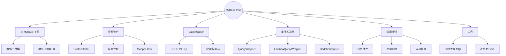
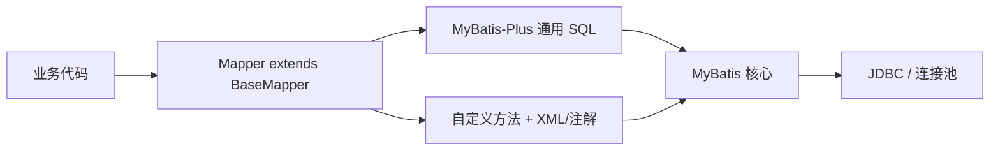
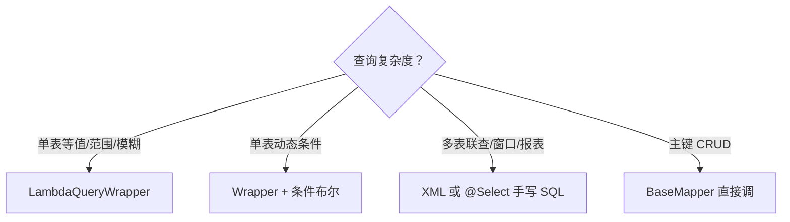

# MyBatis-Plus 增强（在 MyBatis 之上加速 CRUD）
> 面向 JS + Python 背景开发者。  
> 目标：在已掌握 MyBatis 的前提下，用 Plus 的 `BaseMapper`、条件构造器、分页、逻辑删除、自动填充干掉常规 CRUD 样板；知道何时退回手写 SQL。
<!-- more -->

## TL;DR（先看结论）

> 💡 一句话结论：**MyBatis-Plus = MyBatis 的增强工具，不是替代品。** 单表 CRUD / 条件查询 / 分页用 Plus 飞起来；复杂联表、报表、动态到变态的 SQL，仍然写 XML（第 12 篇那套完全有效）。

- 换依赖：`mybatis-plus-spring-boot3-starter`（Boot 3），Mapper 继承 `BaseMapper<T>`
- 实体用 `@TableName` / `@TableId` / `@TableField`；主键策略常见 `ASSIGN_ID`（雪花）或 `AUTO`
- 条件：优先 `LambdaQueryWrapper`（防字段写错）；避免字符串列名魔法值
- 分页：注册 `MybatisPlusInterceptor` + `PaginationInnerInterceptor`，再 `selectPage`
- 逻辑删除、自动填充（创建/更新时间）开箱即用
- 高频坑：Wrapper 条件空导致全表更新/删除、分页插件未注册却调用 page、把 Plus 当 JPA 指望脏检查、复杂 SQL 硬用 Wrapper 拼到崩溃

## 🗺️ 本笔记知识地图



---
## 0. 本笔记重点
> 💡 一句话结论：第 12 篇教你「会写 SQL 就能用 MyBatis」；本篇教你「80% 单表活不必再写 SQL」，同时守住「别把 Plus 用成黑盒 ORM」的底线。

对本系列读者：
| 你熟悉的 | Plus 接近哪一面 |
| --- | --- |
| Prisma `findMany({ where })` | `LambdaQueryWrapper` + `selectList` |
| Sequelize `Model.findAll({ where })` | 同上 |
| ActiveRecord `User.create` | `insert` / `ServiceImpl`（可选） |
| 复杂 raw SQL | 仍回 MyBatis XML / `@Select` |

本篇重点：
1. Plus 与 MyBatis 的边界。
2. 实体注解 + `BaseMapper` 零 SQL CRUD。
3. `LambdaQueryWrapper` 条件查询与更新。
4. 分页、逻辑删除、字段自动填充。
5. 什么时候必须退回手写 SQL。

---
## 1. Plus 与 MyBatis：增强，不替换
> 💡 一句话结论：Plus 在 MyBatis 之上生成通用 SQL、提供插件与工具 API；底层仍是 SqlSession / Mapper 代理，你的 XML `namespace` 方法随时可加。



| 能力 | MyBatis | MyBatis-Plus |
| --- | --- | --- |
| 单表 insert/select/update/delete | 手写 | `BaseMapper` 自带 |
| 条件查询 | 手写 where | Wrapper API |
| 分页 | LIMIT 或 PageHelper | 官方分页插件 |
| 逻辑删除 | 自己写条件 | 注解 + 全局配置 |
| 复杂联表 | XML 强项 | **继续用 XML** |

口诀：**简单用 Plus，复杂用 MyBatis，二者可以在同一个 Mapper 里共存。**

---
## 2. SpringBoot 整合
> 💡 一句话结论：去掉纯 MyBatis starter，换成 Plus Boot3 starter；数据源配置不变；Mapper 改为 `extends BaseMapper<Entity>`。

### 2.1 依赖（Boot 3）
```xml
<dependency>
    <groupId>com.baomidou</groupId>
    <artifactId>mybatis-plus-spring-boot3-starter</artifactId>
    <version>3.5.9</version>
</dependency>
```
注意：
- **不要**与 `mybatis-spring-boot-starter` 同时引入（易冲突）。
- Boot 2.x 用 `mybatis-plus-boot-starter`（无 `boot3`）。
- 版本号以官网发布为准。

### 2.2 配置
```yaml
spring:
  datasource:
    url: jdbc:mysql://localhost:3306/demo?useSSL=false&serverTimezone=Asia/Shanghai&characterEncoding=utf8
    username: root
    password: secret

mybatis-plus:
  configuration:
    map-underscore-to-camel-case: true
    log-impl: org.apache.ibatis.logging.slf4j.Slf4jImpl
  global-config:
    db-config:
      id-type: assign_id          # 雪花；自增用 auto
      logic-delete-field: deleted # 逻辑删除字段名（可选全局）
      logic-delete-value: 1
      logic-not-delete-value: 0
  mapper-locations: classpath*:/mapper/**/*.xml
```

`@MapperScan` 与第 12 篇相同。

### 2.3 实体
```java
@Data
@TableName("users")
public class User {

    @TableId(type = IdType.ASSIGN_ID)
    private Long id;

    @TableField("user_name") // 一般驼峰可省略
    private String userName;

    private String email;
    private Integer age;

    @TableField(fill = FieldFill.INSERT)
    private LocalDateTime createdAt;

    @TableField(fill = FieldFill.INSERT_UPDATE)
    private LocalDateTime updatedAt;

    @TableLogic
    private Integer deleted; // 0 未删 1 已删
}
```

常用注解：
| 注解 | 作用 |
| --- | --- |
| `@TableName` | 表名（默认类名策略可配） |
| `@TableId` | 主键及生成策略 |
| `@TableField` | 列名、是否存在、填充策略 |
| `@TableLogic` | 逻辑删除字段 |
| `@Version` | 乐观锁字段（需插件） |

`IdType` 速览：`AUTO`（数据库自增）、`ASSIGN_ID`（雪花 Long）、`ASSIGN_UUID`、`INPUT`（自行赋值）。

---
## 3. `BaseMapper`：CRUD 零 SQL
> 💡 一句话结论：Mapper 继承 `BaseMapper<User>` 后，单表增删改查方法直接可用；自定义方法仍按 MyBatis 方式加。

```java
@Mapper
public interface UserMapper extends BaseMapper<User> {
    // 复杂查询可继续声明，配 XML / @Select
    List<User> searchComplex(@Param("keyword") String keyword);
}
```

### 3.1 常用方法
```java
userMapper.insert(user);
userMapper.selectById(id);
userMapper.selectBatchIds(List.of(1L, 2L, 3L));
userMapper.selectList(wrapper);
userMapper.selectCount(wrapper);
userMapper.updateById(user);
userMapper.update(null, updateWrapper);
userMapper.deleteById(id);          // 若开启逻辑删除 → UPDATE
userMapper.delete(wrapper);
```

对比：
```ts
// Prisma
await prisma.user.create({ data })
await prisma.user.findUnique({ where: { id } })
await prisma.user.findMany({ where: { age: { gte: 18 } } })
```

```js
// Sequelize
await User.create(data)
await User.findByPk(id)
await User.findAll({ where: { age: { [Op.gte]: 18 } } })
```

### 3.2 Service 层（可选 `IService`）
```java
public interface UserService extends IService<User> {}

@Service
public class UserServiceImpl extends ServiceImpl<UserMapper, User>
        implements UserService {}
```
`save` / `saveBatch` / `getById` / `page` 等更上层封装；团队喜欢「薄 Service」也可只用 Mapper。本系列 REST 示例继续推荐：**Controller → 自建 Service → Mapper**，DTO 转换放 Service。

---
## 4. 条件构造器
> 💡 一句话结论：能写 `LambdaQueryWrapper` 就别写字符串列名；条件必须由业务保证「至少有一个有效限制」，防止全表更新/删除。

### 4.1 `LambdaQueryWrapper`（推荐）
```java
LambdaQueryWrapper<User> qw = new LambdaQueryWrapper<>();
qw.eq(User::getEmail, email)
  .ge(User::getAge, 18)
  .like(User::getUserName, name)
  .orderByDesc(User::getId);

List<User> list = userMapper.selectList(qw);
```

条件方法速查：
| 方法 | SQL 语义 |
| --- | --- |
| `eq` / `ne` | `=` / `<>` |
| `gt` / `ge` / `lt` / `le` | `>` / `>=` / `<` / `<=` |
| `like` / `likeLeft` / `likeRight` | `%x%` / `%x` / `x%` |
| `in` / `notIn` | `IN` |
| `isNull` / `isNotNull` | NULL 判断 |
| `between` | `BETWEEN` |
| `and` / `or` / `nested` | 组合条件 |
| `orderByAsc` / `orderByDesc` | 排序 |
| `select` | 只查部分列 |
| `last` | 拼接末尾（慎用，防注入） |

### 4.2 动态条件（空值跳过）
```java
String name = req.name();
Integer minAge = req.minAge();

LambdaQueryWrapper<User> qw = new LambdaQueryWrapper<>();
qw.like(StrUtil.isNotBlank(name), User::getUserName, name)
  .ge(minAge != null, User::getAge, minAge);
```
第一个 boolean 为 false 时跳过该条件——类似第 12 篇 XML `<if>`。

### 4.3 `UpdateWrapper`
```java
LambdaUpdateWrapper<User> uw = new LambdaUpdateWrapper<>();
uw.eq(User::getId, id)
  .set(User::getEmail, newEmail);

userMapper.update(null, uw); // entity 可为 null，只按 set 更新
```

或改实体后：
```java
user.setEmail(newEmail);
userMapper.updateById(user); // 默认非 null 字段更新（策略可配）
```

### 4.4 危险示例（必读）
```java
// 危险：wrapper 无有效条件 → 全表更新/删除
userMapper.delete(new LambdaQueryWrapper<>());
userMapper.update(null, new LambdaUpdateWrapper<User>().set(User::getAge, 0));
```
生产规范：删除/更新前断言条件非空，或封装安全方法。



---
## 5. 分页插件
> 💡 一句话结论：必须注册分页拦截器，再用 `Page` + `selectPage`；只 `new Page` 不注册插件不会自动拼 LIMIT。

### 5.1 注册
```java
@Configuration
public class MybatisPlusConfig {

    @Bean
    public MybatisPlusInterceptor mybatisPlusInterceptor() {
        MybatisPlusInterceptor interceptor = new MybatisPlusInterceptor();
        interceptor.addInnerInterceptor(new PaginationInnerInterceptor(DbType.MYSQL));
        return interceptor;
    }
}
```

### 5.2 使用
```java
Page<User> page = new Page<>(pageNum, pageSize); // 从 1 开始
LambdaQueryWrapper<User> qw = new LambdaQueryWrapper<>();
qw.orderByDesc(User::getId);

Page<User> result = userMapper.selectPage(page, qw);
long total = result.getTotal();
List<User> records = result.getRecords();
```

对比 PageHelper（第 12 篇）：Plus 分页与 `BaseMapper` 一体，返回类型明确；二者一般**二选一**，别重复拦截。

---
## 6. 逻辑删除与自动填充
> 💡 一句话结论：`@TableLogic` 让 `delete` 变 `UPDATE`，查询自动带「未删除」条件；填充器在插入/更新时写入时间等审计字段。

### 6.1 逻辑删除
表字段示例：`deleted TINYINT DEFAULT 0`  
实体：`@TableLogic private Integer deleted;`

效果：
- `deleteById` → `UPDATE users SET deleted=1 WHERE id=? AND deleted=0`
- `selectById` → 自动追加 `AND deleted=0`
- 真物理删除需自行写 SQL 或特殊方法（慎用）

### 6.2 自动填充
```java
@Component
public class MetaObjectHandlerImpl implements MetaObjectHandler {

    @Override
    public void insertFill(MetaObject metaObject) {
        strictInsertFill(metaObject, "createdAt", LocalDateTime::now, LocalDateTime.class);
        strictInsertFill(metaObject, "updatedAt", LocalDateTime::now, LocalDateTime.class);
    }

    @Override
    public void updateFill(MetaObject metaObject) {
        strictUpdateFill(metaObject, "updatedAt", LocalDateTime::now, LocalDateTime.class);
    }
}
```
字段上需 `@TableField(fill = FieldFill.INSERT)` 等，填充器才会生效。

---
## 7. 与自定义 SQL 共存
> 💡 一句话结论：同一个 `UserMapper` 可以既有 Plus 通用方法，又有 XML 复杂查询——这是相对「纯 ORM」最大的灵活性。

```java
@Mapper
public interface UserMapper extends BaseMapper<User> {

    @Select("""
            SELECT u.* FROM users u
            INNER JOIN orders o ON o.user_id = u.id
            WHERE o.amount > #{minAmount} AND u.deleted = 0
            """)
    List<User> findUsersWithBigOrders(@Param("minAmount") BigDecimal minAmount);
}
```

或 XML：
```xml
<select id="findUsersWithBigOrders" resultType="User">
    ...
</select>
```

选型建议：
| 场景 | 推荐 |
| --- | --- |
| 按 id / 简单条件 CRUD | `BaseMapper` / Wrapper |
| 动态单表筛选 | `LambdaQueryWrapper` |
| 多表 join、统计报表 | XML |
| 批量复杂 upsert | XML / 存储过程 |
| 调用方要强类型列引用 | Lambda Wrapper |

---
## 8. 完整 Service 示例（串 REST）
> 💡 一句话结论：Controller 仍用 DTO + 校验；Service 内 Entity ↔ DTO，数据访问用 Plus；找不到抛第 11 篇业务异常。

```java
@Service
public class UserService {

    private final UserMapper userMapper;

    public UserService(UserMapper userMapper) {
        this.userMapper = userMapper;
    }

    public UserResponse get(Long id) {
        User user = userMapper.selectById(id);
        if (user == null) {
            throw new BusinessException(40401, "用户不存在", HttpStatus.NOT_FOUND);
        }
        return toResponse(user);
    }

    public PageResponse<UserResponse> page(int pageNum, int pageSize, String name) {
        Page<User> page = new Page<>(pageNum, pageSize);
        LambdaQueryWrapper<User> qw = new LambdaQueryWrapper<>();
        qw.like(name != null && !name.isBlank(), User::getUserName, name)
          .orderByDesc(User::getId);
        Page<User> result = userMapper.selectPage(page, qw);
        List<UserResponse> list = result.getRecords().stream().map(this::toResponse).toList();
        return new PageResponse<>(result.getTotal(), list);
    }

    @Transactional
    public UserResponse create(UserCreateRequest req) {
        Long cnt = userMapper.selectCount(new LambdaQueryWrapper<User>()
                .eq(User::getEmail, req.email()));
        if (cnt != null && cnt > 0) {
            throw new BusinessException(40901, "邮箱已被注册", HttpStatus.CONFLICT);
        }
        User user = new User();
        user.setUserName(req.name());
        user.setEmail(req.email());
        user.setAge(req.age());
        userMapper.insert(user);
        return toResponse(user);
    }
}
```

---
## 9. 对比三端心智模型

| 维度 | MyBatis-Plus | Prisma | Sequelize |
| --- | --- | --- | --- |
| 定位 | MyBatis 增强 | 全栈 ORM + 生成客户端 | Node ORM |
| 单表 CRUD | `BaseMapper` | `model.create/find` | `Model.create/find` |
| where | Lambda Wrapper | `where: {}` | `where: {}` |
| 分页 | `Page` + 插件 | `skip/take` | `limit/offset` |
| 逻辑删 | `@TableLogic` | middleware / 字段约定 | `paranoid` |
| 复杂 SQL | 退回 MyBatis XML | `$queryRaw` | `query` / literal |
| 学习前提 | 先会 MyBatis/SQL | Schema 优先 | Model 优先 |

对 JS/Python 开发者：Plus 的 Wrapper **像** Prisma where，但生成的是你可控的 SQL；出问题打开日志看语句即可（第 12 篇同款）。

---
## 10. 常见坑点
> 💡 一句话结论：全表更新、分页不生效、逻辑删除「删不掉查还在」，是 Plus 新手三大冤种。

1. **Wrapper 无条件就 update/delete**：全表事故；加断言。
2. **分页插件未注册**：`selectPage` 查全表再内存切（或行为不符预期）。
3. **Boot3 仍引入 boot2 starter**：启动失败或版本混乱。
4. **与官方 MyBatis starter 双依赖**：冲突。
5. **以为改实体自动 UPDATE**：必须 `updateById` / `update`，没有 JPA 脏检查。
6. **逻辑删除后唯一键冲突**：邮箱唯一索引仍占着「已删」行，需联合唯一或换策略。
7. **`selectById` 查到已逻辑删除数据**：检查 `@TableLogic` / 全局配置是否生效。
8. **字符串 `QueryWrapper` 列名写错**：运行期才爆；改用 Lambda。
9. **`last("limit 1")` 拼接用户输入**：注入风险。
10. **复杂 join 硬用 Wrapper**：可读性崩盘 → 回 XML。

---
## 11. 小结

| 主题 | 记住什么 |
| --- | --- |
| 关系 | Plus 增强 MyBatis，XML 不丢 |
| CRUD | `BaseMapper<T>` |
| 条件 | 优先 `LambdaQueryWrapper` |
| 分页 | 拦截器 + `Page` |
| 删除 | `@TableLogic` 变更新 |
| 审计 | `MetaObjectHandler` 填充 |
| 边界 | 复杂 SQL 回第 12 篇 |

口诀：**单表 Plus 走，联表 XML 守；Lambda 写条件，无 where 不做。**

---
## 12. 练习建议
1. 把第 12 篇 `UserMapper` 改成 `extends BaseMapper<User>`，删掉手写 CRUD 注解，测通增删改查。
2. 用 `LambdaQueryWrapper` 实现 name 模糊 + age 下限的分页列表。
3. 加 `deleted` 字段与 `@TableLogic`，观察 delete / select 实际 SQL。
4. 实现创建/更新时间自动填充。
5. 故意空 Wrapper 调用 delete，在测试环境验证危险性（然后马上加防护）。
6. 写一个多表 join，坚持用 XML，与 Wrapper 方案对比可读性。
7. 用 Prisma / Sequelize 实现同样分页筛选，对比 API 形状。
8. （选做）启用乐观锁 `@Version` + 插件，模拟并发更新。

---
## 13. 下一篇
下一篇：**Java 集合框架**（已生成）。  
重点回顾：
- List / Set / Map 选型
- ArrayList、HashMap 底层直觉
- 遍历、排序、与 JS 数组 / Python list/dict 对照
- 并发集合预告（详细留并发篇）

