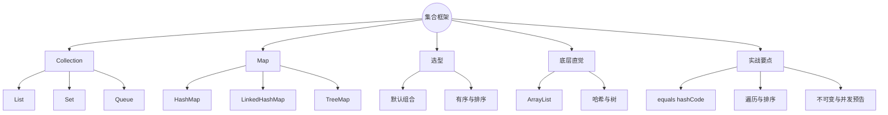
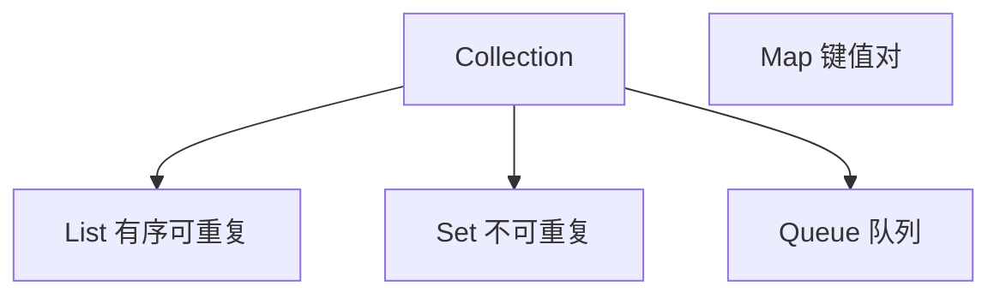
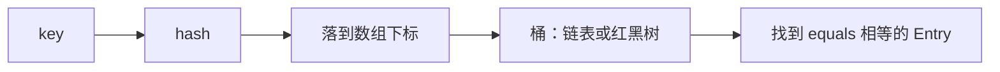
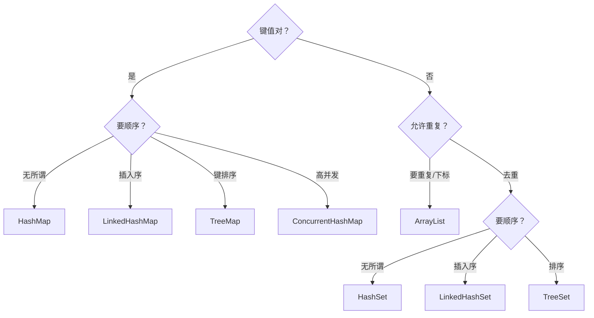

# Java 集合框架：List / Set / Map 选型与底层直觉
> 面向 JS + Python 背景开发者。  
> 目标：建立集合族谱心智模型，会按场景选型，理解 ArrayList / HashMap 的直觉复杂度，横向对比 JS 数组与 Map、Python list / dict / set。Stream 深挖留给下一篇。
<!-- more -->

## TL;DR（先看结论）

> 💡 一句话结论：**有序可重复用 List，去重用 Set，键值查找用 Map。** 日常默认 `ArrayList` + `HashMap`；要插入序用 `LinkedHash*`；要排序用 `Tree*`。和 JS/Python 最大差异：**接口 + 实现分离**，且 `HashMap` 的键必须正确实现 `equals` / `hashCode`。

- 族谱：`Collection`（List / Set / Queue）与独立的 `Map`
- 默认选型：`ArrayList`、`HashSet`、`HashMap`
- 底层直觉：ArrayList ≈ 动态数组；HashMap ≈ 数组 + 链表/红黑树
- 遍历：增强 for、迭代器、`forEach`；改结构时小心 `ConcurrentModificationException`
- 高频坑：用可变对象当 Hash 键、`==` 比内容、边遍历边删不走迭代器、把 `Hashtable`/`Vector` 当现代首选、并发场景仍用普通 HashMap

## 🗺️ 本笔记知识地图



---
## 0. 本笔记重点
> 💡 一句话结论：JS 里「数组万能」、Python 里 list/dict/set 三分天下；Java 把「接口契约」和「实现细节」拆开——先选接口，再选实现。

对照速记：
| 需求 | Java | JavaScript | Python |
| --- | --- | --- | --- |
| 有序列表 | `List` / `ArrayList` | `Array` | `list` |
| 去重集合 | `Set` / `HashSet` | `Set` | `set` |
| 键值映射 | `Map` / `HashMap` | `Map` / 对象 | `dict` |
| 保持插入序 | `LinkedHashMap` 等 | `Map` 默认插入序 | `dict` 3.7+ 插入序 |
| 按键排序 | `TreeMap` | 自己 sort | 可用 `SortedDict` 等 |

本篇重点：族谱、选型、三大实现直觉、`equals`/`hashCode`、遍历与修改、不可变工厂。并发容器只点名，细节进并发篇。

---
## 1. 族谱：先认接口
> 💡 一句话结论：`Collection` 管「一堆元素」；`Map` 管「键 → 值」。编程时尽量依赖接口类型：`List<String> list = new ArrayList<>()`。



| 接口 | 核心语义 | 常用实现 |
| --- | --- | --- |
| `List` | 下标、可重复、有序 | `ArrayList`、`LinkedList` |
| `Set` | 不可重复（按 equals） | `HashSet`、`LinkedHashSet`、`TreeSet` |
| `Queue` / `Deque` | 入队出队 / 双端 | `ArrayDeque`、`LinkedList`、`PriorityQueue` |
| `Map` | 键唯一 | `HashMap`、`LinkedHashMap`、`TreeMap` |

```java
List<String> names = new ArrayList<>();
Set<String> tags = new HashSet<>();
Map<String, Integer> score = new HashMap<>();
```

为什么写接口：换实现（如改成 `LinkedList`）时调用方代码少改；Spring 注入、方法参数也更灵活。

---
## 2. List：有序可重复
> 💡 一句话结论：默认 `ArrayList`（随机访问快）；头尾频繁插删再考虑 `LinkedList` / `ArrayDeque`。对应 JS `Array`、Python `list`。

### 2.1 常用 API
```java
List<String> list = new ArrayList<>();
list.add("a");
list.add(0, "head");       // 按下标插入
list.get(0);
list.set(0, "H");
list.remove("a");          // 按对象（equals）
list.remove(0);            // 按下标
list.size();
list.contains("H");
list.isEmpty();
```

### 2.2 ArrayList vs LinkedList
| 维度 | ArrayList | LinkedList |
| --- | --- | --- |
| 结构 | 动态数组 | 双向链表 |
| `get(i)` | O(1) | O(n) |
| 末尾增删 | 均摊 O(1) | O(1) |
| 中间插删 | O(n) 搬移 | O(n) 找节点 + O(1) 改指针 |
| 内存 | 连续，缓存友好 | 节点开销大 |
| 默认场景 | **首选** | 较少真需要 |

直觉：ArrayList 像 JS 数组；中间狂插删并不意味着 LinkedList 一定更快（找节点也慢），多数业务仍是 ArrayList 赢。

### 2.3 从数组 / 固定元素创建
```java
List<String> a = List.of("x", "y");          // 不可变（Java 9+）
List<String> b = new ArrayList<>(List.of("x", "y")); // 可变副本
List<String> c = Arrays.asList("x", "y");    // 定长，不能 add/remove
```

---
## 3. Set：去重
> 💡 一句话结论：要唯一用 `HashSet`；要插入序用 `LinkedHashSet`；要排序用 `TreeSet`。判重靠 `equals` + `hashCode`（Tree 靠 `compareTo`）。

```java
Set<String> set = new HashSet<>();
set.add("a");
set.add("a"); // 忽略
set.contains("a");
set.remove("a");
```

| 实现 | 顺序 | 复杂度直觉 | 备注 |
| --- | --- | --- | --- |
| `HashSet` | 无 | 均摊 O(1) | 基于 HashMap |
| `LinkedHashSet` | 插入序 | 均摊 O(1) | 多链表维护顺序 |
| `TreeSet` | 排序序 | O(log n) | 元素需可比 |

对比：
```js
const s = new Set(['a', 'a']); // {'a'}
```
```python
s = {'a', 'a'}  # {'a'}
```

注意：自定义对象放进 Set/Map 键，**必须**正确重写 `equals`/`hashCode`（见第 6 节）。

---
## 4. Map：键值查找
> 💡 一句话结论：默认 `HashMap`；要插入序或做简易 LRU 看 `LinkedHashMap`；要按键排序用 `TreeMap`。键唯一，后写覆盖先写。

### 4.1 常用 API
```java
Map<String, Integer> map = new HashMap<>();
map.put("age", 18);
map.get("age");                 // 18
map.getOrDefault("x", 0);       // 缺省
map.containsKey("age");
map.containsValue(18);
map.remove("age");
map.putIfAbsent("age", 20);     // 没有才放
map.computeIfAbsent("n", k -> 1);
```

遍历：
```java
for (Map.Entry<String, Integer> e : map.entrySet()) {
    System.out.println(e.getKey() + "=" + e.getValue());
}
map.forEach((k, v) -> System.out.println(k + "=" + v));
```

### 4.2 HashMap / LinkedHashMap / TreeMap
| 实现 | 顺序 | 典型用途 |
| --- | --- | --- |
| `HashMap` | 无保证 | **默认字典** |
| `LinkedHashMap` | 插入序（可改访问序） | 输出稳定、简易 LRU |
| `TreeMap` | 键排序 | 范围查询、有序报表 |

对比 JS：
```js
const m = new Map();
m.set('age', 18);
// 普通对象 {} 键会被转成字符串；Map 保留键类型
```
对比 Python：`dict` 键需可哈希；Java `HashMap` 键需稳定的 `hashCode`/`equals`。

### 4.3 不要用的遗老
| 类 | 说明 |
| --- | --- |
| `Hashtable` | 古老同步 Map，用 `ConcurrentHashMap` |
| `Vector` | 古老同步 List，用 `ArrayList` 或并发集合 |
| `Stack` | 继承 Vector；用 `Deque`（`ArrayDeque`） |

---
## 5. Queue / Deque（够用即可）
> 💡 一句话结论：队列场景优先 `ArrayDeque`；要优先级用 `PriorityQueue`；阻塞队列留给并发篇。

```java
Deque<String> q = new ArrayDeque<>();
q.offerLast("a");   // 入队
q.pollFirst();      // 出队
q.push("x");        // 栈：头顶插入
q.pop();
```

| 结构 | 实现 | 场景 |
| --- | --- | --- |
| 双端队列 / 栈 | `ArrayDeque` | 一般队列、栈 |
| 优先级队列 | `PriorityQueue` | 堆、TopK |
| 阻塞队列 | `LinkedBlockingQueue` 等 | 生产者消费者（并发篇） |

---
## 6. equals 与 hashCode（Hash 结构灵魂）
> 💡 一句话结论：放进 `HashSet` / 作 `HashMap` 键的对象，相等性必须与哈希一致：**equals 相等 ⇒ hashCode 必须相等**。用可变字段当键且事后改字段，人会消失在桶里。

```java
public final class UserId {
    private final long id;
    public UserId(long id) { this.id = id; }

    @Override
    public boolean equals(Object o) {
        if (this == o) return true;
        if (!(o instanceof UserId userId)) return false;
        return id == userId.id;
    }

    @Override
    public int hashCode() {
        return Long.hashCode(id);
    }
}
```

Lombok：`@EqualsAndHashCode` / `@Data` 可生成（第 07 篇），但要清楚哪些字段参与相等。

对比：
- JS `Map` 对对象键是**引用**相等（除非你自己规范）
- Python `__eq__` + `__hash__` 规则与 Java 同构

---
## 7. 底层直觉（面试高频，够用版）
> 💡 一句话结论：ArrayList 是可扩容数组；HashMap 是「数组 + 链表（或红黑树）」；负载因子默认 0.75，超了扩容。

### 7.1 ArrayList
- 默认容量 10（首次 add 时分配，细节随 JDK 略有差异）
- 满则扩容（通常 1.5 倍），涉及数组拷贝
- 随机访问快；中间插入要搬元素

### 7.2 HashMap


- JDK 8+：桶内链表过长（默认 ≥8 且数组够大）树化，缩短最坏查找
- 扩容：容量翻倍，元素重新分布
- `null`：HashMap 允许一个 null 键；Hashtable / ConcurrentHashMap 不允许 null 键

复杂度口头账：
| 操作 | ArrayList | HashMap（均摊） | TreeMap |
| --- | --- | --- | --- |
| 按值查找 | O(n) | — | — |
| 按下标 / 按键 | get O(1) | get/put O(1) | O(log n) |
| 中间插入 | O(n) | — | — |

---
## 8. 遍历、修改与排序
> 💡 一句话结论：只读遍历用增强 for；遍历中删除用迭代器 `remove` 或 `removeIf`；排序用 `Collections.sort` / `list.sort` / `Comparator`。

### 8.1 遍历
```java
for (String s : list) { ... }

Iterator<String> it = list.iterator();
while (it.hasNext()) {
    String s = it.next();
    if (s.isBlank()) it.remove(); // 合法删除
}

list.removeIf(String::isBlank);   // 更干净
list.forEach(System.out::println);
```

增强 for 底层是迭代器；循环体内直接 `list.remove(...)` 易触发 **fail-fast** → `ConcurrentModificationException`。

### 8.2 排序
```java
list.sort(Comparator.naturalOrder());
list.sort(Comparator.comparing(User::getAge).reversed());
Collections.sort(list); // List 需可比或传 Comparator
```

`TreeSet`/`TreeMap` 本身有序；`HashMap` 无序，不要假设迭代顺序稳定（除非 LinkedHashMap）。

### 8.3 工具类
```java
Collections.emptyList();
Collections.unmodifiableList(list); // 视图只读，底层变仍可能反映
Collections.frequency(list, "a");
Collections.singletonList("x");
```

Java 9+ 更推荐：`List.of` / `Set.of` / `Map.of`（不可变、不可含 null）。

---
## 9. 选型决策表
> 💡 一句话结论：先问「要不要键值、要不要重复、要什么顺序、是否并发」，四问答完实现基本定了。



Web 开发经验频率：
1. `ArrayList` + `HashMap`（最高）
2. `Optional` 包装单值（不是集合，但常一起出现）
3. `LinkedHashMap` 保序输出 JSON 字段
4. 并发：`ConcurrentHashMap`、`CopyOnWriteArrayList`（并发篇）

---
## 10. 与 JS / Python 对照小结

| 操作 | Java | JS | Python |
| --- | --- | --- | --- |
| 创建列表 | `new ArrayList<>()` | `[]` | `[]` |
| 追加 | `add` | `push` | `append` |
| 长度 | `size()` | `.length` | `len` |
| 映射 | `new HashMap<>()` | `new Map()` / `{}` | `{}` |
| 取键 | `get` | `get` / `obj[k]` | `d[k]` |
| 缺省 | `getOrDefault` | `??` / `has` | `dict.get` |
| 去重 | `HashSet` | `Set` | `set` |
| 不可变 | `List.of` | `Object.freeze` 有限 | `tuple` / frozenset |

Java 特有摩擦：
1. **只能存引用类型**：`List<int>` 非法 → `List<Integer>`，装箱拆箱有成本。
2. **接口/实现分离**：左边接口右边实现。
3. **泛型擦除**：运行期 `List<String>` 与 `List<Integer>` 类型信息有限（泛型篇/下一篇周边还会提到）。

---
## 11. 常见坑点
> 💡 一句话结论：一半的集合 bug 来自相等性与遍历时结构修改；另一半来自选错实现或误用同步老类。

1. **`list.add(i)` 与数组长度**：集合用 `size()`，不要当 `.length`。
2. **`Arrays.asList` 后 add**：抛 `UnsupportedOperationException`。
3. **增强 for 里直接删**：`ConcurrentModificationException`。
4. **可变对象当 Hash 键并修改字段**：再也 get 不到。
5. **`==` 比 Integer/String 内容**：包装类用 `equals`（第 02 篇）。
6. **假设 HashMap 有序**：输出顺序不稳定。
7. **`Map.of` 放 null**：直接异常。
8. **并发读写普通 HashMap**：可能死循环 / 数据丢失（JDK 8 后扩容问题缓解但仍不安全）→ `ConcurrentHashMap`。
9. **用 `LinkedList` 当默认 List**：多数场景更慢更耗内存。
10. **`hashCode` 每次重新算且不稳定**：同上，键会丢。

---
## 12. 小结

| 场景 | 推荐 |
| --- | --- |
| 默认列表 | `ArrayList` |
| 默认去重 | `HashSet` |
| 默认字典 | `HashMap` |
| 保插入序 Map | `LinkedHashMap` |
| 排序 Map/Set | `TreeMap` / `TreeSet` |
| 栈 / 双端队列 | `ArrayDeque` |
| 不可变小集合 | `List.of` / `Set.of` / `Map.of` |
| 高并发 Map | `ConcurrentHashMap` |

口诀：**List 有序可重复，Set 去重，Map 键值；默认 ArrayList + HashMap；哈希靠 equals/hashCode。**

---
## 13. 练习建议
1. 用 `ArrayList` 实现「读入一串整数，去重但保序」（提示：`LinkedHashSet`）。
2. 统计词频：`Map<String, Integer>`，对比 JS `Map` / Python `Counter`。
3. 自定义 `record Point(int x, int y)` 放入 `HashSet`，确认去重；再故意只重写 equals 不重写 hashCode，观察后果。
4. 遍历中删除偶数：分别用错误写法与 `removeIf` / 迭代器。
5. 对 `List<User>` 按 age 降序、同 age 按 name 升序排序。
6. 比较 `ArrayList` 末尾插入 100 万次与 `LinkedList` 随机下标插入的耗时体感。
7. （选做）用 `LinkedHashMap` 实现简单 LRU（`accessOrder=true` + 超容量删 eldest）。
8. （选做）阅读 `HashMap.putVal` 源码注释，对照本节树化/扩容描述。

---
## 14. 下一篇
下一篇：**Java Lambda 与 Stream 流**（已生成）。  
重点回顾：
- Lambda / 方法引用 / 函数式接口
- Stream 流水线：filter / map / flatMap / reduce / collect
- 惰性求值、只能消费一次
- 与 JS 数组高阶方法、Python 推导式对照
- 并行流适用边界
