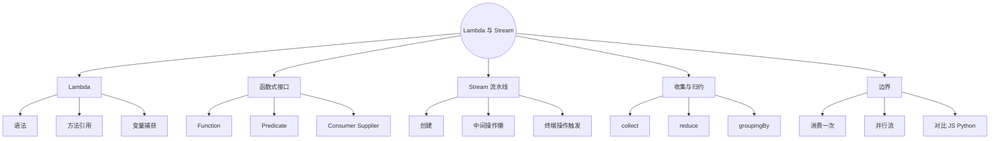
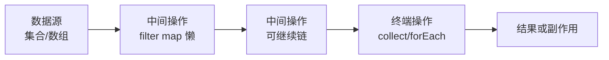
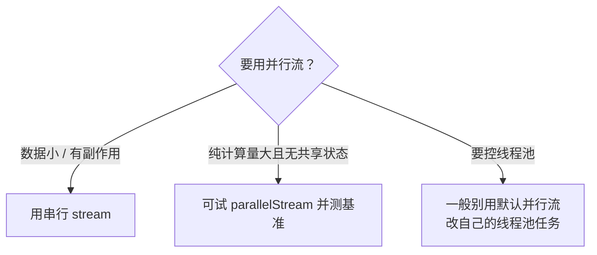

# Java Lambda 与 Stream 流（对比 JS 数组方法 / Python 推导式）
> 面向 JS + Python 背景开发者。  
> 目标：掌握 Lambda、方法引用、常用函数式接口，以及 Stream 流水线（过滤、映射、归约、收集）；吃透惰性求值与「只能消费一次」，分清并行流边界。
<!-- more -->

## TL;DR（先看结论）

> 💡 一句话结论：**Lambda 让「行为」能当参数传；Stream 把集合操作写成流水线。** 长得像 `array.filter().map()`，但 Stream **惰性、可融合、用一次就废**，不是集合本身。

- Lambda ≈ JS 箭头函数；方法引用 `User::getName` 更短
- 四大函数式接口：`Function` / `Predicate` / `Consumer` / `Supplier`（再加 `UnaryOperator` 等）
- Stream 三阶段：创建 → 中间操作（懒）→ 终端操作（才真正执行）
- 收集：`Collectors.toList()` / `toSet()` / `toMap()` / `groupingBy` / `joining`
- 高频坑：流用两次、中间操作以为立刻执行、`parallelStream` 乱用于有状态/小数据、在流里抛受检异常很疼、`map` vs `flatMap` 搞混

## 🗺️ 本笔记知识地图



---
## 0. 本笔记重点
> 💡 一句话结论：你会 `arr.filter(x => ...).map(...)` 就已有 70% 直觉；剩下 30% 是 Java 的类型、惰性、收集器与并行边界。

对照：
| 概念 | Java | JavaScript | Python |
| --- | --- | --- | --- |
| 匿名函数 | Lambda | 箭头函数 | `lambda` |
| 过滤 | `filter` | `filter` | 推导式 / `filter` |
| 映射 | `map` | `map` | 推导式 / `map` |
| 扁平 | `flatMap` | `flatMap` | 嵌套推导 |
| 归约 | `reduce` / `collect` | `reduce` | `functools.reduce` |
| 流水线对象 | `Stream` | 数组方法链（立即） | 生成器（懒） |

本篇重点：Lambda 语法与捕获、函数式接口、Stream 懒执行、常用 API、`collect`、并行流何时用。

---
## 1. Lambda 表达式
> 💡 一句话结论：Lambda 是「实现单抽象方法接口」的短写法；类型由目标接口推断（如 `Predicate<String>`）。

### 1.1 语法
```java
// (参数) -> 表达式
Predicate<String> p = s -> s.length() > 3;

// (参数) -> { 语句块 }
Consumer<String> c = s -> {
    System.out.println(s);
};

// 无参
Supplier<Double> random = () -> Math.random();

// 多参
BinaryOperator<Integer> add = (a, b) -> a + b;
```

对比 JS：
```js
const p = s => s.length > 3;
const add = (a, b) => a + b;
```

### 1.2 方法引用
```java
list.forEach(System.out::println);     // 静态/实例方法
users.stream().map(User::getName);     // 实例方法挂在类名
Supplier<User> s = User::new;          // 构造器
list.sort(String::compareToIgnoreCase);
```

| 形式 | 含义 | 例子 |
| --- | --- | --- |
| `类::静态方法` | 静态方法 | `Integer::parseInt` |
| `对象::实例方法` | 绑定实例 | `System.out::println` |
| `类::实例方法` | 第一个参数当 this | `String::toLowerCase` |
| `类::new` | 构造器 | `ArrayList::new` |

### 1.3 变量捕获
Lambda 可捕获外层**实际上的 final** 变量（不要求写 `final`，但不能再赋值）：
```java
String prefix = "Hi ";
list.forEach(s -> System.out.println(prefix + s)); // OK

// int i = 0;
// list.forEach(s -> i++); // 编译错误：i 非 effectively final
```
对比 JS：闭包可改外层 `let`；Java 更严，避免并发下的迷惑语义。

---
## 2. 函数式接口
> 💡 一句话结论：只有一个抽象方法的接口才能用 Lambda；JDK 在 `java.util.function` 备好了常用形状。

```java
@FunctionalInterface
public interface MyHandler {
    void handle(String msg);
}
MyHandler h = msg -> System.out.println(msg);
```

| 接口 | 形状 | 典型用途 |
| --- | --- | --- |
| `Function<T,R>` | T → R | `map` |
| `Predicate<T>` | T → boolean | `filter` |
| `Consumer<T>` | T → void | `forEach` |
| `Supplier<T>` | () → T | 工厂、懒创建 |
| `UnaryOperator<T>` | T → T | 同类型转换 |
| `BiFunction<T,U,R>` | (T,U) → R | 两参映射 |
| `Comparator<T>` | 比较 | `sort` |

原始类型特化（减少装箱）：`IntPredicate`、`ToIntFunction`、`IntStream` 等。

---
## 3. Stream 是什么
> 💡 一句话结论：Stream 是**数据管道**，不是新容器；不存储元素，只描述怎么算；碰到终端操作才执行。



三阶段：
1. **创建**：`list.stream()`、`Stream.of(...)`、`Files.lines(...)`
2. **中间操作**：返回 Stream，懒、可融合
3. **终端操作**：触发计算，之后流结束

对比 JS：`filter/map` 每次返回**新数组**，一步就算完。  
对比 Python：生成器 / 迭代器更接近「懒」；列表推导通常立即出 list。

---
## 4. 创建 Stream
```java
list.stream();
list.parallelStream();

Stream.of("a", "b", "c");
Stream.empty();

int[] arr = {1, 2, 3};
Arrays.stream(arr);          // IntStream

"hello".chars();             // IntStream of code points/chars

Stream.iterate(0, n -> n + 1).limit(10);
Stream.generate(Math::random).limit(5);
```

---
## 5. 常用中间操作
> 💡 一句话结论：`filter` 筛选，`map` 一对一变，`flatMap` 一对多再拍平，`distinct`/`sorted`/`limit`/`skip` 做集合级加工——全都懒。

```java
List<String> result = users.stream()
        .filter(u -> u.getAge() >= 18)
        .map(User::getName)
        .map(String::toLowerCase)
        .distinct()
        .sorted()
        .limit(10)
        .toList(); // Java 16+；旧版 collect(Collectors.toList())
```

| 操作 | 含义 | JS 近似 |
| --- | --- | --- |
| `filter` | 保留 | `filter` |
| `map` | 转换元素 | `map` |
| `flatMap` | 映射成流再合并 | `flatMap` |
| `distinct` | 去重（equals） | `[...new Set]` |
| `sorted` | 排序 | `sort`（注意 JS 会改原数组） |
| `peek` | 调试偷看 | 无纯对应，慎用 |
| `limit` / `skip` | 截取 | `slice` |
| `takeWhile` / `dropWhile` | 按条件截（Java 9+） | — |

### 5.1 `map` vs `flatMap`
```java
// map：List<String> → Stream<List<String>> 还是「流的列表」
List<List<String>> nested = List.of(List.of("a", "b"), List.of("c"));
Stream<List<String>> s1 = nested.stream().map(list -> list);

// flatMap：摊成 Stream<String>
Stream<String> s2 = nested.stream().flatMap(List::stream);
// a b c
```

```js
[[1,2],[3]].flatMap(x => x) // [1,2,3]
```

### 5.2 惰性证明
```java
List.of(1, 2, 3, 4).stream()
        .filter(n -> {
            System.out.println("filter " + n);
            return n % 2 == 0;
        })
        .map(n -> {
            System.out.println("map " + n);
            return n * n;
        });
// 没有终端操作 → 上面一行都不打印
```

加上 `.toList()` 后才会按需执行（且可能融合、短路，如 `findFirst` 不跑完全表）。

---
## 6. 终端操作
> 💡 一句话结论：终端操作分「吃出结果」与「只做事」；一旦调用，流就不能再用。

### 6.1 匹配与查找
```java
boolean any = stream.anyMatch(u -> u.getAge() > 60);
boolean all = stream.allMatch(u -> u.getAge() > 0);
boolean none = stream.noneMatch(Objects::isNull);

Optional<User> first = users.stream().filter(...).findFirst();
Optional<User> anyEl = users.parallelStream().filter(...).findAny();
```

### 6.2 聚合
```java
long count = stream.count();
Optional<Integer> max = stream.max(Comparator.naturalOrder());
Optional<Integer> min = stream.min(Integer::compareTo);

int sum = IntStream.of(1, 2, 3).sum();
OptionalDouble avg = IntStream.of(1, 2, 3).average();
```

### 6.3 `reduce`
```java
Optional<Integer> sum = Stream.of(1, 2, 3).reduce(Integer::sum);
int sum2 = Stream.of(1, 2, 3).reduce(0, Integer::sum);

// 三参数形式（并行友好）：identity, accumulator, combiner
```

对比 JS `reduce`、Python `functools.reduce`——概念同，Java 更常鼓励用 `collect` 做复杂汇总。

### 6.4 `forEach`
```java
stream.forEach(System.out::println);
// 有顺序要求用 forEachOrdered（并行时）
```
纯副作用终端；能 `collect` 就别靠 forEach 拼外部 list（线程安全与风格都更差）。

---
## 7. Collectors：最常用的终点
> 💡 一句话结论：业务里 80% 终端是 `collect`；先背 `toList` / `toSet` / `toMap` / `groupingBy` / `joining`。

```java
List<String> list = stream.collect(Collectors.toList());
List<String> list16 = stream.toList(); // Java 16+ 不可变列表

Set<String> set = stream.collect(Collectors.toSet());

Map<Long, User> idMap = users.stream()
        .collect(Collectors.toMap(User::getId, Function.identity()));

Map<Long, User> safe = users.stream()
        .collect(Collectors.toMap(User::getId, Function.identity(), (a, b) -> a));
// 键冲突要给 merge 函数，否则 IllegalStateException

String csv = stream.collect(Collectors.joining(", "));

Map<Integer, List<User>> byAge = users.stream()
        .collect(Collectors.groupingBy(User::getAge));

Map<Boolean, List<User>> adult = users.stream()
        .collect(Collectors.partitioningBy(u -> u.getAge() >= 18));

Double avgAge = users.stream()
        .collect(Collectors.averagingInt(User::getAge));
```

`groupingBy` 下游还可接 `counting()`、`mapping(...)` 等二级收集器——类似 SQL `GROUP BY` + 聚合。

---
## 8. Optional 与 Stream 协作
> 💡 一句话结论：查找类 API 常返回 `Optional`，用 `map`/`flatMap`/`orElse` 消化，少直接 `get()`。

```java
String name = users.stream()
        .filter(u -> u.getId().equals(id))
        .findFirst()
        .map(User::getName)
        .orElse("unknown");
```

```java
Optional.ofNullable(user)
        .map(User::getProfile)
        .map(Profile::getEmail)
        .orElse(null);
```
对比 JS 可选链 `user?.profile?.email`；Python 无内置 Optional，常用 `or` / 自定义。

---
## 9. 完整例子：从 Entity 到响应 DTO
```java
public List<UserResponse> searchAdults(String keyword) {
    return userMapper.selectList(null).stream()
            .filter(u -> u.getAge() != null && u.getAge() >= 18)
            .filter(u -> keyword == null || keyword.isBlank()
                    || u.getUserName().contains(keyword))
            .sorted(Comparator.comparing(User::getId).reversed())
            .map(u -> new UserResponse(u.getId(), u.getUserName(), u.getEmail(), u.getAge()))
            .toList();
}
```

注意：大数据量筛选应下推到 SQL（MyBatis / Plus），别把整表 `selectList` 再 Stream 过滤——Stream 擅长**内存中已有的集合**加工，不是替换数据库。

---
## 10. 并行流
> 💡 一句话结论：`parallelStream()` 用公共 ForkJoinPool 切分任务；**小集合、有状态、要保序、抢锁**的场景往往更慢或更危险，默认先写串行。

```java
long count = list.parallelStream()
        .filter(this::isOk)
        .count();
```

适合：纯计算、无共享可变状态、数据量大、操作无顺序依赖。  
不适合：访问同一 ArrayList 外部变量、依赖线程本地上下文、简单 IO、元素很少。

对比：这和 Node「并行」不是一回事——这里是**真多线程**；细节进并发篇。



---
## 11. 对比三端心智

| 维度 | Java Stream | JS 数组链 | Python |
| --- | --- | --- | --- |
| 求值 | 懒（到终端） | 每步立即新数组 | 推导立即；生成器懒 |
| 可复用 | **否**（消费一次） | 原数组还在 | 生成器一次；list 多次 |
| 类型 | 泛型流 | 动态 | 动态 / 类型提示 |
| 并行 | `parallelStream` | Worker 自己搞 | multiprocessing 等 |
| 空安全 | 常配合 Optional | `?.` | 习惯判断 |

口诀：**像 JS 一样链式写，像生成器一样懒执行，像迭代器一样用一次。**

---
## 12. 常见坑点
> 💡 一句话结论：流用两次、以为 filter 立刻跑、并行乱加、受检异常进 Lambda，是四大冤种。

1. **同一 Stream 消费两次**：第二次 `IllegalStateException`。
2. **只有中间操作**：什么都不发生，还以为 bug。
3. **`map` 成 Stream 却忘 `flatMap`**：结构多层。
4. **`toMap` 键重复**：必须提供 merge 函数。
5. **在 Lambda 里修改外部可变集合**：难推理，并行时更危。
6. **`parallelStream` + `ArrayList.add`**：线程不安全。
7. **受检异常**：Lambda 不能直接 throws，需包装成非受检或提前处理。
8. **`peek` 当正式逻辑**：调试可以，业务别依赖。
9. **整表拉内存再 Stream 过滤**：该下推 SQL。
10. **`sorted` 无 Comparator 且元素不可比**：`ClassCastException`。

---
## 13. 小结

| 主题 | 记住什么 |
| --- | --- |
| Lambda | 单方法接口的短实现 |
| 方法引用 | `类::方法` |
| Stream | 管道，不存数据 |
| 中间操作 | 懒 |
| 终端操作 | 触发且耗尽流 |
| collect | 最常用终点 |
| 并行 | 先测再开，默认串行 |

流水线模板：
```text
source.stream()
  .filter(...)
  .map(...)
  .flatMap(...)
  .sorted(...)
  .collect(...) / findFirst / reduce ...
```

---
## 14. 练习建议
1. 对 `List<Integer>` 过滤偶数、平方、排序、收集为 List，对比手写 for。
2. `List<String>` 词频：`groupingBy` + `counting`，对比第 14 篇手写 Map。
3. `List<User>` → `Map<Long, String>`（id → name），处理重复 id。
4. 嵌套 `List<List<T>>` 用 `flatMap` 摊平。
5. 写一段只有 filter/map、无终端的代码，观察无输出；再加 `toList()`。
6. 故意对同一 stream `collect` 两次，记录异常。
7. 用 JS `filter/map/reduce` 与 Python 推导式重写题 1，对比求值时机。
8. （选做）对 100 万整数串行 vs 并行求和，感受何时有收益。

---
## 15. 下一篇
下一篇：**Java 多线程与并发（对比 JS 事件循环）**（已生成）。  
重点回顾：
- Thread / Runnable / Callable
- 线程池 `ExecutorService`
- `synchronized` / `volatile` / `Lock`
- `ConcurrentHashMap` 等并发集合
- **强制区分**：JS 单线程事件循环 vs Java 多线程
