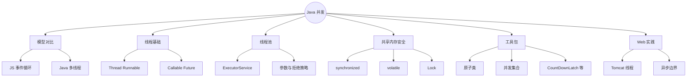
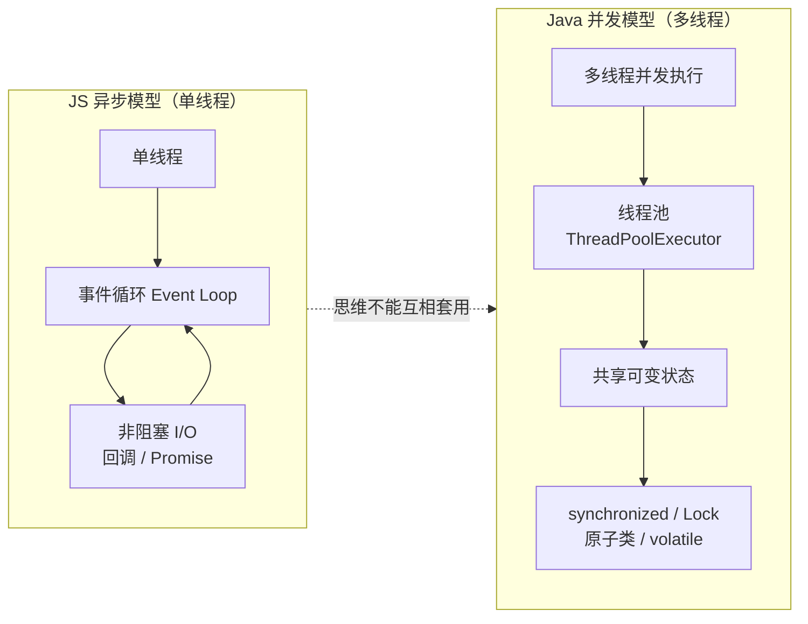
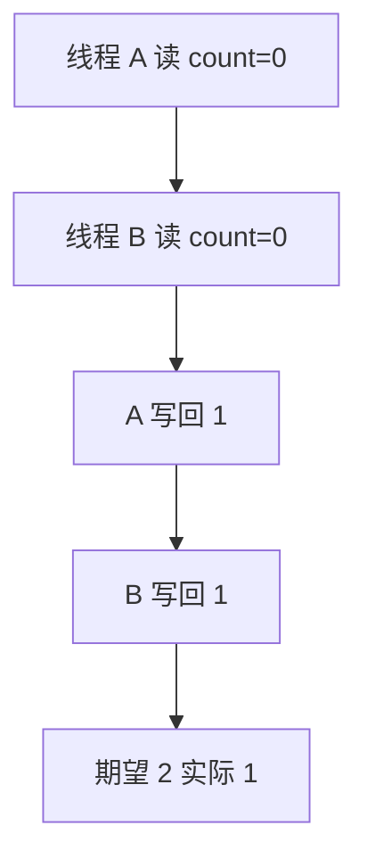
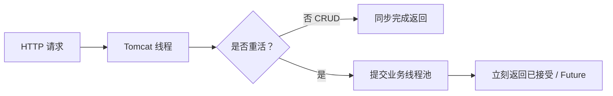

# Java 多线程与并发（强制对比 JS 事件循环）
> 面向 JS + Python 背景开发者。  
> 目标：建立「真多线程 + 共享内存」心智模型，掌握线程、线程池、同步、并发工具与常见坑；**绝不把 Node 事件循环思维硬套到 Java**。
<!-- more -->

## TL;DR（先看结论）

> 💡 一句话结论：**JS（主线程）用事件循环假装并行；Java 是真并行，多个线程同时跑，共享变量必须同步。** SpringBoot 默认每个请求一条 Tomcat 线程——阻塞会占住线程，和 Node 的「异步不占线程」完全不是一回事。

- 创建任务：`Runnable` / `Callable`；**生产环境用线程池，禁止无界乱 `new Thread`**
- 共享可变状态三板斧：`synchronized` / `ReentrantLock`、`volatile`、原子类 / 并发集合
- 线程池核心参数：核心数、最大数、队列、拒绝策略；业务池与公共池隔离
- `ConcurrentHashMap` 替代并发下的 `HashMap`；`Collections.synchronizedXxx` 粗粒度少用
- 高频坑：在请求线程里 `sleep`/狂算、忘记线程池关闭、锁顺序死锁、`volatile` 当锁用、用 `HashMap` 并发写、把 `parallelStream` 当业务线程池

## 🗺️ 本笔记知识地图



---
## 0. 本笔记重点（先拧扭转思维）
> 💡 一句话结论：在 Node 里「别阻塞事件循环」；在 Java Web 里「别把 Tomcat 线程池堵死」——怕的东西都是线程/循环被占住，但**机制完全不同**。

| 维度 | JavaScript (Node) | Java (典型 SpringBoot) |
| --- | --- | --- |
| 执行模型 | 单线程 + 事件循环 | 多线程并行 |
| I/O | 非阻塞，回调/Promise | 默认阻塞 I/O（可 WebFlux） |
| 并行计算 | Worker / 多进程 | 多线程共享堆 |
| 共享状态 | 主线程少共享；Worker 传消息 | **堆上对象默认共享** |
| 风险焦点 | 堵事件循环 | 数据竞争、死锁、池耗尽 |

Python：CPython 有 GIL，多线程偏 I/O；计算密集常用多进程。Java **没有 GIL**，多线程可真正吃满多核，也因此更容易写出数据竞争。

本篇重点：对比模型 → 线程与 Future → 线程池 → synchronized/volatile/Lock → juc 工具 → Web 场景怎么用。

---
## 1. 两种并发模型（必读）
> 💡 一句话结论：JS 靠「不阻塞 + 排队回调」提高吞吐；Java 靠「多线程同时干活」提高吞吐——共享变量是 Java 额外课题。



### 1.1 Node 里你习惯的
```js
app.get('/api/slow', async (req, res) => {
  const data = await db.query(...); // 不占着「逻辑线程」死等
  res.json(data);
});
```
等待 I/O 时主线程去处理别的事件。

### 1.2 SpringMVC 默认
```java
@GetMapping("/api/slow")
public Data slow() {
    return db.query(...); // 当前 Tomcat 工作线程阻塞在 I/O 上
}
```
线程卡住 → 池里少一条可用线程 → 请求堆积 → 超时。这就是第 09 篇强调的「不要在请求线程做长时间阻塞」。

### 1.3 什么时候像 Node
- **WebFlux / Netty** 事件驱动（另一条学习线）
- 业务里用异步：线程池 + `@Async` / `CompletableFuture`（把阻塞甩到别的池）

日常 CRUD 服务：先精通「线程池 + 别堵 Tomcat」，再谈响应式。

---
## 2. 线程基础
> 💡 一句话结论：`Thread` 是执行单元；任务用 `Runnable`（无返回）或 `Callable`（有返回）；拿到结果用 `Future`。

### 2.1 启动方式
```java
// 1) Runnable
Thread t = new Thread(() -> System.out.println("hi"), "demo-thread");
t.start(); // 不是 run()

// 2) Callable + FutureTask
FutureTask<Integer> task = new FutureTask<>(() -> 42);
new Thread(task).start();
Integer v = task.get(); // 阻塞等待
```

| API | 含义 |
| --- | --- |
| `start()` | 真正启动新线程 |
| `run()` | 只是普通方法调用（仍在当前线程） |
| `join()` | 等另一线程结束 |
| `interrupt()` | 打断（协作式，不是强制杀） |
| `sleep` | 当前线程休眠 |

**生产代码几乎不要直接 `new Thread`**，改用线程池统一管理。

### 2.2 线程状态（够用版）
`NEW` → `RUNNABLE` → `BLOCKED` / `WAITING` / `TIMED_WAITING` → `TERMINATED`  
排查卡死：看线程 dump 是否大量 BLOCKED（抢锁）或 WAITING（等条件）。

---
## 3. 线程池：并发的默认姿势
> 💡 一句话结论：线程池复用线程、控并发、管队列与拒绝策略；Spring 里用自定义 `Executor` Bean，避免乱用 `ForkJoinPool.commonPool()`。

### 3.1 快速上手
```java
ExecutorService pool = Executors.newFixedThreadPool(8);
try {
    Future<String> f = pool.submit(() -> {
        // 任务
        return "ok";
    });
    String result = f.get(3, TimeUnit.SECONDS);
} finally {
    pool.shutdown(); // 或 shutdownNow()
}
```

常用工厂（了解即可，生产更推荐手写 `ThreadPoolExecutor`）：
| 工厂 | 特点 | 风险 |
| --- | --- | --- |
| `newFixedThreadPool(n)` | 固定 n 线程 | 队列无界，可能 OOM |
| `newCachedThreadPool()` | 线程可疯涨 | 流量高峰打爆 |
| `newSingleThreadExecutor()` | 单线程排队 | — |
| `newScheduledThreadPool` | 定时 / 周期 | — |

### 3.2 手写 `ThreadPoolExecutor`（推荐理解）
```java
ThreadPoolExecutor pool = new ThreadPoolExecutor(
        4,                      // corePoolSize
        8,                      // maximumPoolSize
        60, TimeUnit.SECONDS,   // 空闲存活
        new LinkedBlockingQueue<>(1000), // 有界队列！
        r -> {
            Thread t = new Thread(r);
            t.setName("biz-" + t.getId());
            t.setDaemon(false);
            return t;
        },
        new ThreadPoolExecutor.CallerRunsPolicy() // 拒绝策略
);
```

执行顺序直觉：
1. 线程数 < core → 建线程跑任务  
2. = core → 进队列  
3. 队列满且 < max → 再建线程  
4. 队列满且 = max → 拒绝策略

拒绝策略：
| 策略 | 行为 |
| --- | --- |
| `AbortPolicy` | 抛异常（默认） |
| `CallerRunsPolicy` | 调用者线程自己跑（降速） |
| `DiscardPolicy` | 默默丢 |
| `DiscardOldestPolicy` | 丢队头再试 |

### 3.3 Spring 中自定义池
```java
@Configuration
@EnableAsync
public class AsyncConfig {
    @Bean(name = "bizExecutor")
    public Executor bizExecutor() {
        ThreadPoolTaskExecutor exec = new ThreadPoolTaskExecutor();
        exec.setCorePoolSize(4);
        exec.setMaxPoolSize(8);
        exec.setQueueCapacity(500);
        exec.setThreadNamePrefix("biz-");
        exec.setRejectedExecutionHandler(new ThreadPoolExecutor.CallerRunsPolicy());
        exec.initialize();
        return exec;
    }
}

@Service
public class ReportService {
    @Async("bizExecutor")
    public CompletableFuture<Void> buildReport() {
        // 别在这里再堵 Tomcat 线程
        return CompletableFuture.completedFuture(null);
    }
}
```

---
## 4. 共享可变状态：为什么要同步
> 💡 一句话结论：多线程读写同一变量，可能看见过期值、丢更新、甚至结构性损坏（如普通 HashMap）。必须靠同步、不可变或并发工具。

经典丢更新：
```java
// 危险
int count = 0;
// 两个线程同时 count++  →  结果可能少加
```

`count++` 实际是读-改-写三步，会交错。



---
## 5. `synchronized` 与显式锁
> 💡 一句话结论：`synchronized` 保原子性 + 可见性；同一把锁保护同一组数据。需要尝试锁/限时锁/多条件再用 `ReentrantLock`。

### 5.1 synchronized
```java
public class Counter {
    private int count = 0;

    public synchronized void incr() {
        count++;
    }

    public synchronized int get() {
        return count;
    }
}
```

或同步代码块：
```java
synchronized (lockObj) {
    // 临界区
}
```

要点：
- 锁的是**对象**（实例方法锁 this，静态方法锁 Class）
- 同一时刻同一锁只有一个线程进临界区
- 会自动释放（与 wait/notify 协作）

### 5.2 ReentrantLock
```java
private final ReentrantLock lock = new ReentrantLock();

public void incr() {
    lock.lock();
    try {
        count++;
    } finally {
        lock.unlock(); // 必须在 finally
    }
}
```

相对优势：`tryLock`、公平锁、多个 `Condition`。记得 **finally 解锁**，否则死锁。

### 5.3 死锁
两个线程以相反顺序抢两把锁 → 互相等待。预防：全局统一加锁顺序；或 `tryLock` 超时放弃。

---
## 6. `volatile`：可见性，不是互斥
> 💡 一句话结论：`volatile` 保证可见性与一定有序性，**不保证** `count++` 原子性。当锁用是错的。

```java
private volatile boolean running = true;

public void stop() {
    running = false; // 其它线程立刻可见
}

public void loop() {
    while (running) {
        // ...
    }
}
```

适合：状态旗标、双重检查单例中的发布（经典写法），不适合复合操作。

---
## 7. JMM 直觉（极简）
> 💡 一句话结论：每个线程有缓存的「工作内存」视图；不加同步时，你写的值别人可能暂时看不见。`synchronized`/`volatile`/并发工具在合适点插入内存屏障。

够用规则：
1. 多线程共享可变状态 → 必须有明确 happens-before 手段（锁、volatile、原子类、并发集合发布等）。
2. 不可变对象（`final` 字段正确发布）天然友好。
3. 先保证正确，再谈无锁优化。

---
## 8. 原子类与并发集合
> 💡 一句话结论：单变量计数用 `AtomicInteger`；共享 Map 用 `ConcurrentHashMap`；别用 `Collections.synchronizedMap` 糊弄高性能场景。

### 8.1 原子类
```java
AtomicInteger count = new AtomicInteger(0);
count.incrementAndGet();
count.compareAndSet(expect, update);
```

### 8.2 并发集合选型
| 结构 | 用途 |
| --- | --- |
| `ConcurrentHashMap` | 并发 Map 默认首选 |
| `CopyOnWriteArrayList` | 读多写极少 |
| `BlockingQueue` | 生产者-消费者 |
| `ConcurrentLinkedQueue` | 非阻塞队列 |

```java
ConcurrentHashMap<String, Integer> map = new ConcurrentHashMap<>();
map.merge("a", 1, Integer::sum); // 原子合并
```

回顾第 14 篇：并发下 **禁止** 多线程裸写 `HashMap`。

### 8.3 同步工具（认识）
| 工具 | 场景 |
| --- | --- |
| `CountDownLatch` | 等 N 个任务完成再继续 |
| `CyclicBarrier` | 一组线程互等碰头 |
| `Semaphore` | 限流 / 许可数 |
| `CompletableFuture` | 异步编排（像 Promise.all） |

```java
CompletableFuture<String> a = CompletableFuture.supplyAsync(() -> "A", pool);
CompletableFuture<String> b = CompletableFuture.supplyAsync(() -> "B", pool);
String all = a.thenCombine(b, (x, y) -> x + y).join();
```
对比 JS `Promise`：编排形似，执行在线程池上真并行。

---
## 9. Web / SpringBoot 实践清单
> 💡 一句话结论：请求线程做协调；重活丢业务线程池；共享状态用并发工具；超时与拒绝策略要可观测。

1. **默认假设**：Controller 方法在 Tomcat 线程执行，会阻塞。
2. **慢任务**：`@Async` / `CompletableFuture` + **自建有界池**。
3. **别在 commonPool 跑阻塞 IO**：`parallelStream`、默认 `supplyAsync` 无池参数时要小心。
4. **线程名**：`setThreadNamePrefix`，出问题看日志/dump 能定位。
5. **优雅停机**：`awaitTermination`，Spring Boot 关池有生命周期钩子。
6. **MDC 传递**：异步要手动传 traceId（第 07 篇），否则日志断层。



---
## 10. 对比三端

| 主题 | Java | Node.js | Python |
| --- | --- | --- | --- |
| 并行 | 多线程真并行 | 主线程单线程 | 线程受 GIL 限（计算） |
| 异步原语 | Future / CompletableFuture | Promise / async | asyncio / concurrent.futures |
| 共享内存 | 默认共享，要同步 | 少共享 | 多进程常用消息 |
| Web 默认 | 每请求一线程（MVC） | 事件循环 | 视部署（sync/async） |
| 阻塞代价 | 占线程池槽位 | 堵事件循环 | 堵 loop 或线程 |

---
## 11. 常见坑点
> 💡 一句话结论：池参数、锁、可见性、HashMap 并发，是线上事故四件套。

1. **`new Thread` 满天飞**：无法控资源。
2. **无界队列 FixedThreadPool**：任务堆积 OOM。
3. **CachedThreadPool 遇突发流量**：创建海量线程。
4. **调用 `run()` 当 `start()`**：根本没开新线程。
5. **`volatile` 做 `count++`**：仍有竞争。
6. **锁顺序反了**：死锁。
7. **并发写 HashMap**：数据错乱。
8. **请求线程里死循环/大计算**：RT 毛刺、雪崩。
9. **Future.get() 无超时**：永久卡住。
10. **异常在线程里吞掉**：任务失败毫无日志（`submit` 后要看 Future 或用 `afterExecute`）。

---
## 12. 小结

| 主题 | 记住什么 |
| --- | --- |
| 模型 | Java 真多线程 ≠ JS 事件循环 |
| 任务 | Runnable / Callable + Future |
| 执行 | 有界队列线程池 |
| 互斥 | synchronized / Lock |
| 可见 | volatile / 锁发布 |
| 单变量 | Atomic* |
| Map | ConcurrentHashMap |
| Web | 别堵 Tomcat；重活进业务池 |

口诀：**池化执行，锁护共享，可见靠同步，Web 线程不扛重活。**

---
## 13. 练习建议
1. 两个线程对非原子 `int` 各加 10 万次，观察结果；改成 `AtomicInteger` / `synchronized` 再比。
2. 手写有界 `ThreadPoolExecutor`，用压测把队列打满，观察 `CallerRunsPolicy` vs `AbortPolicy`。
3. 制造死锁（两锁反序），用 `jstack` 或 IDEA 线程 dump 看。
4. 用 `CompletableFuture` 并行调两个慢方法，对比串行耗时（类似 `Promise.all`）。
5. SpringBoot 接口里 `Thread.sleep(30_000)`，用少量并发压测，观察线程池耗尽。
6. 把同一逻辑用 Node `async` 写一遍，写一段话解释阻塞点差异。
7. （选做）`ConcurrentHashMap` 与同步 `HashMap` 简单吞吐对比。
8. （选做）给 `@Async` 方法传递 MDC traceId。

---
## 14. 下一篇
下一篇：**JVM 基础**（已生成）。  
重点回顾：
- 运行时内存区域（堆、栈、方法区/元空间）
- GC 直觉与常见收集器
- 类加载过程
- 常用排查：内存、CPU、线程 dump
- 与「线上变慢 / OOM」的关联
