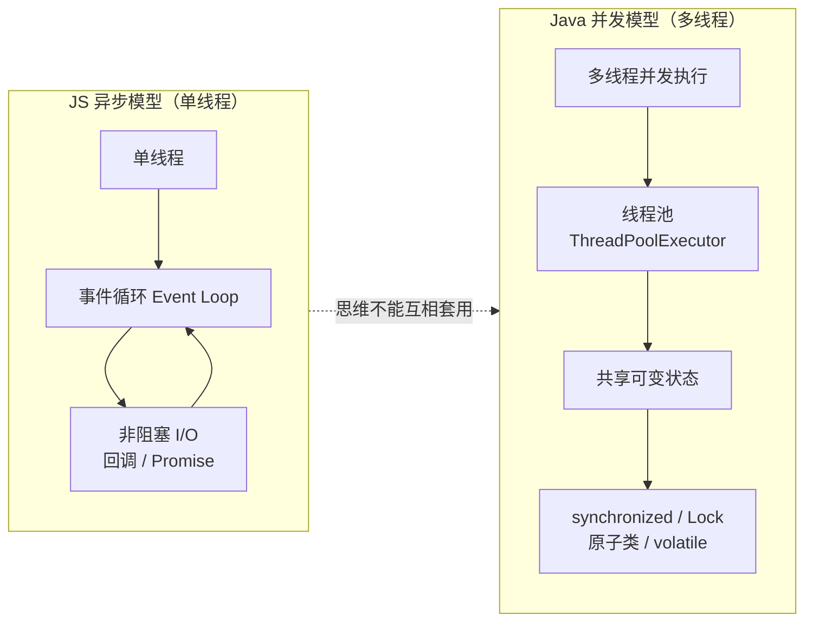
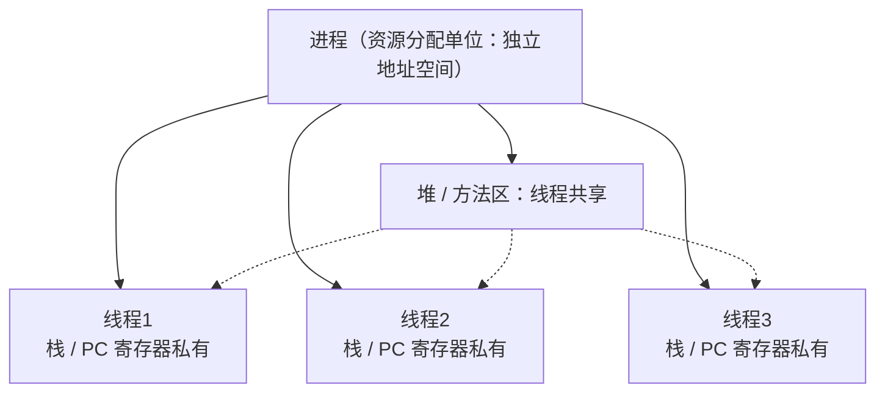
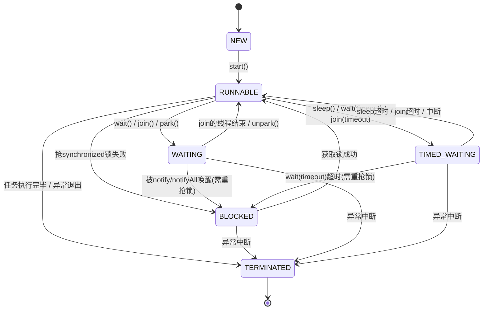
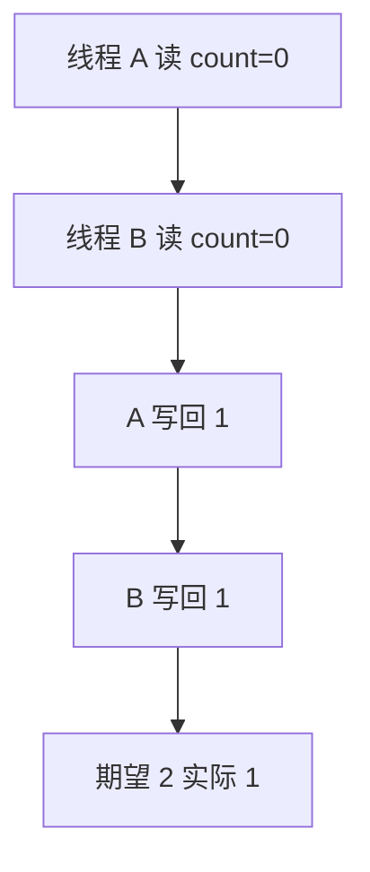
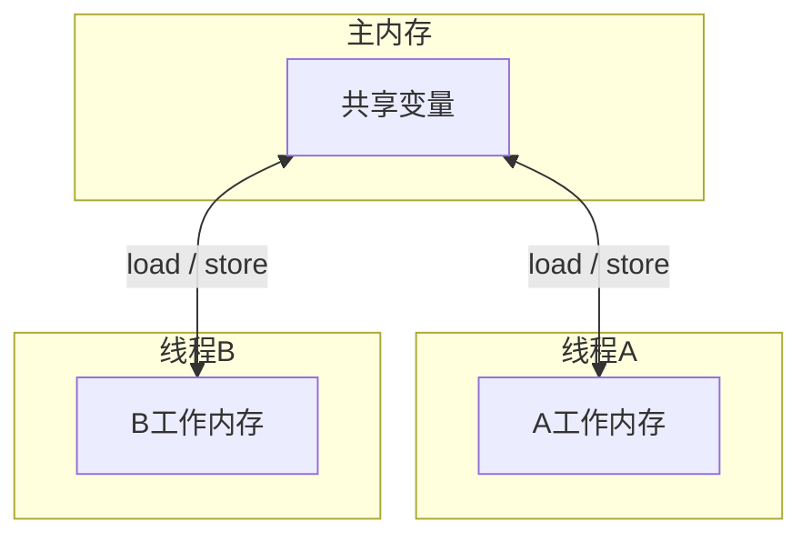
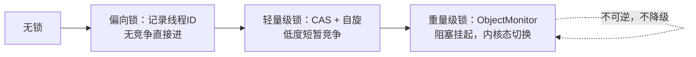
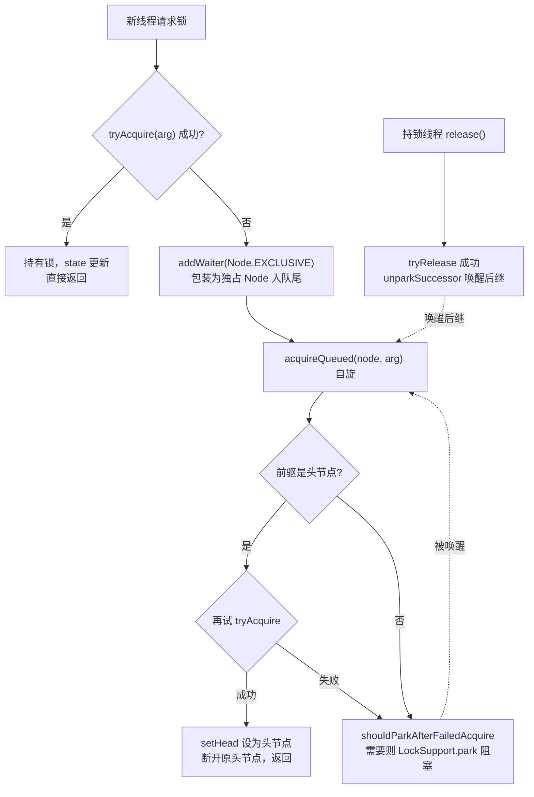
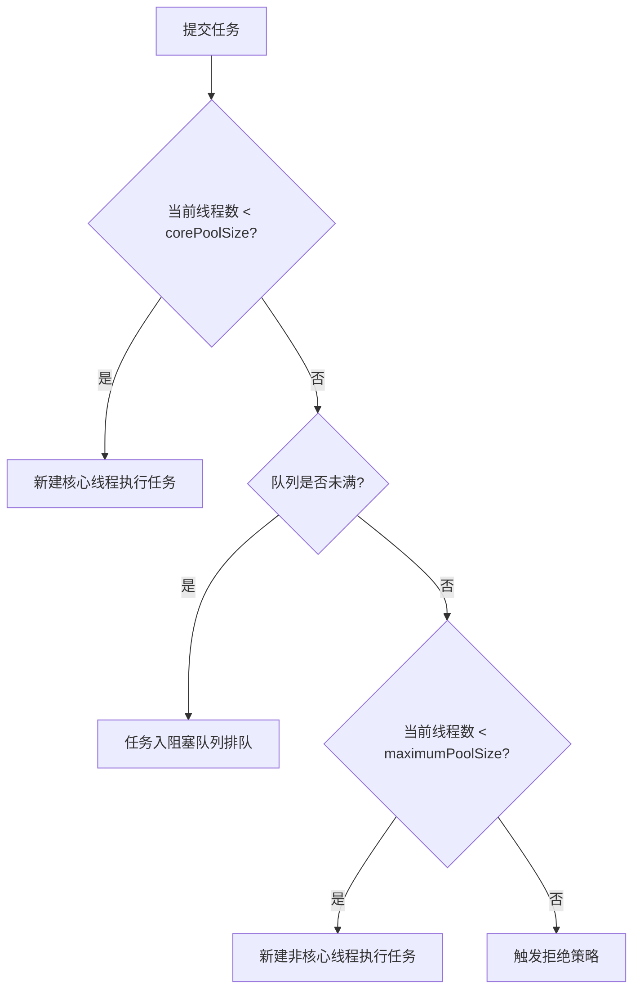
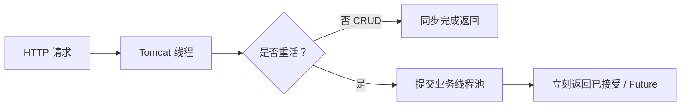

# Java 多线程与并发
> 面向 JS + Python 背景开发者。
> 目标：建立「真多线程 + 共享内存」心智模型，掌握线程、线程池、同步、并发工具与常见坑；**绝不把 Node 事件循环思维硬套到 Java**。
<!-- more -->

## TL;DR（先看结论）
> 💡 一句话结论：**JS（主线程）用事件循环假装并行；Java 是真并行，多个线程同时跑，共享变量必须同步。** SpringBoot 默认每个请求一条 Tomcat 线程——阻塞会占住线程，和 Node 的「异步不占线程」完全不是一回事。
- 创建任务：`Runnable` / `Callable`；**生产环境用线程池，禁止无界乱 `new Thread`**
- 共享可变状态三板斧：`synchronized` / `ReentrantLock`、`volatile`、原子类 / 并发集合
- 线程池核心参数：核心数、最大数、队列、拒绝策略；业务池与公共池隔离
- `ConcurrentHashMap` 替代并发下的 `HashMap`；`Collections.synchronizedXxx` 粗粒度少用
- 高频坑：在请求线程里 `sleep`/狂算、忘记线程池关闭、锁顺序死锁、`volatile` 当锁用、用 `HashMap` 并发写、把 `parallelStream` 当业务线程池
## 🗺️ 本笔记知识地图

```mermaid
flowchart TB
    ROOT(("Java 并发"))
    ROOT --> A["进程与线程"]
    ROOT --> B["创建方式"]
    ROOT --> C["线程状态与中断"]
    ROOT --> D["JMM"]
    ROOT --> E["volatile / CAS / 原子类"]
    ROOT --> F["synchronized 锁升级"]
    ROOT --> G["AQS"]
    ROOT --> H["JUC 工具"]
    ROOT --> I["线程池"]
    ROOT --> J["CompletableFuture"]
    ROOT --> K["Web 实践"]
    A --> A1["进程 vs 线程"]
    B --> B1["Thread / Runnable / Callable"]
    B --> B2["线程池 / 定时线程池"]
    B --> B3["CompletableFuture"]
    C --> C1["六种状态"]
    C --> C2["interrupt()"]
    D --> D1["可见性 / 有序性 / 原子性"]
    D --> D2["happens-before"]
    E --> E1["volatile 可见"]
    E --> E2["CAS 无锁"]
    E --> E3["原子类"]
    F --> F1["Monitor"]
    F --> F2["偏向 → 轻量 → 重量"]
    G --> G1["state + CLH 队列"]
    G --> G2["独占 / 共享"]
    H --> H1["ReentrantLock"]
    H --> H2["ReadWriteLock"]
    H --> H3["Semaphore / Latch / Barrier"]
    I --> I1["ThreadPoolExecutor"]
    I --> I2["ScheduledThreadPoolExecutor"]
    I --> I3["参数与拒绝策略"]
    J --> J1["异步编排"]
    J --> J2["组合与异常处理"]
    K --> K1["Tomcat 线程"]
    K --> K2["异步边界"]
```
---
## 0. 本笔记重点（先拧扭转思维）
> 💡 一句话结论：在 Node 里「别阻塞事件循环」；在 Java Web 里「别把 Tomcat 线程池堵死」——怕的东西都是线程/循环被占住，但**机制完全不同**。


```mermaid
flowchart LR
    subgraph JS["JS 异步模型（单线程）"]
        direction TB
        J1["单线程"] --> J2["事件循环 Event Loop"]
        J2 --> J3["非阻塞 I/O<br/>回调 / Promise"]
        J3 --> J2
    end
    subgraph Java["Java 并发模型（多线程）"]
        direction TB
        K1["多线程并发执行"] --> K2["线程池<br/>ThreadPoolExecutor"]
        K2 --> K3["共享可变状态"]
        K3 --> K4["synchronized / Lock<br/>原子类 / volatile"]
    end
    JS -.->|"思维不能互相套用"| Java
```

| 维度 | JavaScript (Node) | Java (典型 SpringBoot) |
| --- | --- | --- |
| 执行模型 | 单线程 + 事件循环 | 多线程并行 |
| I/O | 非阻塞，回调/Promise | 默认阻塞 I/O（可 WebFlux） |
| 并行计算 | Worker / 多进程 | 多线程共享堆 |
| 共享状态 | 主线程少共享；Worker 传消息 | **堆上对象默认共享** |
| 风险焦点 | 堵事件循环 | 数据竞争、死锁、池耗尽 |

Python：CPython 有 GIL，多线程偏 I/O；计算密集常用多进程。Java **没有 GIL**，多线程可真正吃满多核，也因此更容易写出数据竞争。

## 1. 进程 / 线程：为什么需要多线程

> 💡 一句话结论：**进程是资源分配单位，线程是 CPU 调度单位**；同进程内的线程共享堆与方法区，Java 多线程天然共享变量——这是便利，也是必须同步的原因。

### 1.1 为什么需要多线程
- **利用多核**：单线程只能用一个核，多线程才能吃满多核 CPU
- **掩盖 I/O 等待**：一个线程等磁盘/网络时，其他线程继续跑，整体吞吐提高
- **响应性**：请求处理不过来时，多线程并行 + 线程池排队，别让请求长时间被占用

### 1.2 进程 vs 线程

```mermaid
flowchart TB
    P["进程（资源分配单位：独立地址空间）"]
    P --> M["堆 / 方法区：线程共享"]
    P --> T1["线程1<br/>栈 / PC 寄存器私有"]
    P --> T2["线程2<br/>栈 / PC 寄存器私有"]
    P --> T3["线程3<br/>栈 / PC 寄存器私有"]
    M -.-> T1
    M -.-> T2
    M -.-> T3
```

| 维度 | 进程 | 线程 |
| --- | --- | --- |
| 资源 | 独立地址空间、文件描述符 | 共享进程堆与方法区，栈/PC 私有 |
| 切换成本 | 高（地址空间切换） | 低 |
| 通信 | IPC（管道/消息队列/共享内存） | 共享内存直接读写（要同步） |
| 隔离性 | 好，一个进程崩不影响其他 | 同进程内一个线程崩可能拖垮整个进程 |
| 创建开销 | 大 | 小 |

### 1.3 Java 里的线程
- Java 平台线程与操作系统线程 **1:1 映射**（主流 JVM 实现），`new Thread` 就是在创建 OS 线程
- **虚拟线程（JDK 21 正式）**：轻量、数量可达百万级，适合大量阻塞 I/O 场景，是另一条学习线
- 线程不是越多越好：CPU 密集 ≈ 核数；I/O 密集可稍多，但受内存与切换开销限制

## 2. 创建方式
> 💡 一句话结论：任务定义用 `Runnable`（无返回）/ `Callable`（有返回）；执行交给线程池统一管理；**生产环境禁止无脑 `new Thread`**；定时任务用 `ScheduledExecutorService`；异步编排用 `CompletableFuture`。

### 2.1 Thread 直接继承（了解即可）
```
Thread t = new Thread(() -> System.out.println("hi"), "demo-thread");
t.start(); // 真正启动新线程
// t.run();  // 只是普通方法调用，仍在当前线程执行——不是开新线程！
```
### 2.2 Runnable（无返回值）
```
Runnable task = () -> System.out.println("run");
new Thread(task).start();
```
### 2.3 Callable + Future（有返回值）
```
FutureTask<Integer> task = new FutureTask<>(() -> 42);
new Thread(task).start();
Integer v = task.get(); // 阻塞等待结果
```
| 对比 | Runnable | Callable |
| --- | --- | --- |
| 返回值 | 无 | 有（泛型） |
| 受检异常 | run() 不能抛 | call() 可以抛 |
| 取结果 | 无 | Future.get() |

### 2.4 线程池 ExecutorService（生产默认）
```
ExecutorService pool = Executors.newFixedThreadPool(8);
Future<String> f = pool.submit(() -> "ok");
String result = f.get(3, TimeUnit.SECONDS); // 带超时，别裸 get
pool.shutdown();
```
### 2.5 定时线程池 ScheduledExecutorService
```
ScheduledExecutorService sched = Executors.newScheduledThreadPool(2);
sched.schedule(task, 10, TimeUnit.SECONDS);                  // 延迟 10s 执行一次
sched.scheduleAtFixedRate(task, 0, 10, TimeUnit.SECONDS);    // 固定频率：每 10s 一次（按开始时间对齐）
sched.scheduleWithFixedDelay(task, 0, 10, TimeUnit.SECONDS); // 固定延迟：上次结束后再等 10s
```
> ⚠️ 周期任务里抛异常会**静默取消后续调度**（见第 9 节）。

### 2.6 CompletableFuture（异步编排入口）
```
CompletableFuture.supplyAsync(() -> callA(), pool)
        .thenApply(String::toUpperCase)
        .join();
```
细节在第 10 节展开。

## 3. 线程状态与中断
> 💡 一句话结论：`start()` 才开新线程；中断是**协作式请求**，不是强制杀死；`stop()` / `suspend()` / `resume()` 已废弃，永远别用。

### 3.1 六种状态
Java 线程的六种状态定义在 java.lang.Thread.State 枚举中

| 状态 | 含义 | 常见进入方式 | 退出/恢复 |
|---|---|---|---|
| `NEW` | 新建，尚未启动 | `new Thread()` 后，未调用 `start()` | 调用 `start()` 后进入 `RUNNABLE` |
| `RUNNABLE` | 可运行状态，包括正在运行或就绪等待 CPU | 调用 `start()`；从阻塞/等待/超时中恢复 | 被调度执行、进入阻塞/等待、运行结束 |
| `BLOCKED` | 阻塞，等待监视器锁 | 竞争 `synchronized` 锁失败；`wait()` 被唤醒后重新抢锁失败 | 获得监视器锁后回到 `RUNNABLE` |
| `WAITING` | 无限期等待 | `Object.wait()`、`Thread.join()`、`LockSupport.park()` 等无超时调用 | 被 `notify()/notifyAll()`、`unpark()` 唤醒，或 join 的线程结束 |
| `TIMED_WAITING` | 限期等待 | `Thread.sleep(ms)`、`Object.wait(timeout)`、`Thread.join(timeout)`、`LockSupport.parkNanos/parkUntil` | 超时、被唤醒、被中断 |
| `TERMINATED` | 终止 | `run()` 正常执行完毕或抛出异常结束 | 不可再转换 |


```mermaid
stateDiagram-v2
    [*] --> NEW
    NEW --> RUNNABLE : start()

    RUNNABLE --> BLOCKED : 抢synchronized锁失败
    RUNNABLE --> WAITING : wait() / join() / park()
    RUNNABLE --> TIMED_WAITING : sleep() / wait(timeout) / join(timeout)

    BLOCKED --> RUNNABLE : 获取锁成功
    WAITING --> BLOCKED : 被notify/notifyAll唤醒(需重抢锁)
    WAITING --> RUNNABLE : join的线程结束 / unpark()
    TIMED_WAITING --> BLOCKED : wait(timeout)超时(需重抢锁)
    TIMED_WAITING --> RUNNABLE : sleep超时 / join超时 / 中断
    RUNNABLE --> TERMINATED : 任务执行完毕 / 异常退出
    BLOCKED --> TERMINATED : 异常中断
    WAITING --> TERMINATED : 异常中断
    TIMED_WAITING --> TERMINATED : 异常中断
    TERMINATED --> [*]
```

| 方法 | 所属 | 是否静态 | 线程状态 | 是否释放锁 | 是否响应中断 | 唤醒方式 |
|---|---|---|---|---|---|---|
| `sleep` | `Thread` | 是 | `TIMED_WAITING` | 否 | 是，抛 `InterruptedException` | 超时/中断 |
| `join` | `Thread` | 否 | `WAITING`/`TIMED_WAITING` | 释放目标线程对象锁，不释放其他 | 是，抛 `InterruptedException` | 目标线程结束/超时/中断 |
| `wait` | `Object` | 否 | `WAITING`/`TIMED_WAITING` | 释放该对象监视器锁 | 是，抛 `InterruptedException` | `notify`/`notifyAll`/超时/中断 |
| `yield` | `Thread` | 是 | `RUNNABLE` | 否 | 否 | 调度器 |
| `park` | `LockSupport` | 是 | `WAITING`/`TIMED_WAITING` | 否 | 否，返回并保留中断标志 | `unpark`/中断/超时 |
| `interrupt` | `Thread` | 否 | 不直接改变状态 | - | - | - |

简单记忆
- `sleep`：睡一会儿，不释放锁。
- `wait`：等通知，释放对象锁，必须配合 `synchronized`。
- `join`：等另一个线程结束。
- `yield`：让一下 CPU，不释放锁。
- `park`：更底层的阻塞，不释放锁，靠 `unpark` 唤醒。
- `interrupt`：协作式中断，不是强制杀线程。

排查卡死：看线程 dump 是否大量 BLOCKED（抢锁）或 WAITING（等条件）。

### 3.2 interrupt()：协作式中断
```
Thread t = new Thread(() -> {
    while (!Thread.currentThread().isInterrupted()) {
        // 干活；循环里主动检查中断标志
    }
});
t.start();
t.interrupt(); // 设置中断标志，循环下次检查即退出
```
- `interrupt()` 只是**设置中断标志**，目标线程配合检查才生效
- `sleep` / `wait` / `join` 期间收到中断 → 抛 `InterruptedException` **并清除中断标志**
- 判断方法：`isInterrupted()` 只读不清除；静态 `Thread.interrupted()` 读取并清除

正确捕获处理（二选一，别吞掉）：
```
// 方式 1：恢复中断标志（把决定权交还上层）
try { Thread.sleep(1000); } catch (InterruptedException e) {
    Thread.currentThread().interrupt();
    return;
}
// 方式 2：向上抛出（方法声明 throws InterruptedException）
```

## 4. JMM：主内存 / 工作内存 / happens-before
> 💡 一句话结论：每个线程有「工作内存」缓存视图；不加同步，你写的值别人可能**暂时看不见**，指令也可能被重排——正确性靠 happens-before 规则保证。

### 4.1 为什么多线程写共享变量会出问题
`count++` 实际是读-改-写三步，会交错：

```mermaid
flowchart TD
    A["线程 A 读 count=0"] --> B["线程 B 读 count=0"]
    B --> C["A 写回 1"]
    C --> D["B 写回 1"]
    D --> E["期望 2 实际 1"]
```
### 4.2 主内存 / 工作内存模型

| 概念 | 作用 |
|---|---|
| 主内存 | 存放所有共享变量，比如实例字段、静态字段、数组元素 |
| 工作内存 | 每个线程私有，存放它用到的共享变量副本 |


```mermaid
flowchart TD
    subgraph 主内存
        V[共享变量]
    end
    subgraph 线程A
        WA[A工作内存]
    end
    subgraph 线程B
        WB[B工作内存]
    end
    V <-->|"load / store"| WA
    V <-->|"load / store"| WB
```
线程对共享变量的操作：先拷到自己的工作内存，再读改写，最后写回主内存。不同步时，写回时机不可控 → 可见性问题。

### 4.3 三大特性
| 特性 | 含义 | 保障手段 |
| --- | --- | --- |
| 原子性 | 操作不可分割（读-改-写整体） | synchronized / Lock / 原子类 |
| 可见性 | 一个线程写，其他线程能及时看到 | volatile / synchronized / 原子类 |
| 有序性 | 指令不重排到破坏语义的程度 | volatile / synchronized / happens-before |

### 4.4 happens-before 规则（够用版）
| 规则 | 含义 |
| --- | --- |
| 程序顺序规则 | 单线程内按书写顺序 |
| 监视器锁规则 | 解锁 happens-before 后续对该锁的加锁 |
| volatile 规则 | 写 volatile happens-before 后续读该 volatile |
| 线程启动规则 | `start()` happens-before 该线程所有动作 |
| 线程终止规则 | 线程所有动作 happens-before `join()` 返回 |
| 传递性 | A→B 且 B→C，则 A→C |
| 可见性 | A→B  A结果对B可见 |

够用规则：
1. 多线程共享可变状态 → 必须有明确的 happens-before 手段（锁、volatile、原子类、并发集合发布等）
2. 不可变对象（`final` 字段正确发布）天然友好
3. 先保证正确，再谈无锁优化

## 5. volatile / CAS / 原子类
> 💡 一句话结论：`volatile` 保**可见 + 禁重排**，不保原子性，当锁用是错的；单变量高并发计数用 `AtomicInteger` / `LongAdder`；CAS 是无锁更新的基石，注意 ABA。

### 5.1 volatile：轻量可见
```
private volatile boolean running = true;
public void stop() { running = false; }  // 其它线程立刻可见
public void loop() {
    while (running) { /* ... */ }        // 不会因缓存读不到新值
}
```
适合：状态旗标、双重检查锁单例中的发布。**不适合**：`volatile int count; count++`（仍是读-改-写，不原子）。

双重检查锁为什么必须 volatile：
```
private static volatile Singleton instance; // 防止半初始化对象被发布
public static Singleton get() {
    if (instance == null) {                 // 第一次检查，无锁快速路径
        synchronized (Singleton.class) {
            if (instance == null) {
                instance = new Singleton(); // 分配内存 + 初始化 + 发布
            }
        }
    }
    return instance;
}
```
没有 volatile，`new` 的三步可能重排，「发布引用」先于「字段初始化」→ 别的线程拿到未初始化对象。

### 5.2 CAS：无锁原子更新
- `compareAndSet(expected, update)`：内存值 == expected 才更新，成功返回 true
- 内部走 CPU 原子指令（如 `cmpxchg`），失败通常**自旋重试**
- 常见问题 **ABA**：A → B → A，CAS 误判「没变过」；用 `AtomicStampedReference`（带版本号）解决

### 5.3 原子类
```
AtomicInteger count = new AtomicInteger(0);
count.incrementAndGet();                    // 原子 +1 并返回
count.compareAndSet(expect, update);        // CAS

ConcurrentHashMap<String, Integer> map = new ConcurrentHashMap<>();
map.merge("a", 1, Integer::sum);            // 原子合并
```
| 类型 | 用途 |
| --- | --- |
| `AtomicInteger` / `AtomicLong` | 单计数器 |
| `LongAdder` | **超高并发**计数（分段累加，读时合并） |
| `AtomicReference<T>` | 引用型原子更新 |
| `AtomicStampedReference<T>` | 带版本号的引用（解决 ABA） |
| `AtomicBoolean` | 状态开关 |

## 6. synchronized 与锁升级
> 💡 一句话结论：`synchronized` 把锁状态藏在对象头 Mark Word 里，竞争重了交给 ObjectMonitor；

`synchronized` 是 JVM 内置锁（Monitor 实现），保原子性 + 可见性；竞争不激烈时走偏向/轻量级，竞争激烈才膨胀为重量级锁。

### 6.1 基本用法
```
public class Counter {
    private int count = 0;
    public synchronized void incr() { count++; }  // 锁 this
    public synchronized int get() { return count; }
}
```
```
synchronized (lockObj) {   // 同步代码块：锁任意对象
    // 临界区
}
```
要点：
- 锁的是**对象**：实例方法锁 this，静态方法锁 Class
- 同一时刻同一锁只有一个线程进临界区；**可重入**（同线程可重复进入）
- 异常自动释放锁（区别于 Lock 需要 finally）

### 6.2 对象头 Mark Word
Java 对象头里有一块叫 Mark Word(固定8字节,重点后三位:偏向 + 状态)，它会随着锁状态变化而改变内容。

64 位 JVM 下，常见状态是这样区分的：

| 状态 | 触发场景 | 特点 |
|---|---|---|
| 无锁 | 对象刚创建，无线程竞争 | Mark Word 存哈希码、分代年龄 |
| 偏向锁 | 单线程反复进入同步块 | 记录线程 ID，后续进入几乎无开销 |
| 轻量级锁 | 多线程交替竞争，锁持有时间短 | CAS + 自旋，不立即阻塞线程 |
| 重量级锁 | 竞争激烈、自旋失败 | 线程阻塞，依赖操作系统互斥量，开销大 |


| 锁状态 | 标志位 | 触发场景 | Mark Word 主要存什么(特点) |
|---|---|---|
| 无锁 | `001`，偏向位 `0` | 对象刚创建，无线程竞争 | 哈希码、GC 分代年龄 |
| 偏向锁 | `001`，偏向位 `1` | 单线程反复进入同步块 | 线程 ID(后续进入几乎无开销)、epoch、分代年龄|
| 轻量级锁 | `000` | 多线程交替竞争，锁持有时间短 | 指向线程栈中 Lock Record 的指针(CAS + 自旋，不立即阻塞线程) |
| 重量级锁 | `010` | 竞争激烈、自旋失败 | 指向 ObjectMonitor 的指针(线程阻塞，依赖操作系统互斥量，开销大) |
| GC 标记 | `011` |  | GC 相关信息 |

所以理解 synchronized，第一步就是：锁状态不是单独存在某个“锁对象”里，而是编码在对象头的 Mark Word 中。

### 6.3 Monitor：重量级锁真正的“锁对象”
Monitor 是 JVM 内部用于实现互斥的结构，通常叫 ObjectMonitor。

轻量级锁时，Mark Word 指向的是线程栈上的 Lock Record；
升级到重量级锁后，Mark Word 才会指向堆上的 Monitor。

它大致包含：

| 字段 | 作用 |
|---|---|
| `_owner` | 当前持有锁的线程 |
| `_EntryList` | 竞争锁失败、阻塞等待的线程队列 |
| `_WaitSet` | 调用 `wait()` 后释放锁并等待的线程队列 |
| `_recursions` | 重入计数，支持 synchronized 可重入 |
| `_header` | 保存对象头原始 Mark Word，解锁时恢复 |
| `_cxq` | 竞争队列，线程刚抢锁失败时先进入这里 |

释放锁时，JVM 先把 _cxq 里的竞争线程搬到 _EntryList，再从 _EntryList 里挑一个 unpark()；被唤醒的线程要重新抢锁，所以 synchronized 默认是非公平的

### 6.5 锁升级路径

```mermaid
flowchart LR
    A["无锁"] --> B["偏向锁：记录线程ID<br/>无竞争直接进"]
    B --> C["轻量级锁：CAS + 自旋<br/>低度短暂竞争"]
    C --> D["重量级锁：ObjectMonitor<br/>阻塞挂起，内核态切换"]
    D -.->|"不可逆，不降级"| D
```
| 状态 | 实现 | 适用竞争 | 代价 |
| --- | --- | --- | --- |
| 偏向锁 | Mark Word 记录偏向线程 ID | 无竞争 | 极低 |
| 轻量级锁 | CAS 抢 Mark Word + 自旋 | 少量短暂竞争 | 低 |
| 重量级锁 | ObjectMonitor 阻塞队列 | 高竞争 | 高（用户态/内核态切换、线程挂起） |

> 💡 补充：**JDK 15 起偏向锁默认禁用**（JEP 374），现代 JDK 上直接看「轻量级 → 重量级」更贴近实际；JIT 还会做锁消除、锁粗化，写代码时不必过度微操。

## 7. AQS：state + CLH 队列
> 💡 一句话结论：AQS（`AbstractQueuedSynchronizer`） 把状态抽成 state，把等待线程放进 CLH 队列，用 CAS + LockSupport 自己管理排队和唤醒。
Java并发包 `Java.util.concurrent.locks` 下的核心基础框架
AQS是 JUC 锁的地基：一个 `volatile int state` + 一个 CLH 变体等待队列 + 若干模板方法；`ReentrantLock` 是独占模式，`Semaphore` / `CountDownLatch` 是共享模式。

三个组成
- **state**：`volatile int`，语义由子类定义（锁的重入次数 / 许可数 / 计数）
- **CLH 变体队列**：抢锁失败的线程封装成 Node，双向链入队尾，`LockSupport.park` 阻塞
- **模板方法**：子类只实现 `tryAcquire` / `tryRelease`（独占）或 `tryAcquireShared` / `tryReleaseShared`（共享），排队、唤醒、中断处理 AQS 全包

### 7.1 state
state 是 AQS 里的共享资源标记，语义由子类决定：
| 组件 | state 含义 |
|---|---|
| `ReentrantLock` | 锁重入次数，0 表示无锁 |
| `Semaphore` | 剩余许可数 |
| `CountDownLatch` | 剩余计数 |
| `ReentrantReadWriteLock` | 读锁计数 + 写锁状态 |

AQS 提供三个方法操作 state：

```java
protected final int getState();
protected final void setState(int newState);
protected final boolean compareAndSetState(int expect, int update);
```

### 7.2 CLH 队列
AQS 内部维护一个 FIFO 双向队列，是原始 CLH 锁队列的变体。

原始 CLH 队列：每个线程在前驱节点的 `locked` 字段上自旋。
AQS 的变体：
 - 双向链表，节点为 `Node`。
 - 使用 `LockSupport.park/unpark` 阻塞和唤醒线程，减少自旋。
 - 支持取消、超时、条件队列。
 - 头节点表示当前持有锁的线程（或虚拟头节点）。

Node 结构
```java
static final class Node {
    static final Node SHARED = new Node();
    static final Node EXCLUSIVE = null;

    static final int CANCELLED =  1;
    static final int SIGNAL    = -1;
    static final int CONDITION = -2;
    static final int PROPAGATE = -3;

    volatile int waitStatus;  // 节点状态
    volatile Node prev;       // 前驱
    volatile Node next;       // 后继
    volatile Thread thread;   // 等待线程

    Node nextWaiter; // 条件队列或共享模式标记
}
```

waitStatus 常见值：
| 值 | 含义 |
| --- | --- |
| `0 | 初始状态 |
| `CANCELLED` (1) | 等待被取消（中断/超时） |
| `SIGNAL` (-1) | 后继线程需要被唤醒 |
| `CONDITION` (-2) | 在 Condition 队列等待 |
| `PROPAGATE` (-3) | 共享模式传播释放 |

### 7.3独占模式流程（以 ReentrantLock 为例）
入口:
```java
public final void acquire(int arg) {
    if (!tryAcquire(arg) &&
        acquireQueued(addWaiter(Node.EXCLUSIVE), arg))
        selfInterrupt();
}
```


```mermaid
flowchart TD
    A["新线程请求锁"] --> B{"tryAcquire(arg) 成功?"}
    B -- 是 --> C
    B -- 否 --> D
    C["持有锁，state 更新<br/>直接返回"]
    D["addWaiter(Node.EXCLUSIVE)<br/>包装为独占 Node 入队尾"]
    D --> E["acquireQueued(node, arg) 自旋"]
    E --> F{前驱是头节点?}
    F -- 是 --> H
    F -- 否 --> G
    H{再试 tryAcquire}
    H -- 成功 --> I
    H -- 失败 --> G
    I["setHead 设为头节点<br/>断开原头节点，返回"]
    G["shouldParkAfterFailedAcquire<br/>需要则 LockSupport.park 阻塞"]
    G -.被唤醒.-> E
    R["持锁线程 release()"] --> K["tryRelease 成功<br/>unparkSuccessor 唤醒后继"]
    K -.唤醒后继.-> E
```

### 7.4 共享模式
`Semaphore`：`tryAcquireShared` 扣减许可，许可不足则入队；释放时唤醒多个后继（传播）。`CountDownLatch`：`state` 初始为计数，减到 0 放行所有等待线程。

 - tryAcquireShared 返回值：
    - 负数：失败。
    - 0：成功，但没有剩余资源。
    - 正数：成功，还有剩余资源，需要传播唤醒后续节点。
    
释放时调用 releaseShared，通过 doReleaseShared 传播唤醒。

```
// 自定义一个简易互斥锁（示意）
class SimpleLock extends AbstractQueuedSynchronizer {
    public void lock()   { acquire(1); }
    public void unlock() { release(1); }
    protected boolean tryAcquire(int arg) { return compareAndSetState(0, 1); }
    protected boolean tryRelease(int arg) { setState(0); return true; }
}
```

### 7.5 条件队列 Condition
ConditionObject 是 AQS 内部类，每个 Condition 维护一个单向条件队列。

 - await()：
    - 释放锁。
    - 创建节点加入条件队列。
    - LockSupport.park() 阻塞。
    - 被 signal() 或中断后，从条件队列转移到同步队列。
    - 重新竞争锁。
    
signal()：把条件队列中的节点转移到同步队列，等待被唤醒后重新获取锁。

理解 AQS 的关键就是：state 决定能不能拿，CLH 队列决定拿不到时怎么排队和唤醒。

## 8. JUC 工具：锁 / 信号量 / 栅栏
JUC: Java 并发工具包 `Java.util.current`
> 💡 一句话结论：`ReentrantLock` 比 `synchronized` 多了 `tryLock`/公平/多 `Condition`；读多写少用 `ReadWriteLock`；`CountDownLatch` 等别人减完数，`CyclicBarrier` 等一组人互相到齐；`Semaphore` 做限流。

### 8.1 ReentrantLock 可重入独占锁

#### 底层原理

基于 AQS 独占模式实现，支持可重入、可中断、可超时、公平/非公平、多条件唤醒，是 synchronized 的增强版显式锁。
```java
private final ReentrantLock lock = new ReentrantLock();
public void incr() {
    lock.lock();
    try {
        count++;
    } finally {
        lock.unlock(); // 必须在 finally，否则死锁
    }
}
```
相对 synchronized 的优势：`tryLock(timeout)` 限时抢锁、公平锁构造参数、多个 `Condition`。

#### `Condition` 示例（生产-消费）：

解决 `synchronized notify` 唤醒全部、唤醒混乱的问题，实现生产者只唤醒消费者、消费者只唤醒生产者。
```java
ReentrantLock lock = new ReentrantLock();
Condition notFull  = lock.newCondition();
Condition notEmpty = lock.newCondition();

// 生产者
lock.lock();
try {
    while (queue.isFull()) { notFull.await(); } // 释放锁并等待
    queue.add(item);
    notEmpty.signalAll();
} finally { lock.unlock(); }
// await 必须写在 while 循环，防止 JVM 虚假唤醒。
```

### 8.2 ReadWriteLock / StampedLock 读写锁体系
| 锁 | 规则 | 场景 |
| --- | --- | --- |
| `ReadWriteLock` | 读读共享，读写/写写互斥 | 读多写少 |
| `StampedLock`（JDK8） | 乐观读不加锁，返回 stamp，用前校验 | 读极多、写极少，能接受复杂度 |

### 8.3 Semaphore 信号量（限流）
作用：控制同一时间并发执行的线程数量，用于接口限流、资源抢占、连接池控制。
```java
// 允许3个线程同时并发
Semaphore semaphore = new Semaphore(3);

try {
    semaphore.acquire(); // 获取许可，不足则阻塞
    // 受限业务逻辑
} catch (InterruptedException e) {
    e.printStackTrace();
} finally {
    semaphore.release(); // 释放许可
}
```
核心特点：可反复使用、支持公平/非公平、适合高并发限流场景。

### 8.4 CountDownLatch 倒计时计数器（等任务）
作用：主线程等待 N 个子线程任务全部执行完毕，一次性、不可复用。
```java
// 设定4个任务
CountDownLatch latch = new CountDownLatch(4);

for (int i = 0; i < 4; i++) {
    pool.submit(() -> {
        try {
            // 子线程业务
        } finally {
            latch.countDown(); // 计数-1
        }
    });
}
// 主线程阻塞等待，支持超时
latch.await(5, TimeUnit.SECONDS);
```

### 8.5 CyclicBarrier 循环栅栏（等线程）
作用：让一组线程互相等待，所有线程到达屏障点后统一放行，可循环复用，适合分段并行计算。
```java
CyclicBarrier barrier = new CyclicBarrier(3, () -> System.out.println("都到齐了"));
// 每个线程：barrier.await(); 凑齐 3 个一起放行；可循环复用
```
| 维度 | CountDownLatch | CyclicBarrier |
| --- | --- | --- |
| 语义 | 倒计数，等任务完成 | 一组线程互相等待会合 |
| 复用 | 一次性 | 可循环复用 |
| 参与方 | 任意线程 countDown | 固定 parties 个线程 await |
| 用法 | 主线程等一批任务 | 并行任务分段会合 |

### 8.6 并发集合选型
| 结构 | 底层原理 | 用途 |
| --- | --- | --- |
| `ConcurrentHashMap` | JDK8：CAS + synchronized + 数组+链表+红黑树 | 并发 Map 默认首选 |
| `CopyOnWriteArrayList` | 写时复制，写操作加锁复制新数组，读无锁 | 读多写极少 |
| `BlockingQueue` | 锁+条件队列，线程阻塞/唤醒 | 生产者-消费者 |
| `ConcurrentLinkedQueue` | CAS 无锁非阻塞队列 | 非阻塞队列 |

> 回顾：并发下**禁止**多线程裸写 `HashMap`；`Collections.synchronizedMap` 是粗粒度锁，低并发够用，高性能场景别用。

### 8.7 死锁

#### 死锁四大必要条件（必须全部满足）
- 互斥：资源同一时间只能被一个线程持有
- 持有并等待：线程持有旧锁，同时等待新锁
- 不可剥夺：锁不能被其他线程强制抢占
- 循环等待：线程之间形成环形锁等待依赖

#### 经典死锁场景
两个线程以相反顺序抢两把锁 → 互相等待：

```mermaid
flowchart LR
    T1["线程1 (持有锁A)"] -- 等待锁B --> T2
    T2["线程2 (持有锁B)"] -- 等待锁A --> T1
```

#### 预防：
1. 统一加锁顺序（最优解）：所有线程固定顺序获取多把锁，打破循环等待
2. tryLock 超时机制：抢锁超时主动释放已有锁，避免永久阻塞
3. 减少锁粒度、避免嵌套锁

#### 线上排查方案
使用 jstack 进程ID 打印线程快照，搜索关键字：Found one Java-level deadlock

## 9. 线程池：ThreadPoolExecutor / ScheduledThreadPoolExecutor
> 
> 💡 一句话结论：线程池复用线程、控并发、管理任务队列与拒绝策略；核心7大参数决定线程池行为；`ScheduledThreadPoolExecutor` 的周期任务一旦抛出未捕获异常，任务会静默取消不再执行，必须在任务内部 try-catch。

### 9.1 ThreadPoolExecutor 七大核心参数（面试必背）
```java
public ThreadPoolExecutor(int corePoolSize,
                          int maximumPoolSize,
                          long keepAliveTime,
                          TimeUnit unit,
                          BlockingQueue<Runnable> workQueue,
                          ThreadFactory threadFactory,
                          RejectedExecutionHandler handler)
```

1. **corePoolSize**：核心线程数。线程池中长期保留的常驻线程，默认空闲不会回收；开启`allowCoreThreadTimeOut(true)`后，核心线程空闲超时也会销毁。
2. **maximumPoolSize**：最大线程数。线程池允许创建线程总数上限，`maximumPoolSize - corePoolSize`为非核心线程数量。
3. **keepAliveTime**：非核心线程空闲超时时间。空闲超过该时长，非核心线程会被回收。
4. **unit**：`keepAliveTime` 的时间单位（`TimeUnit`）。
5. **workQueue**：阻塞队列，存放等待执行的任务。**必须使用有界队列，防止任务无限堆积OOM**。
6. **threadFactory**：线程工厂，用于创建线程。推荐自定义，设置业务线程名称，方便日志排查问题。
7. **handler**：拒绝策略。当线程数达到最大值，且队列已满，新任务触发拒绝策略。

#### 9.1.1 快速上手
```java
ExecutorService pool = Executors.newFixedThreadPool(8);
try {
    Future<String> f = pool.submit(() -> "ok");
    String result = f.get(3, TimeUnit.SECONDS); // 带超时获取结果
} finally {
    pool.shutdown(); // 或 shutdownNow()
}
```

> 
> ⚠️ 注意：`Executors` 工厂方法仅用于学习测试，**生产禁止直接使用**，底层大多使用无界队列/无限最大线程，流量突增会OOM。

| 工厂方法 | 特点 | 风险 |
| --- | --- | --- |
| `newFixedThreadPool(n)` | 固定n个核心线程 | `LinkedBlockingQueue`无界，任务堆积OOM |
| `newCachedThreadPool()` | 核心线程0，最大线程`Integer.MAX_VALUE` | 流量高峰线程无限创建，打爆机器 |
| `newSingleThreadExecutor()` | 单线程串行执行任务 | 无界队列，堆积OOM |
| `newScheduledThreadPool(n)` | 支持延迟、周期性任务 | 底层`DelayedWorkQueue`，任务异常会终止周期调度 |

#### 9.1.2 手写 ThreadPoolExecutor（生产推荐模板）
```java
ThreadPoolExecutor pool = new ThreadPoolExecutor(
        4,                          // corePoolSize 核心线程数
        8,                          // maximumPoolSize 最大线程数
        60, TimeUnit.SECONDS,       // keepAliveTime+unit：非核心线程空闲存活时间
        new LinkedBlockingQueue<>(1000), // workQueue 有界阻塞队列！
        r -> {                      // threadFactory 线程工厂：自定义线程名，排障靠它
            Thread t = new Thread(r);
            t.setName("biz-" + t.getId());
            t.setDaemon(false);
            return t;
        },
        new ThreadPoolExecutor.CallerRunsPolicy() // handler 拒绝策略
);
```


```mermaid
flowchart TD
    A[提交任务] --> B{当前线程数 < corePoolSize?}
    B --是--> C[新建核心线程执行任务]
    B --否--> D{队列是否未满?}
    D --是--> E[任务入阻塞队列排队]
    D --否--> F{当前线程数 < maximumPoolSize?}
    F --是--> G[新建非核心线程执行任务]
    F --否--> H[触发拒绝策略]
```

任务执行流程总结：**先核心，再队列，再扩容，最后拒绝**

1. 当前线程数 < corePoolSize → 创建核心线程执行任务
2. 线程数达到corePoolSize → 任务放入阻塞队列排队
3. 队列已满，线程数 < maximumPoolSize → 创建非核心线程执行任务
4. 队列已满，线程数达到maximumPoolSize → 执行拒绝策略

#### 阻塞队列选型

| 队列 | 特点 | 使用场景 |
| --- | --- | --- |
| `LinkedBlockingQueue` | FIFO，可设置容量；不指定容量则无界，底层链表，读写双锁 | 常规业务线程池 |
| `ArrayBlockingQueue` | 有界、固定长度，底层数组 | 对内存可控要求高场景 |
| `SynchronousQueue` | 不存储元素，插入必须等待消费 | `newCachedThreadPool`，任务直接交付线程 |
| `DelayedWorkQueue` | 延迟队列，按任务到期时间排序 | `ScheduledThreadPoolExecutor`定时任务专用 |

#### 阻塞队列核心方法
BlockingQueue 接口规定了这 4 套方法，所有它的实现类（ArrayBlockingQueue、LinkedBlockingQueue、DelayQueue 等）都必须实现这四组 API，方法名和行为统一。

| 方法类型 | 插入 | 取出 | 说明 |
| --- | --- | --- | --- |
| 抛异常 | add() | remove() | 满 / 空直接抛异常 |
| 返回布尔 | offer() | poll() | 不阻塞，立即返回 true/false |
| 阻塞 | put() | take() | 满 / 空就阻塞，核心方法 |
| 超时阻塞 | offer(time) | poll(time) | 阻塞一段时间，超时返回 |

#### 拒绝策略完整说明

| 策略 | 行为 | 使用场景 |
| --- | --- | --- |
| `AbortPolicy` | **默认策略**：直接抛出`RejectedExecutionException` | 业务需要感知任务失败，捕获异常降级 |
| `CallerRunsPolicy` | 由调用者线程执行任务，不抛异常 | 消费速度跟不上生产，利用调用者背压限流 |
| `DiscardPolicy` | 静默丢弃新任务，无异常无日志 | 允许丢失非核心任务场景（极少用） |
| `DiscardOldestPolicy` | 丢弃队列头部等待最久任务，尝试重新提交当前任务 | 时效性优先，旧任务可丢弃场景 |

### 9.2 线程池生命周期与优雅关闭

线程池5种状态：`RUNNING` → `SHUTDOWN` → `STOP` → `TIDYING` → `TERMINATED`

| 状态 | 含义 | 进入方式 |
| --- | --- | --- |
| RUNNING | 正常运行，接收新任务，处理队列任务 | 线程池初始化完成 |
| SHUTDOWN | 不再接收新任务，继续执行队列中存量任务 | `shutdown()` |
| STOP | 不再接收新任务，中断正在执行任务，清空等待队列 | `shutdownNow()` |
| TIDYING | 所有任务执行完毕，工作线程数为0，准备执行钩子`terminated()` | 自动流转 |
| TERMINATED | 线程池彻底终止 | `terminated()`执行完成 |

✅ 优雅关闭模板（生产标准写法）

```java
pool.shutdown();                     // 1. 停止接收新任务，处理存量任务
if (!pool.awaitTermination(30, TimeUnit.SECONDS)) {
    pool.shutdownNow();              // 2. 等待超时，强制中断任务
}
```

> 
> 补充：`awaitTermination`阻塞等待线程池终止；返回true代表正常关闭完成，false代表超时。

> 
> 💡 补充：Spring `@Async` 推荐使用 `ThreadPoolTaskExecutor`，Spring封装线程池，天然支持线程名前缀、生命周期钩子；**业务线程池和公共池隔离**，不要在`ForkJoinPool.commonPool()`执行阻塞IO，会占用公共池线程影响其他任务。

### 9.3 Spring 中自定义线程池（ThreadPoolTaskExecutor）

```java
@Configuration
@EnableAsync
public class AsyncConfig {
    @Bean(name = "bizExecutor")
    public Executor bizExecutor() {
        ThreadPoolTaskExecutor exec = new ThreadPoolTaskExecutor();
        exec.setCorePoolSize(4);
        exec.setMaxPoolSize(8);
        exec.setQueueCapacity(500);
        exec.setThreadNamePrefix("biz-");
        exec.setRejectedExecutionHandler(new ThreadPoolExecutor.CallerRunsPolicy());
        exec.initialize(); // 初始化线程池，必须调用
        return exec;
    }
}
@Service
public class ReportService {
    @Async("bizExecutor")
    public CompletableFuture<Void> buildReport() {
        // 禁止在异步任务内阻塞Tomcat主线程
        return CompletableFuture.completedFuture(null);
    }
}
```

### 9.4 ScheduledThreadPoolExecutor 定时周期线程池

> 
> ⚠️ 核心坑：周期任务抛出未捕获异常，**该周期任务直接静默终止，不再调度，不会主动告警**。必须在任务代码内部包裹`try-catch`捕获所有异常+打印日志。

```java
ScheduledExecutorService sched = Executors.newScheduledThreadPool(2);
sched.scheduleAtFixedRate(() -> {
    try {
        // 业务定时任务逻辑
    } catch (Exception e) {
        log.error("周期任务执行异常", e); // 必须捕获异常！
    }
}, 0, 10, TimeUnit.SECONDS);
```

1. `scheduleAtFixedRate`：固定频率。**以上一次任务开始时间**作为基准，每隔period执行；任务执行耗时超过period，下一个任务会等上一个结束立刻执行（任务串行不会并发跑）。
2. `scheduleWithFixedDelay`：固定延迟。**以上一次任务执行结束时间**作为基准，再等待delay时间执行下一次。
3. `schedule(Runnable, delay, unit)`：只执行一次延迟任务。

### 9.5 高频补充考点（面试追加）

1. **线程复用原理**：线程一旦创建，不会执行完任务就销毁；内部死循环不断从阻塞队列`take()`获取任务执行，实现线程复用。
2. **submit() 和 execute() 区别**
   - `execute(Runnable)`：无返回值；任务异常直接抛出。
   - `submit()`：返回`Future`对象；异常被封装进Future，**不调用`future.get()`异常不会抛出**。
3. **线程池参数经验设置**
   - CPU密集型（大量计算，CPU打满）：核心线程数 ≈ CPU核心数 +1
   - IO密集型（DB、RPC、网络等待）：核心线程数 ≈ CPU核心数 * 2；最终以压测结果为准。
4. `allowCoreThreadTimeOut(true)`：开启后核心线程空闲超时也会被回收，适合任务量波动巨大场景。

### 9.6 常见踩坑清单
1. 使用无界队列 → OOM
2. 定时任务不捕获异常 → 任务跑几次直接停掉
3. 共用ForkJoin公共池执行阻塞任务 → 公共池线程耗尽，全局受影响
4. `submit`提交任务，不get，异常丢失，问题难排查
5. 忘记优雅关闭线程池，应用关闭时线程池线程阻塞，导致应用无法正常退出

## 10. CompletableFuture：异步编排
> 💡 一句话结论：`CompletableFuture` 就是 Java 的 `Promise`：`supplyAsync` 开异步任务，`thenApply` / `thenCombine` 编排，`exceptionally` / `handle` 兜底；**默认跑在 `commonPool` 上，阻塞 I/O 务必传自建线程池**。

### 10.1 创建与转换
```
// 无返回
CompletableFuture.runAsync(() -> log.info("do something"), pool);
// 有返回
CompletableFuture<String> f = CompletableFuture.supplyAsync(() -> callA(), pool);

f.thenApply(String::toUpperCase)   // 转换
 .thenAccept(System.out::println)  // 消费
 .join();                          // 阻塞取结果（比 get 更友好）
```
### 10.2 组合
```
CompletableFuture<String> a = CompletableFuture.supplyAsync(() -> callA(), pool);
CompletableFuture<String> b = CompletableFuture.supplyAsync(() -> callB(), pool);

String all = a.thenCombine(b, (x, y) -> x + y).join();  // 并行后合并（像 Promise.all）
```
- `thenCompose`：**依赖**编排（a 的结果是 b 的输入，串行）
- `thenCombine`：**并行**合并两个独立任务
- `allOf`：等全部完成；`anyOf`：任一个完成即返回
### 10.3 异常处理
```
CompletableFuture.supplyAsync(() -> mayFail(), pool)
        .exceptionally(ex -> "fallback")        // 异常时给兜底值
        .handle((res, ex) -> ex == null ? res : "fallback") // 正常/异常都处理
        .whenComplete((res, ex) -> log.info("完成")); // 收尾，不改结果
```
### 10.4 方法速查
| 类别 | 方法 | 作用 |
| --- | --- | --- |
| 创建 | `runAsync` / `supplyAsync` | 异步执行（无/有返回） |
| 转换 | `thenApply` / `thenAccept` / `thenRun` | 转换 / 消费 / 收尾 |
| 组合 | `thenCompose` / `thenCombine` / `allOf` / `anyOf` | 依赖编排 / 并行合并 / 全等 / 任一等 |
| 异常 | `exceptionally` / `handle` / `whenComplete` | 兜底 / 转换 / 收尾 |
| 阻塞 | `join` / `get` | 等待结果（get 可设超时） |

对比 JS Promise：编排形似（then / 组合），但执行在**线程池上真并行**；默认池是 `ForkJoinPool.commonPool()`——任务里做阻塞 I/O 会连累整个公共池，务必 `supplyAsync(task, bizPool)`。

## 11. Web / SpringBoot 实践清单
> 💡 一句话结论：请求线程做协调；重活丢业务线程池；共享状态用并发工具；超时与拒绝策略要可观测。
1. **默认假设**：Controller 方法在 Tomcat 线程执行，会阻塞。
2. **慢任务**：`@Async` / `CompletableFuture` + **自建有界池**。
3. **别在 commonPool 跑阻塞 IO**：`parallelStream`、默认 `supplyAsync` 无池参数时要小心。
4. **线程名**：`setThreadNamePrefix`，出问题看日志/dump 能定位。
5. **优雅停机**：`awaitTermination`，Spring Boot 关池有生命周期钩子。
6. **MDC 传递**：异步要手动传 traceId，否则日志断层。

```mermaid
flowchart LR
    A["HTTP 请求"] --> B["Tomcat 线程"]
    B --> C{"是否重活？"}
    C -->|"否 CRUD"| D["同步完成返回"]
    C -->|"是"| E["提交业务线程池"]
    E --> F["立刻返回已接受 / Future"]
```

## 12. 对比三端
| 主题 | Java | Node.js | Python |
| --- | --- | --- | --- |
| 并行 | 多线程真并行 | 主线程单线程 | 线程受 GIL 限（计算） |
| 异步原语 | Future / CompletableFuture | Promise / async | asyncio / concurrent.futures |
| 共享内存 | 默认共享，要同步 | 少共享 | 多进程常用消息 |
| Web 默认 | 每请求一线程（MVC） | 事件循环 | 视部署（sync/async） |
| 阻塞代价 | 占线程池槽位 | 堵事件循环 | 堵 loop 或线程 |

## 13. 常见坑点
> 💡 一句话结论：池参数、锁、可见性、HashMap 并发，是线上事故四件套。
1. **`new Thread` 满天飞**：无法控资源。
2. **无界队列 FixedThreadPool**：任务堆积 OOM。
3. **CachedThreadPool 遇突发流量**：创建海量线程。
4. **调用 `run()` 当 `start()`**：根本没开新线程。
5. **`volatile` 做 `count++`**：仍有竞争。
6. **锁顺序反了**：死锁。
7. **并发写 HashMap**：数据错乱。
8. **请求线程里死循环/大计算**：RT 毛刺、雪崩。
9. **Future.get() 无超时**：永久卡住。
10. **异常在线程里吞掉**：任务失败毫无日志（`submit` 后要看 Future 或用 `afterExecute`）。
11. **捕获 `InterruptedException` 后吞掉标志**：线程从此无法被中断。
12. **周期任务抛异常**：`scheduleAtFixedRate` 后续周期静默取消。

## 14. 小结
| 主题 | 记住什么 |
| --- | --- |
| 模型 | Java 真多线程 ≠ JS 事件循环 |
| 进程 / 线程 | 进程管资源，线程管执行，线程共享堆 |
| 任务 | Runnable / Callable + Future |
| 状态 / 中断 | start() 才开线程；中断是协作式 |
| 可见性 | JMM：工作内存 + happens-before |
| 单变量 | volatile（可见）/ Atomic*（原子） |
| 互斥 | synchronized（锁升级）→ Lock |
| 地基 | AQS：state + CLH 队列 |
| 并发集合 | ConcurrentHashMap |
| 执行 | 有界队列线程池；周期任务要 try-catch |
| 编排 | CompletableFuture，显式传业务池 |
| Web | 别堵 Tomcat；重活进业务池 |

口诀：**池化执行，锁护共享，可见靠同步，AQS 托底，Web 线程不扛重活。**

## 15. 练习建议
1. 两个线程对非原子 `int` 各加 10 万次，观察结果；改成 `AtomicInteger` / `synchronized` 再比。
2. 手写有界 `ThreadPoolExecutor`，用压测把队列打满，观察 `CallerRunsPolicy` vs `AbortPolicy`。
3. 制造死锁（两锁反序），用 `jstack` 或 IDEA 线程 dump 看。
4. 用 `CompletableFuture` 并行调两个慢方法，对比串行耗时（类似 `Promise.all`）。
5. SpringBoot 接口里 `Thread.sleep(30_000)`，用少量并发压测，观察线程池耗尽。
6. 把同一逻辑用 Node `async` 写一遍，写一段话解释阻塞点差异。
7. （选做）`ConcurrentHashMap` 与同步 `HashMap` 简单吞吐对比。
8. （选做）给 `@Async` 方法传递 MDC traceId。
9. （选做）实现一个基于 AQS 的简易锁，跑通 lock/unlock 与排队唤醒。
10. （选做）`LongAdder` vs `AtomicLong` 多线程累加 1000 万次，对比耗时。

## 16. 下一篇
下一篇：**JVM 基础**（已生成）。
重点回顾：
- 运行时内存区域（堆、栈、方法区/元空间）
- GC 直觉与常见收集器
- 类加载过程
- 常用排查：内存、CPU、线程 dump
- 与「线上变慢 / OOM」的关联