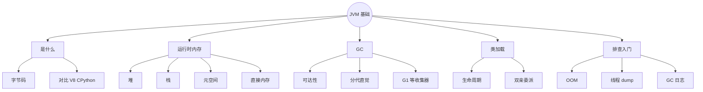
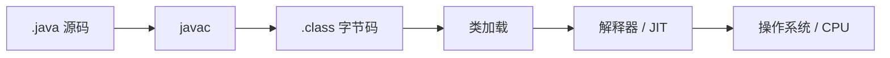
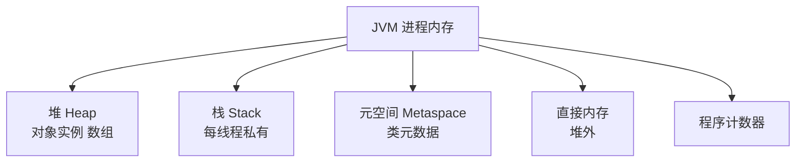
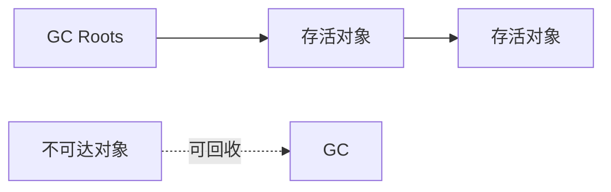
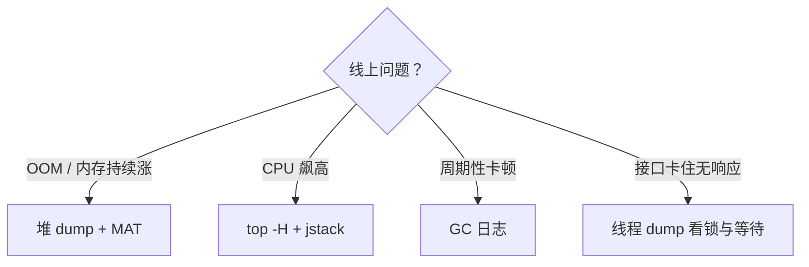

# JVM 基础：内存、GC、类加载与排查入门
> 面向 JS + Python 背景开发者。  
> 目标：建立 JVM 运行时心智模型（堆/栈/元空间）、GC 与常见收集器直觉、类加载过程，以及 OOM / CPU 飙高 / 卡顿时的基本排查路径。
<!-- more -->

## TL;DR（先看结论）

> 💡 一句话结论：**JVM = 跑字节码的虚拟机：类加载进方法区/元空间，对象主要活在堆，线程私有栈帧在栈上；GC 自动回收堆垃圾。** 对比 V8 / CPython，你要多关心「堆多大、GC 停顿、类加载泄漏、线程 dump」。

- 内存：堆（对象） / 栈（帧、局部变量） / 元空间（类元数据） / 直接内存（NIO 等）
- GC：可达性分析；分代直觉（新生代朝生夕死，老年代活得久）；现代默认常见 G1
- 类加载：加载 → 链接 → 初始化；双亲委派；热部署/泄漏常出在自定义 ClassLoader
- 排查三板斧：`jcmd`/`jmap` 看内存，`jstack` 看线程，GC 日志看停顿
- 高频坑：堆设太小频繁 Full GC、堆太大启动慢/回收重、无限缓存导致 OOM、线程爆导致原生内存爆、只看 CPU 不看 GC

## 🗺️ 本笔记知识地图



---
## 0. 本笔记重点
> 💡 一句话结论：JS/Python 开发者也有「运行时 + GC」，但 Java 运维与调优把 JVM 参数、堆dump、线程dump 做成日常工具链——本篇建立**能对话、能入门排查**的词汇，不追求一次性成为调优专家。

| 运行时 | 你熟悉的 | 对应直觉 |
| --- | --- | --- |
| Node | V8 堆、事件循环 | 堆对象 + GC；无线程栈共享业务模型 |
| CPython | 对象堆、引用计数+GC | 也有堆；GIL 限制并行 |
| Java | JVM | 堆 + 多线程栈 + 元空间 + 明确工具 |

本篇重点：内存区域、对象生死与 GC、类加载、常见 OOM、排查命令与参数直觉。

---
## 1. JVM 是什么
> 💡 一句话结论：`.java` → 编译成 `.class` 字节码 → JVM 加载解释/JIT 编译成本地代码执行；「一次编译，到处运行」靠的是各平台 JVM。



SpringBoot 的 `java -jar app.jar`：本质是启动 JVM，从 jar 里加载主类再跑起来。

对比：
- Node：直接跑 JS 源码/字节码（V8）
- Python：`.py` → 字节码 `.pyc` → 解释执行
- Java：强调**静态类型字节码 + 成熟 JIT + 明确运维参数**

---
## 2. 运行时内存区域
> 💡 一句话结论：对象在堆；方法调用在栈；类信息在元空间；NIO 可能用直接内存。OOM 要先问「哪一块爆了」。

### 2.1 总览


| 区域 | 谁拥有 | 存什么 | 典型问题 |
| --- | --- | --- | --- |
| 堆 | 共享 | `new` 出来的对象 | `OutOfMemoryError: Java heap space` |
| 虚拟机栈 | 每线程 | 栈帧：局部变量、操作数、方法出口 | `StackOverflowError` 过深递归 |
| 元空间 | 共享 | 类结构、方法元数据等（JDK 8+ 取代永久代） | `Metaspace` OOM（类太多/泄漏） |
| 直接内存 | 进程 | ByteBuffer.allocateDirect 等 | 堆外 OOM / 进程 RSS 很高 |
| 程序计数器 | 每线程 | 当前执行位置 | 几乎不 OOM |

### 2.2 堆的分代直觉（仍有用）
现代收集器细节各异，但口语仍常说：
- **新生代（Young）**：新对象；Minor GC 频繁、通常较快
- **老年代（Old）**：活得久的对象；Full GC / 混合回收更重
- **晋升**：新生代熬过几次 GC 进入老年代

大多数 Web 对象「请求内创建、请求结束可回收」——分配速率高时，要关注 Young GC 频率与停顿。

### 2.3 栈与 JS/Python 对照
```java
void a() { b(); }
void b() { c(); }
void c() { /* ... */ }
```
每次调用压一帧，返回弹帧——和你对调用栈的直觉一致。  
差异：Java **每个线程一个栈**；线程多 → 栈内存总占用也可观（`-Xss`）。

---
## 3. GC：自动内存管理
> 💡 一句话结论：GC 回收「不可达」对象；不是引用计数唯一方案（JVM 用可达性分析，可处理循环引用）。停顿（Stop-The-World）越短越好，但不是零成本。

### 3.1 可达性
从 GC Roots（线程栈引用、静态变量、JNI 等）出发能摸到的对象算活着；摸不到即可回收。



对比 Python：引用计数 + 循环检测；Java 主要靠追踪式 GC。

### 3.2 常见收集器（认知级）
| 收集器 | 特点 | 何时会遇到 |
| --- | --- | --- |
| Serial / Parallel | 较老；Parallel 吞吐优先 | 老文档、小堆 |
| CMS | 低延迟老方案，已淘汰路径 | 遗留系统 |
| **G1** | JDK 9+ 服务器常见默认方向 | 大堆、可控停顿 |
| ZGC / Shenandoah | 超低停顿 | 大堆、延迟敏感（版本要匹配） |

入门不必背参数表；先会看：**GC 频率、停顿时间、堆是否持续涨到顶**。

### 3.3 分配失败与 Full GC 直觉
- 新生代放不下 → Minor GC
- 老年代空间不足 / 晋升失败 / 显式 `System.gc()`（别乱调）等 → 更重的回收
- 回收后仍不够 → **Heap OOM**

---
## 4. 类加载
> 💡 一句话结论：类不是「用到时魔法出现」，而是按阶段加载并初始化；理解双亲委派有助于懂 Spring Boot 胖 jar、热部署与 Metaspace 泄漏。

### 4.1 生命周期（简化）
加载 → 验证 → 准备 → 解析 → 初始化 → 使用 → 卸载（稀有）

- **准备**：静态字段赋默认值  
- **初始化**：执行 `<clinit>`（静态赋值与静态块）

### 4.2 双亲委派（直觉）
类加载器先请父加载器尝试，父没有再自己加载——保证 `java.lang.String` 等核心类不被窜改。

```text
Bootstrap ClassLoader
    ↑
Extension / Platform ClassLoader
    ↑
Application ClassLoader   ← 你的 classpath
    ↑
自定义 ClassLoader（Tomcat / SPI / 热部署）
```

### 4.3 和业务的关系
- 动态生成大量类（某些增强、脚本、热加载）→ Metaspace 涨
- 热部署后旧 ClassLoader 残留 → 类元数据泄漏
- Spring Boot 可执行 jar 有特殊启动 ClassLoader（理解「为什么 IDE 跑与 java -jar 有时表现不同」）

---
## 5. 常见错误与参数直觉
> 💡 一句话结论：先认异常名字，再调 `-Xmx`；盲目加大堆可能只是延后爆炸。

### 5.1 错误对照
| 现象 | 常见含义 |
| --- | --- |
| `Java heap space` | 堆对象太多 / 泄漏 / 堆过小 |
| `GC overhead limit exceeded` | GC 太勤仍回收很少 |
| `Metaspace` | 类太多或 ClassLoader 泄漏 |
| `Direct buffer memory` | 堆外内存不够 |
| `unable to create new native thread` | 线程太多或系统限制 |
| `StackOverflowError` | 递归过深 / 栈过小 |

### 5.2 高频参数（认识）
| 参数 | 含义 |
| --- | --- |
| `-Xms` / `-Xmx` | 堆初值 / 最大值（常设相同减少伸缩） |
| `-Xss` | 每线程栈大小 |
| `-XX:MetaspaceSize` / `MaxMetaspaceSize` | 元空间 |
| `-XX:+UseG1GC` | 使用 G1 |
| `-Xlog:gc*`（JDK 9+） | GC 日志 |

示例：
```bash
java -Xms512m -Xmx512m -Xlog:gc*:file=gc.log:time,uptime -jar app.jar
```

容器环境：还要让 JVM **感知 cgroup 内存限制**（较新 JDK 较友好），避免「容器限 512M，JVM 以为有主机 16G」。

---
## 6. 排查入门三板斧
> 💡 一句话结论：慢或挂了，先定性：内存涨？CPU 高？线程卡？再取对应现场。

### 6.1 内存怀疑
```bash
jcmd <pid> VM.flags
jcmd <pid> GC.heap_info
# 或 jmap -histo:live <pid>
# 堆转储（慎用，大堆会卡）
jcmd <pid> GC.heap_dump /tmp/heap.hprof
```
用 Eclipse MAT / VisualVM / JProfiler 看 **Dominator Tree**：谁持有最多内存（缓存、Map、监听器泄漏常见）。

对比 Node：`heapdump` / Chrome DevTools；Python：`tracemalloc` / `objgraph`。

### 6.2 线程 / CPU 怀疑
```bash
jstack <pid> > threaddump.txt
# 或多打几次对比
top -H -p <pid>   # 找忙线程，把 PID 转十六进制对 dump 里 nid
```
看是否：死锁、大量 BLOCKED、业务线程死循环、线程数爆炸。

### 6.3 GC 怀疑
开 GC 日志，看：
- Young GC 是否过于频繁（分配太狠或伊甸太小）
- 是否出现长停顿
- 堆曲线是否回收后立刻回到高位（泄漏特征）

### 6.4 排查决策


---
## 7. 和 SpringBoot 日常的关系
> 💡 一句话结论：多数业务问题仍是代码与 SQL；JVM 知识用来判断「是不是运行时层面的锅」以及怎么取证。

常见真实案例：
1. 本地缓存 `ConcurrentHashMap` 只进不出 → Heap OOM  
2. 每次请求生成动态类 / Groovy 脚本 → Metaspace OOM  
3. 线程池无界 + 阻塞任务 → 线程数打满 → 无法创建原生线程  
4. 大 JSON / 大 List 一次加载 → Young GC 疯狂  
5. `parallelStream` 占满 commonPool + 阻塞 → 全局卡顿（呼应第 15/16 篇）

Actuator（第 09 篇）可看基础健康与指标；深挖仍靠 dump 与 GC 日志。

---
## 8. 对比三端

| 主题 | JVM | Node V8 | CPython |
| --- | --- | --- | --- |
| 对象存放 | 堆 | 堆 | 堆 |
| 多线程 | 每线程一栈，真并行 | 主线程单线程 | 有线程但有 GIL |
| GC | 分代/分区追踪等 | 分代 GC | 引用计数+GC |
| 调优入口 | `-Xmx`、GC 日志、jcmd | `--max-old-space-size` | 较少调运行时堆 |
| 现场工具 | jstack / jmap / MAT | heapdump / clinic | faulthandler 等 |

---
## 9. 常见坑点
> 💡 一句话结论：堆不是越大越好；`System.gc()` 不是绩优；泄漏不查 dump 只会反复重启。

1. **只加大 `-Xmx`**：泄漏时只是更晚炸，且 GC 更重。  
2. **堆远超容器限制**：被 cgroup kill（看起来像随机挂）。  
3. **生产频繁打 heap dump**：大停顿。  
4. **忽略 Metaspace**：只盯堆。  
5. **递归过深**：StackOverflow，不是堆问题。  
6. **线程池无界**：线程与栈内存一起爆。  
7. **把 GC 停顿当业务锁问题**：先看 GC 日志。  
8. **本地能跑、服务器 OOM**：环境堆默认不同。  
9. **日志与临时 List 无限缓冲**：隐性泄漏。  
10. **JIT / 预热**：压测前冷启动对比不公平（认知即可）。

---
## 10. 小结

| 主题 | 记住什么 |
| --- | --- |
| 堆 | 对象乐园，OOM 重灾区 |
| 栈 | 每线程调用帧 |
| 元空间 | 类元数据 |
| GC | 回收不可达对象，有停顿 |
| 类加载 | 双亲委派，防核心类被替换 |
| 排查 | dump + GC 日志 + 线程栈 |

口诀：**对象看堆，调用看栈，类看元空间；出事先定性，再取现场。**

---
## 11. 练习建议
1. 写程序无限 `list.add(new byte[1_000_000])`，用小堆 `-Xmx64m` 制造 `heap space` OOM。  
2. 无限递归制造 `StackOverflowError`。  
3. 启动 SpringBoot，用 `jcmd` 看 `GC.heap_info`。  
4. 打一次 `jstack`，找到 Tomcat / 业务线程命名（呼应第 16 篇线程名前缀）。  
5. 开 `-Xlog:gc*` 跑一段流量，读懂 Young GC 行里的前后堆大小。  
6. （选做）故意做一个静态 Map 缓存泄漏，用 MAT 找到 Dominator。  
7. （选做）对比 Node `--max-old-space-size` 与 Java `-Xmx` 文档描述。  
8. （选做）了解 ZGC 适用场景与版本要求。

---
## 12. 下一篇
下一篇：**实战项目：RESTful 后端系统**。  
重点：
- 把 08～13 串成完整业务：分层、REST、校验、异常、MyBatis-Plus
- 配置与多环境、日志与 Actuator
- 测试与打包部署
- 用并发与 JVM 知识做一次「上线检查清单」

> 阶段 5 核心课（并发 + JVM）到此告一段落；实战篇是阶段 6 收口。
