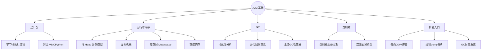
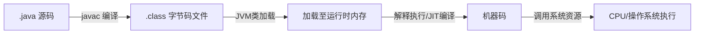
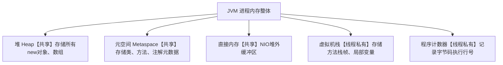
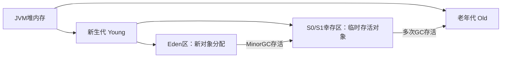
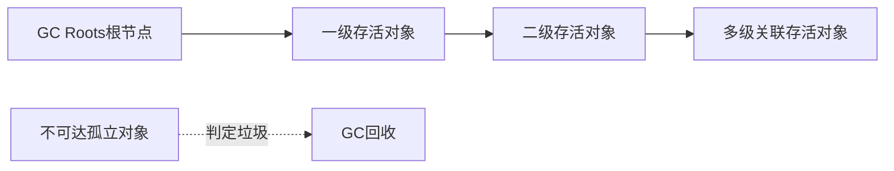
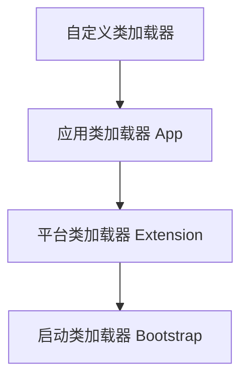
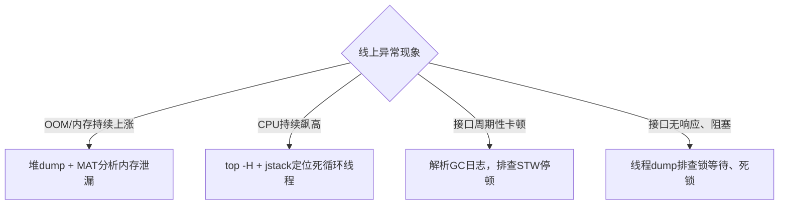

# JVM 基础：内存、GC、类加载与排查入门
> 面向 JS + Python 背景开发者。  
> 目标：建立 JVM 运行时心智模型（堆/栈/元空间）、GC 与常见收集器直觉、类加载过程，以及 OOM / CPU 飙高 / 卡顿时的基本排查路径。
<!-- more -->
## TL;DR（先看结论）

💡 一句话结论：**JVM = 跑字节码的虚拟机：类加载进方法区/元空间，对象主要活在堆，线程私有栈帧在栈上；GC 自动回收堆垃圾。** 对比 V8 / CPython，你要多关心「堆大小、GC 停顿、类加载泄漏、线程 dump」四大核心问题。

- **内存分区**：堆（对象实例） / 虚拟机栈（方法帧） / 元空间（类元数据） / 直接内存（堆外NIO）/ 程序计数器

- **GC核心**：可达性分析判定垃圾；分代回收适配对象生命周期；生产主流G1、低延迟场景ZGC

- **类加载**：七步生命周期 \+ 双亲委派模型；热部署、类泄漏均和自定义类加载器相关

- **排查三板斧**：jcmd/jmap 查内存、jstack 查线程、GC日志分析停顿与回收效率

- **高频线上坑**：堆参数不合理、频繁Full GC、内存泄漏、线程溢出、忽略堆外内存OOM

## 🗺️ 本笔记知识地图


```mermaid
flowchart TB
    ROOT(("JVM 基础"))
    ROOT --> A["是什么"]
    ROOT --> B["运行时内存"]
    ROOT --> C["GC"]
    ROOT --> D["类加载"]
    ROOT --> E["排查入门"]
    A --> A1["字节码执行流程"]
    A --> A2["对比 V8/CPython"]
    B --> B1["堆 Heap 分代模型"]
    B --> B2["虚拟机栈"]
    B --> B3["元空间 Metaspace"]
    B --> B4["直接内存"]
    C --> C1["可达性分析"]
    C --> C2["分代回收直觉"]
    C --> C3["主流GC收集器"]
    D --> D1["类加载生命周期"]
    D --> D2["双亲委派模型"]
    E --> E1["各类OOM排查"]
    E --> E2["线程dump分析"]
    E --> E3["GC日志解读"]

```

## 0\. 前置认知：跨语言运行时对比

💡 核心差异：JS/Python 运行时封装度更高，Java JVM 暴露完整调优参数、工具链和内存模型，需要主动感知运行时风险。

|运行时|核心机制|JVM差异化特点|
|---|---|---|
|Node\(V8\)|分代堆GC、单线程事件循环|无线程栈竞争，无需关注线程内存模型|
|CPython|引用计数\+分代GC、GIL锁限制并行|无显式栈调优、类元数据无泄漏风险|
|JVM\(Java\)|多线程栈、分代/分区GC、类热加载|可精细化调优内存、GC、线程，线上问题可完整取证|

本篇核心掌握：**内存分区边界、GC垃圾回收逻辑、类加载机制、线上故障排查流程**，实现从「会用Java」到「懂JVM运行」的过渡。

## 1\. JVM 核心定义与执行流程

💡 一句话结论：JVM 是跨平台字节码虚拟机，将Java源码编译的\.class文件，通过解释器\+JIT编译器转换为系统可执行的机器码，实现「一次编译，到处运行」。

### 1\.1 完整执行链路


```mermaid
flowchart LR
    A[".java 源码"] -->|"javac 编译"| B[".class 字节码文件"]
    B -->|"JVM类加载"| C[加载至运行时内存]
    C -->|"解释执行/JIT编译"| D[机器码]
    D -->|"调用系统资源"| E["CPU/操作系统执行"]

```

### 1\.2 主流语言运行时对比

- **Java**：静态编译字节码 \+ JIT即时编译 \+ 可控GC，适合高性能服务端

- **Node**：动态解释执行，V8内置JIT，无复杂内存调优

- **Python**：动态解释\+pyc字节码，引用计数为主GC，几乎无需人工调优

日常`java -jar app.jar`本质：启动JVM进程 → 加载SpringBoot容器类 → 初始化环境 → 运行业务代码。

## 2\. JVM 运行时内存区域（核心重点）

💡 一句话结论：内存分区**线程私有**（栈、程序计数器）、**线程共享**（堆、元空间、直接内存）；90%线上OOM问题，均可定位到具体分区。

### 2\.1 内存分区总览


```mermaid
flowchart TB
    JVM["JVM 进程内存整体"]
    %% 线程共享区域
    JVM --> HEAP["堆 Heap【共享】存储所有new对象、数组"]
    JVM --> META["元空间 Metaspace【共享】存储类、方法、注解元数据"]
    JVM --> DIRECT["直接内存【共享】NIO堆外缓冲区"]
    %% 线程私有区域
    JVM --> STACK["虚拟机栈【线程私有】存储方法栈帧、局部变量"]
    JVM --> PC["程序计数器【线程私有】记录字节码执行行号"]

```

### 2\.2 五大分区详细说明

|内存区域|归属特性|存储内容|异常场景|
|---|---|---|---|
|堆 Heap|线程共享，GC主战场|所有new实例、数组、集合对象|Java heap space OOM|
|虚拟机栈|线程私有，随线程销毁|栈帧（局部变量表、操作数栈、方法返回地址）|StackOverflowError、栈OOM|
|元空间|线程共享，JDK8\+替代永久代|类结构、方法、常量、注解、动态生成类|Metaspace OOM（类泄漏）|
|直接内存|堆外内存，不受Xmx限制|NIO ByteBuffer、网络缓冲区|Direct buffer memory OOM|
|程序计数器|线程私有，唯一无OOM区域|当前线程执行的字节码行号|无|

### 2\.3 堆分代模型（通用认知）

现代JDK收集器（G1/ZGC）弱化分代，但业务排查仍需基础认知：


```mermaid
flowchart LR
    HEAP["JVM堆内存"] --> YOUNG["新生代 Young"]
    HEAP --> OLD["老年代 Old"]
    YOUNG --> E["Eden区：新对象分配"]
    YOUNG --> S["S0/S1幸存区：临时存活对象"]
    E -->|"MinorGC存活"| S
    S -->|"多次GC存活"| OLD

```

- **新生代**：对象朝生夕死，Minor GC频繁、停顿短、效率高

- **老年代**：长期存活对象，回收频率低、开销大、易触发FullGC

- **对象晋升**：新生代熬过多次GC后，迁移至老年代长期存储

### 2\.4 虚拟机栈调用机制

方法嵌套调用对应栈帧入栈/出栈，和前端调用栈逻辑一致，核心差异：**Java每条线程独立栈，线程越多，栈内存总占用越高**（可通过`-Xss`调优单栈大小）。

## 3\. GC垃圾回收机制（核心）

💡 一句话结论：JVM通过**可达性分析**判定垃圾，自动回收堆内存无效对象；所有GC均存在STW停顿，核心优化目标是「降低停顿、减少GC频率」。

### 3\.1 垃圾判定：可达性分析

摒弃Python的引用计数（无法解决循环引用），JVM采用根搜索算法：从GC Roots出发，遍历可达对象为存活对象，不可达即为可回收垃圾。


```mermaid
flowchart LR
    R["GC Roots根节点"] --> A["一级存活对象"]
    A --> B["二级存活对象"]
    B --> C["多级关联存活对象"]
    X["不可达孤立对象"] -.->|"判定垃圾"| G["GC回收"]

```

**常见GC Roots**：线程栈局部变量、静态常量、本地方法JNI引用、加载的Class对象、系统类引用

### 3\.2 四大引用类型

|引用类型|特性|回收规则|业务场景|
|---|---|---|---|
|强引用|默认引用|永不回收，直至OOM|常规业务对象|
|软引用|内存敏感|内存不足时回收|图片缓存、临时缓存|
|弱引用|生命周期最短|下次GC必回收|防内存泄漏、缓存兜底|
|虚引用|无实际引用作用|回收前收到通知|堆外内存监控|

### 3\.3 主流GC收集器对比

入门无需死记参数，掌握**适用场景、核心特点**即可，适配线上调优选型。

|收集器|核心特点|适用场景|版本状态|
|---|---|---|---|
|Serial|单线程回收、简单高效、STW长|客户端、小内存应用|老旧、基本淘汰|
|Parallel|多线程、高吞吐量、不关注延迟|后台批量任务、离线服务|JDK8默认新生代收集器|
|CMS|并发低延迟、内存碎片多|早期低延迟业务|JDK14废弃，遗留系统使用|
|**G1**|分区回收、可控停顿、吞吐延迟兼顾|线上大堆、通用Web服务|**JDK9\+默认**|
|ZGC|超低STW、超大堆适配、几乎无停顿|延迟敏感、超大集群服务|JDK15正式商用|

### 3\.4 GC触发与OOM逻辑

- **Minor GC**：Eden区内存占满触发，频率高、速度快

- **Full GC**：老年代不足、晋升失败、手动`System.gc()`触发，开销极大

- **OOM触发条件**：多次GC回收后，堆/元空间/直接内存仍无足够空间分配新对象

## 4\. 类加载机制

💡 一句话结论：Java类不会直接加载到内存，遵循完整生命周期；双亲委派模型保障核心类安全，是理解热部署、类泄漏、SpringBoot打包的关键。

### 4\.1 类完整生命周期


```mermaid
flowchart LR
    1["加载"] --> 2["验证"]
    2 --> 3["准备"]
    3 --> 4["解析"]
    4 --> 5["初始化"]
    5 --> 6["使用"]
    6 --> 7["卸载"]

```

核心阶段释义：

- **加载**：读取\.class文件，生成内存Class对象

- **验证**：校验字节码合法性，防止恶意代码

- **准备**：静态变量分配内存，赋默认初始值

- **初始化**：执行静态代码块、静态变量赋值（触发\<clinit\>方法）

- **卸载**：极少触发，仅自定义类加载器可实现

### 4\.2 双亲委派模型

核心规则：类加载器优先委托父加载器加载，父加载器无法加载时，自身才加载，避免核心类被篡改、重复加载。


```mermaid
flowchart TD
    A["自定义类加载器"] --> B["应用类加载器 App"]
    B --> C["平台类加载器 Extension"]
    C --> D["启动类加载器 Bootstrap"]

```

### 4\.3 业务落地场景

- 动态生成类、Groovy脚本、热部署 → 频繁创建Class对象 → 元空间溢出

- 热部署残留旧类加载器 → 类元数据无法卸载 → 隐形内存泄漏

- SpringBoot胖jar → 自定义类加载器加载jar内资源，区别于普通本地运行

## 5\. 常见异常与JVM核心参数

💡 一句话结论：先识别异常类型，再针对性调参；盲目加大堆内存，只会延后OOM，无法解决泄漏问题。

### 5\.1 高频OOM异常对照表

|异常信息|根因定位|解决方向|
|---|---|---|
|Java heap space|堆对象过多、集合未释放、堆内存过小|排查内存泄漏、优化对象生命周期、合理调大Xmx|
|GC overhead limit exceeded|GC频繁执行，回收效率极低|存在严重内存泄漏，优先排查代码|
|Metaspace OOM|动态类过多、类加载器泄漏|限制动态生成类、修复热部署泄漏|
|Direct buffer memory|堆外NIO内存耗尽|释放无效堆外缓冲区、限制直接内存大小|
|unable to create new native thread|线程数量超出系统限制|优化线程池、限制最大线程数|
|StackOverflowError|递归过深、方法嵌套过多|优化递归逻辑、适当调大Xss|

### 5\.2 高频生产JVM参数

|参数|作用说明|生产建议|
|---|---|---|
|\-Xms|JVM堆初始内存|与Xmx设置相同，避免堆动态扩容开销|
|\-Xmx|JVM堆最大内存|不超过容器/服务器物理内存70%|
|\-Xss|单线程栈内存大小|业务线程默认即可，递归场景适当调大|
|\-XX:MaxMetaspaceSize|元空间最大上限|限制大小，防止元空间无限膨胀|
|\-XX:\+UseG1GC|启用G1垃圾收集器|JDK9\+默认，通用生产方案|
|\-Xlog:gc\*|输出详细GC日志|生产必开，用于故障排查|

生产启动示例：

```bash
java -Xms512m -Xmx512m -XX:MaxMetaspaceSize=256m -Xlog:gc*:file=gc.log:time,uptime -jar app.jar
```

## 6\. 线上故障排查三板斧

💡 一句话结论：线上问题先定性（内存/CPU/线程/GC），再用对应命令取证，不盲目重启服务。

### 6\.1 排查决策流程


```mermaid
flowchart TD
    Q{"线上异常现象"}
    Q -->|"OOM/内存持续上涨"| M["堆dump + MAT分析内存泄漏"]
    Q -->|"CPU持续飙高"| C["top -H + jstack定位死循环线程"]
    Q -->|"接口周期性卡顿"| G["解析GC日志，排查STW停顿"]
    Q -->|"接口无响应、阻塞"| T["线程dump排查锁等待、死锁"]

```

### 6\.2 内存问题排查命令

```bash
# 查看JVM启动参数
jcmd <pid> VM.flags
# 查看堆内存实时信息
jcmd <pid> GC.heap_info
# 查看存活对象统计
jmap -histo:live <pid>
# 导出堆快照（大堆慎用，会STW）
jcmd <pid> GC.heap_dump /tmp/heap.hprof
```

分析工具：Eclipse MAT、VisualVM，重点查看**支配树（Dominator Tree）**，定位大对象、常驻缓存泄漏。

### 6\.3 CPU/线程问题排查命令

```bash
# 查看进程内线程CPU占用
top -H -p <pid>
# 导出线程快照，排查死锁、阻塞
jstack <pid> > threaddump.txt
```

排查重点：线程死锁、BLOCKED阻塞、RUNNABLE死循环、线程数溢出。

### 6\.4 GC日志排查重点

- YoungGC频率过高：对象分配过快、Eden区内存过小

- GC停顿时间过长：大堆回收、FullGC频繁

- 堆内存回收后立即高位：存在内存泄漏

## 7\. SpringBoot 业务常见JVM问题

- 本地静态Map/ConcurrentHashMap无过期清理 → 堆内存泄漏OOM

- 动态生成类、Groovy脚本、热部署 → 元空间持续上涨溢出

- 无界线程池 \+ 阻塞任务 → 线程数爆炸，无法创建新线程

- 一次性加载大List、大JSON → 新生代频繁GC

- parallelStream占用公共线程池 → 全局业务卡顿

核心结论：**90%线上JVM问题，根源是代码问题，而非JVM参数问题**，调参只是优化手段，代码优化才是根治方案。

## 8\. 跨语言运行时最终对比

|对比维度|JVM\(Java\)|V8\(Node\)|CPython|
|---|---|---|---|
|对象存储|堆内存|堆内存|堆内存|
|多线程能力|真并行、多独立栈|单线程串行|假并行（GIL锁）|
|GC机制|分代/分区追踪GC|分代GC|引用计数\+分代GC|
|调优方式|参数\+日志\+dump全方位调优|仅堆大小简单限制|几乎无需调优|
|故障取证|jstack/jmap/MAT全套工具|heapdump、控制台分析|基础日志排查|

## 9\. 生产高频坑点总结

1. 盲目加大`-Xmx`：掩盖内存泄漏，导致GC停顿更严重

2. 堆内存超出容器cgroup限制：被系统随机kill，无报错日志

3. 生产频繁dump堆快照：大堆场景引发长时间STW，服务卡顿

4. 只关注堆内存，忽略元空间、直接内存OOM

5. 递归逻辑无限制，引发栈溢出而非堆溢出

6. 线程池无界配置，导致线程爆炸、系统资源耗尽

7. 误将GC停顿问题，判定为业务锁、代码阻塞问题

8. 本地开发正常、线上OOM：环境默认JVM参数差异导致

9. 日志、临时集合无限累加，造成隐性内存泄漏

10. 压测忽略JIT预热，冷启动性能对比数据失真

## 10\. 核心知识点小结

|核心模块|核心记忆点|
|---|---|
|堆内存|对象存储核心区，GC、OOM高发区，分代回收|
|虚拟机栈|线程私有，存储方法栈帧，递归过深栈溢出|
|元空间|存储类元数据，动态类、热部署易引发泄漏|
|GC机制|可达性分析判垃圾，所有GC均有STW，优先优化代码|
|类加载|双亲委派保安全，七步生命周期，自定义加载器易泄漏|
|故障排查|先定性问题，再dump取证，最后调优修复|

**极简口诀**：对象看堆，调用看栈，类看元空间；出事先定性，取证再修复。

## 11\. 实操练习建议（快速落地）

1. 自定义无限添加集合代码，小堆参数模拟`Java heap space` OOM

2. 编写无限递归方法，模拟`StackOverflowError`

3. 启动SpringBoot，通过jcmd查看实时堆内存、JVM参数

4. 导出线程dump，识别业务线程、Tomcat工作线程

5. 开启GC日志，压测后解读YoungGC、FullGC日志信息

6. 手动构造静态缓存泄漏，用MAT定位泄漏对象

7. 对比Node堆内存限制与JVM堆参数的差异

8. 调研ZGC低延迟收集器的版本适配与生产使用场景

## 12\. 下篇预告

下一篇：**实战项目：RESTful 后端系统**

核心重点：

- 整合分层架构、REST接口、参数校验、全局异常处理

- MyBatis\-Plus实战、多环境配置、日志规范、Actuator监控

- 项目测试、打包、部署完整流程

- 结合并发、JVM知识梳理线上上线检查清单

阶段5（并发\+JVM）核心内容完结，下篇进入项目实战收口阶段！