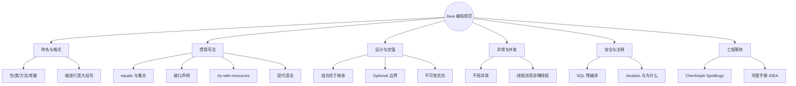

# Java 编程规范：写出可读、安全、可维护的代码
> 面向 JS + Python 背景开发者。  
> 目标：对齐 Java 社区惯例（命名、惯用写法、空值、异常、并发与安全），并落到 Checkstyle / SpotBugs / 阿里巴巴手册等工程手段。对应 Python 篇的「Pythonic」。
<!-- more -->

## TL;DR（先看结论）

> 💡 一句话结论：**好的 Java 代码 = 清晰命名 + 接口优先 + 不吞异常 + 少魔法 + 工具强制。** 风格靠团队统一与自动化；品味靠 Effective Java / 阿里手册。

- 命名：包全小写、类大驼峰、方法/字段小驼峰、常量 `UPPER_SNAKE`
- 惯用：`"ok".equals(x)`、接口类型声明、`try-with-resources`、Optional 只作返回值
- 设计：组合优于继承；优先不可变；不要魔法数字；对外 API 写 Javadoc
- 安全：SQL 用预编译；别把密钥写进代码；日志勿打敏感信息
- 工程：IDE 格式化 + Checkstyle / SpotBugs / Sonar；国内团队常对标《阿里巴巴 Java 开发手册》
- 高频坑：`==` 比字符串、空 `catch`、`new Thread` 满天飞、可变对象当 Map 键、Optional 当字段滥用

## 🗺️ 本笔记知识地图



---
## 0. 本笔记重点
> 💡 一句话结论：JS/Python 也有风格指南（Airbnb / PEP 8）；Java 多一层**静态类型 + 企业级检查器**——规范既是「写起来像 Java」，也是「CI 拦得住」。

| 语言 | 风格权威 | 强制手段 |
| --- | --- | --- |
| JavaScript | Airbnb / Standard | ESLint |
| Python | PEP 8 / Black | flake8 / ruff |
| Java | Oracle / Google Style / 阿里手册 | Checkstyle / SpotBugs / Sonar |

本篇重点：命名格式、惯用写法、该避免的反模式、空值与 Optional、注释、工程工具链。异常细节见《异常体系》，并发见《多线程与并发》。

---
## 1. 命名与格式
> 💡 一句话结论：**一看名字就知道是包、类、方法还是常量**；格式交给工具，人只统一规则。

```java
package com.example.demo;          // 包：全小写，点分隔

public class OrderService {        // 类/接口/枚举：大驼峰 UpperCamelCase
    public static final int MAX_SIZE = 100; // 常量：全大写 + 下划线

    private final OrderRepository repo;     // 字段：小驼峰 lowerCamelCase

    public OrderDTO findById(long id) {     // 方法：小驼峰；动词开头
        return repo.find(id);
    }
}
```

| 元素 | 约定 | 示例 |
| --- | --- | --- |
| 包 | 全小写 | `com.example.order` |
| 类 / 接口 / 枚举 / 注解 | UpperCamelCase | `OrderService`、`List`、`Retention` |
| 方法 / 字段 / 局部变量 | lowerCamelCase | `findById`、`orderId` |
| 常量 | `UPPER_SNAKE` | `MAX_RETRY` |
| 泛型参数 | 单大写字母或有意义短名 | `T`、`E`、`K`、`V`、`ID` |
| 布尔方法 | `is` / `has` / `can` | `isEmpty()`、`hasNext()` |
| 测试类 | 被测类 + `Test` | `OrderServiceTest` |

格式约定（团队选一套锁死即可）：

- 缩进 **4 空格**（不用 Tab）
- 行宽建议 **100～120**
- 大括号：Oracle / Google 多为「同行开括号」`{`；关键统一最重要
- 推荐：IDE 一键格式化，或 `google-java-format` / Spotless

对比：

| | Java | JS | Python |
| --- | --- | --- | --- |
| 类 | `OrderService` | `OrderService` | `OrderService` |
| 方法 | `findById` | `findById` | `find_by_id` |
| 常量 | `MAX_SIZE` | `MAX_SIZE` | `MAX_SIZE` |
| 包/模块 | `com.example.demo` | 文件路径 / `@scope/pkg` | `package_name` |

---
## 2. 惯用写法（Idiomatic Java）
> 💡 一句话结论：字符串用 `equals`、集合判空要防 NPE、声明用接口、资源用 try-with-resources——这些是「像 Java」的最低门槛。

```java
// 1) 字符串内容比较：常量在前，防 NPE；或用 Objects.equals
if ("ok".equals(status)) { }
if (Objects.equals(a, b)) { }

// 2) 空集合：先判 null 再判 empty（或从源头保证非 null）
if (list == null || list.isEmpty()) { }
if (list != null && !list.isEmpty()) { }

// 3) 优先接口类型声明（便于换实现）
List<String> names = new ArrayList<>();
Map<String, Integer> counter = new HashMap<>();
Set<Long> ids = new HashSet<>();

// 4) try-with-resources：自动关流（见异常篇）
try (InputStream in = Files.newInputStream(path);
     BufferedReader reader = new BufferedReader(new InputStreamReader(in))) {
    return reader.readLine();
}

// 5) Optional：表达「可能没有」的返回值，不要当字段/参数滥用
Optional<User> user = findUser(id);
user.ifPresent(u -> log.info("user={}", u.getName()));
User u = user.orElseThrow(() -> new NotFoundException(id));

// 6) 现代 switch 表达式（Java 14+）
String label = switch (day) {
    case 1, 2, 3, 4, 5 -> "工作日";
    case 6, 7 -> "周末";
    default -> "未知";
};

// 7) var 局部变量（Java 10+）：右边类型已明显时可用，别到处用丢可读性
var names = List.of("a", "b");
```

集合与对象习惯：

```java
// 不可变视图 / 工厂（按需）
List<String> fixed = List.of("a", "b");          // 不可变
Map<String, Integer> m = Map.of("x", 1);

// equals / hashCode 成对出现（当 Map/Set 键或业务相等时）
// 优先用 record（Java 16+）或 Lombok @EqualsAndHashCode，手工写易漏字段

record Money(BigDecimal amount, Currency currency) {}
```

---
## 3. 设计取向
> 💡 一句话结论：**组合 + 接口 > 深层继承**；能不可变就不可变；魔法数字提成命名常量。

```java
// 组合：OrderService 依赖仓储，而不是继承一堆基类「万能 Service」
public class OrderService {
    private final OrderRepository repo;
    private final InventoryClient inventory;

    public OrderService(OrderRepository repo, InventoryClient inventory) {
        this.repo = repo;
        this.inventory = inventory;
    }
}

// 不可变字段：构造后不再改，线程更安全、心智更简单
public final class UserId {
    private final long value;
    public UserId(long value) { this.value = value; }
    public long value() { return value; }
}
```

| 倾向 | 说明 |
| --- | --- |
| 组合优于继承 | 继承是强耦合；优先「有一个」而不是「是一个」的深层树 |
| 面向接口 | 方法参数/字段类型用 `List`/`Map`/`Repository`，少绑死实现类 |
| 不可变优先 | `final` 字段、`record`、不可变集合；共享状态才上锁 |
| 单一职责 | 一个类一件事；上帝类难测难改 |
| 显式优于隐式 | 少依赖「碰巧的」包扫描副作用；关键约定写进配置/文档 |

---
## 4. 空值、Optional 与基本类型
> 💡 一句话结论：**能从 API 边界消灭 null 就消灭**；Optional 是返回值的「可能空」，不是万能包装纸。

| 做法 | 推荐？ | 说明 |
| --- | --- | --- |
| 返回 `Optional<T>` | ✅ | 调用方被迫处理「没有」 |
| 字段类型 `Optional<T>` | ❌ | 序列化、Bean、反射都别扭 |
| 方法参数 `Optional<T>` | ❌ | 直接重载或可空注解更清晰 |
| 集合返回 `null` | ❌ | 返回空集合 `List.of()` / `Collections.emptyList()` |
| `int` vs `Integer` | 视场景 | 基本类型无 null；包装类型才有 null，注意拆箱 NPE |

```java
// 推荐：没有就 Optional.empty() / orElse / orElseThrow
public Optional<User> findById(long id) { ... }

// 推荐：集合永不返回 null
public List<Order> listByUser(long userId) {
    return repo.findByUserId(userId); // 无数据 → 空 List
}

// 注解（可选）：配合 Checker Framework / IDE / SpotBugs
public @Nullable String nickname;
public @NonNull String email;
```

对比：JS 的 `?.` / `??`、Python 的 `x or default` 更随意；Java 更强调**类型与约定**把空值逼到边界。

---
## 5. 异常与日志（规范视角）
> 💡 一句话结论：**不吞异常、不捕获过宽、包装不丢 cause、日志带上下文**——细则见《异常体系》。

```java
// ❌ 空 catch：问题被抹掉
try {
    doWork();
} catch (Exception e) {
}

// ✅ 记录或转换后上抛
try {
    doWork();
} catch (IOException e) {
    log.error("doWork failed, orderId={}", orderId, e);
    throw new BusinessException("ORDER_IO", "处理失败", e);
}
```

要点：

- `catch (Exception e)` 慎用；能捕具体类型就捕具体类型
- 业务可预期失败用业务异常 + 错误码；系统故障保留堆栈
- 日志用 SLF4J 占位符：`log.info("id={}", id)`，不要 `+` 拼接
- 日志勿打印密码、token、身份证号明文

---
## 6. 并发与资源
> 💡 一句话结论：**线程池执行任务，别 `new Thread`；共享可变状态要同步；资源必须关闭。**

| 不推荐 | 推荐 |
| --- | --- |
| 业务里随意 `new Thread(...)` | `ExecutorService` / Spring `@Async` + 有界队列 |
| 并发写普通 `HashMap` | `ConcurrentHashMap` 或外部同步 |
| 手工 `stream.close()` 易漏 | `try-with-resources` |
| 无超时的 `Future.get()` | `get(timeout, unit)` |

详见《多线程与并发》。

---
## 7. 安全底线
> 💡 一句话结论：规范里的「安全」不是写论文，是**挡住最常见的三种事故：注入、密钥泄漏、越权数据。**

```java
// ❌ SQL 字符串拼接用户输入 → 注入
String sql = "SELECT * FROM user WHERE name = '" + name + "'";

// ✅ 预编译 / MyBatis #{} 
try (PreparedStatement ps = conn.prepareStatement(
        "SELECT * FROM user WHERE name = ?")) {
    ps.setString(1, name);
}

// MyBatis：用 #{}，不要用 ${} 拼关键字（除非白名单列名）
```

- 密钥、数据库密码进环境变量 / 配置中心，不进 Git
- 对外接口做鉴权与越权校验（不能只信前端传来的 `userId`）
- 文件路径、命令行参数同样防注入（别直接拼 `Runtime.exec`）

---
## 8. 注释与文档
> 💡 一句话结论：**注释写「为什么」；对外 API 写 Javadoc；废话注释不如好命名。**

```java
/**
 * 计算折扣后价格。
 *
 * @param price 原价，必须 &gt; 0
 * @param rate  折扣率，闭区间 [0, 1]
 * @return 折后价，规模与 currency 小数位一致
 * @throws IllegalArgumentException 当 price 或 rate 非法
 */
public BigDecimal discount(BigDecimal price, BigDecimal rate) {
    // 营销侧约定：rate=0 表示免费赠品价，不能提前 return 原价
    ...
}
```

- 好命名 > 注释复述代码（`i++` 旁写「i 自增」是噪声）
- 复杂算法、业务妥协、临时 Hack：必须写清原因与拆除条件
- `TODO` / `FIXME` 带工单号或负责人，避免永久腐烂

---
## 9. 该避免的写法（速查表）

| 不推荐 | 推荐 |
| --- | --- |
| `==` 比字符串 / 包装对象内容 | `equals` / `Objects.equals` |
| 空 `catch` 吞异常 | 记日志或向上抛（带 cause） |
| 魔法数字散落 | `private static final` 命名常量 |
| `new Thread` 无限制创建 | 有界线程池 |
| SQL / 命令字符串拼接用户输入 | `PreparedStatement` / 参数绑定 |
| 深层继承造「万能基类」 | 组合 + 接口 |
| 返回 `null` 集合 | 空集合 |
| Optional 当字段/参数 | 仅作返回值 |
| 可变对象当 `HashMap` 键 | 不可变键，或正确维护 `equals`/`hashCode` |
| `System.out.println` 当日志 | SLF4J |
| 在循环里字符串 `+` 大量拼接 | `StringBuilder` / `String.join` |
| 捕获 `Throwable` / `Error` | 只处理可恢复的 `Exception` |

---
## 10. 工程落地：手册与工具
> 💡 一句话结论：**规范写在 wiki 里没人看；进 Checkstyle / CI 才会生效。**

### 10.1 常读文档

- [Oracle Code Conventions](https://www.oracle.com/java/technologies/javase/codeconventions-contents.html)（经典，偏老）
- [Google Java Style Guide](https://google.github.io/styleguide/javaguide.html)
- 《阿里巴巴 Java 开发手册》（国内团队事实标准：命名、并发、集合、异常、MySQL、工程结构）
- 《Effective Java》（Joshua Bloch）——品味与 API 设计必读，不是格式手册

### 10.2 工具链

| 工具 | 作用 |
| --- | --- |
| IDE 格式化 / Save Actions | 保存即统一风格 |
| Checkstyle / Spotless | 风格、导入、命名可自动化 |
| SpotBugs / Error Prone | 找 NPE、资源未关、equals 坑等 |
| SonarQube | 重复代码、复杂度、安全异味 |
| EditorConfig | 跨 IDE 统一缩进与换行 |

Maven 示例思路（示意，按需引入）：

```xml
<!-- 构建时跑 Checkstyle；失败即 fail the build -->
<plugin>
  <groupId>org.apache.maven.plugins</groupId>
  <artifactId>maven-checkstyle-plugin</artifactId>
</plugin>
```

### 10.3 IDEA 常用设置（建议）

- Editor → Code Style → Java：导入 `GoogleStyle` 或团队 XML
- 开启 Optimize imports on the fly
- Inspections：空指针、未使用变量、资源泄漏保持开启
- 安装阿里 Java 编码规约插件（可选，与手册条目对齐）

---
## 11. 对比三端

| 主题 | Java | JavaScript | Python |
| --- | --- | --- | --- |
| 风格圣经 | Effective Java + 阿里手册 | Airbnb / 团队 ESLint | PEP 8 + Pythonic |
| 强制手段 | Checkstyle / SpotBugs | ESLint / Prettier | ruff / Black |
| 命名 | 驼峰为主 | 驼峰为主 | 蛇形为主 |
| 空值 | Optional + 约定非 null 集合 | `?.` `??` | `None` + EAFP |
| 资源 | try-with-resources | `finally` / `using` 少见 | `with` |
| 包结构 | 反向域名包 | 文件/目录模块 | 包 + `__init__` |

---
## 12. 常见坑点
> 💡 一句话结论：动态语言转 Java，最容易栽在「`==`、空 catch、null 集合、裸线程、Optional 滥用」上。

1. **`==` 比字符串**：比的是引用，不是内容。
2. **`Integer` 用 `==`**：缓存区间内碰巧对，区间外翻车。
3. **空 catch / 只 `printStackTrace`**：生产环境等于没处理。
4. **集合方法返回 null**：调用方到处 NPE；统一空集合。
5. **Optional 层层套、当字段**：代码更丑且难序列化。
6. **上帝类 + 深层继承**：改一处炸一片。
7. **日志拼接敏感信息**：合规与安全事故。
8. **`${}` 拼 SQL**：MyBatis 注入经典坑。
9. **本地能过、CI 风格检查挂**：没把格式化工具接到保存/提交钩子。
10. **照抄过时规范**：如坚持 `Vector`/`Hashtable`——以现代 JDK + 团队手册为准。

---
## 13. 小结

| 主题 | 记住什么 |
| --- | --- |
| 命名 | 包小写、类大驼峰、方法小驼峰、常量大写 |
| 惯用 | equals、接口声明、try-with-resources |
| 空值 | 集合不返回 null；Optional 仅返回值 |
| 设计 | 组合、不可变、少魔法 |
| 异常 | 不吞、不丢 cause、日志有上下文 |
| 并发 | 线程池；ConcurrentHashMap |
| 安全 | 预编译 SQL；密钥不进库 |
| 落地 | 手册 + Checkstyle/SpotBugs + CI |

口诀：**命名清晰，接口优先，空值靠边，异常透明，工具强制。**

---
## 14. 练习建议
1. 打开现有类，按命名表改一轮；用 IDEA Reformat 对齐大括号与导入。
2. 把项目里所有 `catch (Exception e) {}` 搜出来，改成日志 + 上抛或明确处理。
3. 找一处字符串 `==` 比较，改成 `Objects.equals`；写单测锁住。
4. 给一个返回 `null` List 的方法改成空集合，观察调用方简化情况。
5. 读《阿里巴巴 Java 开发手册》「编程规约」前三章，对照自己代码列 5 条差距。
6. （选做）Maven 接入 `spotless` 或 `checkstyle`，故意写错格式看 CI 是否拦住。
7. （选做）读 Effective Java 条目：Prefer try-with-resources、Prefer composition、Avoid finalizers（对照现代 Cleaner）。

