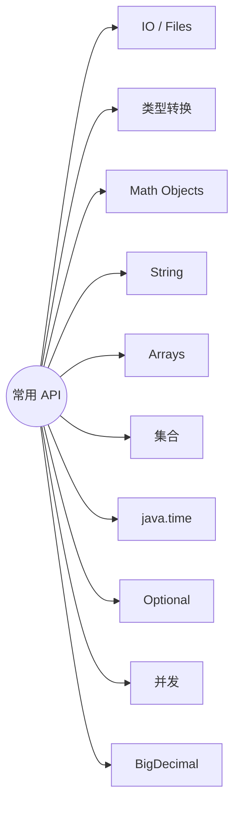

# 附录：常用 API 速查
> 面向 JS + Python 背景开发者。  
> 定位：**查表用**，不是教程。对应 Python《常用内置函数速查》。进阶关键字 / 泛型 / Stream 选型见 [55.附录-进阶速查表](/pages/java-adv-cheatsheet/)。
<!-- more -->

## TL;DR（怎么用本附录）

> 💡 一句话结论：**按场景找类，按类找方法。** 日常最高频：`String` / `List`/`Map` / `Files` / `LocalDateTime` / `Objects` / `Optional`。

| 你想… | 先看 |
| --- | --- |
| 打印 / 读键盘 / 读文件 | §1 输入输出 |
| `"42"` ↔ `int` | §2 类型转换 |
| 最值、随机、空安全相等 | §3 Math / Objects |
| 切分、替换、拼接 | §4 字符串 |
| 排序、拷贝数组 | §5 数组 |
| List / Set / Map | §6 集合 |
| 日期格式化、时区 | §7 java.time |
| 可能为空的返回值 | §8 Optional |
| 线程池、原子类 | §9 并发 |
| 金额计算 | §10 BigDecimal |

## 🗺️ 类别索引



对照三端：

| 场景 | Java | JS | Python |
| --- | --- | --- | --- |
| 打印 | `System.out.println` | `console.log` | `print` |
| 读文件文本 | `Files.readString` | `fs.readFileSync` | `Path.read_text` |
| 字符串切分 | `s.split(",")` | `s.split(",")` | `s.split(",")` |
| 动态数组 | `ArrayList` | `[]` | `list` |
| 字典 | `HashMap` | `Map` / `{}` | `dict` |
| 日期 | `LocalDateTime` | `Date` / dayjs | `datetime` |
| 可选值 | `Optional` | `??` / 可能 `undefined` | `Optional` 少用 / `None` |

---
## 1. 输入输出与文件

| API | 作用 | 示例 |
| --- | --- | --- |
| `System.out.println` | 换行输出 | `println("hi")` |
| `System.out.print` | 不换行 | `print("hi")` |
| `System.out.printf` | 格式化 | `printf("%d%n", 1)` |
| `Scanner` | 读键盘/流 | `new Scanner(System.in).nextLine()` |
| `Files.readString` | 读整个文本（Java 11+） | `Files.readString(path)` |
| `Files.writeString` | 写文本 | `Files.writeString(path, s)` |
| `Files.readAllLines` | 按行读成 List | `Files.readAllLines(path)` |
| `Files.write` | 写行 / 字节 | `Files.write(path, lines)` |
| `Files.exists` / `createDirectories` | 存在性 / 建目录 | |
| `Path.of` | 路径（推荐） | `Path.of("a", "b.txt")` |
| `Paths.get` | 旧写法 | `Paths.get("a/b.txt")` |

```java
Path path = Path.of("data", "note.txt");
String text = Files.readString(path, StandardCharsets.UTF_8);
Files.writeString(path, text + "\n", StandardOpenOption.APPEND);

try (var reader = Files.newBufferedReader(path)) {
    String line;
    while ((line = reader.readLine()) != null) {
        // ...
    }
}
```

> 资源关闭用 **try-with-resources**。二进制大文件用流式 API，别整文件读进内存。

---
## 2. 类型转换

| API | 作用 | 示例 / 注意 |
| --- | --- | --- |
| `Integer.parseInt` | 字符串 → `int` | 失败抛 `NumberFormatException` |
| `Long.parseLong` | 字符串 → `long` | |
| `Double.parseDouble` | 字符串 → `double` | |
| `Boolean.parseBoolean` | 字符串 → `boolean` | 仅 `"true"`（忽略大小写）为 true |
| `String.valueOf` | 任意 → 字符串 | `null` → `"null"` 字符串 |
| `Integer.valueOf` | 装箱 / 解析 | `valueOf(1)` 或 `valueOf("1")` |
| `(int) x` | 强制窄化 | `(int) 3.9` → `3`（截断，非四舍五入） |
| `obj.toString()` | 对象 → 字符串 | `obj` 为 null 会 NPE；优先 `String.valueOf` |

```java
int n = Integer.parseInt("42");
String s = String.valueOf(42);       // "42"
Integer boxed = Integer.valueOf(42); // 装箱；-128~127 可能走缓存
```

| Java | JS | Python |
| --- | --- | --- |
| `Integer.parseInt("42")` | `parseInt("42", 10)` | `int("42")` |
| `String.valueOf(42)` | `String(42)` | `str(42)` |
| `(int) 3.9` | `Math.trunc(3.9)` | `int(3.9)` |

---
## 3. Math 与 Objects

| API | 作用 | 示例 |
| --- | --- | --- |
| `Math.abs` | 绝对值 | `Math.abs(-5)` |
| `Math.max` / `min` | 最值 | `Math.max(1, 2)` |
| `Math.pow` / `sqrt` | 幂 / 平方根 | `Math.pow(2, 3)` → `8.0` |
| `Math.round` / `ceil` / `floor` | 舍入 | `Math.round(3.5)` |
| `Math.random` | `[0,1)` 随机 | `(int)(Math.random()*10)` → 0~9 |
| `ThreadLocalRandom.current()` | 并发友好随机 | `.nextInt(10)` |
| `Objects.equals` | 空安全相等 | `Objects.equals(a, b)` |
| `Objects.requireNonNull` | 非空校验 | `requireNonNull(x, "x")` |
| `Objects.requireNonNullElse` | 空则默认 | `requireNonNullElse(x, def)` |
| `Objects.toString` | 空安全 toString | `Objects.toString(x, "null")` |
| `Objects.hash` | 组合哈希 | `Objects.hash(a, b)` |

```java
if (Objects.equals(a, b)) { }
String name = Objects.requireNonNull(input, "name required");
```

---
## 4. 字符串 `String` / `StringBuilder`

| 方法 | 作用 |
| --- | --- |
| `length` / `isEmpty` / `isBlank` | 长度；空；空白（Java 11+） |
| `charAt` / `substring` | 取字符 / 子串（`substring` 含头不含尾） |
| `contains` / `indexOf` / `lastIndexOf` | 包含 / 位置 |
| `startsWith` / `endsWith` | 前后缀 |
| `toLowerCase` / `toUpperCase` | 大小写 |
| `trim` / `strip` / `stripLeading` | 去空白（`strip` 认 Unicode 空白） |
| `replace` / `replaceAll` | 替换（后者正则） |
| `split` | 按正则分割 | `split("\\s+")` |
| `String.join` | 拼接 | `String.join(",", list)` |
| `formatted` / `String.format` | 格式化 | `"%s-%d".formatted(a, 1)` |
| `matches` | 整串正则匹配 | |
| `repeat` | 重复（Java 11+） | `"ab".repeat(3)` |
| `lines` | 按行 Stream（Java 11+） | |

```java
String s = "  Hello,Java  ".strip();
boolean ok = "ok".equals(status);           // 常量在前防 NPE
String[] parts = "a,b,c".split(",");
String joined = String.join("-", List.of("a", "b"));

// 大量拼接用 StringBuilder（循环内不要用 +）
StringBuilder sb = new StringBuilder();
sb.append("a").append(1).insert(0, "[").append("]");
String out = sb.toString();
```

| 注意 | 说明 |
| --- | --- |
| `==` vs `equals` | 内容比较用 `equals` / `Objects.equals` |
| `String` 不可变 | `replace` 等返回新串，原串不变 |
| `replaceAll` | 第二参数也认正则替换符，纯文本优先 `replace` |
| `split(".")` | `.` 是正则「任意字符」，应 `split("\\.")` |

---
## 5. 数组与 `Arrays`

| API | 作用 |
| --- | --- |
| `arr.length` | 长度（**字段**，不是方法） |
| `Arrays.sort` | 排序（原地） |
| `Arrays.toString` / `deepToString` | 打印一维 / 多维 |
| `Arrays.copyOf` / `copyOfRange` | 拷贝 / 截取拷贝 |
| `Arrays.equals` / `deepEquals` | 内容相等 |
| `Arrays.fill` | 填充 |
| `Arrays.binarySearch` | 二分（**必须已有序**） |
| `Arrays.asList` | 定长 List 视图（不能 `add`） |
| `System.arraycopy` | 高效区间拷贝 |
| `Arrays.stream` | 转 Stream | `Arrays.stream(arr)` |

```java
int[] a = {3, 1, 2};
Arrays.sort(a);
System.out.println(Arrays.toString(a)); // [1, 2, 3]

int[] b = Arrays.copyOf(a, a.length);
List<String> view = Arrays.asList("a", "b"); // 定长
List<String> list = new ArrayList<>(List.of("a", "b")); // 可变
```

---
## 6. 集合常用操作

```
Collection
├── List  → ArrayList（默认）/ LinkedList / ArrayDeque（作栈队列）
└── Set   → HashSet / LinkedHashSet / TreeSet
Map（独立）→ HashMap / LinkedHashMap / TreeMap / ConcurrentHashMap
```

| 操作 | List | Set | Map |
| --- | --- | --- | --- |
| 添加 | `add(e)` | `add(e)` | `put(k, v)` |
| 获取 | `get(i)` | — | `get(k)` / `getOrDefault` |
| 判断 | `contains` | `contains` | `containsKey` / `containsValue` |
| 删除 | `remove(i)` / `remove(e)` | `remove(e)` | `remove(k)` |
| 大小 / 空 | `size` / `isEmpty` | 同左 | 同左 |
| 遍历 | for-each | for-each | `entrySet` / `forEach` |

```java
List<String> list = new ArrayList<>();
list.add("Java");
list.get(0);
list.removeIf(s -> s.startsWith("J"));

Set<String> set = new HashSet<>();
set.add("a");

Map<String, Integer> map = new HashMap<>();
map.put("a", 1);
map.getOrDefault("b", 0);
map.merge("a", 1, Integer::sum);          // 计数神器
map.computeIfAbsent("k", k -> new ArrayList<>());

for (var e : map.entrySet()) {
    System.out.println(e.getKey() + "=" + e.getValue());
}
map.forEach((k, v) -> System.out.println(k + "=" + v));
```

| 实现 | 特点 | 对标直觉 |
| --- | --- | --- |
| `ArrayList` | 随机访问 O(1) | JS 数组 / Python list |
| `LinkedList` | 头尾插删快，随机访问慢 | 少作默认 List |
| `HashSet` / `HashMap` | 无序，均摊 O(1) | `Set` / `Map`/`dict` |
| `LinkedHashSet` / `LinkedHashMap` | 保持插入序 | 有序字典 |
| `TreeSet` / `TreeMap` | 按比较器排序 | `SortedSet` / 有序 map |
| `List.of` / `Map.of` | 不可变短集合 | `Object.freeze` 近似 |
| `Collections.emptyList()` | 空不可变 List | 别返回 `null` |

工具类速记：`Collections.sort`、`Collections.unmodifiableList`、`Collections.frequency`；Java 21+ 也可看 `SequencedCollection`。

> 选型细节与坑见《集合框架》；并发 Map 见《多线程与并发》。

---
## 7. 日期时间（`java.time`）

| 类型 | 用途 |
| --- | --- |
| `LocalDate` | 仅日期 | `2026-09-25` |
| `LocalTime` | 仅时间 | `16:50` |
| `LocalDateTime` | 日期+时间（**无时区**） |
| `ZonedDateTime` | 带时区 |
| `Instant` | 时间线瞬间（UTC 机读） |
| `Duration` / `Period` | 时分秒间隔 / 年月日间隔 |
| `DateTimeFormatter` | 格式化与解析 |

```java
LocalDate today = LocalDate.now();
LocalDateTime dt = LocalDateTime.of(2026, 9, 25, 16, 50);
LocalDateTime later = dt.plusDays(1).minusHours(2);

DateTimeFormatter fmt = DateTimeFormatter.ofPattern("yyyy-MM-dd HH:mm");
String s = dt.format(fmt);
LocalDateTime parsed = LocalDateTime.parse("2026-09-25 16:50", fmt);

Instant now = Instant.now();
ZonedDateTime sh = now.atZone(ZoneId.of("Asia/Shanghai"));
```

| 注意 | 说明 |
| --- | --- |
| 新代码 | **优先 `java.time`**，少用 `Date` / `Calendar` |
| `LocalDateTime` | 无时区，存「本地墙上时间」；跨时区用 `Instant`/`ZonedDateTime` |
| 线程安全 | `DateTimeFormatter` 不可变，可共享 |
| 与 JS | 更接近 `Temporal` / dayjs；别当毫秒数随便加减（用 `plus`/`minus`） |

---
## 8. Optional（速查）

| API | 作用 |
| --- | --- |
| `Optional.of` | 非 null 包装（null 立即 NPE） |
| `Optional.ofNullable` | 可为 null |
| `Optional.empty` | 空 |
| `isPresent` / `isEmpty` | 是否有值（Java 11+ `isEmpty`） |
| `ifPresent` / `ifPresentOrElse` | 有则消费 |
| `orElse` / `orElseGet` / `orElseThrow` | 取默认 / 懒默认 / 抛异常 |
| `map` / `flatMap` / `filter` | 转换 / 过滤 |

```java
Optional<User> user = findUser(id);
user.ifPresent(u -> log.info("{}", u.getName()));
User u = user.orElseThrow(() -> new NotFoundException(id));
String name = user.map(User::getName).orElse("anonymous");
```

> **只作返回值**；不要当字段/参数。详见《编程规范》《Lambda 与 Stream》。

---
## 9. 并发 API 速查

| API | 用途 |
| --- | --- |
| `Executors` / `ThreadPoolExecutor` | 创建线程池（生产更推荐后者显式参数） |
| `ExecutorService` | `submit` / `invokeAll` / `shutdown` |
| `CompletableFuture` | 异步编排（类似 Promise） |
| `synchronized` / `ReentrantLock` | 互斥 |
| `volatile` | 可见性（不保证复合操作原子） |
| `AtomicInteger` 等 | 原子计数 |
| `ConcurrentHashMap` | 并发 Map |
| `CountDownLatch` | 等待计数归零 |
| `Semaphore` | 限流许可 |
| `Thread.sleep` | 休眠（抛受检中断） |

```java
ExecutorService pool = Executors.newFixedThreadPool(4);
Future<Integer> f = pool.submit(() -> 42);
CompletableFuture.supplyAsync(() -> "ok", pool)
    .thenApply(String::toUpperCase)
    .thenAccept(System.out::println);
pool.shutdown();
```

> 完整模型与坑见《多线程与并发》。

---
## 10. BigDecimal（金额）

| API | 作用 |
| --- | --- |
| `new BigDecimal("0.1")` | **用字符串构造**，避免 `double` 误差 |
| `add` / `subtract` / `multiply` | 加减乘 |
| `divide` | 除（**必须指定精度与舍入**） |
| `setScale` | 设小数位 |
| `compareTo` | 比较（不要用 `equals` 比数值，`1.0`≠`1.00`） |
| `stripTrailingZeros` | 去尾零 |

```java
BigDecimal a = new BigDecimal("0.1");
BigDecimal b = new BigDecimal("0.2");
BigDecimal sum = a.add(b); // 0.3
BigDecimal q = a.divide(b, 2, RoundingMode.HALF_UP);
if (sum.compareTo(new BigDecimal("0.30")) == 0) { }
```

| 不要 | 要 |
| --- | --- |
| `new BigDecimal(0.1)` | `new BigDecimal("0.1")` |
| `==` / `equals` 比金额 | `compareTo == 0` |
| `double` 累加钱 | `BigDecimal` |

---
## 11. 其它高频一小撮

| API | 场景 |
| --- | --- |
| `UUID.randomUUID()` | 生成唯一 ID |
| `Base64.getEncoder()` | Base64 编解码 |
| `URLEncoder.encode` | 表单/URL 编码（注意字符集） |
| `MessageDigest.getInstance("SHA-256")` | 摘要（密码请用专用哈希如 BCrypt） |
| `System.currentTimeMillis()` | 毫秒时间戳（业务日期优先 `Instant`） |
| `System.nanoTime()` | 间隔计时（不要当墙钟） |
| `Class.forName` | 反射加载（框架多用，业务少碰） |
| `record` | 不可变数据载体（Java 16+） |

```java
String id = UUID.randomUUID().toString().replace("-", "");
long t0 = System.nanoTime();
// ...
long costNs = System.nanoTime() - t0;
```

---
## 12. Stream 一行速记（详情见专篇）

```java
list.stream()
    .filter(s -> s.length() > 3)
    .map(String::toUpperCase)
    .sorted()
    .toList();                 // Java 16+；或 collect(Collectors.toList())

map.values().stream().mapToInt(Integer::intValue).sum();
```

| 中间 | 终端 |
| --- | --- |
| `filter` `map` `flatMap` `distinct` `sorted` `limit` `skip` | `collect` `toList` `forEach` `reduce` `count` `findFirst` `anyMatch` |

---
## 13. 按包速查索引

| 包 / 类 | 常见成员 |
| --- | --- |
| `java.lang` | `String` `StringBuilder` `Math` `System` `Integer`… |
| `java.util` | `List` `Map` `Set` `Optional` `Objects` `Arrays` `Collections` `UUID` `Scanner` |
| `java.util.concurrent` | `ExecutorService` `CompletableFuture` `ConcurrentHashMap` `Atomic*` |
| `java.time` | `LocalDate*` `Instant` `Duration` `DateTimeFormatter` |
| `java.nio.file` | `Path` `Files` `StandardOpenOption` |
| `java.math` | `BigDecimal` `BigInteger` |
| `java.util.stream` | `Stream` `Collectors` |

---
## 14. 相关笔记

| 主题 | 文档 |
| --- | --- |
| 语法与类型 | 《Java 基础语法》 |
| 集合选型 | 《集合框架》 |
| Lambda / Stream | 《Lambda 与 Stream》 |
| 并发 | 《多线程与并发》 |
| 风格与坑 | 《编程规范》 |
| 关键字 / 泛型 / 注解 | 《附录-进阶速查表》 |

口诀：**字符串不可变，集合接口声明，日期用 time，金额用 BigDecimal，空用 Optional 返回。**
