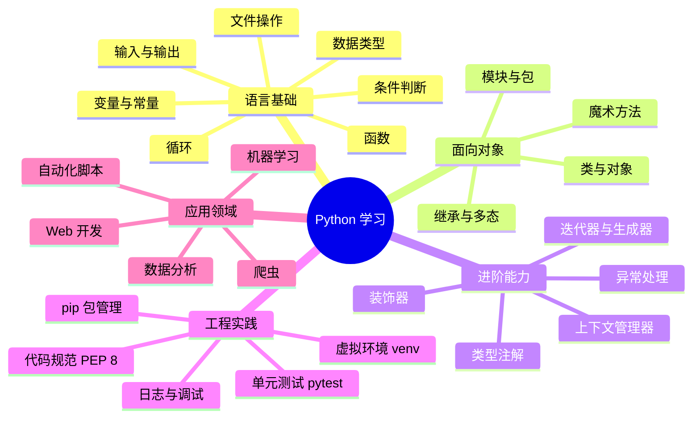

# Python 解释

本文介绍 Python 是什么、有哪些特点、如何系统学习，以及常见框架的用途，为后续章节打基础。

<!-- more -->

## 1. Python 语言概述

Python 是一种**高级、解释型、通用**的编程语言，由 Guido van Rossum 于 1991 年首次发布。设计目标是让代码**简洁易读**，降低编程门槛，同时保持足够的表达力应对复杂工程。

Python 的应用极其广泛，涵盖 Web 开发、数据分析、人工智能、自动化运维、科学计算、爬虫、桌面应用等领域。目前主流版本为 **Python 3**（Python 2 已于 2020 年停止维护）。

### 1.1 设计哲学

Python 社区有一句著名的「Python 之禅」（The Zen of Python），可在交互式环境中输入 `import this` 查看。核心思想包括：

- **优美胜于丑陋**（Beautiful is better than ugly）
- **明了胜于晦涩**（Explicit is better than implicit）
- **简单胜于复杂**（Simple is better than complex）
- **可读性很重要**（Readability counts）

这些原则体现在 Python 的语法设计中：强制缩进、清晰的命名约定、丰富的标准库等。

### 1.2 运行机制简述

Python 代码通常由**解释器**逐行执行，无需事先编译成机器码（与 C/Java 不同）。执行流程大致为：

```
源代码 (.py) → 字节码 (.pyc) → Python 虚拟机 (PVM) → 运行结果
```

常见实现有 **CPython**（官方参考实现）、PyPy（JIT 加速）、Jython（运行在 JVM 上）等。日常学习和开发以 CPython 为主。

---

## 2. Python 语言特点

| 特点 | 说明 |
|------|------|
| **易学易用** | 语法接近自然语言，入门曲线平缓，适合编程零基础 |
| **解释型** | 无需编译，修改后立即运行，开发迭代快 |
| **动态类型** | 变量无需声明类型，运行时自动推断 |
| **跨平台** | Windows、macOS、Linux 均可运行，一次编写多处部署 |
| **丰富的标准库** | 内置文件 I/O、网络、正则、JSON 等模块，「自带电池」 |
| **庞大的第三方生态** | PyPI 上有数十万个包，覆盖几乎所有应用场景 |
| **多范式** | 支持面向对象、函数式、过程式等多种编程风格 |
| **可扩展** | 可通过 C/C++ 扩展性能关键模块，也可嵌入其他语言 |

### 2.1 适用场景

- **快速原型与脚本**：自动化任务、批处理、小工具
- **Web 后端**：REST API、全栈网站、微服务
- **数据科学与 AI**：数据处理、可视化、机器学习、深度学习
- **运维与 DevOps**：配置管理、CI/CD、云原生工具
- **教育与研究**：算法验证、科学仿真、论文复现

### 2.2 与其他语言对比（简要）

| 维度 | Python | Java | JavaScript |
|------|--------|------|------------|
| 类型 | 动态 | 静态 | 动态 |
| 执行 | 解释型 | 编译型（JVM） | 解释型 |
| 主要用途 | 通用、AI、脚本 | 企业级后端 | 前端、全栈 |
| 学习难度 | 较低 | 中等 | 较低 |

---

## 3. Python 学习思维导图

以下思维导图梳理本教程及常用扩展的学习路径，可按需分阶段深入。



### 3.1 建议学习顺序

1. **基础语法**（本教程 02–08 章）：输入输出、变量、数据类型、流程控制、函数
2. **结构与抽象**：文件操作、类与面向对象、模块导入
3. **工程化**：虚拟环境、第三方库安装、简单项目组织
4. **选方向深入**：根据职业或兴趣选择 Web、数据、AI 等分支

---

## 4. 常见框架与库：解释及用途

Python 的优势之一在于**生态丰富**。下面按领域介绍主流框架/库及其典型用途。

### 4.1 Web 开发

| 框架/库 | 定位 | 典型用途 |
|---------|------|----------|
| **Django** | 全功能 Web 框架 | 内容管理系统、电商后台、企业级网站；内置 ORM、Admin、认证 |
| **Flask** | 轻量微框架 | 小型 API、原型项目、需要高度自定义的 Web 服务 |
| **FastAPI** | 现代异步 API 框架 | 高性能 REST/GraphQL API、微服务；自动文档、类型校验 |
| **Tornado** | 异步网络库 | 长连接、WebSocket、高并发场景 |

**选型建议**：大型项目选 Django；轻量 API 选 Flask 或 FastAPI；追求性能与类型安全优先 FastAPI。

### 4.2 数据分析与可视化

| 库 | 用途 |
|----|------|
| **NumPy** | 多维数组运算、线性代数，科学计算基础 |
| **Pandas** | 表格数据处理（DataFrame）、清洗、聚合、透视 |
| **Matplotlib** | 静态图表绑制 |
| **Seaborn** | 基于 Matplotlib 的统计可视化 |
| **Plotly** | 交互式图表、仪表盘 |

典型流程：用 Pandas 读 CSV/Excel → 清洗转换 → NumPy 计算 → Matplotlib/Seaborn 出图。

### 4.3 机器学习与深度学习

| 库 | 用途 |
|----|------|
| **scikit-learn** | 传统机器学习：分类、回归、聚类、特征工程 |
| **TensorFlow / Keras** | 深度学习，Google 生态，生产部署成熟 |
| **PyTorch** | 深度学习，研究界与工业界广泛使用，动态图友好 |
| **XGBoost / LightGBM** | 梯度提升树，结构化数据竞赛常用 |

### 4.4 爬虫与自动化

| 库/工具 | 用途 |
|---------|------|
| **Requests** | HTTP 请求，调用 REST API、简单页面抓取 |
| **Beautiful Soup / lxml** | HTML/XML 解析 |
| **Scrapy** | 大规模、可扩展的爬虫框架 |
| **Selenium / Playwright** | 浏览器自动化，动态页面、端到端测试 |
| **APScheduler** | 定时任务调度 |

### 4.5 数据库与 ORM

| 库 | 用途 |
|----|------|
| **SQLAlchemy** | ORM，支持多种关系型数据库 |
| **pymongo** | MongoDB 驱动 |
| **redis-py** | Redis 客户端 |
| **Django ORM** | Django 内置，与 Admin 深度集成 |

### 4.6 测试与质量

| 库 | 用途 |
|----|------|
| **pytest** | 单元测试、集成测试，插件生态丰富 |
| **unittest** | 标准库内置测试框架 |
| **black / ruff** | 代码格式化与静态检查 |

### 4.7 其他常用工具

| 库 | 用途 |
|----|------|
| **Flask/FastAPI + Uvicorn** | ASGI/WSGI 服务部署 |
| **Celery** | 分布式异步任务队列 |
| **Pydantic** | 数据校验与设置管理（FastAPI 核心依赖） |
| **Poetry / pip-tools** | 依赖管理与锁文件 |

---

## 5. 下一步

掌握本页概念后，建议从 [Python 教程目录](/pages/python-tutorial/) 进入系统学习，按章节顺序阅读：

- [输入与输出](/pages/python-io/) → 变量与常量 → 数据类型 → 条件与循环 → 函数 → 面向对象

语法熟练后，再按目标领域选读 Web（Django/FastAPI）或数据（Pandas）等专题文档。
