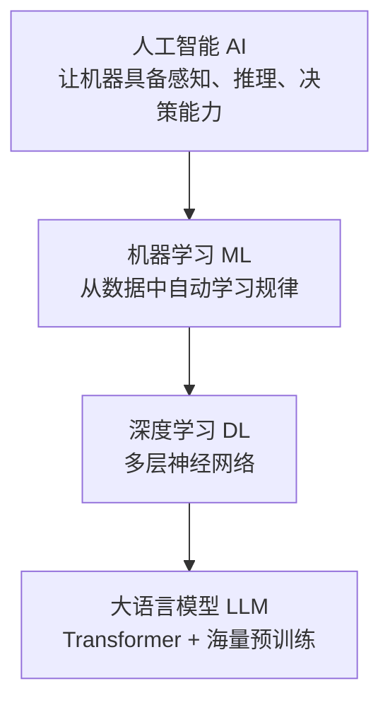
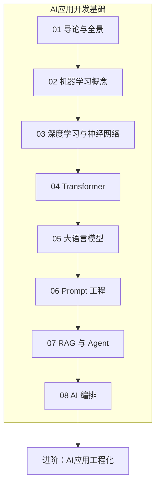

# AI导论与学习路线

本系列以**落地应用 AI 开发**为核心：弱化公式堆砌，强化「概念认知 → 模型理解 → 单模型用法 → 组合应用 → 系统编排」全链路。适配有前后端基础的开发者，快速具备 LLM 应用、Agent 与线上运维能力。

<!-- more -->

## 1. 核心目标

面向有前后端基础的开发者，最终具备：

- 分清人工智能 / 机器学习 / 深度学习 / LLM 的边界与应用场景
- 理解模型「怎么学、怎么搭、为什么强」，再谈怎么用
- 熟练调用大模型 API：对话、流式、结构化输出
- 掌握 Prompt、RAG、Function Calling / Agent 三大应用能力
- 能用编排框架把上述能力串成可上线的工作流

---

## 2. AI 全景：先建坐标系

### 2.1 AI / ML / DL / LLM 关系

| 层级 | 一句话 | 对本系列 |
|------|--------|----------|
| **AI** | 目标学科：让机器像人一样处理任务 | 全局坐标 |
| **ML** | 用数据训练模型，而非手写全部规则 | 必懂：训练/推理、过拟合 |
| **DL** | 用深层神经网络自动学特征 | 必懂直觉，不手推公式 |
| **LLM** | 超大规模预训练语言模型 | **主战场**：应用开发 |

> 本系列不做底层模型训练；理解概念地图，分清名词边界即可。

### 2.2 三大思想流派（扫读）

| 流派 | 核心 | 典型 | 与今日关系 |
|------|------|------|------------|
| **符号主义** | 知识用符号+规则推理 | 专家系统、知识图谱 | Agent 里常作业务规则约束 |
| **连接主义** | 神经元网络学权重 | 神经网络、深度学习 | **LLM 底层根基** |
| **行为主义** | 与环境交互、奖励反馈 | 强化学习 | RLHF 等对齐手段 |

### 2.3 三大应用领域

| 领域 | 做什么 | 与本系列 |
|------|--------|----------|
| **NLP** | 理解与生成语言 | **主攻**：对话、问答、Agent |
| **语音** | ASR / TTS | 可接 API，非主线 |
| **CV** | 检测、分割、OCR | 多模态会碰到，非主线 |

### 2.4 两条实现路径

| 路径 | 做法 | 现状 |
|------|------|------|
| **知识工程** | 专家写规则与知识库 | 作辅助约束，难成主引擎 |
| **机器学习** | 从数据学规律 | **工业主流** |

现代落地常是：大模型（连接主义）+ 业务规则 / 知识图谱（符号）+ RAG（外部知识）。

---

## 3. 推荐学习顺序

**核心逻辑**：认知全景 → 模型怎么学 → 模型怎么搭 → 模型为什么强 → 怎么用好单个模型 → 怎么组合成应用 → 怎么编排成系统。

| 篇 | 文档 | 学什么 | 属性 |
|----|------|--------|------|
| **01** | 本文 · 导论与路线 | AI 全景、学习方法 | 必学（打底） |
| **02** | [机器学习核心概念](/pages/ai-ml-concepts/) | 训练/推理、监督范式、过拟合、评估指标 | 必学（补断层） |
| **03** | [深度学习与神经网络](/pages/ai-neural-network/) | 网络层、激活、CNN/RNN 直觉 | 必学（浅读） |
| **04** | [Transformer 架构](/pages/ai-transformer/) | 注意力、自注意力、位置编码 | 必学（关键桥） |
| **05** | [大语言模型 LLM](/pages/ai-llm/) | 预训练/微调、Token、上下文、API 实操 | 必学（重实操） |
| **06** | [Prompt 工程](/pages/ai-prompt/) | 提示模式、Few-shot、CoT、结构化输出 | 必学 |
| **07** | [RAG 与 Agent](/pages/ai-rag-agent/) | 检索增强、向量库、Function Calling | 必学 |
| **08** | [AI 编排](/pages/ai-orchestration/) | 工作流、多步链路、LangChain / Dify | 必学（收束） |

进阶见 [AI 应用工程化学习路线](/pages/ai-eng-roadmap/)：本地服务 → RAG → Agent / MCP / Skills → 产品化部署（21 篇）。

> **原则**：01～04 快速通关建认知；05 起以「文档智能问答」为贯穿项目，依次叠加 Prompt、RAG、工具调用与编排，边做边学。

---

## 4. 标准化学习步骤

1. 读完本文，建立 AI/ML/DL/LLM 坐标系。
2. 过 [机器学习核心概念](/pages/ai-ml-concepts/)，搞清训练、推理、过拟合。
3. 浅读 [神经网络](/pages/ai-neural-network/) 与 [Transformer](/pages/ai-transformer/)，知道大模型「为什么强」。
4. 在 [大语言模型](/pages/ai-llm/) 打通 API：普通对话 → 流式 → JSON。
5. 用 [Prompt 工程](/pages/ai-prompt/) 把指令写稳；用 [RAG 与 Agent](/pages/ai-rag-agent/) 接知识库与工具。
6. 在 [AI 编排](/pages/ai-orchestration/) 把链路串成可维护流水线。
7. 全程记录问题与 Token/成本，形成可复用模板。

---

## 5. 选学拓展（不挡主线）

- LoRA 等轻量微调、数据集制作
- 向量库索引与混合检索深化
- AutoGen 等多 Agent 架构

---

本文档为系列目录索引；基础八篇按上表推进，工程化进阶见 [AI 应用工程化学习路线](/pages/ai-eng-roadmap/)。
