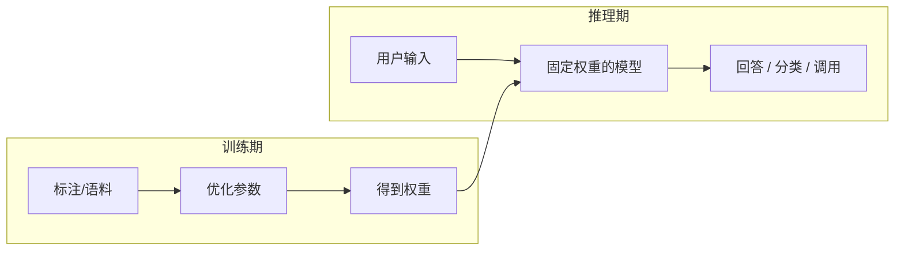

# 机器学习核心概念

补上「人工智能分类 → 神经网络」之间的桥：训练与推理、学习范式、损失与优化直觉、过拟合与评估指标。应用开发不需要手写训练循环，但这些词会在读模型文档、调 RAG、排幻觉时反复出现。

承接 [AI导论与学习路线](/pages/ai-roadmap/)，下一篇进入 [深度学习与神经网络](/pages/ai-neural-network/)。

<!-- more -->

## 1. 什么是机器学习

Tom Mitchell 经典定义：对于任务 **T**、性能度量 **P**，若程序在 T 上的表现 P 随经验 **E** 增加而提升，则称其从 E 中学习。

核心思想：**不是手写全部业务规则，而是设计训练流程，让机器从数据中自动学到规律。**

---

## 2. 训练 vs 推理（必须分清）

| 阶段 | 做什么 | 谁在做 | 应用开发者日常 |
|------|--------|--------|----------------|
| **训练 Training** | 用数据调参数，让损失下降 | 模型厂商 / 微调团队 | 多数时候**不亲自训** |
| **推理 Inference** | 固定参数，输入 → 输出 | 你的业务代码调 API | **每天都在做** |

> 调 Chat Completions、跑 RAG、跑 Agent，全是**推理**。预训练 / 微调发生在训练期；应用层通过 API「使用」已训好的模型。

---

## 3. 四种学习范式

| 范式 | 数据条件 | 目标 | 例子 |
|------|----------|------|------|
| **监督学习** | 输入 + 标签 | 学映射 \(x \to y\) | 分类、回归、多数微调任务 |
| **无监督学习** | 无标签 | 找结构 / 表示 | 聚类、异常检测、部分 Embedding |
| **半监督学习** | 少量标签 + 大量无标签 | 降低标注成本 | 医疗影像等 |
| **强化学习** | 交互 + 奖励信号 | 学策略 | 游戏 AI、部分 LLM 对齐（RLHF） |

对本系列：**监督学习直觉最重要**（有对错可评）；LLM 预训练更接近「自监督」（用文本自身当标签预测下一词）；Agent 里的试错调优常借鉴强化学习思路，但你通常不自己训策略网络。

---

## 4. 损失、梯度与「学」的直觉

监督学习可抽象：给定样本 \((x, y)\)，学函数 \(f\)，让预测 \(\hat{y}=f(x)\) 尽量接近 \(y\)。

| 概念 | 直觉 |
|------|------|
| **损失函数** | 预测与真相差多少；训练目标是把它压小 |
| **梯度** | 损失对参数的「上山方向」；更新时往反方向迈一步 |
| **学习率** | 每一步迈多大；太大震荡，太小爬不动 |
| **一轮 / Epoch** | 把训练数据过完一遍 |

> 应用开发**不需要**手推反向传播。记住：模型在训练时靠「算预测 → 算损失 → 反向改参数」循环变强；推理时只跑前半截「算预测」。

---

## 5. 欠拟合、过拟合与泛化

| 状态 | 训练集 | 新数据 | 含义 |
|------|--------|--------|------|
| **欠拟合** | 差 | 差 | 模型太弱或训不够 |
| **过拟合** | 很好 | 差 | 死记训练噪声，不会举一反三 |
| **良好泛化** | 好 | 也好 | 真正目标 |

常见缓解过拟合的思路（知道名词即可）：更多/更干净数据、正则、Dropout、早停、数据增强。

> 落到 LLM 应用：Prompt 塞进大量噪声示例、RAG 检索一堆无关段落，也会表现为「训/用时看似齐全、真实问题上翻车」——本质仍是**泛化与噪声**问题。

---

## 6. 常用评估指标（够用版）

分类任务最常听到：

| 指标 | 含义 | 何时敏感 |
|------|------|----------|
| **准确率 Accuracy** | 预测对的比例 | 类别均衡时直观 |
| **精确率 Precision** | 判为正例里有多少真是正例 | 误报代价高（误杀好人） |
| **召回率 Recall** | 真正例里抓回了多少 | 漏报代价高（漏检坏人） |
| **F1** | 精确率与召回的调和 | 两者要兼顾 |

回归常见：MAE / MSE（看平均误差大小）。

生成式任务还会用：人工评测、黄金集对照、RAG 场景下的「依据是否命中正确文档」等——**先有可复现的评测集，再谈换模型**。

---

## 7. 小结

- **训练**改参数，**推理**用参数；你做应用主要在推理侧。
- 监督 / 无监督 / 强化帮你读懂数据从哪来、目标是什么。
- 过拟合与泛化解释大量「演示很好、上线翻车」。
- 指标让你能量化「改 Prompt / 改检索」到底有没有变好。

下一步：[深度学习与神经网络](/pages/ai-neural-network/)——模型「怎么搭」的直觉。
