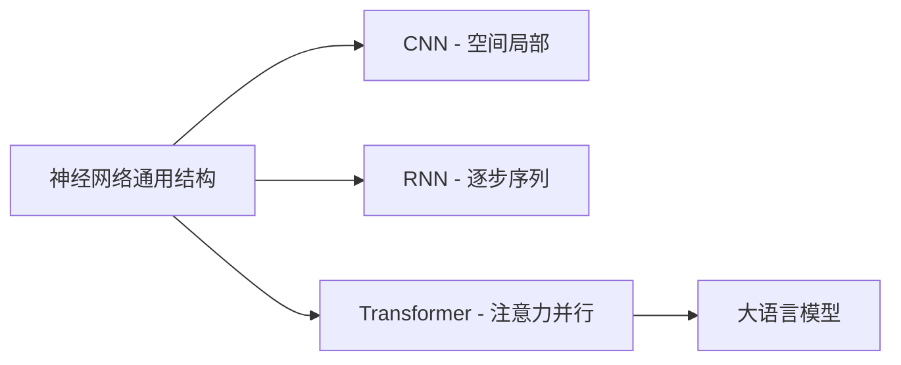

# 深度学习与神经网络

神经网络本质：**输入 → 多层可学习变换 → 输出**。激活函数引入非线性；深度学习是层数更深、规模更大的神经网络。本篇**不堆公式、不手推反向传播**，只建立读大模型文档够用的结构直觉。

承接 [机器学习核心概念](/pages/ai-ml-concepts/)，下一篇进入关键桥 [Transformer 架构](/pages/ai-transformer/)。

<!-- more -->

## 1. 阅读目标

| 要懂 | 可跳过 |
|------|--------|
| 神经元、层、前向传播在干什么 | 手写反向传播推导 |
| 激活函数为何必要 | 自己训模型的框架细节 |
| CNN / RNN 各自擅长什么 | 权重文件格式、存盘加载 |

三句话记住：

1. **单元简单，组合强大**：单神经元做加权求和 + 激活；多层可拟合复杂映射。
2. **前向算预测，反向改参数**：推理只做前向；训练才做反向（见上篇）。
3. **结构决定特长**：CNN 吃网格（图），RNN 吃序列，Transformer（下篇）通吃长序列并行。

---

## 2. 神经元与网络层

单个神经元：**多输入，单输出**——对输入加权求和，加偏置，再过激活函数。

- **权重**：每个输入的重要程度（可学习）
- **偏置**：阈值偏移（可学习）
- **激活**：引入非线性；没有它，多层等价于一层线性变换

常见层分工：

| 层 | 作用 |
|----|------|
| **输入层** | 接收特征 / Token 表示 |
| **隐藏层** | 逐层变换、抽象特征 |
| **输出层** | 得到预测（类别概率、下一 Token 分布等） |

**前向传播**：数据从输入一路算到输出，得到预测。调用大模型 API，本质就是一次（规模巨大的）前向传播。

---

## 3. 激活函数（知道用途即可）

激活函数给网络「弯折」能力，才能拟合非线性现实。

| 函数 | 直觉 | 备注 |
|------|------|------|
| **ReLU** | 负值变 0，正值原样 | 最常用，算得快 |
| **Sigmoid / Tanh** | 压到有界区间 | 了解名字；深层里较少作主激活 |
| **Softmax** | 多类打成概率分布 | 分类 / 下一 Token 常用在输出侧 |

不必背公式；见到文档写「ReLU / Softmax」能对上角色即可。

---

## 4. 训练在网络里怎么发生（回顾）

结合上篇：

1. 前向 → 得到预测与损失  
2. 反向传播：用链式法则把误差传回各层，得到梯度  
3. 梯度下降：按学习率更新权重  

应用开发**不实现**这三步；理解「大模型的能力来自海量数据上反复做这件事」即可。

欠拟合 / 过拟合同样适用于神经网络：太浅/太弱 → 学不会；太深/数据少 → 死记。目标始终是**泛化**。

---

## 5. 主流架构直觉（扫读）

### 5.1 CNN 卷积神经网络

- **特长**：图像等网格数据；局部感受野、权值共享、池化降维。
- **场景**：分类、检测、分割、OCR 前端等。
- **一句话**：善于抓局部图案，再层层组合成整体概念。

### 5.2 RNN / LSTM（序列旧方案）

- **特长**：按时间步处理序列，理论上能记历史。
- **痛点**：长程依赖弱、难以并行，训起来慢。
- **场景**：早期机器翻译、语音等；今日 NLP 主流已被 Transformer 取代，但「序列建模」直觉仍有用。

### 5.3 通往 Transformer

CNN/RNN 解决了图像与序列的一部分问题；**并行处理长序列 + 任意位置互相关注**，催生了 Transformer——今天几乎所有 LLM 的骨架。细节见下一篇。

---

## 6. 选读：框架与权重（应用可跳过）

自己训练时才会深度接触：

- **PyTorch**：研究与工业训练主流，动态图好调试  
- **TensorFlow**：部署与生产工具链仍常见  
- 权重格式：`.pth` / `.h5` / `.onnx` 等  

做 Agent / 调 API：**可以整节跳过**。

---

## 7. 小结

- 深度学习 = 更深的神经网络；层 + 激活 + 前向是最小心智模型。
- CNN / RNN 帮助理解「结构为何重要」；LLM 战场在 Transformer。
- 不手推公式，但能解释：推理是前向，能力来自训练期的参数学习。

下一步：[Transformer 架构](/pages/ai-transformer/)——大模型的引擎。
