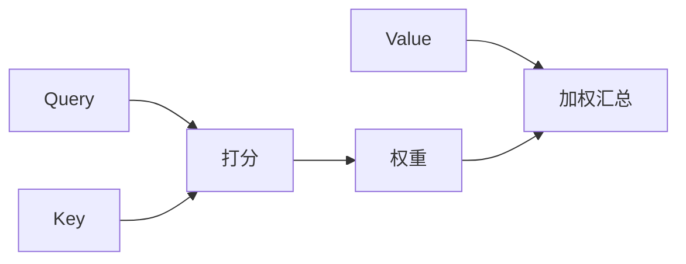
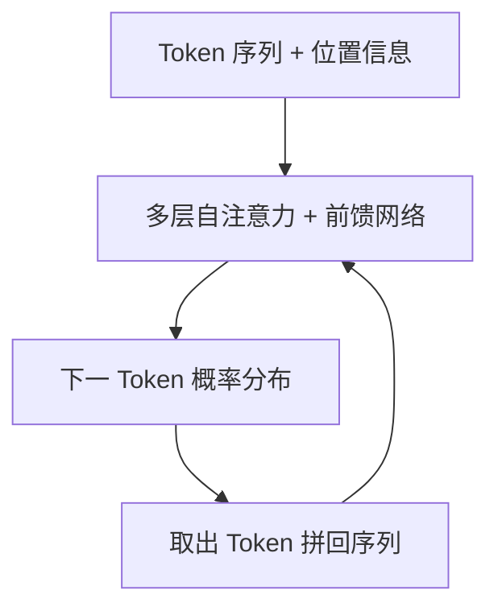

# Transformer架构

从经典神经网络跳到大模型，中间缺的关键一块就是 **Transformer**。注意力、自注意力、位置编码，构成今日 LLM 的引擎；本篇只讲直觉，不堆矩阵推导。

承接 [深度学习与神经网络](/pages/ai-neural-network/)，下一篇进入 [大语言模型](/pages/ai-llm/)。

<!-- more -->

## 1. 为什么需要 Transformer

RNN 逐步读序列：难并行、长距离信息容易丢。  
**Transformer（2017，Attention Is All You Need）** 用注意力机制让序列中任意位置直接互相「看见」，并高度可并行——规模化预训练成为可能。

> GPT、BERT、LLaMA、绝大多数多模态骨干，底层都是 Transformer 变体。

---

## 2. 注意力机制：把「相关」算出来

直觉：写文章时，当前词会**重点关注**上下文里某些词，而不是平均看待每一个字。

注意力大致三步：

1. 对当前位置，衡量它与序列中其它位置的**相关程度**（打分）
2. 把分数变成权重（谁重要谁权重大）
3. 用权重对信息做加权汇总，得到「我该吸收的上下文」

| 角色（常见叫法） | 直觉 |
|------------------|------|
| **Query（Q）** | 我在找什么 |
| **Key（K）** | 我有什么可被匹配的标签 |
| **Value（V）** | 真正要传递的内容 |

Q 去和各位置的 K 比对，得到权重后再去加权 V——这就是注意力的核心故事。

---

## 3. 自注意力 Self-Attention

**自注意力**：Q、K、V 都来自**同一段序列自身**。每个 Token 都可以关注整句（或窗口内）其它 Token，从而建模「谁修饰谁、指代谁、前后因果」。

相对 RNN 的优势：

- **长程依赖**：首尾词可以直接建立联系，不必一步步传过去
- **并行计算**：各位置注意力可同时算，吃满 GPU
- **可解释线索**：权重大致反映「模型此刻在看哪里」（工程上别过度迷信可视化）

**多头注意力**：多组 Q/K/V 并行，每组关注不同关系（句法、指代、语气…），再拼起来——表达力更强。

---

## 4. 位置编码：顺序从哪来

注意力本身对位置不敏感（把词打乱，集合关系仍可算）。语言却依赖顺序：「狗咬人」≠「人咬狗」。

**位置编码**给每个位置注入顺序信息（正弦编码、可学习位置嵌入、相对位置等实现细节可略）。记住结论：

> Transformer 靠「内容注意力 + 位置信息」同时知道**说了什么**和**谁在前谁在后**。

---

## 5. 编码器 / 解码器与 GPT 路线（扫读）

原版 Transformer：

| 部分 | 典型用途 |
|------|----------|
| **Encoder** | 读完整输入，建双向上下文（如 BERT） |
| **Decoder** | 自左向右生成，只能看已生成部分（如 GPT） |

今日对话大模型多为 **Decoder-only**：给定上文，自回归预测下一个 Token，循环生成整段回答。

---

## 6. 和应用开发的关系

| 你听到的词 | 和 Transformer 的关系 |
|------------|------------------------|
| **上下文窗口** | 注意力能「看见」的 Token 长度上限（还有工程截断） |
| **幻觉** | 仍是概率续写，不是数据库查询 |
| **长文变笨** | 窗口内噪声多、位置远，有效注意力被稀释 |
| **预训练 / 微调** | 在这套结构上改权重；应用侧多直接调已训模型 |

不需要会写 Attention 代码；需要能解释：**大模型强，是因为可并行的自注意力结构撑起了规模化预训练。**

---

## 7. 小结

- 注意力 = 按相关度加权取信息；自注意力 = 序列内部互相关注。
- 位置编码补上顺序；多头提升多种关系建模。
- Decoder-only + 下一词预测 → 现代对话 LLM 的主流形态。

下一步：[大语言模型](/pages/ai-llm/)——预训练/微调、Token、能力边界与 API。
