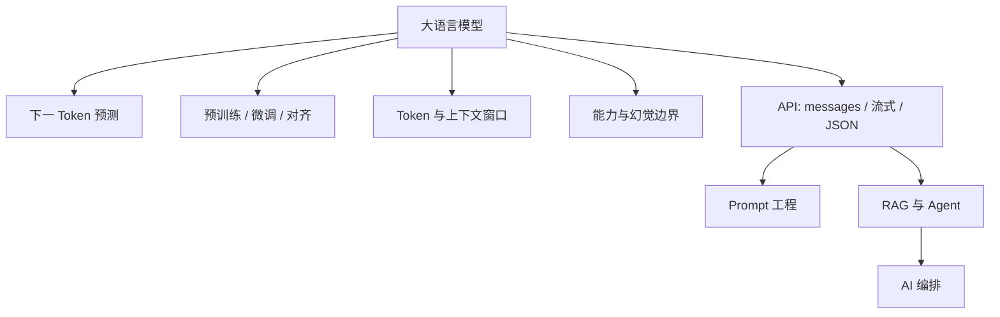

# 大语言模型（LLM）

大语言模型是在海量文本上预训练得到的深度神经网络（骨干多为 Transformer），能根据输入预测并续写后续内容。本篇聚焦：**预训练/微调范式、主流模型、能力与局限、Token 与上下文**，并亲手打通一次兼容 API。

承接 [Transformer 架构](/pages/ai-transformer/)。提示词写法见 [Prompt 工程](/pages/ai-prompt/)；接知识库与工具见 [RAG 与 Agent](/pages/ai-rag-agent/)。

<!-- more -->

## 1. 本质：下一 Token 预测

预训练核心目标：给定上文，预测下一个概率最高的 Token。对话、摘要、翻译、代码等，多是该能力在合适提示下的**涌现**。

> 模型不是真正「理解」世界，而是统计续写，因此会产生**幻觉**（编造不存在的事实）。

| 维度 | 传统专用 NLP | 大语言模型 |
|------|--------------|------------|
| 任务 | 单任务模型 | 同一模型覆盖多类任务 |
| 交互 | 特征工程 + 结构化输入 | 自然语言 Prompt |
| 知识 | 训练集 + 人工特征 | 参数内知识 + 外部 RAG/工具 |
| 开发重心 | 数据与训练 | Prompt、RAG、工具、校验 |

---

## 2. 预训练 / 微调（核心范式）

| 阶段 | 做什么 | 数据规模 | 谁做 |
|------|--------|----------|------|
| **预训练 Pre-training** | 在海量语料上学通用语言与知识 | 极大 | 模型厂商 |
| **微调 Fine-tuning** | 用领域/任务数据继续改权重 | 相对小 | 厂商或有算力的团队 |
| **对齐 Alignment** | 让输出更符合人类偏好与安全（如 RLHF、DPO） | 偏好数据 | 厂商为主 |

应用开发常见路径：

1. **直接用基座/对话模型 API**（最多）
2. **Prompt / RAG / 工具** 适配业务（本系列主线）
3. **LoRA 等轻量微调**（需要强定制且有数据时，属选学）

> 不要把「微调」当成第一选择：多数业务问题用 Prompt + RAG + 工具更便宜、更好迭代。

---

## 3. 主流模型地图（扫读）

生态变化快，记**类型**比背型号重要：

| 类型 | 特点 | 选用直觉 |
|------|------|----------|
| **闭源 API**（GPT、Claude、Gemini 等） | 能力强、省运维 | 默认首选，注意数据出境与成本 |
| **开源可部署**（LLaMA、Qwen、Mistral 等） | 可私有化 | 合规、内网、可定制权重 |
| **小模型 / 端侧** | 便宜、快、能力有限 | 分类、路由、简单抽取 |
| **多模态** | 图文音等 | OCR、截图理解、语音助手 |

选型先看：任务难度、延迟、成本、数据是否可出域、是否要结构化输出 / 工具调用。

---

## 4. 能力与局限

**擅长**：改写与摘要、分类与抽取、草稿代码、多轮对话、按材料问答（配合 RAG）、规划与工具选型（配合 Agent）。

**不擅长 / 需外挂**：

- 精确计算与事务（下单、改库）→ 工具或规则
- 实时私有数据 → RAG 或 API 查询
- 保证事实为零错误 → 校验、引用、人工审核
- 窗口外的「永久记忆」→ 你自己存历史 / 摘要

---

## 5. Token 与上下文

### 5.1 Token

文本最小计费与计算单元，多为**子词**切分，≠ 汉字个数。

关心 Token 的原因：

1. **计费与限流**（输入 + 输出）
2. **上下文窗口**以 Token 计，不是字符数
3. 同等长度中文往往比英文更「贵」

### 5.2 上下文窗口

单次请求模型能读的最大 Token：含 system、历史、当前输入，**多数厂商里待生成输出也占配额**。超限会截断或报错；窗口外内容模型看不见。

### 5.3 无状态

API **不替你记**对话。多轮 = 客户端维护 `messages` 再发回去。

| 角色 | 用途 |
|------|------|
| **system** | 人设、硬规则、输出格式 |
| **user** | 用户问题与材料 |
| **assistant** | 历史回复；也可作 Few-shot |
| **tool** | 工具结果回填 |

---

## 6. 采样参数（够用）

| 参数 | 作用 |
|------|------|
| **temperature** | 随机性：低→稳（抽取/JSON）；高→散（创意，幻觉风险升） |
| **top_p** | 核采样；一般与温度二选一深调 |
| **max_tokens** | 限制输出长度与成本 |
| **stop** | 遇到停止串就结束 |

稳定 JSON：先降温，再配合格式约束或官方 JSON 模式。

---

## 7. 直调 API（必做）

任意 **OpenAI 兼容**端点即可。

### 7.1 最小 messages

```bash
curl "$OPENAI_BASE_URL/v1/chat/completions" \
  -H "Authorization: Bearer $OPENAI_API_KEY" \
  -H "Content-Type: application/json" \
  -d '{
    "model": "你的模型名",
    "temperature": 0.2,
    "messages": [
      {"role": "system", "content": "你是简洁的助手。用中文回答。"},
      {"role": "user", "content": "用一句话解释什么是 Token。"}
    ]
  }'
```

关注：`choices[0].message.content`、`usage.prompt_tokens` / `completion_tokens`。

### 7.2 流式

`"stream": true` → SSE 增量（多在 `delta.content`）。适合聊天 UI；注意超时与 usage 是否另开参数。

### 7.3 结构化输出

| 方式 | 做法 |
|------|------|
| 提示约束 | 写清字段 + 低温 + 客户端校验 |
| JSON / schema 模式 | 厂商若支持 `response_format` 优先用 |

详细模式与模板见 [Prompt 工程](/pages/ai-prompt/)。

### 7.4 排错底线

| 现象 | 先查 |
|------|------|
| 401 / 403 | Key、权限、Base URL |
| 429 | 限流：退避、降并发、缩上下文 |
| 超时 / 空回复 | 网络、`max_tokens`、流式解析 |
| JSON 失败 | 降温、收紧格式、官方 JSON 模式 |

密钥进环境变量，**不要进仓库**。

---

## 8. 调用清单

1. 任务是否适合 LLM，是否该上工具/规则  
2. Token 与窗口是否够用，历史是否该摘要  
3. 采样是否匹配「求稳 / 求创意」  
4. 直调：非流式 → 流式 → JSON  
5. 私有/过期知识 → [RAG 与 Agent](/pages/ai-rag-agent/)  

---

## 9. 思维导图



下一步：[Prompt 工程](/pages/ai-prompt/)。
