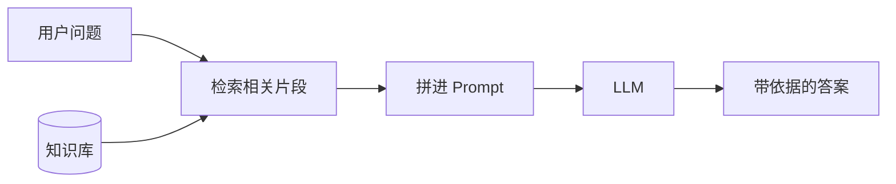
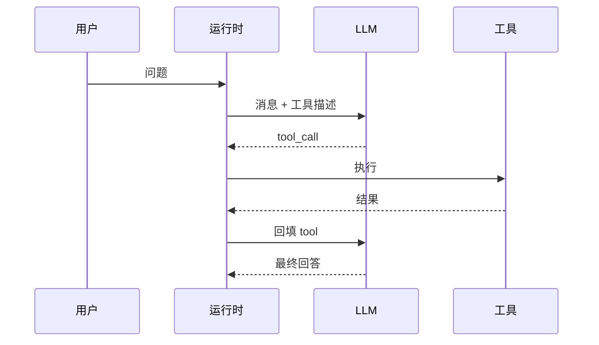

# RAG与Agent

知道大模型是什么 ≠ 会做应用。企业落地最常见的两块：**RAG**（给模型临时翻开你的知识库）与 **Agent / Function Calling**（让模型调用工具执行动作）。编排框架（下篇）本质是把它们和 Prompt 串成工作流。

承接 [Prompt 工程](/pages/ai-prompt/)，下一篇 [AI 编排](/pages/ai-orchestration/)。

<!-- more -->

## 1. 为什么需要 RAG

模型短板：

1. **知识有截止日期**——新政策、新产品可能不知道  
2. **看不见私有数据**——内部文档、工单、代码库不在参数里  

硬塞进 Prompt 会撞上下文窗口且难维护。RAG：**检索相关材料 → 拼进提示 → 依据材料生成**。

---

## 2. RAG 三环节

| 环节 | 做什么 | 常见坑 |
|------|--------|--------|
| **切分 Chunking** | 长文档切成可检索片段 | 切太碎丢语境；切太大难命中 |
| **检索 Retrieval** | 关键词 / 向量 / 混合召回 Top-K | 检错则生成再强也救不回来 |
| **生成 Generation** | 约束「只依据材料」，可要求引用 | 塞过多无关段会稀释注意力 |

> RAG ≠ 永久记忆：解决的是「本次有据可依」；文档更新后要重新索引。

---

## 3. Embedding 与向量库

| 概念 | 直觉 |
|------|------|
| **Embedding** | 把文本压成向量；语义近则距离近 |
| **向量库 VectorStore** | 存向量并按相似度取 Top-K（FAISS、Chroma、各类云检索） |

离线：`加载 → 切分 → Embedding → 写入向量库`  
在线：`问题 →（可选改写）→ 检索 → Prompt → LLM`

排错顺序：

1. Top-K 原文是否相关？不相关 → 切分 / Embedding / 混合检索 / query 改写  
2. 相关仍答错 → 提示约束、降温、强制引用  
3. 不稳定 → 固定黄金集对比，忌凭感觉调参  

---

## 4. Function Calling（工具调用）

模型擅长语言，不擅长：实时数据、精确计算、鉴权后的业务写操作。

**Function Calling**：模型输出结构化「调用请求」（函数名 + 参数）→ 你的运行时执行 → 结果以 tool 消息回填 → 模型再生成最终回答。

设计要点：

| 要点 | 说明 |
|------|------|
| 名称与 description 写清 | 决定模型何时选用 |
| 参数用严格 schema | 降胡编参数 |
| 运行时鉴权 | 不信模型「自称有权限」 |
| 返回短而结构化 | 大段日志污染上下文 |
| 幂等 / 可重试 | 网络抖动时编排可能重试 |

---

## 5. Agent：何时上、何时不上

| 形态 | 特征 | 适用 |
|------|------|------|
| **固定链** | 永远「先检索再答」或「先查库再答」 | 流程稳定、要好测 |
| **单 Agent（如 ReAct）** | 模型自主决定是否调工具、调哪个、是否继续 | 步骤不固定、需探索 |
| **多 Agent** | 多角色分工 | 复杂业务（进阶专栏） |

原则：**一步固定流程能搞定，就不要上 Agent**——Agent 更贵、更难测、更难复现。

本阶段目标：跑通「单 Agent + 若干 Tools」或「RAG 链 + 一两个查询工具」。多 Agent / Skill 留给后续技术专栏。

---

## 6. RAG 与 Agent 怎么配合

一次真实请求里，上下文预算常被四类内容挤占：

| 部分 | 来源 |
|------|------|
| 系统规则 | Prompt / system |
| 对话状态 | 历史消息 / Memory |
| 知识片段 | RAG |
| 工具结果 | Function Calling |

分工：

- **RAG**：相对稳定的业务知识  
- **工具**：实时状态与写操作  
- **Prompt**：规则与格式  
- **Memory**：本会话短期状态  

---

## 7. 实用清单

1. 私有/易变知识 → 先做最小 RAG，验证检索再换大模型  
2. 实时/事务 → 工具 + 鉴权，不靠模型「记住库存」  
3. 流程固定用链；动态选工具再用单 Agent  
4. 评测：问题 + 期望依据文档 / 期望工具调用  
5. 安全：用户输入当数据；工具最小权限；密钥不进仓  

---

## 8. 小结

- RAG = 先找材料再生成；向量库是检索基础设施。  
- Function Calling = 模型提议、运行时执行。  
- Agent = 动态工具循环；能不用则不用。  

下一步：[AI 编排](/pages/ai-orchestration/)——把 Prompt、RAG、工具串成系统。
