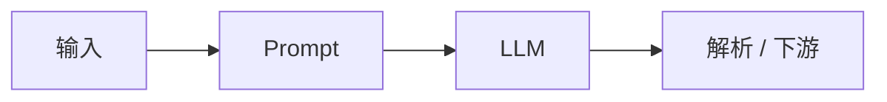
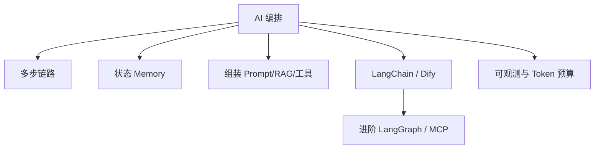

# AI编排

编排（Orchestration）= 把 [Prompt](/pages/ai-prompt/)、[RAG / 工具 / Agent](/pages/ai-rag-agent/)、多模型调用**串成可维护的工作流**：多步链路、状态（记忆）、可观测与可替换。若前面模块没学，编排就是空中楼阁。

本篇以概念与 LangChain 为主，并对照 Dify 等可视化方案；复杂控制流转 LangGraph（进阶专栏）。

<!-- more -->

## 1. 编排在解决什么

单次调 API 够写 Demo；业务常见诉求：

- 多步：先路由分类 → 再抽取 → 再生成回复  
- 多轮：管理历史，控制 Token  
- 外挂：数据库、HTTP、检索  
- 可运维：换模型、打点追踪、失败重试  

| 直接调 API | 编排层 |
|------------|--------|
| 自己写循环与分支 | Chain / 工作流节点 |
| 换模型改请求细节 | 换 Model 适配，管道复用 |
| 自建工具协议 | Tools / 插件抽象 |
| 自己打日志 | LangSmith 等追踪 |

原则：小脚本可直调；出现「多步 + 检索 + 工具 + 要换模型」再上编排。

---

## 2. 工作流与多步链路

最小链：

```text
输入 → Prompt 填充 → LLM →（可选）解析结构化结果
```

| 形态 | 说明 | 场景 |
|------|------|------|
| **单链** | 一步生成 | 摘要、翻译 |
| **顺序链** | A 输出喂 B | 先提炼再写邮件 |
| **路由链** | 先判断类型再走子链 | 客服：退款 / 物流 |
| **RAG 链** | 先检索再生成 | 文档问答 |
| **工具链 / Agent** | 动态调用 | 查库存再回答 |



建议：一步能完不要硬拆五步；每步输入输出字段写死，便于单测。

---

## 3. 状态管理（Memory）

LLM 默认无状态；「记忆」= 你决定存什么、何时写入、如何拼进下次 Prompt。详见 [大语言模型 · 上下文](/pages/ai-llm/)。

| 策略 | 做法 | 代价 |
|------|------|------|
| 缓冲窗口 | 最近 K 轮 | 早先约束易丢 |
| 全文历史 | 全拼进上下文 | Token 暴涨 |
| 摘要记忆 | 旧对话压缩 | 可能丢细节 |
| 槽位 / 实体 | 结构化字段 | 要抽取逻辑 |
| 外部存储 | Redis / DB | 多一层基建 |

与 RAG 分工：长期知识进检索；短期会话进 Memory。重要规则放 system 或每轮前缀。

---

## 4. LangChain 心智模型

LangChain ≈ **模型 + 提示模板 + 输出解析 + 工具/检索** 的组合层。现代写法多用 **LCEL**：`prompt | model | parser`。

| 积木 | 作用 |
|------|------|
| ChatModel | 对接各家模型 |
| PromptTemplate | 变量渲染 |
| OutputParser | 文本 → JSON 等 |
| Chain / Runnable | 管道组装 |
| Memory | 历史策略 |
| Tools / Retriever | 工具与 RAG |

```python
from langchain_core.prompts import ChatPromptTemplate
from langchain_openai import ChatOpenAI
from langchain_core.output_parsers import JsonOutputParser

prompt = ChatPromptTemplate.from_messages([("user", "回答：{question}")])
model = ChatOpenAI(model="gpt-4o-mini")
chain = prompt | model | JsonOutputParser()
chain.invoke({"question": "解释什么是编排"})
```

RAG、工具调用的业务细节已在 [RAG 与 Agent](/pages/ai-rag-agent/)；此处重点是**如何组装与替换组件**。

---

## 5. Dify 等可视化编排（对照）

| | LangChain 类代码编排 | Dify / 类似平台 |
|--|---------------------|-----------------|
| 形态 | 代码 / Notebook | 画布拖拽工作流 |
| 优势 | 灵活、可测、易进 CI | 上手快、运营可参与 |
| 注意 | 要自己做观测与发布 | 复杂逻辑、版本与定制有边界 |

选型：原型与运营可配流程 → 可视化；强定制、复杂 Agent、要单测 → 代码编排。二者可并存（平台调你的 API）。

---

## 6. 一次请求里有什么

| 部分 | 来源 |
|------|------|
| 系统规则 | Prompt |
| 对话历史 | Memory |
| 检索片段 | RAG |
| 工具结果 | Function Calling |
| 当前用户话 | 本轮输入 |

编排的核心工程问题常常是：**在有限 Token 里排优先级**，而不是再多接一个模型。

---

## 7. 本篇边界与下一步

| 本篇（基础收束） | 进阶专栏 |
|------------------|----------|
| 顺序/路由链、Memory、RAG 流水线组装 | **LangGraph**：循环、分支、人机审批 |
| 单 Agent + Tools | **多 Agent / Skill** |
| LangChain 工具封装 | **MCP** 标准化接入 |

---

## 8. 实用清单

1. 固定流程 → Chain；动态探索 → 单 Agent  
2. Memory 策略匹配会话长度  
3. RAG 先验证检索；工具先验证 schema 与权限  
4. 可观测：能区分失败在检索、工具还是生成  
5. 成本与安全：控 Token、密钥、提示注入  

---

## 9. 思维导图



基础专栏到此收束；用「文档问答 + 一两个工具」项目贯穿复习 05～08，再进入进阶。
