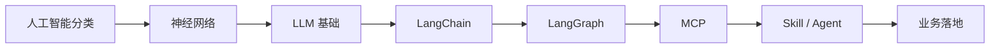

# 学习路线

本系列以**应用 AI** 为主线：先建立必要概念，再快速进入 LLM、工具链与 Agent 落地。理论够用即可，重点练「能用、会接、能排错」。

<!-- more -->

## 1. 目标定位

面向有前后端基础的开发者，目标不是系统啃完机器学习教材，而是能：

- 说清 AI / 机器学习 / 深度学习 / LLM 的边界
- 会调用大模型 API，做提示词与结构化输出
- 用 LangChain / LangGraph 搭工作流与 Agent
- 接入 MCP、Skill 等工具能力，落到真实业务

---

## 2. 建议学习顺序

| 阶段 | 内容 | 说明 | 状态 |
|------|------|------|------|
| **0. 地图** | [人工智能分类](/pages/ai-classification/) | 三大流派、NLP/语音/CV、知识工程 vs 机器学习 | 已有 |
| **1. 底座** | [神经网络](/pages/ai-neural-network/) | 神经元、前向/反向传播、过拟合；够读懂后续名词即可 | 已有 |
| **2. 大模型** | [大模型](/pages/ai-llm/) | Token、上下文、温度、提示词、RAG 直觉 | 已有 |
| **3. 编排** | LangChain | 链、记忆、工具调用、检索增强 | 待写 |
| **4. 工作流** | LangGraph | 状态图、分支、循环、人机协同 | 待写 |
| **5. 工具协议** | MCP | 模型与外部工具/数据源的标准接入 | 待写 |
| **6. 能力封装** | Skill / Agent | 可复用技能、多智能体协作与落地案例 | 待写 |

> **原则**：阶段 0–2 快速过；阶段 3 起以项目驱动，边做边补概念。

---

## 3. 路线示意

---

## 4. 现阶段怎么学

1. 先读 [人工智能分类](/pages/ai-classification/)，建立全局坐标。
2. 再读 [神经网络](/pages/ai-neural-network/)，抓住「前向算预测、反向调参数」即可，不必深抠公式推导。
3. 再读 [大模型](/pages/ai-llm/)，掌握 Token、上下文、温度、提示词与 RAG 直觉。
4. 随后转入应用：选一个小场景（如文档问答、客服助手），按 LLM → LangChain → LangGraph → MCP 往上叠能力。

后续章节会按上表顺序补齐，本页作为目录索引持续更新。
